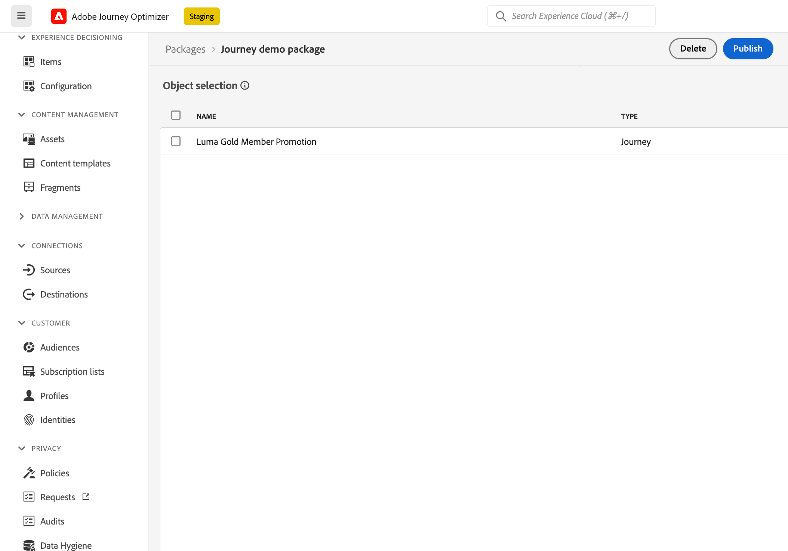

# Copiare un percorso in un’altra sandbox {#copy-to-sandbox}

<!--
>[!CONTEXTUALHELP]
>id="ajo_journey_copy_main"
>title="Copy a journey to another sandbox"
>abstract="Journey Optimizer allows you to copy an entire journey from one sandbox to another. For example, you can copy a journey from the Stage sandbox environment to your Production sandbox. In addition to the Journey itself, Journey Optimizer also copies most of the objects the journey depends on."

>[!CONTEXTUALHELP]
>id="ajo_journey_copy_sandbox_details"
>title="Sandbox details"
>abstract="Select the destination sandbox you want to copy the journey to. Only sandboxes within your organization are available."

>[!CONTEXTUALHELP]
>id="ajo_journey_copy_object_details"
>title="Object details"
>abstract="This is the journey you are going to copy."

>[!CONTEXTUALHELP]
>id="ajo_journey_copy_dependent_objects"
>title="Dependent objects"
>abstract="This is the list of associated objects used in the journey. This list displays the name, the object type, as well as the internal Journey Optimizer ID."
-->

Gli strumenti sandbox consentono di copiare oggetti in più sandbox sfruttando le funzioni di esportazione e importazione dei pacchetti. Un pacchetto può essere costituito da uno o più oggetti. Tutti gli oggetti inclusi in un pacchetto devono appartenere alla stessa sandbox.

Questa pagina descrive il caso di utilizzo degli strumenti Sandbox nel contesto di Journey Optimizer. Per ulteriori informazioni sulla funzione stessa, fare riferimento a [Documentazione di Experienci Platform](https://experienceleague.corp.adobe.com/docs/experience-platform/sandbox/ui/sandbox-tooling.html).

## Introduzione agli strumenti sandbox{#sandbox-gs}

Journey Optimizer consente di copiare un intero percorso da una sandbox all’altra. Ad esempio, puoi copiare un percorso dall’ambiente sandbox di Stage alla sandbox di produzione. Oltre al percorso stesso, Journey Optimizer copia anche la maggior parte degli oggetti da cui dipende il percorso: tipi di pubblico, schemi, eventi e azioni. Per ulteriori dettagli sugli oggetti copiati, consulta questa [sezione](https://experienceleague.adobe.com/docs/experience-platform/sandbox/ui/sandbox-tooling.html#abobe-journey-optimizer-objects).

>[!CAUTION]
>
>Non è garantito che tutti gli elementi collegati vengano copiati nella sandbox di destinazione. È consigliabile eseguire un controllo approfondito prima di pubblicare il percorso. In questo modo è possibile identificare eventuali oggetti mancanti.

Gli oggetti copiati nella sandbox di destinazione sono univoci e non esiste alcun rischio di sovrascrittura degli elementi esistenti. Sia il percorso che i messaggi all&#39;interno del percorso vengono trasferiti in modalità bozza. Ciò ti consente di eseguire una convalida completa prima della pubblicazione sulla sandbox di destinazione. Il processo di copia viene copiato solo sui metadati relativi al percorso e agli oggetti di tale Percorso. Non vengono copiati dati di profilo o set di dati come parte di questo processo.

## Esportare il percorso {#export}

Per copiare un percorso in un’altra sandbox, effettua le seguenti operazioni:

1. Nella sezione del menu GESTIONE PERCORSO fare clic su **[!UICONTROL Percorsi]**. Viene visualizzato l’elenco dei percorsi.

1. Cercare il percorso che si desidera copiare, fare clic sul pulsante **Altre azioni** (i tre punti accanto al nome del percorso) e fare clic su **Aggiungi al pacchetto**.

Il **Aggiungi al pacchetto** viene visualizzata la finestra.

1. Scegliere se si desidera aggiungere il percorso a un pacchetto esistente o crearne uno nuovo:

   * **Pacchetto esistente**: seleziona il pacchetto dal menu a discesa.
   * **Crea un nuovo pacchetto**: digita il nome del pacchetto. Puoi anche aggiungere una descrizione.

1. Nella sezione del menu AMMINISTRAZIONE, fare clic su **[!UICONTROL Sandbox]**, seleziona la **Pacchetti** e fai clic sul pacchetto da esportare.

   

1. Selezionare gli oggetti da esportare e fare clic su **Pubblica**

   

   Se la pubblicazione non è riuscita, puoi controllare i registri per identificare il motivo dell’errore. Apri il pacchetto e fai clic su **Vedi processi non riusciti**, seleziona il processo di importazione e fai clic su **Visualizza dettagli importazione**.

   

## Importa il percorso {#import}

1. Nell’elenco dei pacchetti, fai clic sull’icona + accanto al nome del pacchetto.

   

1. Seleziona la **Sandbox di Target** dal campo a discesa e fai clic su **Successivo**. Sono disponibili solo le sandbox all’interno dell’organizzazione.

   

1. Esaminare gli oggetti pacchetto e le dipendenze. Questo è l’elenco degli oggetti associati utilizzati nel percorso. In questo elenco vengono visualizzati il nome e il tipo di oggetto. Per ogni oggetto, puoi scegliere di crearne uno nuovo o utilizzarne uno esistente nella sandbox di destinazione.

   

1. Fai clic su **Fine** nell’angolo in alto a destra, per iniziare a copiare il pacchetto nella sandbox di destinazione. Il processo di copia varia in base alla complessità del percorso e al numero di oggetti da copiare.

1. Fare clic sul processo di importazione per esaminare il risultato della copia:

   * Clic **Visualizza oggetti importati** per visualizzare ogni singolo oggetto copiato.
   * Clic **Visualizza dettagli importazione** per controllare i risultati dell&#39;importazione per ciascun oggetto.

   

1. Accedi alla sandbox di destinazione ed esegui un controllo completo di tutti gli oggetti copiati.
