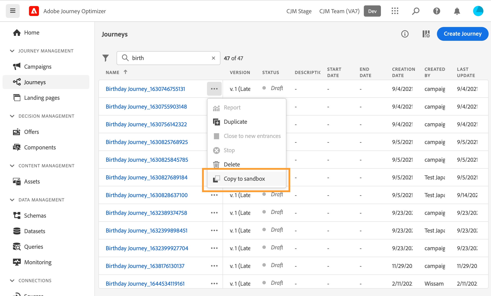

# Copiare un percorso in un’altra sandbox {#copy-to-sandbox}

>[!CONTEXTUALHELP]
>id="ajo_journey_copy_main"
>title="Copiare un percorso in un’altra sandbox"
>abstract="Journey Optimizer consente di copiare un intero percorso da una sandbox all’altra. Ad esempio, puoi copiare un percorso dall’ambiente sandbox di staging alla sandbox di produzione. Oltre al percorso stesso, Journey Optimizer copia anche la maggior parte degli oggetti da cui dipende il percorso."

>[!CONTEXTUALHELP]
>id="ajo_journey_copy_sandbox_details"
>title="Dettagli della sandbox"
>abstract="Seleziona la sandbox di destinazione in cui desideri copiare il percorso. Sono disponibili solo le sandbox all’interno dell’organizzazione."

>[!CONTEXTUALHELP]
>id="ajo_journey_copy_object_details"
>title="Dettagli oggetto"
>abstract="Questo è il percorso che stai per copiare."

>[!CONTEXTUALHELP]
>id="ajo_journey_copy_dependent_objects"
>title="Oggetti dipendenti"
>abstract="Questo è l’elenco degli oggetti associati utilizzati nel percorso. Questo elenco mostra il nome, il tipo di oggetto e l’ID Journey Optimizer interno."

Journey Optimizer consente di copiare un intero percorso da una sandbox all’altra. Ad esempio, puoi copiare un percorso dall’ambiente sandbox di Stage alla sandbox di produzione. Oltre al percorso stesso, Journey Optimizer copia anche la maggior parte degli oggetti da cui dipende il percorso: tipi di pubblico, superfici (ossia predefiniti), schemi, eventi e azioni. Per ulteriori dettagli sugli oggetti copiati, consulta questa [sezione](#limitations).

>[!CAUTION]
>
>Non è garantito che tutti gli elementi collegati vengano copiati nella sandbox di destinazione. È consigliabile eseguire un controllo approfondito prima di pubblicare il percorso. In questo modo è possibile identificare eventuali oggetti mancanti.

Gli oggetti copiati nella sandbox di destinazione sono univoci e non esiste alcun rischio di sovrascrittura degli elementi esistenti. Sia il percorso che i messaggi all&#39;interno del percorso vengono trasferiti in modalità bozza. Ciò ti consente di eseguire una convalida completa prima della pubblicazione sulla sandbox di destinazione. Il processo di copia viene copiato solo sui metadati relativi al percorso e agli oggetti di tale Percorso. Non vengono copiati dati di profilo o set di dati come parte di questo processo.

Per copiare un percorso in un’altra sandbox, effettua le seguenti operazioni:

1. Nella sezione del menu GESTIONE PERCORSO fare clic su **[!UICONTROL Percorsi]**. Viene visualizzato l’elenco dei percorsi.

2. Cercare il percorso che si desidera copiare, fare clic sul pulsante **Altre azioni** (i tre punti accanto al nome del percorso) e fare clic su **Copia nella sandbox**.

   

   Il **Copia nella sandbox** viene visualizzata la schermata.

   

3. Seleziona la **Sandbox di Target** dal campo a discesa. Sono disponibili solo le sandbox all’interno dell’organizzazione.

4. Rivedi **Oggetti dipendenti** sezione. Questo è l’elenco degli oggetti associati utilizzati nel percorso. Questo elenco mostra il nome, il tipo di oggetto e l’ID Journey Optimizer interno.

5. Fai clic su **Copia** nell’angolo in alto a destra, per iniziare a copiare il percorso nella sandbox di destinazione.

   

   Viene avviato il processo di copia e visualizzato l&#39;avanzamento di ogni singolo oggetto. Il processo di copia varia in base alla complessità del percorso e al numero di oggetti da copiare. Se si verifica un errore, viene visualizzato un messaggio per l&#39;oggetto correlato.

   

6. Una volta completata la copia, fai clic su **Chiudi**.

7. Accedi alla sandbox di destinazione ed esegui un controllo completo di tutti gli oggetti copiati.

## Processo di copia e limitazioni {#limitations}

Tutti gli elementi collegati potrebbero non essere copiati nella sandbox di destinazione. L’Adobe consiglia vivamente di eseguire un controllo accurato. Identifica eventuali oggetti mancanti e creali manualmente prima di pubblicare il percorso.

Vengono copiati i seguenti oggetti:

* Pubblico

  Un pubblico può essere copiato una sola volta da una sandbox all’altra. Una volta copiato, il pubblico non può più essere modificato nella sandbox di destinazione.

* Schema

  Gli schemi utilizzati in questo percorso vengono copiati.

* Messaggio

  Le attività di azione del canale utilizzate nel percorso. I campi utilizzati per la personalizzazione nel messaggio non vengono controllati per verificarne la completezza. I blocchi di contenuto non vengono copiati.

* Percorso - dettagli area di lavoro

  La rappresentazione del percorso nell’area di lavoro, inclusi gli oggetti nel percorso come condizioni, azioni, eventi, tipi di pubblico letti e così via. L’attività Jump (Salta) viene esclusa dalla copia.

* Evento

  Gli eventi e i dettagli dell’evento utilizzati nel percorso vengono copiati.

* Azione

  Vengono copiati le azioni e i dettagli delle azioni utilizzati nel percorso.

Le superfici (ossia i predefiniti) non vengono copiate. Il sistema seleziona automaticamente la corrispondenza più simile possibile nella sandbox di destinazione, in base al tipo di messaggio e al nome della superficie. Se nella sandbox di destinazione non è presente alcuna superficie, la copia della superficie avrà esito negativo. Ciò significa che anche la copia del messaggio avrà esito negativo perché un messaggio richiede che sia disponibile una superficie per l’impostazione. In questo caso, affinché la copia funzioni, è necessario creare almeno una superficie, per il canale destro del messaggio.

Per gli schemi, i criteri di unione e i tipi di pubblico, la seconda volta che questi oggetti tentano di essere copiati, viene fatto riferimento solo a essi. Saranno trattati come oggetti già esistenti e verranno copiati di nuovo. Ciò significa che questi oggetti possono essere copiati una sola volta.

Si verifica un ritardo di cinque minuti prima che Adobe Journey Optimizer possa fare riferimento a schemi, criteri di unione e tipi di pubblico senza visualizzare un errore nell’area di lavoro. Attendete cinque minuti e questi riferimenti saranno disponibili.
