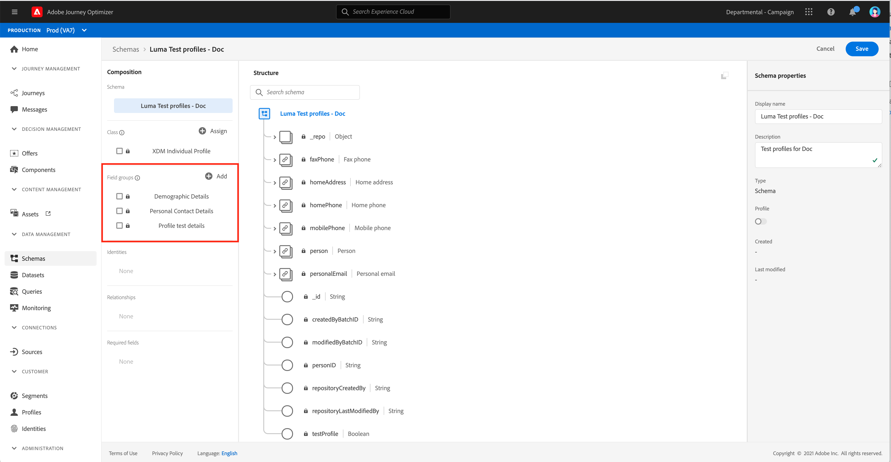
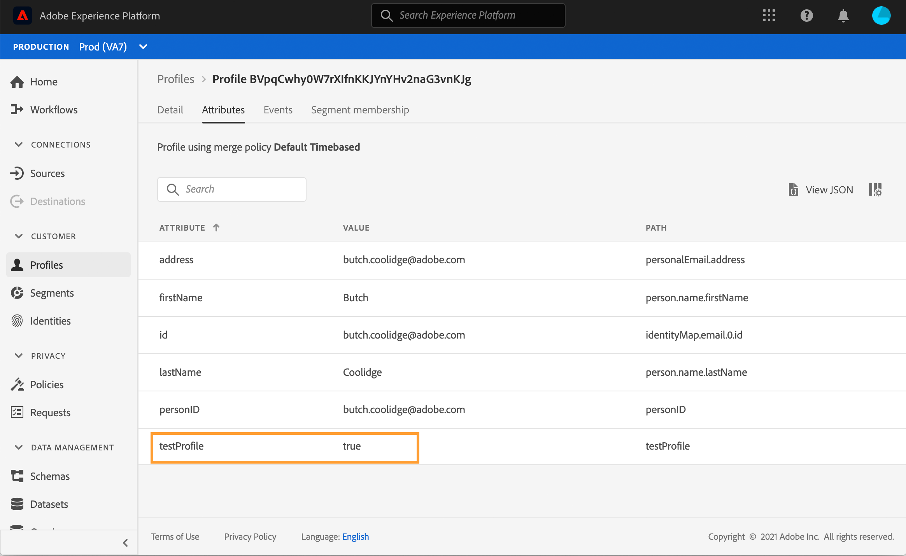
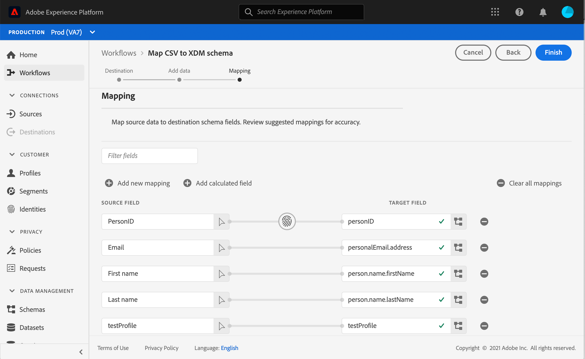

# Creare profili di test {#create-test-profiles}

I profili di test sono necessari quando si utilizza la modalità di test Per scoprire come utilizzare la modalità [test](../building-journeys/testing-the-journey.md) in un percorso e per [visualizzare in anteprima e verificare i messaggi](../preview.md).

I metodi disponibili per creare i profili di test sono descritti di seguito:

* Puoi trasformare un [profilo esistente](#turning-profile-into-test) in un profilo di test

* Puoi creare un profilo di test caricando un [file csv](#create-test-profiles-csv) o utilizzando [chiamate API](#create-test-profiles-api). Oltre a questi due metodi, Adobe Journey Optimizer viene fornito con un [caso d’uso interno al prodotto](#use-case-1) specifico per facilitare la creazione del profilo di test.

* Puoi anche caricare un file json in un set di dati. Per ulteriori informazioni, consulta la [documentazione sull’acquisizione dei dati](https://experienceleague.adobe.com/docs/experience-platform/ingestion/tutorials/ingest-batch-data.html#add-data-to-dataset).

La creazione di un profilo di test è simile alla creazione di profili normali in Adobe Experience Platform. Per ulteriori informazioni, consulta la [documentazione Profilo cliente in tempo reale](https://experienceleague.adobe.com/docs/experience-platform/profile/home.html).

## Prerequisiti  {#test-profile-prerequisites}

Per poter creare profili, devi innanzitutto creare uno schema e un set di dati nell’Adobe [!DNL Journey Optimizer].

Innanzitutto, devi **creare uno schema**. Segui questi passaggi:

1. Nella sezione del menu GESTIONE DATI fare clic su **[!UICONTROL Schemas]**.
   
1. Fai clic su **[!UICONTROL Create schema]**, in alto a destra, quindi seleziona un tipo di schema, ad esempio **Profilo individuale XDM**.
   
1. Selezionare i gruppi di campi appropriati. Assicurati di aggiungere il gruppo di campi **Dettagli test profilo** .
   
Al termine, fai clic su  **[!UICONTROL Add field groups]**: l’elenco dei gruppi di campi viene visualizzato nella schermata di panoramica dello schema.
   

   >[!NOTE]
   >
   >* Fai clic sul nome dello schema per modificarlo e aggiornarne le proprietà.
      >
      >
   * Fai clic sul pulsante **[!UICONTROL Add]** nella sezione Gruppi di campi per selezionare altri gruppi di campi da aggiungere nello schema


1. Nell’elenco dei campi, fai clic sul campo da definire come identità principale.
   
1. Nel riquadro a destra **[!UICONTROL Field properties]**, seleziona le opzioni **[!UICONTROL Identity]** e **[!UICONTROL Primary Identity]** e seleziona uno spazio dei nomi. Se desideri che l’identità principale sia un indirizzo e-mail, scegli lo spazio dei nomi **[!UICONTROL Email]** . Fai clic su **[!UICONTROL Apply]**.
   
1. Seleziona lo schema e abilita l&#39;opzione **[!UICONTROL Profile]** nel riquadro **[!UICONTROL Schema properties]**.
   
1. Fai clic su **Salva**.

>[!NOTE]
>
>Per ulteriori informazioni sulla creazione dello schema, consulta la [documentazione XDM](https://experienceleague.adobe.com/docs/experience-platform/xdm/ui/resources/schemas.html#prerequisites).

Quindi devi **creare il set di dati** in cui i profili verranno importati. Segui questi passaggi:

1. Passa a **[!UICONTROL Datasets]**, quindi fai clic su **[!UICONTROL Create dataset]**.
   
1. Scegli **[!UICONTROL Create dataset from schema]**.
   
1. Seleziona lo schema creato in precedenza e fai clic su **[!UICONTROL Next]**.
   
1. Scegli un nome e fai clic su **[!UICONTROL Finish]**.
   
1. Abilita l’opzione **[!UICONTROL Profile]** .
   

>[!NOTE]
>
> Per ulteriori informazioni sulla creazione dei set di dati, consulta la [documentazione Servizio catalogo](https://experienceleague.adobe.com/docs/experience-platform/catalog/datasets/user-guide.html#getting-started).

## Caso d&#39;uso interno al prodotto{#use-case-1}

Dalla home page di Adobe Journey Optimizer, puoi sfruttare il caso d’uso dei profili di test nel prodotto. Questo caso d’uso facilita la creazione di profili di test utilizzati per i percorsi di test prima della pubblicazione.


Fai clic sul pulsante **[!UICONTROL Begin]** per avviare il caso d’uso.

Sono necessarie le seguenti informazioni:

1. **Spazio dei nomi** identità: Lo spazio dei  [nomi ](https://experienceleague.adobe.com/docs/experience-platform/identity/namespaces.html) di identità utilizzato per identificare in modo univoco i profili di test. Ad esempio, se utilizzi l’e-mail per identificare i profili di test, devi selezionare lo spazio dei nomi identità **E-mail**. Se l&#39;identificatore univoco è il numero di telefono, deve essere selezionato lo spazio dei nomi identità **Telefono**.

2. **File** CSV: Un file separato da virgole contenente l’elenco dei profili di test da creare. Il caso d’uso richiede un formato predefinito per il file CSV che contiene l’elenco dei profili di test da creare. Ciascuna riga del file deve includere i campi seguenti nell’ordine corretto, come segue:

   1. **ID** persona: Identificatore univoco del profilo di test. I valori di questo campo devono riflettere lo spazio dei nomi identità selezionato. Ad esempio, se per lo spazio dei nomi identità è selezionato **Telefono** , i valori di questo campo devono essere numeri di telefono. Analogamente, se è selezionato **E-mail**, i valori di questo campo devono essere e-mail)
   1. **Indirizzo** e-mail: Verifica l’indirizzo e-mail del profilo. (Il campo **ID persona** e il campo **Indirizzo e-mail** potrebbero contenere gli stessi valori se **E-mail** è selezionato come spazio dei nomi di identità)
   1. **Nome**: Nome del profilo di test.
   1. **Cognome**: Cognome profilo di test.
   1. **Città**: Profilo di prova città di residenza
   1. **Paese**: Profilo di prova paese di residenza
   1. **Genere**: Genere del profilo di test. I valori disponibili sono **maschio**, **femmina** e **non_specificato**

Dopo aver selezionato lo spazio dei nomi dell&#39;identità e aver fornito il file CSV in base al formato di cui sopra, fai clic sul pulsante **[!UICONTROL Run]** in alto a destra. Il completamento del caso d’uso potrebbe richiedere alcuni minuti. Al termine dell’elaborazione e della creazione dei profili di test, viene inviata una notifica per informare l’utente.

>[!NOTE]
>
>I profili di test possono sostituire i profili esistenti. Prima di eseguire il caso d’uso, accertati che il CSV contenga solo profili di test e che venga eseguito rispetto alla sandbox corretta.

## Trasforma un profilo in un profilo di test{#turning-profile-into-test}

Puoi trasformare un profilo esistente in un profilo di test: puoi aggiornare gli attributi dei profili nello stesso modo in cui crei un profilo.

Un modo semplice per farlo è utilizzare un&#39;attività di azione **[!UICONTROL Update Profile]** in un percorso e cambiare il campo booleano testProfile da false a true.

Il percorso sarà composto da un’ **[!UICONTROL Read Segment]** e da un’ attività **[!UICONTROL Update Profile]** . Devi innanzitutto creare un segmento che esegue il targeting dei profili che desideri trasformare in profili di test.

>[!NOTE]
>
> Poiché stai aggiornando il campo **testProfile**, i profili selezionati devono includere questo campo. Lo schema correlato deve avere il gruppo di campi **Dettagli test profilo** . Vedi [questa sezione](../building-journeys/creating-test-profiles.md#test-profiles-prerequisites).

1. Passa a **Segmenti**, quindi **Crea segmento**, in alto a destra.
   
1. Definisci un nome per il segmento e crea il segmento: scegli i campi e i valori per eseguire il targeting dei profili desiderati.
   
1. Fai clic su **Salva** e verifica che il targeting dei profili sia corretto per il segmento.
   

   >[!NOTE]
   >
   > Il calcolo del segmento può richiedere del tempo. Ulteriori informazioni sui segmenti in [questa sezione](../segment/about-segments.md).

1. Ora crea un nuovo percorso e inizia con un’attività di orchestrazione **[!UICONTROL Read Segment]** .
1. Scegli il segmento creato in precedenza e lo spazio dei nomi utilizzato dai profili.
   
1. Aggiungi un’attività di azione **[!UICONTROL Update Profile]** .
1. Seleziona lo schema, il campo **testProfiles**, il set di dati e imposta il valore su **True**. Per eseguire questa operazione, nel campo **[!UICONTROL VALUE]** fai clic sull&#39;icona **Penna** a destra, seleziona **[!UICONTROL Advanced mode]** e immetti **true**.
   
1. Aggiungi un&#39;attività **End** e fai clic su **[!UICONTROL Publish]**.
1. Nella sezione **[!UICONTROL Segments]** , verifica che i profili siano stati aggiornati correttamente.
   

   >[!NOTE]
   >
   > Per ulteriori informazioni sull&#39;attività **[!UICONTROL Update Profile]**, consulta [questa sezione](../building-journeys/update-profiles.md).

## Creare un profilo di test utilizzando un file csv{#create-test-profiles-csv}

In Adobe Experience Platform, puoi creare profili caricando un file csv contenente i diversi campi di profilo nel set di dati. Questo è il metodo più semplice.

1. Crea un file csv semplice utilizzando un foglio di calcolo.
1. Aggiungi una colonna per ogni campo necessario. Assicurati di aggiungere il campo di identità principale (&quot;personID&quot; nel nostro esempio sopra) e il campo &quot;testProfile&quot; impostato su &quot;true&quot;.
   
1. Aggiungi una riga per profilo e compila i valori per ciascun campo.
   
1. Salva il foglio di calcolo come file csv. Assicurati che le virgole siano utilizzate come separatori.
1. Passa a Adobe Experience Platform **Flussi di lavoro**.
   
1. Scegli **Mappa CSV su schema XDM**, quindi fai clic su **Launch**.
   
1. Seleziona il set di dati in cui desideri importare i profili. Fai clic su **Avanti**.
   
1. Fai clic su **Scegli i file** e seleziona il file CSV. Quando il file viene caricato, fai clic su **Avanti**.
   
1. Mappa i campi csv di origine ai campi dello schema, quindi fai clic su **Fine**.
   
1. Inizia l’importazione dei dati. Lo stato verrà spostato da **Elaborazione** a **Success**. Fai clic su **Anteprima set di dati** in alto a destra.
   
1. Verifica che i profili di test siano stati aggiunti correttamente.
   

I profili di test vengono aggiunti e possono ora essere utilizzati durante il test di un percorso. Fai riferimento a [questa sezione](../building-journeys/testing-the-journey.md).
>[!NOTE]
>
> Per ulteriori informazioni sulle importazioni CSV, consulta la [documentazione sull’ acquisizione dei dati](https://experienceleague.adobe.com/docs/experience-platform/ingestion/tutorials/map-a-csv-file.html#tutorials).

## Creare profili di test utilizzando le chiamate API{#create-test-profiles-api}

Puoi anche creare profili di test tramite chiamate API. Ulteriori informazioni in questa [pagina](https://experienceleague.adobe.com/docs/experience-platform/profile/home.html).

Devi utilizzare uno schema di profilo che contenga il gruppo di campi &quot;Dettagli del test di profilo&quot;. Il flag testProfile fa parte di questo gruppo di campi.
Quando crei un profilo, accertati di trasmettere il valore: testProfile = true.

Tieni presente che puoi anche aggiornare un profilo esistente per modificare il relativo flag testProfile in &quot;true&quot;.

Ecco un esempio di chiamata API per creare un profilo di test:

```
curl -X POST \
'https://dcs.adobedc.net/collection/xxxxxxxxxxxxxx' \
-H 'Cache-Control: no-cache' \
-H 'Content-Type: application/json' \
-H 'Postman-Token: xxxxx' \
-H 'cache-control: no-cache' \
-H 'x-api-key: xxxxx' \
-H 'x-gw-ims-org-id: xxxxx' \
-d '{
"header": {
"msgType": "xdmEntityCreate",
"msgId": "xxxxx",
"msgVersion": "xxxxx",
"xactionid":"xxxxx",
"datasetId": "xxxxx",
"imsOrgId": "xxxxx",
"source": {
"name": "Postman"
},
"schemaRef": {
"id": "https://example.adobe.com/mobile/schemas/xxxxx",
"contentType": "application/vnd.adobe.xed-full+json;version=1"
}
},
"body": {
"xdmMeta": {
"schemaRef": {
"contentType": "application/vnd.adobe.xed-full+json;version=1"
}
},
"xdmEntity": {
"_id": "xxxxx",
"_mobile":{
"ECID": "xxxxx"
},
"testProfile":true
}
}
}'
```
