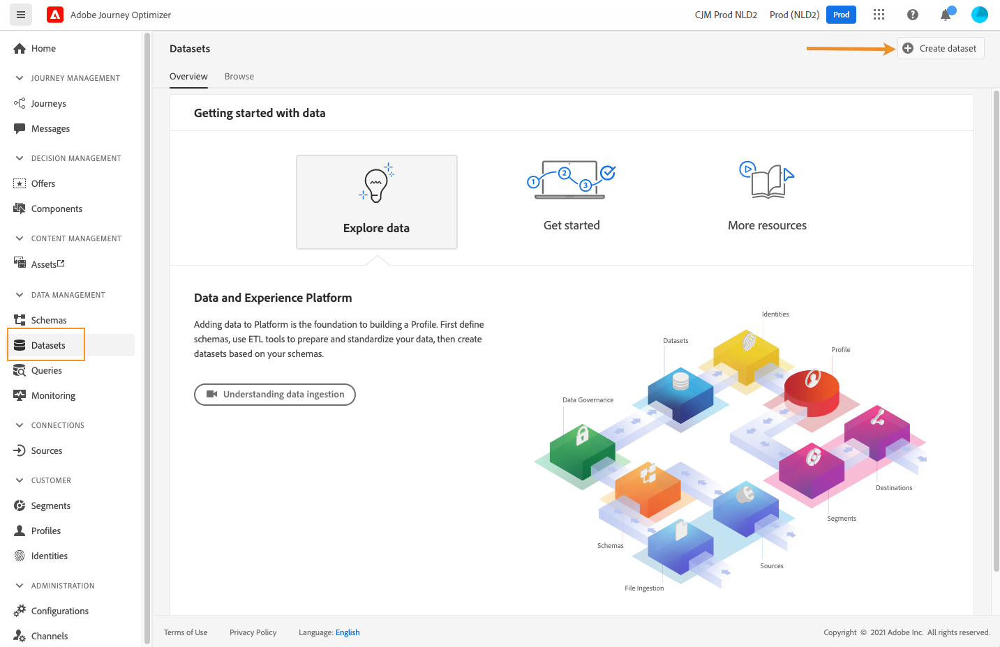
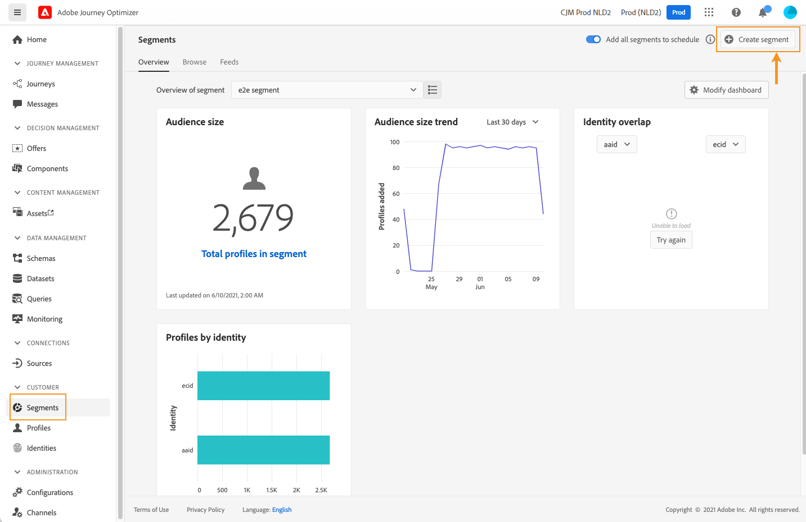
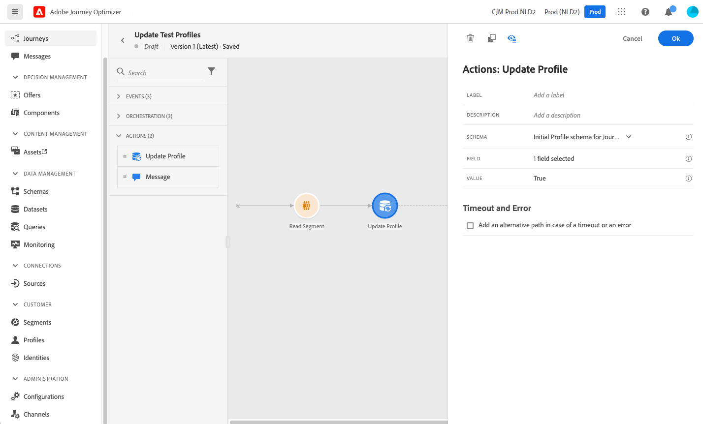
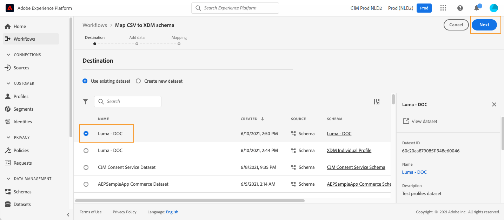
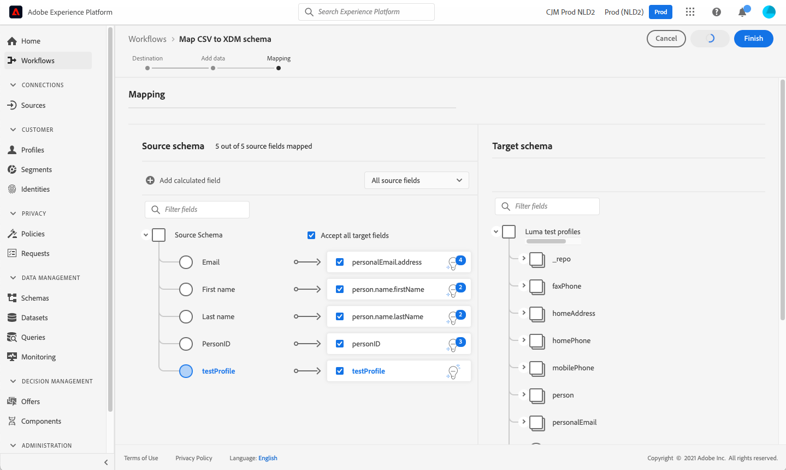

# Creare profili di test {#create-test-profiles}

I profili di test sono necessari quando si utilizza [modalità di test](../building-journeys/testing-the-journey.md) in un percorso e a [visualizzare in anteprima e verificare il contenuto](../email/preview.md).

Esistono diversi modi per creare profili di test. Puoi trovare in questa pagina i dettagli per:

* Attiva [profilo esistente](#turning-profile-into-test) in un profilo di test

* Creare profili di test caricando un [file csv](#create-test-profiles-csv) o utilizzando [Chiamate API](#create-test-profiles-api).

  Oltre a questi due metodi, Adobe Journey Optimizer viene fornito con un [caso d’uso interno al prodotto](#use-case-1) per facilitare la creazione del profilo di test.

Puoi anche caricare un file json in un set di dati esistente. Per ulteriori informazioni, consulta [Documentazione sull’acquisizione dei dati](https://experienceleague.adobe.com/docs/experience-platform/ingestion/tutorials/ingest-batch-data.html#add-data-to-dataset){target="_blank"}.

La creazione di un profilo di test è simile alla creazione di profili normali in Adobe Experience Platform. Per ulteriori informazioni, consulta [Documentazione del profilo cliente in tempo reale](https://experienceleague.adobe.com/docs/experience-platform/profile/home.html?lang=it){target="_blank"}.

➡️ [Scopri come creare profili di test in questo video](#video)

## Prerequisiti {#test-profile-prerequisites}

Per poter creare profili, devi innanzitutto creare uno schema e un set di dati in Adobe [!DNL Journey Optimizer].

A **creare uno schema**, effettua le seguenti operazioni:

1. Nella sezione del menu DATA MANAGEMENT, fare clic su **[!UICONTROL Schemi]**.
   
1. Clic **[!UICONTROL Crea schema]**, in alto a destra, quindi seleziona un tipo di schema, ad esempio **Profilo individuale XDM**.
   
1. Selezionare i gruppi di campi appropriati. Accertati di aggiungere **Dettagli del test del profilo** gruppo di campi.
   
Al termine, fai clic su **[!UICONTROL Aggiungi gruppi di campi]**: l’elenco dei gruppi di campi viene visualizzato nella schermata di panoramica dello schema.
   

   >[!NOTE]
   >
   >* Fai clic sul nome dello schema per modificarlo e aggiornarne le proprietà.
   >
   >* Fai clic su **[!UICONTROL Aggiungi]** nella sezione Gruppi di campi per selezionare altri gruppi di campi da aggiungere nello schema

1. Nell’elenco dei campi, fai clic sul campo che desideri definire come identità primaria.
   
1. In **[!UICONTROL Proprietà campo]** riquadro destro, selezionare **[!UICONTROL Identità]** e **[!UICONTROL Identità primaria]** e selezionare uno spazio dei nomi. Se desideri che l’identità primaria sia un indirizzo e-mail, scegli **[!UICONTROL E-mail]** spazio dei nomi. Clic **[!UICONTROL Applica]**.
   
1. Seleziona lo schema e abilita **[!UICONTROL Profilo]** opzione in **[!UICONTROL Proprietà dello schema]** riquadro.
   
1. Fai clic su **Salva**.

>[!NOTE]
>
>Per ulteriori informazioni sulla creazione dello schema, consulta [Documentazione XDM](https://experienceleague.adobe.com/docs/experience-platform/xdm/ui/resources/schemas.html#prerequisites){target="_blank"}.

Quindi devi **creare il set di dati** in cui verranno importati i profili. Segui questi passaggi:

1. Sfoglia per **[!UICONTROL Set di dati]**, quindi fai clic su **[!UICONTROL Crea set di dati]**.
   
1. Scegli **[!UICONTROL Crea set di dati dallo schema]**.
   
1. Seleziona lo schema creato in precedenza, quindi fai clic su **[!UICONTROL Successivo]**.
   
1. Scegli un nome e fai clic su **[!UICONTROL Fine]**.
   
1. Abilita **[!UICONTROL Profilo]** opzione.
   

>[!NOTE]
>
> Per ulteriori informazioni sulla creazione di set di dati, consulta [Documentazione di Catalog Service](https://experienceleague.adobe.com/docs/experience-platform/catalog/datasets/user-guide.html#getting-started){target="_blank"}.

## Caso di utilizzo interno al prodotto{#use-case-1}

Dalla pagina Home di Adobe Journey Optimizer, puoi sfruttare il caso di utilizzo dei profili di test nel prodotto. Questo caso d’uso facilita la creazione di profili di test utilizzati per i percorsi di test prima della pubblicazione.


Per iniziare il caso d’uso, fai clic sul pulsante **[!UICONTROL Inizia]**.

Sono richieste le seguenti informazioni:

1. **Spazio dei nomi dell’identità**: Il [spazio dei nomi delle identità](../audience/get-started-identity.md) utilizzato per identificare in modo univoco i profili di test. Ad esempio, se l’e-mail viene utilizzata per identificare i profili di test, lo spazio dei nomi dell’identità **E-mail** deve essere selezionato. Se l’identificatore univoco è il numero di telefono, allora lo spazio dei nomi dell’identità **Telefono** deve essere selezionato.

2. **File CSV**: file separato da virgole contenente l’elenco dei profili di test da creare. Il caso d’uso prevede un formato predefinito per il file CSV che contiene l’elenco dei profili di test da creare. Ogni riga del file deve includere i campi seguenti nell’ordine corretto, come segue:

   1. **ID persona**: identificatore univoco del profilo di test. I valori di questo campo devono riflettere lo spazio dei nomi delle identità selezionato. (ad esempio, se **Telefono** è selezionato per lo spazio dei nomi delle identità, quindi i valori di questo campo devono essere numeri di telefono. Analogamente se **E-mail** , i valori di questo campo devono essere e-mail)
   1. **Indirizzo e-mail**: indirizzo e-mail del profilo di test. (Il **ID persona** e **Indirizzo e-mail** il campo potrebbe contenere gli stessi valori se **E-mail** è selezionato come spazio dei nomi dell’identità)
   1. **Nome**: nome del profilo di test.
   1. **Cognome**: cognome del profilo di test.
   1. **Città**: profilo di test città di residenza
   1. **Paese**: profilo di test paese di residenza
   1. **Genere**: genere del profilo di test. I valori disponibili sono **maschio**, **femmina** e **non_specificato**

Dopo aver selezionato lo spazio dei nomi dell’identità e aver fornito il file CSV in base al formato di cui sopra, fai clic su **[!UICONTROL Esegui]** in alto a destra. Il completamento del caso d’uso potrebbe richiedere alcuni minuti. Una volta completata l’elaborazione e la creazione dei profili di test, il caso d’uso invia una notifica per informare l’utente.

>[!NOTE]
>
>I profili di test possono ignorare quelli esistenti. Prima di eseguire il caso d’uso, assicurati che il file CSV contenga solo profili di test e che venga eseguito sulla sandbox corretta.

## Trasformare un profilo in un profilo di test{#turning-profile-into-test}

È possibile trasformare un profilo esistente in un profilo di test: è possibile aggiornare gli attributi dei profili nello stesso modo in cui si crea un profilo.

Un modo semplice per farlo è utilizzare un **[!UICONTROL Aggiorna profilo]** attività di azione in un percorso e modificare il **testProfile** campo booleano da false a true.

Il percorso sarà composto da **[!UICONTROL Read Audience]** e un **[!UICONTROL Aggiorna profilo]** attività. Devi innanzitutto creare un pubblico che punti ai profili da trasformare in profili di test.

>[!NOTE]
>
> Poiché verrà aggiornato il **testProfile** , i profili scelti devono includere questo campo. Lo schema correlato deve avere **Dettagli del test del profilo** gruppo di campi. Consulta [questa sezione](../audience/creating-test-profiles.md#test-profiles-prerequisites).

1. Sfoglia per **Tipi di pubblico**, quindi **Creare un pubblico**, in alto a destra.
   
1. Definisci un nome per il pubblico e crea il pubblico: scegli i campi e i valori per eseguire il targeting dei profili che desideri.
   
1. Clic **Salva** e verifica che il pubblico esegua correttamente il targeting dei profili.
   

   >[!NOTE]
   >
   > Il calcolo del pubblico può richiedere del tempo. Ulteriori informazioni sui tipi di pubblico in [questa sezione](../audience/about-audiences.md).

1. Ora crea un nuovo percorso e inizia con **[!UICONTROL Read Audience]** attività di orchestrazione.
1. Scegli il pubblico creato in precedenza e lo spazio dei nomi utilizzato dai profili.
   
1. Aggiungi un **[!UICONTROL Aggiorna profilo]** attività azione.
1. Seleziona lo schema, il **testProfiles** , il set di dati e imposta il valore su **Vero**. Per eseguire questa operazione, nella **[!UICONTROL VALORE]** , fare clic sul pulsante **Penna** a destra, seleziona **[!UICONTROL Modalità avanzata]** e immetti **true**.
   
1. Fai clic su **[!UICONTROL Pubblica]**.
1. In **[!UICONTROL Tipi di pubblico]** sezione, verifica che i profili siano stati aggiornati correttamente.
   

   >[!NOTE]
   >
   > Per ulteriori informazioni su **[!UICONTROL Aggiorna profilo]** attività, fare riferimento a [questa sezione](../building-journeys/update-profiles.md).

## Creare un profilo di test utilizzando un file CSV{#create-test-profiles-csv}

In Adobe Experience Platform, puoi creare profili caricando un file csv contenente i diversi campi del profilo nel set di dati. Questo è il metodo più semplice.

1. Creare un semplice file CSV utilizzando un software per fogli di calcolo.
1. Aggiungi una colonna per ogni campo richiesto. Assicurati di aggiungere il campo dell’identità primaria (&quot;personID&quot; nell’esempio precedente) e il campo &quot;testProfile&quot; impostato su &quot;true&quot;.
   
1. Aggiungi una riga per profilo e compila i valori per ciascun campo.
   
1. Salva il foglio di calcolo come file csv. Assicurati che le virgole siano utilizzate come separatori.
1. Passa a Adobe Experience Platform **Flussi di lavoro**.
   
1. Scegli **Mappa lo schema CSV a XDM**, quindi fai clic su **Launch**.
   
1. Seleziona il set di dati in cui desideri importare i profili. Fai clic su **Avanti**.
   
1. Clic **Scegli i file** e seleziona il file csv. Una volta caricato il file, fai clic su **Successivo**.
   
1. Mappa i campi csv di origine ai campi dello schema, quindi fai clic su **Fine**.
   
1. Viene avviata l’importazione dei dati. Lo stato verrà spostato da **Elaborazione** a **Completato**. Clic **Anteprima set di dati**, in alto a destra.
   
1. Verifica che i profili di test siano stati aggiunti correttamente.
   

Vengono aggiunti i profili di test, che ora possono essere utilizzati durante il test di un percorso. Fai riferimento a [questa sezione](../building-journeys/testing-the-journey.md).
>[!NOTE]
>
> Per ulteriori informazioni sulle importazioni di CSV, consulta [Documentazione sull’acquisizione dei dati](https://experienceleague.adobe.com/docs/experience-platform/ingestion/tutorials/map-a-csv-file.html#tutorials){target="_blank"}.

## Creare profili di test tramite chiamate API{#create-test-profiles-api}

Puoi anche creare profili di test tramite chiamate API. Ulteriori informazioni nella [documentazione di Adobe Experience Platform](https://experienceleague.adobe.com/docs/experience-platform/profile/home.html?lang=it){target="_blank"}.

Devi utilizzare uno schema di profilo che contiene il gruppo di campi &quot;Dettagli test profilo&quot;. Il flag testProfile fa parte di questo gruppo di campi.
Quando crei un profilo, accertati di trasmettere il valore: testProfile = true.

Puoi anche aggiornare un profilo esistente per modificare il flag testProfile in &quot;true&quot;.

Di seguito è riportato un esempio di chiamata API per creare un profilo di test:

```
curl -X POST \
'https://dcs.adobedc.net/collection/xxxxxxxxxxxxxx' \
-H 'Cache-Control: no-cache' \
-H 'Content-Type: application/json' \
-H 'Postman-Token: xxxxx' \
-H 'cache-control: no-cache' \
-H 'x-api-key: xxxxx' \
-H 'x-gw-ims-org-id: xxxxx' \
-d '{
"header": {
"msgType": "xdmEntityCreate",
"msgId": "xxxxx",
"msgVersion": "xxxxx",
"xactionid":"xxxxx",
"datasetId": "xxxxx",
"imsOrgId": "xxxxx",
"source": {
"name": "Postman"
},
"schemaRef": {
"id": "https://example.adobe.com/mobile/schemas/xxxxx",
"contentType": "application/vnd.adobe.xed-full+json;version=1"
}
},
"body": {
"xdmMeta": {
"schemaRef": {
"contentType": "application/vnd.adobe.xed-full+json;version=1"
}
},
"xdmEntity": {
"_id": "xxxxx",
"_mobile":{
"ECID": "xxxxx"
},
"testProfile":true
}
}
}'
```

## Video introduttivo {#video}

Scopri come creare profili di test.

>[!VIDEO](https://video.tv.adobe.com/v/334236?quality=12)
