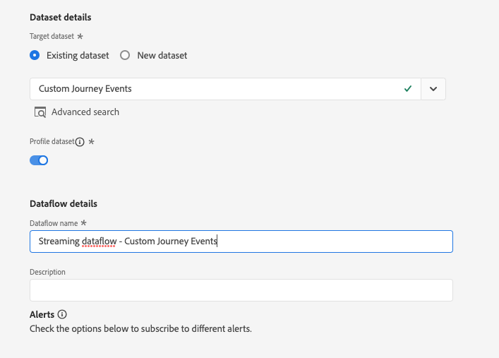

# Utilizzare azioni personalizzate per scrivere eventi del percorso in Experience Platform {#custom-action-aep}

>[!BEGINSHADEBOX]

**In questa pagina:** Scopri come scrivere eventi di percorso personalizzati in Adobe Experience Platform dai tuoi percorsi utilizzando azioni personalizzate e chiamate API autenticate.

>[!ENDSHADEBOX]

Questo caso d&#39;uso spiega come scrivere eventi personalizzati in [!DNL Adobe Experience Platform] da Percorsi utilizzando Azioni personalizzate e chiamate autenticate.

## Configurare un progetto per sviluppatori {#custom-action-aep-IO}

1. Da Adobe Developer Console, fai clic su **Progetto** e apri il progetto di I/O.

1. Nella sezione **Credenziali**, fai clic su **OAuth Server-to-Server**.

   

1. Fare clic su **Visualizza comando cURL**.

   Selezione del tipo di azione ![[!DNL Adobe Experience Platform]](assets/custom-action-aep-2.png)

1. Copiare il comando cURL e archiviare client_id, client_secret, grant_type e scope.

```
curl -X POST 'https://ims-na1.adobelogin.com/ims/token/v3' -H 'Content-Type: application/x-www-form-urlencoded' -d 'grant_type=client_credentials&client_id=1234&client_secret=5678&scope=openid,AdobeID,read_organizations,additional_info.projectedProductContext,session'
```

>[!CAUTION]
>
>Dopo aver creato il progetto su Adobe Developer Console, assicurati di concedere agli sviluppatori e al controllo dell’accesso API le autorizzazioni appropriate. Ulteriori informazioni nella [[!DNL Adobe Experience Platform] documentazione](https://experienceleague.adobe.com/en/docs/experience-platform/landing/platform-apis/api-authentication#grant-developer-and-api-access-control){target="_blank"}

## Configurare l’origine utilizzando l’ingresso API HTTP

1. Creare un endpoint in [!DNL Adobe Experience Platform] per scrivere i dati dai percorsi.

1. In [!DNL Adobe Experience Platform], fai clic su **Origini**, in **Connessioni** nel menu a sinistra. In **API HTTP**, fare clic su **Aggiungi dati**.

   ![Menu a discesa di selezione sandbox per [!DNL Adobe Experience Platform]](assets/custom-action-aep-3.png)

1. Seleziona **Nuovo account** e abilita l&#39;autenticazione. Selezionare **Connetti a Source**.

   

1. Seleziona **Avanti** e il set di dati in cui desideri scrivere i dati. Fai clic su **Avanti** e **Fine**.

   

1. Apri il flusso di dati appena creato. Copia il payload dello schema e salvalo nel blocco note.

```
{
"header": {
"schemaRef": {
"id": "https://ns.adobe.com/<your_org>/schemas/<schema_id>",
"contentType": "application/vnd.adobe.xed-full+json;version=1.0"
},
"imsOrgId": "<org_id>",
"datasetId": "<dataset_id>",
"source": {
"name": "Custom Journey Events"
}
},
"body": {
"xdmMeta": {
"schemaRef": {
"id": "https://ns.adobe.com/<your_org>/schemas/<schema_id>",
"contentType": "application/vnd.adobe.xed-full+json;version=1.0"
}
},
"xdmEntity": {
"_id": "test1",
"<your_org>": {
"journeyVersionId": "",
"nodeId": "", "customer_Id":""
},
"eventMergeId": "",
"eventType": "",
"producedBy": "self",
"timestamp": "2018-11-12T20:20:39+00:00"
}
}
}
```

## Configurare l’azione personalizzata {#custom-action-config}

La configurazione dell&#39;azione personalizzata è dettagliata in [questa pagina](../action/about-custom-action-configuration.md).

Per questo esempio, segui questi passaggi:

1. Apri [!DNL Adobe Journey Optimizer] e fai clic su **Configurazioni**, in **Amministrazione** nel menu a sinistra. In **Azioni**, fai clic su **Gestisci** e poi su **Crea azione**.

1. Imposta l’URL e seleziona il metodo Post.

   `https://dcs.adobedc.net/collection/<collection_id>?syncValidation=false`

1. Assicurati che le intestazioni (Content-Type, Charset, sandbox-name) siano configurate.

   

### Configurare l’autenticazione {#custom-action-aep-authentication}

1. Seleziona **Tipo** come **Personalizzato** con il seguente payload.

1. Incollare client_secret, client_id, scope e grant_type dal payload del progetto IO utilizzato in precedenza.

   ```
   {
   "type": "customAuthorization",
   "authorizationType": "Bearer",
   "endpoint": "https://ims-na1.adobelogin.com/ims/token/v3",
   "method": "POST",
   "headers": {},
   "body": {
   "bodyType": "form",
   "bodyParams": {
   "grant_type": "client_credentials",
   "client_secret": "********",
   "client_id": "<client_id>",
   "scope": "openid,AdobeID,read_organizations,additional_info.projectedProductContext,session"
   }
   },
   "tokenInResponse": "json://access_token",
   "cacheDuration": {
   "duration": 28000,
   "timeUnit": "seconds"
   }
   }
   ```

1. Utilizza **Fare clic per verificare l&#39;autenticazione** per verificare la connessione.

   

### Impostare il payload {#custom-action-aep-payload}

1. Nei campi **Richiesta** e **Risposta**, incolla il payload dalla connessione di origine utilizzata in precedenza.

   ```
   {
   "xdmMeta": {
   "schemaRef": {
   "id": "https://ns.adobe.com/<your_org>/schemas/<schema_id>",
   "contentType": "application/vnd.adobe.xed-full+json;version=1.0"
   }
   },
   "xdmEntity": {
   "_id": "/uri-reference",
   "<your_org>": {
   "journeyVersionId": "Sample value",
   "nodeId": "Sample value",
   "customer_Id":""
   },
   "eventMergeId": "Sample value",
   "eventType": "advertising.completes,
   "producedBy": "self",
   "timestamp": "2018-11-12T20:20:39+00:00"
   }
   }
   ```

1. Modifica la configurazione del campo da **Costante** a **Variabile** per i campi che verranno compilati in modo dinamico.

1. Salva l&#39;azione personalizzata.

## Percorso

1. Infine, utilizza questa azione personalizzata in un percorso per scrivere gli eventi di percorso personalizzati.

1. Popola l’ID versione del Percorso, l’ID nodo, il nome del nodo e altri attributi in base al tuo caso d’uso.

   

+++ Guida di riferimento della Knowledge Base di AI

Questa sezione contiene informazioni strutturate che supportano l&#39;interpretazione, il recupero e la risposta alle domande relative a questo argomento.

Per una comprensione completa, queste informazioni devono essere unite alla documentazione su questa pagina. Nessuna delle due origini è progettata per essere indipendente; la pagina descrive la funzione, mentre questa sezione fornisce un contesto aggiuntivo che aiuta a non ambiguare la terminologia, le finalità, l’applicabilità e i vincoli.

- **TL;DR:** Questo caso d&#39;uso spiega come configurare un&#39;azione personalizzata in Journey Optimizer che scrive i dati dell&#39;evento di percorso in Adobe Experience Platform utilizzando un ingresso API HTTP e le chiamate autenticate da server a server OAuth.

**Intenti:**
- Configurare un progetto I/O di Adobe Developer Console con le credenziali server-to-server OAuth per l’autenticazione API di AEP
- Creare un’origine di ingresso API HTTP in Adobe Experience Platform per ricevere i dati dell’evento del percorso di streaming
- Configurare un’azione personalizzata in Journey Optimizer con l’URL, le intestazioni e l’autenticazione personalizzata del token Bearer corretti
- Mappa dinamicamente i campi del percorso (ID versione percorso, ID nodo, ID cliente) come variabili nel payload dell’azione personalizzata
- Utilizzare l’azione personalizzata in un percorso per scrivere eventi personalizzati in un set di dati di AEP

**Glossario:**
- **Ingresso API HTTP**: connettore di origine Adobe Experience Platform che crea un endpoint di streaming per l&#39;acquisizione di dati tramite richieste HTTP POST *(specifico per prodotto)*
- **OAuth Server-to-Server**: tipo di credenziali di autenticazione in Adobe Developer Console che genera token Bearer per le chiamate API server-to-server senza interazione utente *(specifico per prodotto)*
- **Autorizzazione personalizzata**: tipo di autenticazione dell&#39;azione personalizzata Journey Optimizer che recupera un token Bearer da un endpoint specificato e lo memorizza nella cache per una durata configurata *(specifica per prodotto)*
- **Entità XDM**: la struttura del payload dei dati conforme allo schema Experience Data Model, utilizzata come corpo per la scrittura di eventi in AEP tramite l&#39;ingresso API HTTP *(specifico per prodotto)*
- **cacheDuration**: l&#39;impostazione della cache dei token nella configurazione di autorizzazione personalizzata che controlla per quanto tempo il token Bearer recuperato viene riutilizzato prima che ne venga richiesto uno nuovo *(specifico per prodotto)*

**Guardrail:**
- Dopo aver creato il progetto Adobe Developer Console, è necessario concedere esplicitamente le autorizzazioni di controllo degli accessi a sviluppatori e API prima di poter utilizzare le credenziali
- L’origine di ingresso API HTTP deve essere creata con l’autenticazione abilitata; l’URL dell’endpoint di connessione e il payload dello schema devono essere copiati e memorizzati per l’utilizzo nella configurazione dell’azione personalizzata
- Le intestazioni delle azioni personalizzate devono includere Content-Type, Charset e sandbox-name
- I campi destinati a essere compilati dinamicamente in fase di esecuzione devono essere modificati da Costante a Variabile nella configurazione del payload dell’azione personalizzata

**Terminologia:**
- Nome canonico: azione personalizzata — Acronimo: none — varianti: configurazione azione personalizzata, azione personalizzata Journey Optimizer
- Nome canonico: Adobe Experience Platform — Acronimo: AEP — varianti: Experience Platform, Platform
- Sinonimi: &quot;HTTP API Inlet&quot; = &quot;endpoint di streaming&quot; = &quot;DCS collection endpoint&quot;
- Da non confondere: &quot;OAuth Server-to-Server&quot; ≠ &quot;OAuth User Authentication&quot; (Server-to-Server non richiede l’accesso dell’utente; utilizza le credenziali client)

**Domande frequenti:**
- **D: che tipo di autenticazione viene utilizzata per chiamare l&#39;ingresso API HTTP di AEP da un&#39;azione personalizzata di Journey Optimizer?** — Autenticazione del token Bearer personalizzato tramite le credenziali client OAuth Server-to-Server recuperate dall&#39;endpoint del token Adobe IMS.
- **Q: Dove si trovano i valori client_id, client_secret, grant_type e scope?** — Dalla sezione delle credenziali server-to-server OAuth del progetto IO di Adobe Developer Console, facendo clic su &quot;Visualizza comando cURL&quot;.
- **D: come posso rendere dinamici i campi specifici del percorso (ad esempio, journeyVersionId, nodeId) nel payload?** — Modifica la configurazione del campo da Costante a Variabile nella configurazione del payload dell&#39;azione personalizzata in modo che vengano compilati dal contesto del percorso in fase di esecuzione.
- **D: quali autorizzazioni sono necessarie per il progetto Adobe Developer Console?** — Dopo la creazione del progetto, lo sviluppatore e il controllo dell&#39;accesso API devono disporre delle autorizzazioni appropriate, come descritto nella documentazione relativa all&#39;autenticazione API di AEP.
- **D: qual è lo scopo dell&#39;impostazione cacheDuration nel payload di autenticazione?** — Controlla per quanto tempo il token Bearer recuperato viene memorizzato in cache e riutilizzato (28.000 secondi nell&#39;esempio) prima che l&#39;azione personalizzata richieda un nuovo token.

+++
