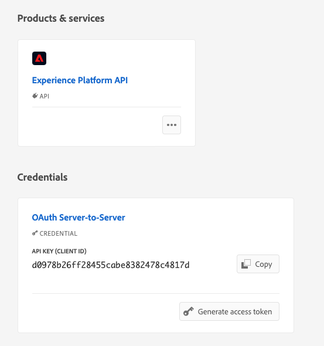

# Caso d’uso: utilizzare azioni personalizzate per scrivere eventi di Percorso in Experienci Platform{#custom-action-aep}

Questo caso d’uso spiega come scrivere eventi personalizzati in Adobe Experience Platform da Percorsi utilizzando Azioni personalizzate e chiamate autenticate.

## Configurare un progetto I/O

1. Dalla console Adobe Developer, fai clic su **Progetto** e aprire il progetto I/O.

1. In **Credenziali** , fare clic su **OAuth Server-to-Server**.

   

1. Clic **Visualizza comando cURL**.

   

1. Copiare il comando cURL e archiviare client_id, client_secret, grant_type e scope.

```
curl -X POST 'https://ims-na1.adobelogin.com/ims/token/v3' -H 'Content-Type: application/x-www-form-urlencoded' -d 'grant_type=client_credentials&client_id=1234&client_secret=5678&scope=openid,AdobeID,read_organizations,additional_info.projectedProductContext,session'
```

>[!CAUTION]
>
>Dopo aver creato il progetto nella console Adobe Developer, assicurati di concedere agli sviluppatori e al controllo dell’accesso API le autorizzazioni appropriate. Per ulteriori informazioni, consulta [Documentazione di Adobe Experience Platform](https://experienceleague.adobe.com/en/docs/experience-platform/landing/platform-apis/api-authentication#grant-developer-and-api-access-control){target="_blank"}

## Configurare l’origine utilizzando l’ingresso API HTTP

1. Crea un endpoint in Adobe Experience Platform per scrivere i dati dai percorsi.

1. In Adobe Experience Platform, fai clic su **Sorgenti**, in **Connessioni** nel menu a sinistra. Sotto **API HTTP**, fai clic su **Aggiungi dati**.

   

1. Seleziona **Nuovo account** e abilitare l’autenticazione. Fai clic su **Connetti all&#39;origine**.

   

1. Fai clic su **Successivo** e seleziona il Set di dati in cui desideri scrivere i dati. Clic **Successivo** e **Fine**.

   

1. Apri il flusso di dati appena creato. Copia il payload dello schema e salvalo nel blocco note.

```
{
"header": {
"schemaRef": {
"id": "https://ns.adobe.com/<your_org>/schemas/<schema_id>",
"contentType": "application/vnd.adobe.xed-full+json;version=1.0"
},
"imsOrgId": "<org_id>",
"datasetId": "<dataset_id>",
"source": {
"name": "Custom Journey Events"
}
},
"body": {
"xdmMeta": {
"schemaRef": {
"id": "https://ns.adobe.com/<your_org>/schemas/<schema_id>",
"contentType": "application/vnd.adobe.xed-full+json;version=1.0"
}
},
"xdmEntity": {
"_id": "test1",
"<your_org>": {
"journeyVersionId": "",
"nodeId": "", "customer_Id":""
},
"eventMergeId": "",
"eventType": "",
"producedBy": "self",
"timestamp": "2018-11-12T20:20:39+00:00"
}
}
}
```

## Configurare l’azione personalizzata

1. Apri Adobe Journey Optimizer e fai clic su **Configurazioni**, in **Amministrazione** nel menu a sinistra. Sotto **Azioni**, fai clic su **Gestisci** e fai clic su **Crea azione**.

1. Imposta l’URL e seleziona il metodo Post.

   `https://dcs.adobedc.net/collection/<collection_id>?syncValidation=false`

1. Assicurati che le intestazioni (Content-Type, Charset, sandbox-name) siano configurate.

   

### Impostare l’autenticazione

1. Seleziona la **Tipo** as **Personalizzato** con il seguente payload.

1. Incollare client_secret, client_id, scope e grant_type dal payload del progetto IO utilizzato in precedenza.

   ```
   {
   "type": "customAuthorization",
   "authorizationType": "Bearer",
   "endpoint": "https://ims-na1.adobelogin.com/ims/token/v3",
   "method": "POST",
   "headers": {},
   "body": {
   "bodyType": "form",
   "bodyParams": {
   "grant_type": "client_credentials",
   "client_secret": "********",
   "client_id": "<client_id>",
   "scope": "openid,AdobeID,read_organizations,additional_info.projectedProductContext,session"
   }
   },
   "tokenInResponse": "json://access_token",
   "cacheDuration": {
   "duration": 28000,
   "timeUnit": "seconds"
   }
   }
   ```

1. Utilizza il **Fai clic per verificare l’autenticazione** per verificare la connessione.

   

### Impostare il payload

1. In **Richiesta** e **Risposta** , incolla il payload dalla connessione di origine utilizzata in precedenza.

   ```
   {
   "xdmMeta": {
   "schemaRef": {
   "id": "https://ns.adobe.com/<your_org>/schemas/<schema_id>",
   "contentType": "application/vnd.adobe.xed-full+json;version=1.0"
   }
   },
   "xdmEntity": {
   "_id": "/uri-reference",
   "<your_org>": {
   "journeyVersionId": "Sample value",
   "nodeId": "Sample value",
   "customer_Id":""
   },
   "eventMergeId": "Sample value",
   "eventType": "advertising.completes,
   "producedBy": "self",
   "timestamp": "2018-11-12T20:20:39+00:00"
   }
   }
   ```

1. Modifica la configurazione del campo da **Costante** a **Variabile** per i campi che verranno compilati in modo dinamico. Salva l&#39;azione personalizzata.

## Percorso

1. Infine, utilizza questa azione personalizzata in un percorso per scrivere gli eventi di percorso personalizzati.

1. Popola l’ID versione del Percorso, l’ID nodo, il nome del nodo e altri attributi in base al tuo caso d’uso.

   
