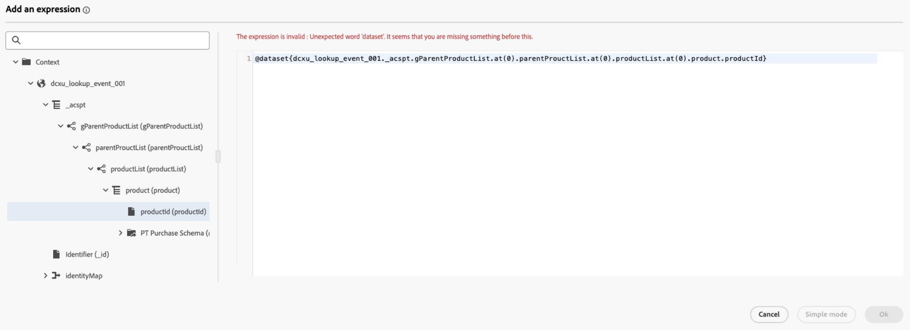

# Usa dati [!DNL Adobe Experience Platform] in percorsi {#datalookup}

>[!CONTEXTUALHELP]
>id="ajo_journey_dataset_lookup"
>title="Attività di ricerca del set di dati"
>abstract="L’attività **[!UICONTROL Ricerca set di dati]** consente di recuperare dinamicamente i dati dai set di dati dei record di Adobe Experience Platform durante il runtime. Sfruttando questa funzionalità, puoi accedere ai dati che potrebbero non trovarsi nel profilo o nel payload dell’evento, garantendo che le interazioni della clientela siano pertinenti e tempestive."

L’attività **[!UICONTROL Ricerca set di dati]** consente di recuperare dinamicamente i dati dai set di dati dei record di Adobe Experience Platform durante il runtime. Sfruttando questa funzionalità, puoi accedere ai dati che potrebbero non trovarsi nel profilo o nel payload dell’evento, garantendo che le interazioni della clientela siano pertinenti e tempestive.

Vantaggi principali:

* **Personalizzazione in tempo reale**: personalizza le esperienze dei clienti utilizzando dati arricchiti.
* **Processo decisionale dinamico**: utilizza dati esterni per indirizzare la logica e le azioni del percorso.
* **Accesso ai dati migliorato**: recupera i metadati di prodotto, le tabelle dei prezzi o i dati relazionali associati a chiavi specifiche.

>[!AVAILABILITY]
>
>Questa attività è disponibile solo per un set di organizzazioni (disponibilità limitata). Per potervi accedere, contatta il tuo rappresentante Adobe.

## Da leggere {#must-read}

### Abilitazione set di dati

Il set di dati deve essere abilitato per la ricerca in Adobe Experience Platform. Informazioni dettagliate sono disponibili in questa sezione: [Usa dati di Adobe Experience Platform](../data/lookup-aep-data.md).

### Limiti e restrizioni

* Massimo 10 attività di ricerca set di dati al percorso.
* Massimo 20 campi selezionati.
* Massimo 500 chiavi nell’array delle chiavi di ricerca.
* La dimensione dei dati arricchiti è limitata a 10 KB.

## Configurare l’attività di ricerca del set di dati {#configure}

Per configurare l&#39;attività **[!UICONTROL Ricerca set di dati]**, eseguire la procedura seguente:

1. Espandi la categoria **[!UICONTROL Orchestrazione]** e rilascia un&#39;attività **[!UICONTROL Ricerca set di dati]** nell&#39;area di lavoro.

   

1. Aggiungi un’etichetta e una descrizione.

1. Nel campo **[!UICONTROL Set di dati]**, seleziona il set di dati con gli attributi necessari.

   >[!NOTE]
   >
   >Se il set di dati che stai cercando non viene visualizzato nell’elenco, assicurati di averlo abilitato per la ricerca. Per ulteriori dettagli, consulta la sezione [Da leggere](#must-read).

1. Seleziona i campi specifici che desideri recuperare dal set di dati.

   * Puoi selezionare solo nodi foglia (campi al livello più basso dello schema). Il campo deve essere un valore primitivo (stringa, numero, booleano, data e così via).

   * Non è possibile selezionare elenchi (array) e mappe (oggetti chiave-valore).

   +++Esempio

   

   +++

1. Nel campo **[!UICONTROL Chiavi di ricerca]**, scegli una chiave di unione esistente sia negli attributi dell&#39;elemento di decisione che nel set di dati. Questa chiave viene utilizzata dal sistema per eseguire ricerche nel set di dati selezionato.

   * Le chiavi possono essere espressioni derivate dal contesto del percorso, ad esempio SKU, ID e-mail o altri identificatori. Esempio: `@profile.email` o `list(@event{purchase_event.products.sku})`.

   * Sono supportati solo **stringhe** o **elenchi di stringhe**.

   +++Esempio

   

   +++

## Utilizzare dati arricchiti nel percorso

I dati recuperati dall&#39;attività **[!UICONTROL Ricerca set di dati]** vengono memorizzati nel contesto del Percorso come array di oggetti. È disponibile nell’editor di espressioni di percorso e nell’editor di personalizzazione, abilitando la logica condizionale e la messaggistica personalizzata in base a dati arricchiti.

* **Editor espressioni Percorso**:

  Accedere all&#39;editor **[!UICONTROL Modalità avanzata]** e utilizzare la sintassi: `@datasetLookup{MyDatasetLookUpActivity1.entities}`. [Scopri come utilizzare l&#39;editor di espressioni avanzate](../building-journeys/expression/expressionadvanced.md)

* **Editor Personalization**:

  Utilizzare la sintassi: `{{context.journey.datasetLookup.1482319411.entities}}`.

>[!NOTE]
>
>I dati arricchiti sono transitori e disponibili solo durante il runtime del percorso e nella personalizzazione delle attività in uscita (e-mail, push, SMS, ecc.)

## Esempi di casi d’uso

+++Filtro basato su categorie di prodotti

**Scenario**:Send un coupon per gli utenti che spendono più di $ 40 per i prodotti per la casa.

**Flusso Percorso**:

1. **Evento di acquisto**: acquisisci SKU dal carrello dell&#39;utente.

1. **Attività di ricerca set di dati**:
* Set di dati: `products-dataset` (SKU come chiave primaria).
* Chiavi di ricerca: `list(@event{purchase_event.products.sku})`.
* Campi da restituire: `["SKU", "category", "price"]`.

1. **Attività condizione**:

   * Filtra gli SKU in cui la categoria è &quot;famiglia&quot;.

     ```
     @event{purchase_event.products.all( in(currentEventField.sku, @datasetlookup{MyDatasetLookupActivity1.entities.all(currentDatasetLookupField.category == ‘household’).sku} ) )} 
     ```

   O

   * Aggrega la spesa totale per i prodotti per la casa e confrontala con la soglia di 40 $.

     ```
     sum(@event{purchase_event.products.all( in(currentEventField.sku, @datasetlookup{MyDatasetLookUpActivity1.entities.all(currentDatasetLookupField.category == ‘household’).sku} ) )}.price}, ',', true ) > 40
     ```

1. **Editor Personalization**:

   Utilizza i dati arricchiti per personalizzare il contenuto dell’e-mail:

   ```
   
   {{#each journey.datasetlookup.3709000.entities as |product|}}
   
   
   {{/each}}
   "Hi, thanks for spending " +  + " on household products. Here is your reward!"
   ```

+++

+++Personalization che utilizza dati fedeltà esterni

**Scenario**: identifica l&#39;account e-mail per un profilo con stato di fedeltà Platinum. In questo scenario, l’account fedeltà è associato a un ID e-mail e i dati fedeltà non sono disponibili nell’archivio di ricerca profilo standard.

**Flusso Percorso**:

1. **Attivatore evento profilo**: acquisisce gli ID e-mail dal profilo o dal contesto dell&#39;evento.

1. **Attività di ricerca set di dati**:
   * Set di dati: `loyalty-member-dataset` (e-mail come chiave primaria).
   * Chiavi di ricerca: `@profile.email`.
   * Campi da restituire: `["email", "loyaltyTier"]`.

1. **Attività condizione**:

   Dividi il percorso in base al livello di fedeltà:

   ```
   @datasetLookup{MyDatasetLookUpActivity1.entity.loyaltyMember.loyaltyTier} == 'Platinum'
   ```

1. **Editor Personalization**:

   Utilizza i dati del livello fedeltà arricchito per personalizzare la comunicazione in uscita:

   ```
   {{context.journey.datasetLookup.1482319411.entity.loyaltyMember.loyaltyTier}}
   ```
