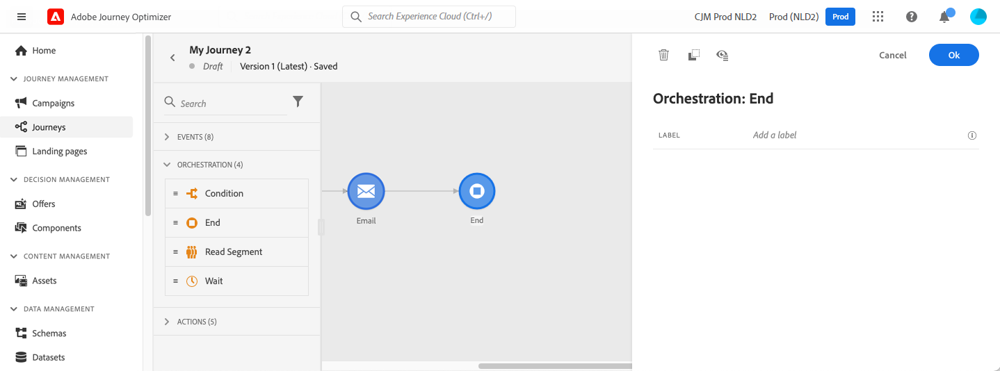

# Attività Fine{#end-activity}

>[!BEGINSHADEBOX]

**In questa pagina:** Scopri come utilizzare l&#39;attività End per contrassegnare la fine di ogni percorso di percorso e aggiungere etichette che facilitino la lettura dei report di percorso.

>[!ENDSHADEBOX]

>[!CONTEXTUALHELP]
>id="ajo_journey_end"
>title="Attività Fine"
>abstract="L’attività Fine consente di contrassegnare la fine di ogni parte del percorso. Non è obbligatoria, ma è consigliata per maggiore chiarezza visiva. Se un percorso dispone di diverse attività di fine, consigliamo di aggiungere un’etichetta a ciascuna di esse per agevolare la lettura dei rapporti."

L&#39;attività **[!UICONTROL End]** consente di contrassegnare la fine di ogni percorso del percorso. Non è obbligatoria, ma è consigliata per maggiore chiarezza visiva. Se un percorso dispone di diverse attività di fine, consigliamo di aggiungere un’etichetta a ciascuna di esse per agevolare la lettura dei rapporti. Consulta [questa pagina](../reports/live-report.md).

<!--

-->

{{$include /help/_includes/do-not-localize/building-journeys/ai-augmented-end-activity.md}}
