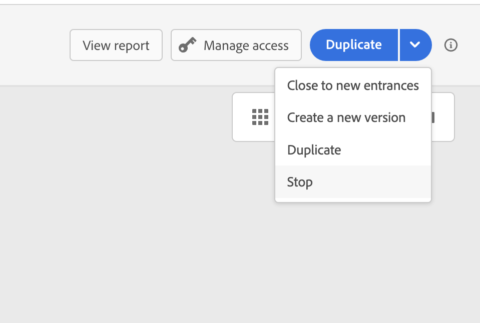

# Termina un percorso {#journey-ending}

## Come termina un percorso live

I percorsi vengono chiusi al raggiungimento del timeout del percorso globale o dopo l’ultima occorrenza di un percorso ricorrente basato su pubblico. [Informazioni sulla chiusura dei percorsi](#close-journey).

Se devi terminare un percorso live, ti consigliamo di [chiuderlo](#close-to-new-entrances) manualmente. L&#39;arrivo di nuovi clienti nel percorso viene quindi bloccato. I profili che sono già entrati nel percorso possono provarlo fino alla fine.

Puoi anche [interrompere un percorso](#stop-journey), solo in caso di emergenza e se l&#39;elaborazione di tutto il percorso deve essere interrotta immediatamente. Le persone che sono già entrate in un percorso sono tutte fermate nel loro avanzamento.

>[!IMPORTANT]
>
>* Impossibile riavviare o eliminare un percorso [chiuso](#close-journey) o [interrotto](#stop-journey). Puoi [creare una nuova versione](publish-journey.md#journey-versions-journey-versions) di essa o [duplicarla](journey-ui.md#duplicate-a-journey-duplicate-a-journey).
>
>* È possibile eliminare solo i percorsi finiti.

## Terminazione di un percorso con i profili

Un percorso termina per un individuo in due contesti specifici:

* Il singolo raggiunge l&#39;ultima attività di un percorso, quindi si sposta sul tag [End](#end-tag).
* L&#39;individuo raggiunge un&#39;attività **Condition** (o un&#39;attività **Wait** con una condizione) e non corrisponde a nessuna delle condizioni.

L’individuo può quindi rientrare nel percorso se il rientro è consentito. [Ulteriori informazioni sulla gestione dell&#39;ingresso/rientro](../building-journeys/journey-properties.md#entrance)

## Tag di fine percorso {#end-tag}

Durante la creazione di un percorso, alla fine di ciascun percorso viene visualizzato un tag di fine. Questo nodo non può essere aggiunto da un utente, non può essere rimosso e solo la relativa etichetta può essere modificata. Segna la fine di ogni percorso del percorso.

Se il percorso dispone di diversi percorsi, si consiglia di aggiungere un’etichetta a ogni estremità per facilitare la lettura dei rapporti. Ulteriori informazioni sui [report percorso](../reports/live-report.md).

## Chiudi un percorso {#close-journey}

Un percorso può essere chiuso per i motivi seguenti:

* Un percorso basato su un segmento che ha completato l’esecuzione e ha raggiunto il timeout globale di 91 giorni.
* Dopo l’ultima occorrenza di un percorso ricorrente basato su pubblico.
* Il percorso viene chiuso manualmente tramite il pulsante [**[!UICONTROL Chiudi ai nuovi ingressi]**](#close-to-new-entrances).

Dopo il timeout globale del percorso di **91 giorni**, un percorso Read audience passa allo stato **Finished**. Questo comportamento è impostato per 91 giorni, in quanto tutte le informazioni sui profili che sono entrati nel percorso vengono rimosse 91 giorni dopo l’ingresso. Le persone ancora nel percorso sono automaticamente interessate. Uscono dal percorso dopo il timeout di 91 giorni.  Ulteriori informazioni sul [timeout globale del percorso](../building-journeys/journey-properties.md#global_timeout).

>[!TIP]
>
>Un percorso basato su un solo segmento mantiene lo stato **Live** anche dopo l&#39;esecuzione di una sola volta. I profili non possono essere reinseriti una volta completato, ma il percorso rimane nello stato **Live** fino alla scadenza del timeout globale predefinito. È possibile chiuderlo manualmente prima utilizzando l&#39;opzione **Chiudi ai nuovi ingressi**.

### Chiudi ai nuovi ingressi {#close-to-new-entrances}

La chiusura manuale di un percorso consente ai clienti che sono già entrati nel percorso di completare il percorso, ma ai nuovi utenti di non accedere al percorso. Quando un percorso viene chiuso (per uno dei motivi di cui sopra), avrà lo stato **[!UICONTROL Chiuso]**. Il percorso non consente più l&#39;ingresso di nuovi individui nel percorso. I profili già presenti nel percorso possono completare il percorso normalmente. Dopo il timeout globale predefinito di 91 giorni, il percorso passerà allo stato **Completato**.

Per chiudere un percorso dall&#39;elenco dei percorsi, fare clic sul pulsante **[!UICONTROL Puntini di sospensione]** a destra del nome del percorso e selezionare **[!UICONTROL Chiudi ai nuovi ingressi]**.

È inoltre possibile:

1. Nell&#39;elenco **[!UICONTROL Percorsi]** selezionare il percorso che si desidera chiudere.
1. In alto a destra, fare clic sulla freccia giù.

   {width="50%" align="left" zoomable="yes"}

1. Fai clic su **[!UICONTROL Chiudi ai nuovi ingressi]** e conferma nella finestra di dialogo.

## Interrompi un percorso {#stop-journey}

Nel caso in cui si debba fermare il progresso di tutti i singoli individui nel percorso, è possibile fermarlo. Interruzione del timeout del percorso per tutti gli utenti del percorso. Tuttavia, l&#39;arresto di un percorso implica che le persone che sono già entrate in un percorso sono tutte ferme nel loro progresso. Il percorso è spento. Se desideri terminare con un percorso, è consigliabile [chiuderlo](#close-journey).

Puoi interrompere un percorso, ad esempio, se un addetto marketing si rende conto che il percorso esegue il targeting del pubblico sbagliato o che un’azione personalizzata destinata a consegnare i messaggi non funziona correttamente. Per interrompere un percorso dall&#39;elenco dei percorsi, fare clic sul pulsante **[!UICONTROL Puntini di sospensione]** a destra del nome del percorso e selezionare **[!UICONTROL Interrompi]**.

È inoltre possibile:

1. Nell&#39;elenco **[!UICONTROL Percorsi]** fare clic sul percorso che si desidera interrompere.
1. In alto a destra, fare clic sulla freccia giù.

   {width="50%" align="left" zoomable="yes"}

1. Fai clic su **[!UICONTROL Interrompi]** e conferma nella finestra di dialogo.

Quando viene interrotto, lo stato del percorso è impostato su **[!UICONTROL Arrestato]**.

>[!CAUTION]
>
>Autorizzazioni per arrestare un percorso limitato agli utenti con l&#39;autorizzazione di alto livello **[!DNL Manage journeys]**. Ulteriori informazioni sulla gestione dei diritti di accesso degli utenti [!DNL Journey Optimizer] in [questa sezione](../administration/permissions-overview.md).