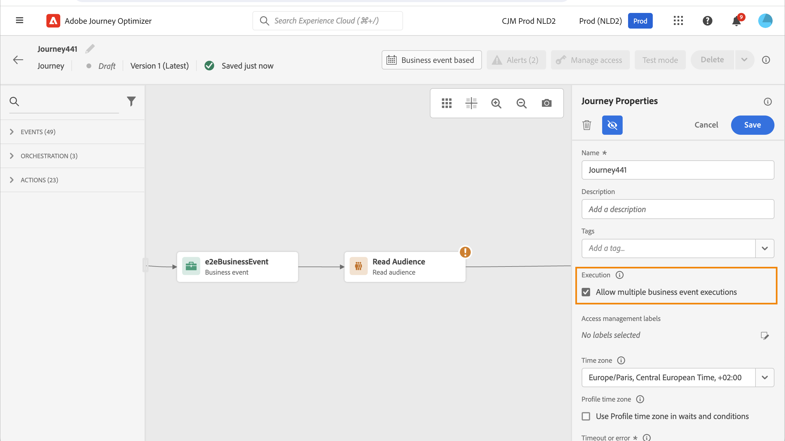

# Gestione dell’ingresso del profilo {#entry-management}

La gestione dell’entrata del profilo dipende dal tipo di percorso.

## Tipi di percorsi {#types-of-journeys}

Con Adobe Journey Optimizer è possibile creare i seguenti tipi di percorsi:

* **Evento unitario** percorsi: questi percorsi iniziano con un evento unitario. Quando l’evento viene ricevuto, il profilo associato entra nel percorso. [Ulteriori informazioni](#entry-unitary)

* **Evento di business** percorsi: questi percorsi iniziano con un evento di business immediatamente seguito da un&#39;attività **Read audience**. Quando l’evento viene ricevuto, i profili appartenenti al pubblico di destinazione entrano nel percorso. Viene creata un’istanza di questo percorso per ogni profilo. [Ulteriori informazioni](#entry-business)

* **Read audience** percorsi: questi percorsi iniziano con un&#39;attività **Read audience**. Quando il percorso viene eseguito, i profili appartenenti al pubblico di destinazione entrano nel percorso. Viene creata un’istanza di questo percorso per ogni profilo. Questi percorsi possono essere ricorrenti o &quot;one-shot&quot;. [Ulteriori informazioni](#entry-read-audience)

* **Qualificazione del pubblico** percorsi: questi percorsi iniziano con un evento di qualificazione del pubblico. Questi percorsi ascoltano le entrate e le uscite dei profili nei tipi di pubblico. In questo caso, il profilo associato entra nel percorso. [Ulteriori informazioni](#entry-unitary)

In tutti i tipi di percorso, un profilo non può essere presente più volte nello stesso percorso, contemporaneamente. Per verificare che una persona appartenga a un percorso, viene utilizzata come chiave l’identità del profilo. La stessa chiave, ad esempio la chiave `CRMID=3224`, non può trovarsi in posizioni diverse nello stesso percorso.

## Percorsi unitari di qualificazione di eventi e pubblico{#entry-unitary}

In **Evento unitario** e **Qualificazione del pubblico** percorsi, puoi abilitare o disabilitare il rientro:

* Se la rientrata è abilitata, un profilo può entrare in un percorso diverse volte, ma non può farlo fino a quando non è completamente uscito dall&#39;istanza precedente del percorso.

* Se il rientro è disattivato, un profilo non può entrare più volte nello stesso percorso, entro il periodo di timeout del percorso globale. Consulta questa [sezione](../building-journeys/journey-properties.md#global_timeout).

Per impostazione predefinita, i percorsi consentono il rientro. Quando l&#39;opzione **Consenti rientro** è attivata, viene visualizzato il campo **Periodo di attesa rientro**. Consente di definire il tempo di attesa prima che un profilo possa entrare nuovamente nel percorso. In questo modo si evita che i percorsi vengano attivati erroneamente più volte per lo stesso evento. Per impostazione predefinita, il campo è impostato su 5 minuti. La durata massima è di 91 giorni ([timeout globale](journey-properties.md#global_timeout)).

<!--
When a journey ends, its status is **[!UICONTROL Closed]**. New individuals can no longer enter the journey. Persons already in the journey automatically exit the journey. 
-->

Dopo il periodo di rientro, i profili possono rientrare nel percorso. Per evitare questo problema e disabilitare completamente il rientro per tali profili, puoi aggiungere una condizione per verificare se il profilo è già stato inserito o meno, utilizzando i dati del profilo o del pubblico.

<!--
Due to the 30-day journey timeout, when journey reentrance is not allowed, we cannot make sure the reentrance blocking will work more than 91 days. Indeed, as we remove all information about persons who entered the journey 91 days after they enter, we cannot know the person entered previously, more than 91 days ago. -->

## Percorsi lavorativi {#entry-business}

<!--
Business events follow reentrance rules in the same way as for unitary events. If a journey allows reentrance, the next business event will be processed.
-->

In **percorsi lavorativi**, per consentire più esecuzioni di eventi aziendali, attiva l&#39;opzione corrispondente nella sezione **[!UICONTROL Esecuzione]** delle proprietà del percorso.

Nel caso di eventi di business, per un determinato percorso, i dati sul pubblico recuperati alla prima esecuzione vengono riutilizzati durante un intervallo di tempo di 1 ora.

Un profilo può essere presente più volte nello stesso percorso, allo stesso tempo, ma nel contesto di diversi eventi di business.

Per ulteriori informazioni, consulta questa [sezione](../event/about-creating-business.md)

## Leggi percorsi di pubblico {#entry-read-audience}

**Read audience** i percorsi possono essere ricorrenti o &quot;one-shot&quot;:

* Per percorsi non ricorrenti/&quot;one-shot&quot;: il profilo entra una sola volta nel percorso.

* Per i percorsi ricorrenti: per impostazione predefinita, tutti i profili appartenenti al pubblico entrano nel percorso per ogni ricorrenza. Devono terminare il percorso prima di poter rientrare in un&#39;altra occorrenza.

Sono disponibili diverse opzioni per percorsi di pubblico Read ricorrenti. Per ulteriori informazioni, consulta la sezione [Utilizzare un pubblico in un percorso](../building-journeys/read-audience.md).

<!--
After 91 days, a Read audience journey switches to the **Finished** status. This behavior is set for 91 days only (i.e. journey timeout default value) as all information about profiles who entered the journey is removed 91 days after they entered. Persons still in the journey automatically are impacted. They exit the journey after the 30 day timeout. 
-->
