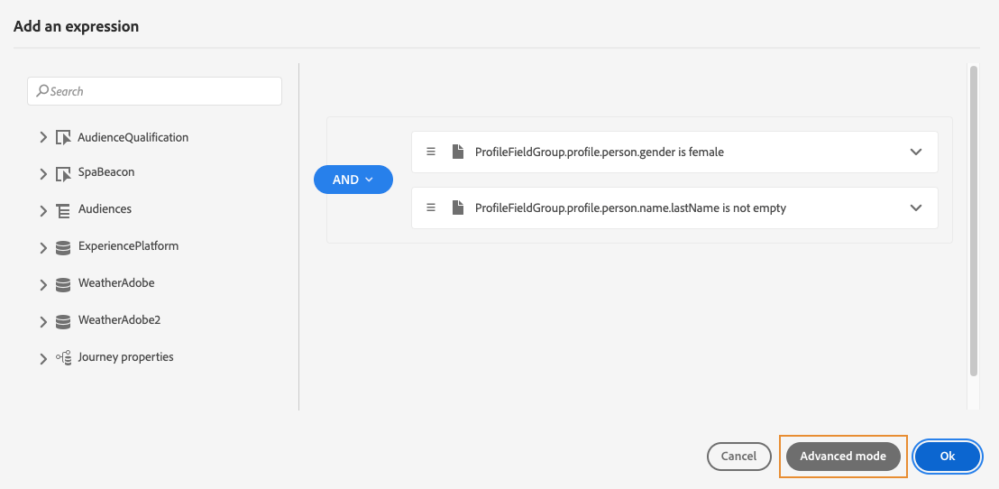
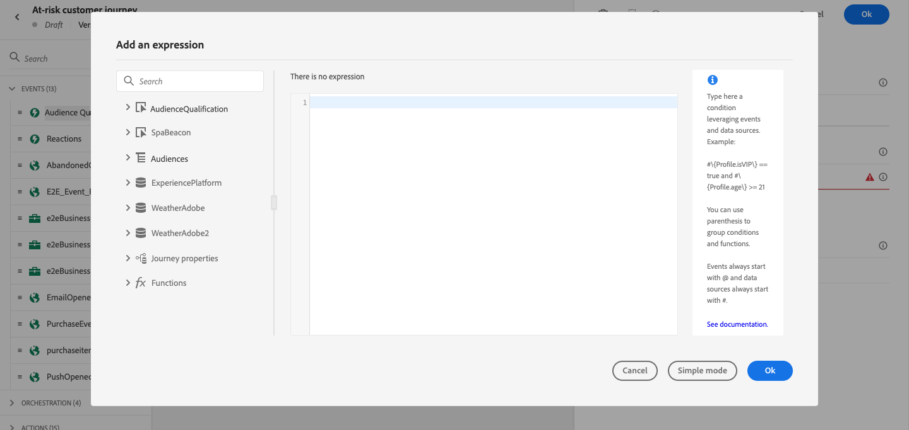

# Informazioni sull’editor di espressioni avanzate {#about-the-advanced-expression-editor}

>[!CONTEXTUALHELP]
>id="ajo_journey_expression_advanced"
>title="Informazioni sull’editor di espressioni avanzate"
>abstract="Utilizza l’editor di espressioni avanzate per creare espressioni avanzate in varie schermate dell’interfaccia. È possibile, ad esempio, creare espressioni durante la configurazione e l&#39;utilizzo di percorsi e durante la definizione di una condizione di origine dati."

Utilizza l’editor di espressioni avanzate di Percorso per creare espressioni avanzate in varie schermate dell’interfaccia. È possibile, ad esempio, creare espressioni durante la configurazione e l&#39;utilizzo di percorsi e durante la definizione di una condizione di origine dati.

>[!NOTE]
>
>Le funzioni e le funzionalità disponibili nell’editor di espressioni avanzate di Percorso sono diverse da quelle disponibili in [editor di personalizzazione](../../personalization/functions/functions.md).

È inoltre disponibile ogni volta che hai bisogno di definire parametri di azione che richiedono specifiche manipolazioni dei dati. Puoi sfruttare i dati provenienti dagli eventi o le informazioni aggiuntive recuperate dall’origine dati. In un percorso, l’elenco visualizzato dei campi evento è contestuale e varia in base agli eventi aggiunti nel percorso.

L’editor di espressioni avanzate offre un set di funzioni e operatori incorporati che ti consente di manipolare i valori e definire un’espressione adatta alle tue esigenze. L’editor di espressioni avanzate ti consente inoltre di definire i valori del parametro dell’origine dati esterna, di manipolare i campi e le raccolte delle mappe, ad esempio gli eventi di esperienza.

_Interfaccia dell’editor di espressioni avanzate_

L’editor di espressioni avanzate può essere utilizzato per:

* creare [condizioni avanzate](../condition-activity.md#about_condition) sulle origini dati e sulle informazioni sull’evento
* definisci personalizzato [attività attendi](../wait-activity.md#custom)
* definire la mappatura dei parametri delle azioni

Quando possibile, è possibile passare tra le due modalità utilizzando **[!UICONTROL Modalità avanzata]** / **[!UICONTROL Modalità semplice]** pulsante. Viene descritta la modalità semplice [qui](../condition-activity.md#about_condition).

>[!NOTE]
>
>Le condizioni possono essere definite nell’editor di espressioni semplice o avanzato. Restituiscono sempre un tipo booleano.
>
>I parametri delle azioni possono essere definiti selezionando i campi o tramite l’editor di espressioni avanzate. Restituiscono un tipo di dati specifico in base alla loro espressione.

## Accesso all’editor di espressioni avanzate {#accessing-the-advanced-expression-editor}

Puoi accedere all’editor di espressioni avanzate in diversi modi:

* Quando crei una condizione di origine dati, puoi accedere all’editor avanzato facendo clic su **[!UICONTROL Modalità avanzata]**.

  

* Quando crei un timer personalizzato, l’editor avanzato viene visualizzato direttamente.
* Quando mappi il parametro dell’azione, fai clic su **[!UICONTROL Modalità avanzata]**.

## Esplorazione dell’interfaccia{#discovering-the-interface}

Questa schermata consente di scrivere manualmente l’espressione.

Nella parte sinistra dello schermo sono visualizzati i campi e le funzioni disponibili:

* **[!UICONTROL Eventi]**: scegli uno dei campi ricevuti dall’evento in entrata. L’elenco visualizzato dei campi dell’evento è contestuale e varia in base agli eventi aggiunti nel percorso. [Ulteriori informazioni](../../event/about-events.md)
* **[!UICONTROL Tipi di pubblico]**: se hai rilasciato una **[!UICONTROL Qualificazione del pubblico]** , scegli il pubblico da utilizzare nell&#39;espressione. [Ulteriori informazioni](../condition-activity.md#using-a-segment)
* **[!UICONTROL Origini dati]**: scegli dall’elenco di campi disponibili nei gruppi di campi delle origini dati. [Ulteriori informazioni](../../datasource/about-data-sources.md)
* **[!UICONTROL Proprietà percorso]**: questa sezione raggruppa i campi tecnici relativi al percorso per un determinato profilo. [Ulteriori informazioni](journey-properties.md)
* **[!UICONTROL Funzioni]**: scegli dall’elenco di funzioni integrate che consentono di eseguire filtri complessi. Le funzioni sono organizzate per categorie. [Ulteriori informazioni](functions.md)

Un meccanismo di completamento automatico visualizza i suggerimenti contestuali.

Un meccanismo di convalida della sintassi controlla l’integrità del codice. Gli errori vengono visualizzati sopra l’editor.

**Necessità di parametri per la creazione di condizioni con l’editor di espressioni avanzate**

Se selezioni un campo da un’origine dati esterna che richiede la chiamata di un parametro (consulta [questa pagina](../../datasource/external-data-sources.md)), a destra viene visualizzata una nuova scheda che consente di specificare questo parametro. Il valore del parametro può provenire dagli eventi posizionati nel percorso o dall&#39;origine dati dell&#39;Experience Platform (e non da altre origini dati esterne). Ad esempio, in un’origine dati correlata al meteo, un parametro utilizzato di frequente sarà &quot;city&quot;. Di conseguenza, devi selezionare il punto in cui desideri ottenere questo parametro della città. Le funzioni possono essere applicate anche ai parametri per eseguire modifiche di formato o concatenazioni.

Per casi di utilizzo più complessi, se desideri includere i parametri dell’origine dati nell’espressione principale, puoi definirne i valori utilizzando la parola chiave &quot;params&quot;. Consulta [questa pagina](../expression/field-references.md).
