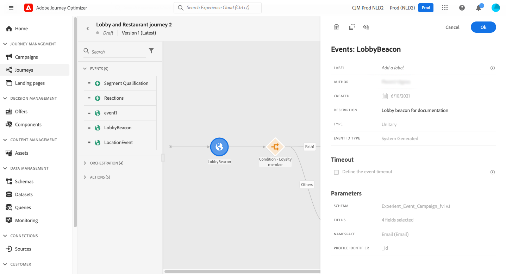

# Eventi generali {#general-events}

>[!BEGINSHADEBOX]

**In questa pagina:** Scopri come utilizzare gli eventi generali per attivare i percorsi in modo unitario in tempo reale e configurare i timeout degli eventi e i percorsi di timeout per l&#39;ascolto di un evento solo durante un periodo definito.

>[!ENDSHADEBOX]

>[!CONTEXTUALHELP]
>id="ajo_journey_event_custom"
>title="Eventi unitari"
>abstract="Gli eventi consentono di attivare i percorsi in modo unitario per inviare messaggi in tempo reale all’utente che entra nel percorso. Per questo tipo di evento, puoi aggiungere solo un’etichetta e una descrizione. La configurazione dell’evento viene eseguita da un ingegnere dei dati e non può essere modificata."

>[!CONTEXTUALHELP]
>id="ajo_journey_event_business_canvas"
>title="Eventi di business"
>abstract="Questi eventi ti consentono di avviare un percorso utilizzando un evento non correlato al profilo. Quando tale evento viene attivato, potrai inviare messaggi a un pubblico di profili. Per questo tipo di evento, puoi aggiungere solo un’etichetta e una descrizione. La configurazione dell’evento viene eseguita da un utente tecnico e non può essere modificata."

Gli eventi consentono di attivare i percorsi in modo unitario per inviare messaggi in tempo reale all’utente che entra nel percorso.

Per questo tipo di evento, puoi aggiungere solo un’etichetta e una descrizione. Impossibile modificare il resto della configurazione. È stata eseguita dall’utente tecnico. Consulta [questa pagina](../event/about-events.md).

Ulteriori informazioni sulla velocità effettiva degli eventi e sulle velocità di elaborazione percorsi in [questa sezione](entry-management.md#journey-processing-rate).

Quando rilasci un evento di business, aggiunge automaticamente un&#39;attività **Read Audience**. Per ulteriori informazioni sugli eventi di business, consulta [questa sezione](../event/about-events.md)

## Ascolto degli eventi durante un periodo di tempo specifico {#events-specific-time}

Un’attività evento posizionata nel percorso ascolta gli eventi a tempo indefinito. Per ascoltare un evento solo durante un determinato periodo di tempo, è necessario configurare un timeout per l’evento.

Il percorso ascolterà quindi l’evento durante il tempo specificato nel timeout. Se un evento viene ricevuto durante tale periodo, la persona scorrerà nel percorso dell’evento. In caso contrario, il cliente passa al percorso di timeout, se definito, oppure continua quel percorso.

Se non è definito alcun percorso di timeout, l’impostazione di timeout fungerà da attività di attesa, facendo aspettare il profilo per un periodo di tempo che potrebbe essere interrotto se un evento si verifica prima della fine di tale attesa. Se desideri escludere i profili da tale percorso dopo il timeout, devi impostare un percorso di timeout.

Per configurare un timeout per un evento, effettua le seguenti operazioni:

1. Attiva l&#39;opzione **[!UICONTROL Definisci il timeout evento]** dalle proprietà dell&#39;evento.

1. Specifica il tempo di attesa dell&#39;evento da parte del percorso. La durata massima è di **90 giorni**.

1. Quando non viene ricevuto alcun evento entro il timeout specificato, è consigliabile inviare i singoli utenti a un percorso di timeout. Abilitare l&#39;opzione **[!UICONTROL Imposta un percorso di timeout]**. In tal caso, il percorso continua per l’individuo una volta raggiunto il timeout. È consigliabile abilitare sempre l&#39;opzione **[!UICONTROL Imposta un percorso di timeout]**.

   

In questo esempio, il percorso invia un’e-mail di benvenuto a un cliente dopo che è entrato nell’atrio. Invia un’e-mail con uno sconto sui pasti solo se il cliente entra nel ristorante entro il giorno successivo. Abbiamo quindi configurato l’evento del ristorante con un timeout di 1 giorno:

* Se l’evento del ristorante viene ricevuto meno di 1 giorno dopo l’e-mail di benvenuto, viene inviata l’e-mail con lo sconto sui pasti.
* Se non viene ricevuto alcun evento del ristorante nel giorno successivo, la persona scorre attraverso il percorso di timeout.

Se vuoi configurare un timeout per più eventi posizionati dopo un&#39;attività **[!UICONTROL Wait]**, devi configurare il timeout solo per uno di questi eventi.

Il timeout definito si applica a tutti gli eventi posizionati dopo l&#39;attività **[!UICONTROL Wait]**:

* Se un evento viene ricevuto entro la durata di timeout, il singolo passa nel percorso dell’evento ricevuto.
* Se non viene ricevuto alcun evento entro la durata di timeout, il singolo fluisce nel ramo di timeout dell’evento in cui è stato definito il timeout.

+++ Guida di riferimento della Knowledge Base di AI

Questa sezione contiene informazioni strutturate che supportano l&#39;interpretazione, il recupero e la risposta alle domande relative a questo argomento.

Per una comprensione completa, queste informazioni devono essere unite alla documentazione su questa pagina. Nessuna delle due origini è progettata per essere indipendente; la pagina descrive la funzione, mentre questa sezione fornisce un contesto aggiuntivo che aiuta a non ambiguare la terminologia, le finalità, l’applicabilità e i vincoli.

* **TL;DR:** In questa pagina viene illustrato come utilizzare eventi generali (unitari e aziendali) in percorsi per attivare la consegna di messaggi in tempo reale a livello individuale, inclusa la configurazione dei timeout degli eventi e dei percorsi di timeout.

**Intenti:**
* Aggiungere un’attività evento generale a un’area di lavoro del percorso per attivare la voce di profilo in tempo reale
* Configurare un timeout evento per limitare il tempo di attesa di un percorso per un evento
* Imposta un percorso di timeout per gestire profili che non attivano l’evento previsto in tempo
* Distinguere tra eventi unitari ed eventi di business e capire quando ciascuno di essi viene aggiunto automaticamente
* Combinare i timeout degli eventi con le attività Attendi per controllare il comportamento di timeout per più eventi

**Glossario:**
* **Evento unitario**: un evento che attiva il percorso per un individuo alla volta, in tempo reale *(specifico per prodotto)*
* **Evento di business**: un evento non correlato al profilo che attiva un percorso per un pubblico di profili, aggiungendo automaticamente un&#39;attività Read Audience *(specifica per prodotto)*
* **Timeout evento**: una durata configurabile (fino a 90 giorni) dopo la quale il percorso smette di attendere un evento specifico e instrada il profilo a un percorso di timeout *(specifico per il prodotto)*
* **Percorso timeout**: ramo di percorso facoltativo seguito dai profili quando l&#39;evento previsto non viene ricevuto entro l&#39;intervallo di timeout *(specifico per prodotto)*

**Guardrail:**
* L’etichetta e la descrizione dell’evento sono gli unici campi modificabili per un evento generale sull’area di lavoro; tutte le altre configurazioni vengono eseguite da un utente tecnico e non possono essere modificate dal percorso
* La durata massima del timeout evento è di 90 giorni
* Quando più eventi seguono un’attività Wait, il timeout deve essere configurato solo su uno di tali eventi; il timeout definito si applica quindi a tutti gli eventi dopo Wait
* Se non è definito alcun percorso di timeout, il timeout funge da attività Attendi; i profili che non ricevono l’evento rimangono nel percorso fino alla scadenza del timeout

**Terminologia:**
* Nome canonico: General event — Acronimo: none — varianti: unitary event, custom event
* Sinonimi: &quot;evento generale&quot; = &quot;evento unitario&quot; (nel contesto dell’attività del quadro)
* Da non confondere: &quot;evento di business&quot; ≠ &quot;evento unitario&quot;: un evento di business è destinato a un pubblico di profili, mentre un evento unitario è destinato a un singolo individuo

**Domande frequenti:**
* **Q: posso modificare la configurazione dell&#39;evento dall&#39;area di lavoro del percorso?** — No; solo l&#39;etichetta e la descrizione possono essere modificate nell&#39;area di lavoro. La configurazione completa dell’evento è impostata da un utente tecnico e non può essere modificata dal percorso.
* **D: cosa succede se non viene ricevuto alcun evento prima della scadenza del timeout?** — Se è definito un percorso di timeout, il profilo scorre in tale percorso. Se non è impostato alcun percorso di timeout, il timeout si comporta come un’attività Attendi e il profilo continua il percorso dopo il periodo di timeout.
* **Q: Qual è la durata massima del timeout dell&#39;evento?** — 90 giorni.
* **Q: quando devo abilitare l&#39;opzione del percorso di timeout?** — attivalo sempre se desideri che i profili escano da quel ramo dopo il timeout; senza un percorso di timeout, i profili rimangono nel percorso in attesa dell’evento.
* **D: quali sono le differenze tra un evento di business e un evento unitario nell&#39;area di lavoro del percorso?** — Se si rilascia un evento di business, viene automaticamente aggiunta un&#39;attività Read Audience, in quanto gli eventi di business sono destinati a più profili contemporaneamente anziché a un singolo individuo.

+++
