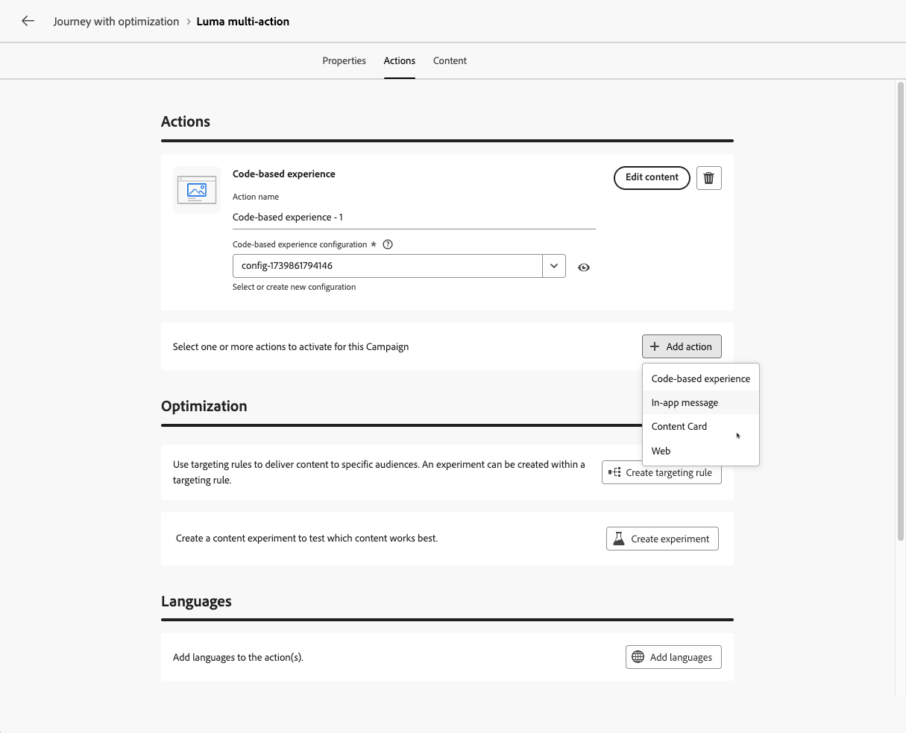

# Utilizzare l’attività Azione {#add-a-message-in-a-journey}

>[!CONTEXTUALHELP]
>id="ajo_action_activity"
>title="Attività azione"
>abstract="L’attività **Azione** consente di configurare un’unica azione per il canale nativo e più attività in entrata con la possibilità di aggiungere l’ottimizzazione a qualsiasi azione per canali incorporata."

L&#39;attività **Azione** è il punto di ingresso singolo per tutte le azioni del canale nell&#39;area di lavoro del percorso.

Sostituisce le precedenti attività dei singoli canali integrate e consolida e-mail, push, SMS, in-app, web, esperienza basata su codice e scheda di contenuto in un unico tipo di attività unificato.

Utilizzala per:

* Configura qualsiasi azione di canale incorporata da un’unica interfaccia semplificata.
* Genera gruppi di azioni in entrata con più azioni.
* Applica l’ottimizzazione a qualsiasi azione del canale.

>[!NOTE]
>
>Puoi anche impostare azioni personalizzate per inviare i messaggi in [!DNL Journey Optimizer]. [Ulteriori informazioni](#recommendation)

## Informazioni sulle attività dei canali legacy

Le attività dei canali nativi legacy (e-mail, push, SMS, in-app, web, esperienza basata su codice e scheda di contenuto) sono **obsolete a partire dalla versione di marzo 2026**.

I percorsi esistenti che utilizzano queste attività continuano a funzionare senza alcuna modifica e non è richiesta alcuna migrazione.

In questi casi vengono mantenute anche le attività del canale nativo legacy:

* **Duplica un percorso**. Il percorso duplicato continua a utilizzare le attività legacy. Puoi modificarlo e pubblicarlo così com’è; non è richiesta alcuna migrazione.
* **Crea una nuova versione del percorso**. La nuova versione continua a utilizzare le attività legacy. Puoi modificarlo e pubblicarlo così com’è; non è richiesta alcuna migrazione.
* **Copiare e incollare le attività legacy in un percorso** — Le attività incollate rimangono attività legacy. Puoi modificarli e pubblicarli così come sono; non è richiesta alcuna migrazione.

## Aggiungere un&#39;azione di canale incorporata a un percorso  {#add-action}

Per aggiungere un&#39;azione di canale incorporata al percorso tramite l&#39;attività **[!UICONTROL Azione]**, segui la procedura riportata di seguito.

>[!NOTE]
>
>Per ulteriori informazioni sui canali disponibili nei percorsi, consulta la tabella in questa sezione: [Canali nei percorsi e nelle campagne](../channels/gs-channels.md#channels).

1. Avvia il percorso con un&#39;attività [Event](general-events.md) o [Read Audience](read-audience.md).

1. Dalla sezione **[!UICONTROL Azioni]** della palette, trascina e rilascia un&#39;attività **[!UICONTROL Azione]** nell&#39;area di lavoro.

1. Seleziona l’attività di canale incorporata che desideri sfruttare nel percorso.

   

1. Aggiungi un&#39;etichetta all&#39;azione e seleziona **[!UICONTROL Configura azione]**.

   {width="80%"}

1. Sei stato indirizzato alla scheda **[!UICONTROL Azioni]** della schermata di configurazione delle azioni di percorso.

   Seleziona la configurazione da utilizzare per il canale selezionato.

   

1. Se hai selezionato un canale in entrata, puoi aggiungere più azioni. [Ulteriori informazioni](#multi-action)

1. Configura l’attività in base al canale selezionato. Linee guida dettagliate sulla configurazione sono disponibili nei collegamenti riportati di seguito.

   * Scopri i passaggi dettagliati per creare l’azione in uscita come segue:

     <table style="table-layout:fixed">
      <tr style="border: 0;">
      <td>
      
      
<a href="../email/create-email.md"><strong>Creare e-mail</strong>
      

      

      </td>
      <td>
      
      

      <a href="../push/create-push.md"><strong>Creare notifiche push<strong></a>
      

      

      </td>
      <td>
      
      

      <a href="../mobile/create-mobile-message.md"><strong>Creare messaggi mobili (SMS/RCS/MMS)</strong></a>
      

      

      </td>
      </tr>
      </table>

   * Scopri i passaggi dettagliati per creare l’azione in entrata come segue:

     <table style="table-layout:fixed">
      <tr style="border: 0;">
      <td>
      
      
<a href="../in-app/create-in-app.md"><strong>Creare messaggi in-app</strong>
      

      

      </td>
      <td>
      
      
<a href="../web/create-web.md"><strong>Crea esperienze Web</strong>
      

      

      </td>
      <td>
      
      
<a href="../content-card/create-content-card.md"><strong>Creare schede di contenuti</strong>
      

      

      </td>
      <td>
      
      

      <a href="../code-based/create-code-based.md"><strong>Creare esperienze basate su codice<strong></a>
      

      

      </td>
      </tr>
      </table>

   >[!NOTE]
   >
   >* Ogni azione in entrata viene fornita con un&#39;attività **Wait** di 3 giorni. [Ulteriori informazioni](wait-activity.md#auto-wait-node)
   >
   >* Per le e-mail e le notifiche push, puoi abilitare Ottimizzazione del tempo di invio. [Ulteriori informazioni](send-time-optimization.md)

1. A seconda dell’attività, puoi visualizzare parametri avanzati specifici per il canale selezionato e ignorare alcuni valori predefiniti, come l’indirizzo di esecuzione. [Ulteriori informazioni](about-journey-activities.md#advanced-parameters)

   >[!NOTE]
   >
   >Se i parametri avanzati sono nascosti, fare clic sul pulsante **[!UICONTROL Mostra campi di sola lettura]** nella parte superiore del riquadro di destra.

1. Utilizza la sezione **[!UICONTROL Ottimizzazione]** per eseguire esperimenti di contenuto, sfruttare le regole di targeting o utilizzare combinazioni avanzate di sperimentazione e targeting.

   Queste diverse opzioni e i passaggi da seguire sono descritti in [questa sezione](../content-management/gs-message-optimization.md).

1. Utilizza la sezione **[!UICONTROL Lingue]** per creare contenuti in più lingue all&#39;interno dell&#39;azione di percorso. A tale scopo, fai clic sul pulsante **[!UICONTROL Aggiungi lingue]** e seleziona le **[!UICONTROL impostazioni lingua]** desiderate.

   Informazioni dettagliate su come impostare e utilizzare le funzionalità multilingue sono disponibili in [questa sezione](../content-management/multilingual-gs.md).

Sono disponibili impostazioni aggiuntive a seconda del canale di comunicazione selezionato. Per ulteriori informazioni, espandi le sezioni seguenti.

+++**Applica regole limite** (e-mail, push, SMS)

Nell&#39;elenco a discesa **[!UICONTROL Regole aziendali]**, selezionare un set di regole per applicare le regole di limitazione di utilizzo all&#39;azione di percorso.

L’utilizzo dei set di regole di canale consente di impostare i limiti di frequenza per tipo di comunicazione per evitare di sovraccaricare i clienti con messaggi simili.

[Scopri come utilizzare i set di regole](../conflict-prioritization/rule-sets.md)

+++

+++**Rileva coinvolgimento** (e-mail, SMS).

Utilizza la sezione **[!UICONTROL Tracciamento delle azioni]** per tenere traccia di come i destinatari reagiscono alle consegne e-mail o SMS.

I risultati del tracciamento sono accessibili dal rapporto sul percorso una volta che il percorso è stato eseguito.

[Ulteriori informazioni sui report di percorso](../reports/journey-global-report-cja.md)

+++

+++**Attiva modalità Consegna rapida** (Push).

La modalità Consegna rapida è un componente aggiuntivo [!DNL Journey Optimizer] che consente l’invio molto rapido di messaggi push in volumi elevati tramite campagne.

La consegna rapida viene utilizzata quando il ritardo nella consegna dei messaggi è business-critical, quando desideri inviare un avviso push urgente sui telefoni cellulari, ad esempio una notizia straordinaria agli utenti che hanno installato la tua app per il canale notizie.

Scopri come abilitare la modalità Consegna rapida per le notifiche push [&#x200B; in questa pagina](../push/create-push.md#rapid-delivery).

Per ulteriori informazioni sulle prestazioni quando si utilizza la modalità Consegna rapida, consultare [[!DNL Adobe Journey Optimizer] descrizione del prodotto](https://helpx.adobe.com/it/legal/product-descriptions/adobe-journey-optimizer.html){target="_blank"}.

+++

+++**Assegna punteggi di priorità** (Web, In-app, basati su codice)

Nella sezione **[!UICONTROL Gestione dei conflitti]**, è possibile assegnare un punteggio di priorità all&#39;azione di percorso, consentendo di assegnare un&#39;azione in entrata quando sono presenti più azioni di percorso o campagne che utilizzano la stessa configurazione di canale.

Per impostazione predefinita, il punteggio di priorità per l’azione viene ereditato da quello complessivo relativo al percorso.

[Scopri come assegnare punteggi di priorità alle azioni del canale](../conflict-prioritization/priority-scores.md#priority-action)

+++

+++**Imposta regole di consegna aggiuntive** (schede contenuto)

Per i percorsi di schede di contenuto, puoi abilitare regole di consegna aggiuntive per scegliere gli eventi e i criteri che attivano il messaggio.

[Scopri come creare schede di contenuto](../content-card/create-content-card.md)

+++

+++**Definisci trigger** (in-app)

Per i messaggi in-app, puoi utilizzare il pulsante **[!UICONTROL Modifica trigger]** per scegliere gli eventi e i criteri che attivano il messaggio.

[Scopri come creare un messaggio in-app](../in-app/create-in-app.md)

+++

## Aggiungere più azioni in entrata {#multi-action}

>[!CONTEXTUALHELP]
>id="ajo_multi_action_journey"
>title="Aggiungere più azioni in entrata"
>abstract="Puoi selezionare diverse azioni in entrata all’interno di un singolo percorso. Questa funzionalità consente di consegnare più esperienze basate su codice, messaggi in-app, schede di contenuto o azioni web in diverse posizioni contemporaneamente, ciascuna con contenuti specifici."

Per semplificare l’orchestrazione del percorso, puoi definire diverse azioni in entrata all’interno di una singola azione del percorso.

>[!NOTE]
>
>Questa capacità è disponibile solo per i canali in entrata. Attualmente i canali in uscita come e-mail non sono supportati.

Questa capacità ti consente di fornire varie esperienze basate su codice, messaggi in-app, schede di contenuto o azioni web a posizioni diverse contemporaneamente, senza la necessità di creare più azioni di percorso. Semplifica l’implementazione del percorso e consente rapporti più fluidi, con tutti i dati consolidati in un unico percorso.

Ad esempio, puoi inviare un’esperienza basata su codice a più endpoint con contenuti leggermente diversi. A questo scopo, crea più azioni basate su codice all’interno della stessa azione di percorso, ciascuna con una configurazione di endpoint diversa.

Per definire più azioni in entrata in un singolo nodo di azione di percorso, segui i passaggi indicati di seguito.

1. Avvia il percorso con un&#39;attività [Event](general-events.md) o [Read Audience](read-audience.md).

1. Dalla sezione **[!UICONTROL Azioni]** della palette, trascina e rilascia un&#39;attività **[!UICONTROL Azione]** nell&#39;area di lavoro.

1. Seleziona **[!UICONTROL Azione multipla]** come tipo di azione.

   

1. Aggiungi un&#39;etichetta se necessario e seleziona **[!UICONTROL Configura azione]**.

   {width="60%"}

1. Sei stato indirizzato alla scheda **[!UICONTROL Azioni]** della schermata di configurazione delle azioni di percorso.

   {width="70%"}

1. Seleziona un&#39;azione in entrata (**Esperienza basata su codice**, **Messaggio in-app**, **Scheda contenuto** o **Web**) dalla sezione **[!UICONTROL Azioni]**.

1. Seleziona la configurazione del canale e definisci un contenuto specifico per tale azione.

1. Utilizza il pulsante **[!UICONTROL Aggiungi azione]** per selezionare un&#39;altra azione in entrata dall&#39;elenco a discesa.

   {width="80%"}

1. Procedi in modo simile per aggiungere altre azioni. Puoi aggiungere fino a 10 azioni in entrata in un percorso di azioni di gruppo.

Una volta che il percorso è [live](publish-journey.md), tutte le azioni vengono attivate contemporaneamente.

## Aggiornare un contenuto live {#update-live-content}

Puoi aggiornare il contenuto di un’azione del canale incorporata in un percorso live.

Eventuali modifiche apportate al contenuto non vengono applicate al percorso fino a quando non salvi le proprietà dell’azione. [Ulteriori informazioni](about-journey-activities.md#advanced-parameters)

A questo scopo, apri il percorso live, seleziona l&#39;attività del canale e fai clic su **Modifica contenuto**.

Tuttavia, non puoi modificare gli attributi utilizzati nella personalizzazione, siano essi attributi di profilo o dati contestuali (dalle proprietà di evento o di percorso).

* Se i dati contestuali sono stati modificati, verrà visualizzato il seguente messaggio di errore: `ERR_AUTHORING_JOURNEYVERSION_201`

* Se sono stati modificati gli attributi del profilo, verrà visualizzato il seguente messaggio di errore: `ERR_AUTHORING_JOURNEYVERSION_202`

Tieni presente che per l’attività in-app è possibile apportare qualsiasi modifica al contenuto mentre il percorso è in esecuzione, ma non è possibile modificare i trigger in-app.

## Inviare con azioni personalizzate {#recommendation}

Invece di utilizzare le funzionalità per messaggi incorporate, puoi utilizzare azioni personalizzate per configurare la connessione di un sistema di terze parti per l’invio di messaggi o chiamate API.

* Se utilizzi un sistema di terze parti per l’invio dei messaggi, puoi creare un’azione personalizzata. [Ulteriori informazioni](../action/action.md)

* Se utilizzi Adobe Campaign, consulta le sezioni seguenti:

   * [[!DNL Journey Optimizer] e Campaign v7/v8](../action/acc-action.md)
   * [[!DNL Journey Optimizer] e Campaign Standard](../action/acs-action.md)
