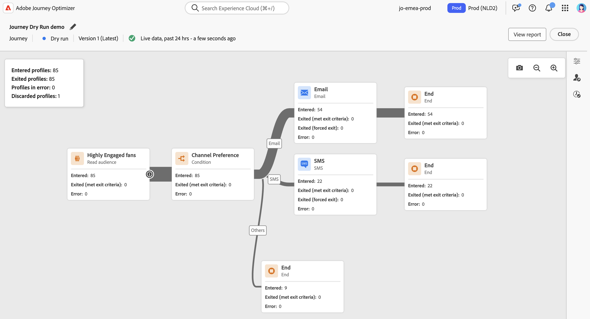

# Prova del percorso {#journey-dry-run}

>[!CONTEXTUALHELP]
>id="ajo_journey_dry_run"
>title="Modalità di esecuzione di prova"
>abstract="Questo percorso è in esecuzione di prova. L’esecuzione di prova di un percorso è una modalità speciale di pubblicazione dello stesso in Adobe Journey Optimizer che consente ai professionisti che si occupano del percorso di poterlo testare utilizzando dati reali di produzione, senza dover contattare la clientela reale o aggiornare le informazioni del profilo.  Questa funzione aiuta i professionisti del percorso ad acquisire maggiore sicurezza rispetto alla progettazione di un percorso e al targeting del pubblico, prima della pubblicazione effettiva."

>[!CONTEXTUALHELP]
>id="ajo_journey_dry_run_start"
>title="Pubblicare un percorso in modalità di esecuzione di prova"
>abstract="L’esecuzione di prova di un percorso è una modalità speciale di pubblicazione dello stesso in Adobe Journey Optimizer che consente ai professionisti che si occupano del percorso di poterlo testare utilizzando dati reali di produzione. Dopo aver progettato il percorso, esegui un’esecuzione in prova per assicurare che funzioni e che i passaggi siano corretti. Questa modalità di pubblicazione consente di eseguire un test preliminare di un percorso, senza inviare comunicazioni ad alcun profilo."

L’esecuzione di prova di un percorso è una modalità speciale di pubblicazione dello stesso in Adobe Journey Optimizer che consente ai professionisti che si occupano del percorso di poterlo testare utilizzando dati reali di produzione, senza dover contattare la clientela reale o aggiornare le informazioni del profilo.  Questa funzione aiuta i professionisti del percorso ad acquisire maggiore sicurezza rispetto alla progettazione di un percorso e al targeting del pubblico, prima della pubblicazione effettiva.

➡️ [Ulteriori informazioni sull&#39;esecuzione di prova del percorso in questo video](#dry-run-video)

## Vantaggi chiave {#journey-dry-run-benefits}

L’esecuzione in modalità Percorsi Dry aumenta la fiducia dei professionisti e il successo del percorso consentendo test sicuri e basati sui dati dei percorsi dei clienti che utilizzano dati di produzione reali, senza il rischio di contattare i clienti o di modificare le informazioni del profilo. Questa funzione consente ai professionisti del percorso di convalidare la logica di copertura del pubblico e della diramazione prima della pubblicazione, garantendo che i percorsi siano allineati agli obiettivi di business previsti.

Con l&#39;esecuzione di prova del Percorso, è possibile identificare i problemi in anticipo, ottimizzare le strategie di targeting e migliorare la progettazione del percorso in base ai dati effettivi, non alle ipotesi. Integrato direttamente nell’area di lavoro del percorso, Dry run fornisce rapporti intuitivi e visibilità sugli indicatori delle prestazioni chiave, consentendo ai team di eseguire iterazioni affidabili e di semplificare i flussi di lavoro di approvazione. Ciò migliora l&#39;efficienza operativa, riduce il rischio di lancio e migliora i risultati del coinvolgimento dei clienti.

In ultima analisi, questa funzione migliora il time-to-value e riduce i guasti del percorso.

Percorsi Dry run porta:

1. **Ambiente di test sicuro**: i profili in modalità di esecuzione a secco non vengono contattati, garantendo che non vi sia alcun rischio di inviare comunicazioni o di influire sui dati live.
1. **Informazioni sul pubblico**: i professionisti del Percorso possono prevedere la raggiungibilità del pubblico in vari nodi del percorso, incluse rinunce ed esclusioni in base alle condizioni del Percorso.
1. **Feedback in tempo reale**: le metriche vengono visualizzate direttamente nell&#39;area di lavoro del percorso, in modo simile al reporting live, consentendo agli utenti del percorso di perfezionare la progettazione del percorso.

## Logica di esecuzione a secco {#journey-dry-run-exec}

Durante l&#39;esecuzione di prova, il percorso viene eseguito in modalità di simulazione, applicando i seguenti comportamenti specifici a ogni attività del percorso senza attivare azioni effettive:

* **I nodi dell&#39;azione del canale**, comprese le notifiche e-mail, SMS o push, non vengono eseguiti.
* **Le azioni personalizzate** sono disabilitate durante l&#39;esecuzione di prova e le relative risposte sono impostate su null.

  Per migliorare la leggibilità, le azioni personalizzate e le attività del canale appaiono in grigio durante l’esecuzione di un’esecuzione di prova.

  {width="80%" align="left"}

* **Le origini dati**, incluse le origini dati esterne, e le attività **Wait** sono disabilitate per impostazione predefinita durante l&#39;esecuzione di prova. Tuttavia, è possibile modificare questo comportamento [quando si attiva la modalità di esecuzione di prova](#journey-dry-run-start).

* **Reazione** nodi non eseguiti: tutti i profili che vi entrano usciranno con successo. Tuttavia, si applicano le seguenti regole di priorità:
   * Se viene utilizzato un nodo **Reaction** con uno o più nodi **unitary event** in parallelo, i profili passeranno sempre attraverso l&#39;evento di reazione.
   * Se viene utilizzato un nodo **Reazione** con uno o più nodi **evento di reazione** in parallelo, i profili passeranno sempre al primo nodo dell&#39;area di lavoro (quello in alto).

>[!CAUTION]
>
>* Le autorizzazioni per avviare un&#39;esecuzione di prova sono limitate agli utenti con l&#39;autorizzazione di alto livello **[!DNL Publish journeys]**. Le autorizzazioni per interrompere un&#39;esecuzione di prova sono limitate agli utenti con l&#39;autorizzazione di alto livello **[!DNL Manage journeys]**. Ulteriori informazioni sulla gestione dei diritti di accesso degli utenti [!DNL Journey Optimizer] in [questa sezione](../administration/permissions-overview.md).
>
>* Prima di iniziare a utilizzare la funzionalità di esecuzione di prova, [leggere i guardrail e le limitazioni](#journey-dry-run-limitations).

## Avvia un&#39;esecuzione di prova {#journey-dry-run-start}

Potete utilizzare la funzionalità di esecuzione di prova in qualsiasi percorso 2D senza errori.

Per attivare l&#39;esecuzione in prova, effettuare le seguenti operazioni:

1. Aprire il percorso che si desidera verificare.
1. Selezionare il pulsante **[!UICONTROL Esegui]**.

   

1. Selezionare se si desidera abilitare o disabilitare le attività **Wait** e le chiamate **Origini dati esterne** e confermare la pubblicazione Dry run.

   {width="50%" align="left"}

   Durante la transizione viene visualizzato il messaggio di stato **[!UICONTROL Attivazione dell&#39;esecuzione di prova]**.

1. Dopo l&#39;attivazione, il percorso entra in modalità **[!UICONTROL Esecuzione a secco]**.

## Monitorare un’esecuzione in prova {#journey-dry-monitor}

Una volta avviata la pubblicazione in modalità Asciutto, puoi visualizzare l’esecuzione del percorso e il modo in cui i profili progrediscono attraverso rami e nodi del percorso.

Le metriche vengono visualizzate direttamente nell’area di lavoro del percorso. Ulteriori informazioni sui report e le metriche live di percorso sono disponibili in [Report live nell&#39;area di lavoro di percorso](report-journey.md).

È inoltre possibile accedere ai **report delle ultime 24 ore** e ai **report delle ultime 24 ore** per l&#39;esecuzione di prova. Per accedere a questi report, fare clic sul pulsante **Visualizza report** nell&#39;angolo superiore destro dell&#39;area di lavoro del percorso.

>[!CAUTION]
>
> I dati di reporting sono disponibili solo quando l&#39;esecuzione di prova è **attiva**.  Una volta interrotti, i dati di reporting non saranno più accessibili. Utilizza il pulsante **Esporta** sopra i report per scaricarli, se necessario.

## Interrompere un&#39;esecuzione di prova {#journey-dry-run-stop}

Dopo 14 giorni, i percorsi di esecuzione di prova passano automaticamente allo stato **[!UICONTROL Bozza]**.

È inoltre possibile arrestare manualmente i percorsi di esecuzione di prova. Per disattivare la modalità di esecuzione a secco, effettuare le seguenti operazioni:

1. Aprire il percorso di esecuzione di prova che si desidera interrompere.
1. Seleziona il pulsante **[!UICONTROL Chiudi]** per terminare il test.
Nella schermata di conferma sono disponibili i collegamenti alle ultime 24 ore e tutti i rapporti temporali.

   {width="50%" align="left"}

1. Fai clic su **[!UICONTROL Torna alla bozza]** per confermare.

## Guardrail e limitazioni {#journey-dry-run-limitations}

* I profili in modalità di esecuzione in prova vengono conteggiati per i profili coinvolgibili
* I percorsi in modalità di esecuzione in prova vengono conteggiati ai fini della quota di percorso in tempo reale
* I percorsi di esecuzione in prova non influiscono sulle regole aziendali
  <!--* When creating a new journey version, if a previous journey version is **Live**, then the Dry run activation is not allowed on the new version.-->
* Le azioni **Salta** non sono abilitate nell&#39;esecuzione di prova.
Quando un percorso di origine attiva un evento **Jump** a una destinazione, tale evento di salto non è applicabile a una versione del percorso di esecuzione in prova. Ad esempio, se l&#39;ultima versione di un percorso è in esecuzione di prova e la precedente è **Live**, l&#39;evento Salta ignorerà la versione di esecuzione di prova e sarà applicabile solo a quella **Live**.

## Eventi di passaggio percorso ed esecuzione in prova {#journey-step-events}

L&#39;esecuzione di prova del percorso genera **stepEvents**. Questi stepEvents hanno un flag specifico e un ID esecuzione di prova: `inDryRun` e `dryRunID`.

* `_experience.journeyOrchestration.stepEvents.inDryRun` restituisce `true` se l&#39;esecuzione di prova è attivata e `false` in caso contrario
* `_experience.journeyOrchestration.stepEvents.dryRunID` restituisce l&#39;ID di un&#39;istanza di esecuzione di prova

Se esporti dati stepEvent in **sistemi esterni**, puoi filtrare le esecuzioni di esecuzione di prova utilizzando il flag `inDryRun`.

Quando si analizzano **metriche di reporting di percorso** tramite il servizio Adobe Experience Platform Query, è necessario escludere gli eventi di passaggio generati da Dry Run. Per eseguire questa operazione, impostare il flag `inDryRun` su `false`.

## Video dimostrativo {#dry-run-video}

Scopri come eseguire a secco i percorsi in questo video.

>[!VIDEO](https://video.tv.adobe.com/v/3464681/?learn=on&enablevpops)
