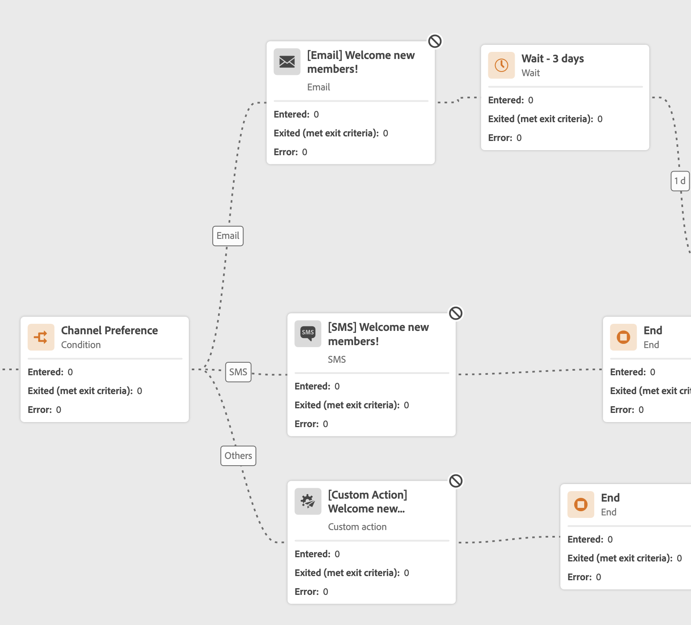

# Prova del percorso {#journey-dry-run}

>[!BEGINSHADEBOX]

**In questa pagina:** scopri come pubblicare un percorso in modalità di esecuzione a secco per testarlo con dati di produzione reali senza contattare clienti reali o aggiornare i profili, in modo da poter convalidare la progettazione prima della pubblicazione.

>[!ENDSHADEBOX]

>[!CONTEXTUALHELP]
>id="ajo_journey_dry_run"
>title="Modalità di esecuzione di prova"
>abstract="Questo percorso è in esecuzione di prova. L’esecuzione di prova di un percorso è una modalità speciale di pubblicazione dello stesso in [!DNL Adobe Journey Optimizer] che consente a chi si occupa dei percorsi di poterli testare utilizzando dati reali di produzione, senza però contattare clienti reali e senza dover aggiornare i dati dei profili.  Questa funzione aiuta i professionisti del percorso ad acquisire maggiore sicurezza rispetto alla progettazione di un percorso e al targeting del pubblico, prima della pubblicazione effettiva."

>[!CONTEXTUALHELP]
>id="ajo_journey_dry_run_start"
>title="Pubblicare un percorso in modalità di esecuzione di prova"
>abstract="L’esecuzione di prova di un percorso è una modalità speciale di pubblicazione dello stesso in [!DNL Adobe Journey Optimizer] che consente a chi si occupa dei percorsi di poterli testare utilizzando dati reali di produzione. Una volta progettato un percorso, una prova di funzionamento a secco conferma che è funzionante e assicura che i passaggi siano corretti. Questa modalità di pubblicazione consente di eseguire un test preliminare di un percorso, senza inviare comunicazioni ad alcun profilo."

L’esecuzione di prova di un percorso è una modalità speciale di pubblicazione dello stesso in [!DNL Adobe Journey Optimizer] che consente a chi si occupa dei percorsi di poterli testare utilizzando dati reali di produzione, senza però contattare clienti reali e senza dover aggiornare i dati dei profili.  Questa funzione aiuta i professionisti del percorso ad acquisire maggiore sicurezza rispetto alla progettazione di un percorso e al targeting del pubblico, prima della pubblicazione effettiva.

➡️ [Ulteriori informazioni sull&#39;esecuzione di prova del percorso in questo video](#dry-run-video)

## Vantaggi chiave {#journey-dry-run-benefits}

L’esecuzione in modalità Percorsi Dry aumenta la fiducia dei professionisti e il successo del percorso consentendo test sicuri e basati sui dati dei percorsi dei clienti che utilizzano dati di produzione reali, senza il rischio di contattare i clienti o di modificare le informazioni del profilo. Questa funzione consente ai professionisti del percorso di convalidare la logica di copertura del pubblico e della diramazione prima della pubblicazione, garantendo che i percorsi siano allineati agli obiettivi di business previsti.

Con l&#39;esecuzione di prova del Percorso, è possibile identificare i problemi in anticipo, ottimizzare le strategie di targeting e migliorare la progettazione del percorso in base ai dati effettivi, non alle ipotesi. Integrato direttamente nell’area di lavoro del percorso, Dry run fornisce rapporti intuitivi e visibilità sugli indicatori delle prestazioni chiave, consentendo ai team di eseguire iterazioni affidabili e di semplificare i flussi di lavoro di approvazione. Ciò migliora l&#39;efficienza operativa, riduce il rischio di lancio e migliora i risultati del coinvolgimento dei clienti.

In ultima analisi, questa funzione migliora il time-to-value e riduce i guasti del percorso.

Percorsi Dry run porta:

1. **Ambiente di test sicuro**: i profili in modalità di esecuzione a secco non vengono contattati, garantendo che non vi sia alcun rischio di inviare comunicazioni o di influire sui dati live.
1. **Informazioni sul pubblico**: i professionisti del Percorso possono prevedere la raggiungibilità del pubblico in vari nodi del percorso, incluse rinunce ed esclusioni in base alle condizioni del Percorso.
1. **Feedback in tempo reale**: le metriche vengono visualizzate direttamente nell&#39;area di lavoro del percorso, in modo simile al reporting live, consentendo agli utenti del percorso di perfezionare la progettazione del percorso.

## Logica di esecuzione a secco {#journey-dry-run-exec}

Durante l&#39;esecuzione di prova, il percorso viene eseguito in modalità di simulazione, applicando i seguenti comportamenti specifici a ogni attività del percorso senza attivare azioni effettive:

* **I nodi dell&#39;azione del canale**, comprese le notifiche e-mail, SMS o push, non vengono eseguiti.
* **Le azioni personalizzate** sono disabilitate durante l&#39;esecuzione di prova e le relative risposte sono impostate su null.

  Per migliorare la leggibilità, le azioni personalizzate e le attività del canale appaiono in grigio durante l’esecuzione di un’esecuzione di prova.

  {width="80%"}

* **Le origini dati**, incluse le origini dati esterne, e le attività **Wait** sono disabilitate per impostazione predefinita durante l&#39;esecuzione di prova. Tuttavia, è possibile modificare questo comportamento [quando si attiva la modalità di esecuzione di prova](#journey-dry-run-start).

* **Reazione** nodi non eseguiti: tutti i profili che vi entrano usciranno con successo. Tuttavia, si applicano le seguenti regole di priorità:

   * Se viene utilizzato un nodo **Reaction** con uno o più nodi **unitary event** in parallelo, i profili passeranno sempre attraverso l&#39;evento di reazione.
   * Se viene utilizzato un nodo **Reazione** con uno o più nodi **evento di reazione** in parallelo, i profili passeranno sempre al primo nodo dell&#39;area di lavoro (quello in alto).

>[!CAUTION]
>
>* Le autorizzazioni per avviare un&#39;esecuzione di prova sono limitate agli utenti con l&#39;autorizzazione di alto livello **[!DNL Publish journeys]**. Le autorizzazioni per interrompere un&#39;esecuzione di prova sono limitate agli utenti con l&#39;autorizzazione di alto livello **[!DNL Manage journeys]**. Ulteriori informazioni sulla gestione dei diritti di accesso degli utenti [!DNL Journey Optimizer] in [questa sezione](../administration/permissions-overview.md).
>
>* Prima di iniziare a utilizzare la funzionalità di esecuzione di prova, [leggere i guardrail e le limitazioni](#journey-dry-run-limitations).

## Avvia un&#39;esecuzione di prova {#journey-dry-run-start}

Potete utilizzare la funzionalità di esecuzione di prova in qualsiasi percorso 2D senza errori.

Per attivare l&#39;esecuzione in prova, effettuare le seguenti operazioni:

1. Aprire il percorso che si desidera verificare.
1. Selezionare il pulsante **[!UICONTROL Esegui]**.

   

1. Selezionare se si desidera abilitare o disabilitare le attività **Wait** e le chiamate **Origini dati esterne** e confermare la pubblicazione Dry run.

   {width="50%"}

   Durante la transizione viene visualizzato il messaggio di stato **[!UICONTROL Attivazione dell&#39;esecuzione di prova]**.

1. Dopo l&#39;attivazione, il percorso entra in modalità **[!UICONTROL Esecuzione a secco]**.

## Monitorare un’esecuzione in prova {#journey-dry-monitor}

Una volta avviata la pubblicazione in modalità Asciutto, puoi visualizzare l’esecuzione del percorso e il modo in cui i profili progrediscono attraverso rami e nodi del percorso.

Le metriche vengono visualizzate direttamente nell’area di lavoro del percorso. Ulteriori informazioni sui report e le metriche live di percorso sono disponibili in [Report live nell&#39;area di lavoro di percorso](report-journey.md).

È inoltre possibile accedere ai **report delle ultime 24 ore** e ai **report delle ultime 24 ore** per l&#39;esecuzione di prova. Per accedere a questi report, fare clic sul pulsante **Visualizza report** nell&#39;angolo superiore destro dell&#39;area di lavoro del percorso.

>[!CAUTION]
>
> I dati di reporting sono disponibili solo quando l&#39;esecuzione di prova è **attiva**.  Una volta interrotti, i dati di reporting non saranno più accessibili. Utilizza il pulsante **Esporta** sopra i report per scaricarli, se necessario.

## Interrompere un&#39;esecuzione di prova {#journey-dry-run-stop}

Dopo 14 giorni, i percorsi di esecuzione di prova passano automaticamente allo stato **[!UICONTROL Bozza]**.

È inoltre possibile arrestare manualmente i percorsi di esecuzione di prova. Per disattivare la modalità di esecuzione a secco, effettuare le seguenti operazioni:

1. Aprire il percorso di esecuzione di prova che si desidera interrompere.
1. Seleziona il pulsante **[!UICONTROL Chiudi]** per terminare il test.
Nella schermata di conferma sono disponibili i collegamenti alle ultime 24 ore e tutti i rapporti temporali.

   {width="50%"}

1. Fai clic su **[!UICONTROL Torna alla bozza]** per confermare.

## Guardrail e limitazioni {#journey-dry-run-limitations}

* I profili in modalità di esecuzione a secco vengono conteggiati per [Profili coinvolgibili](../audience/license-usage.md)
* I percorsi in modalità di esecuzione in prova vengono conteggiati ai fini della quota di percorso in tempo reale
* I percorsi di esecuzione in prova non influiscono sulle regole aziendali
  <!--* When creating a new journey version, if a previous journey version is **Live**, then the Dry run activation is not allowed on the new version.-->
* Le azioni **Salta** non sono abilitate nell&#39;esecuzione di prova.
Quando un percorso di origine attiva un evento **Jump** a un percorso di destinazione, tale evento di salto non è applicabile a una versione di Dry Run. Ad esempio, se l&#39;ultima versione di un percorso è in esecuzione di prova e la precedente è **Live**, l&#39;evento Salta ignorerà la versione di esecuzione di prova e sarà applicabile solo a quella **Live**.

## Eventi delle fasi del percorso ed esecuzione in prova {#journey-step-events}

L&#39;esecuzione di prova del percorso genera **stepEvents**. Questi stepEvents hanno un flag specifico e un ID esecuzione di prova: `inDryRun` e `dryRunID`.

* `_experience.journeyOrchestration.stepEvents.inDryRun` restituisce `true` quando il percorso è in modalità di esecuzione in prova e `null` per percorsi di prova o live (esecuzione non in prova).
* `_experience.journeyOrchestration.stepEvents.dryRunID` restituisce l&#39;ID dell&#39;istanza di esecuzione di prova in modalità di esecuzione di prova; per percorsi di prova o live, è `null`.

Se esporti dati stepEvent in **sistemi esterni**, puoi filtrare le esecuzioni di esecuzione di prova utilizzando il flag `inDryRun`.

Quando si analizzano **metriche di reporting di percorso** utilizzando il servizio query [!DNL Adobe Experience Platform], è necessario escludere gli eventi di passaggio generati dall&#39;esecuzione di prova. Per eseguire questa operazione, escludere gli eventi del passaggio in cui `inDryRun` è `true` (ovvero includere solo gli eventi in cui `inDryRun` è `null` o `false`).

## Domande frequenti {#faq}

**Un&#39;esecuzione di prova invia messaggi a clienti reali?**

No. L’esecuzione in prova utilizza dati di produzione reali, ma non contatta i profili o aggiorna le informazioni sul profilo. Le azioni del canale (e-mail, SMS, push) non vengono eseguite e le azioni personalizzate vengono disabilitate con le relative risposte impostate su `null`.

**Quali autorizzazioni sono necessarie per avviare o interrompere un&#39;esecuzione di prova?**

L&#39;avvio di un&#39;esecuzione di prova richiede l&#39;autorizzazione di alto livello **[!DNL Publish journeys]**. L&#39;arresto di un&#39;esecuzione di prova richiede l&#39;autorizzazione di alto livello **[!DNL Manage journeys]**. Per ulteriori informazioni, consulta la [sezione sulle autorizzazioni](../administration/permissions-overview.md).

**In quali percorsi è possibile eseguire un&#39;esecuzione di prova?**

Puoi usare l&#39;esecuzione in prova in qualsiasi percorso **[!UICONTROL Bozza]** che non presenta errori.

**Quanto dura un&#39;esecuzione di prova?**

Dopo 14 giorni, i percorsi di esecuzione di prova torneranno automaticamente allo stato **[!UICONTROL Bozza]**. È inoltre possibile interrompere manualmente un&#39;esecuzione di prova in qualsiasi momento.

**Le attività di attesa e le origini dati esterne vengono eseguite durante un&#39;esecuzione di prova?**

Per impostazione predefinita, le attività **Attendi** e le **origini dati** (comprese le origini dati esterne) sono disabilitate durante un&#39;esecuzione di prova. È possibile modificare questo comportamento quando [si attiva la modalità di esecuzione di prova](#journey-dry-run-start).

**I profili e i percorsi di esecuzione a secco vengono conteggiati per le quote?**

Sì. I profili in modalità di esecuzione in prova vengono conteggiati in base a [Profili coinvolgibili](../audience/license-usage.md) e i percorsi in modalità di esecuzione in prova vengono conteggiati in base alla quota di percorsi attivi. Tuttavia, i percorsi di esecuzione in prova non influiscono sulle regole aziendali.

**È ancora possibile accedere ai report di esecuzione di prova dopo l&#39;interruzione del test?**

No. I dati di reporting sono disponibili solo se l&#39;esecuzione di prova è **attiva**. Una volta interrotti, i dati non sono più accessibili. Utilizza il pulsante **Esporta** sopra i report per scaricarli in anticipo, se necessario.

**Come si escludono i dati di esecuzione in prova dai rapporti?**

L&#39;esecuzione di prova genera **stepEvents** contrassegnati con `inDryRun` e un `dryRunID`. Durante l&#39;analisi delle metriche di reporting del percorso con il servizio query [!DNL Adobe Experience Platform], escludere gli eventi del passaggio in cui `inDryRun` è `true` (includere solo gli eventi in cui `inDryRun` è `null` o `false`).

## Video introduttivo {#dry-run-video}

Scopri come eseguire a secco i percorsi in questo video.

>[!VIDEO](https://video.tv.adobe.com/v/3464681/?learn=on&enablevpops)

+++ Guida di riferimento della Knowledge Base di AI

Questa sezione contiene informazioni strutturate che supportano l&#39;interpretazione, il recupero e la risposta alle domande relative a questo argomento.

Per una comprensione completa, queste informazioni devono essere unite alla documentazione su questa pagina. Nessuna delle due origini è progettata per essere indipendente; la pagina descrive la funzione, mentre questa sezione fornisce un contesto aggiuntivo che aiuta a non ambiguare la terminologia, le finalità, l’applicabilità e i vincoli.

* **TL;DR:** In questa pagina viene illustrata l&#39;esecuzione di prova del Percorso, una modalità di pubblicazione speciale che consente ai professionisti di testare un percorso utilizzando dati di produzione reali senza contattare i clienti o modificare i profili e viene illustrato come avviare, monitorare, arrestare e filtrare gli eventi dei passaggi dell&#39;esecuzione di prova.

**Intenti:**
* Attiva la modalità di esecuzione in modalità provvisoria in un percorso in bozza per convalidare la logica di diffusione e diramazione del pubblico con i dati di produzione reali
* Monitorare le metriche di esecuzione del percorso nell’area di lavoro durante un’esecuzione di prova
* Interrompere un&#39;esecuzione di prova manuale e riportare il percorso allo stato Bozza
* Filtrare gli eventi dei passaggi di esecuzione di prova dalle query di reporting utilizzando il flag `inDryRun`
* Scopri quali attività sono disabilitate o simulate durante un’esecuzione in prova

**Glossario:**
* **Esecuzione a secco**: modalità speciale di pubblicazione del percorso che esegue il percorso rispetto ai dati di produzione reali senza inviare comunicazioni o aggiornare le informazioni del profilo *(specifiche del prodotto)*
* **stepEvent**: un record di set di dati generato automaticamente che acquisisce ogni passaggio che un profilo compie in un percorso; gli eventi dei passaggi di esecuzione in prova contengono `inDryRun=true` e un `dryRunID` *(specifico per prodotto)*
* **Flag inDryRun**: campo booleano in stepEvents che è `true` per le esecuzioni di esecuzione di prova e `null` per i percorsi live o di prova *(specifico per prodotto)*

**Guardrail:**
* In modalità di esecuzione a secco è possibile attivare solo percorsi 2D senza errori
* L&#39;avvio di un&#39;esecuzione di prova richiede l&#39;autorizzazione **Pubblica percorsi**; l&#39;arresto richiede **Gestisci percorsi**
* I percorsi di esecuzione di prova escono automaticamente dalla modalità di esecuzione di prova e tornano allo stato Bozza dopo 14 giorni. Non viene perso alcun contenuto di percorso; termina solo la sessione di esecuzione di prova.
* I profili elaborati durante un’esecuzione di prova vengono conteggiati per i profili coinvolgibili e la quota di percorso live
* I nodi di azione del canale (e-mail, SMS, push) e le azioni personalizzate non vengono eseguiti durante l’esecuzione in prova
* Le azioni di salto non sono abilitate nell’esecuzione di prova
* I nodi di reazione non vengono eseguiti durante l’esecuzione di prova; i profili vengono chiusi correttamente, con regole di priorità per i rami di reazione e unitari paralleli
* I dati di reporting sono disponibili solo quando l&#39;esecuzione di prova è attiva; una volta arrestata, i dati non sono più accessibili
* I percorsi di esecuzione in prova non influiscono sulle regole aziendali

**Terminologia:**
* Nome canonico: Percorsi Dry run — Acronimo: none — varianti: dry run mode, Dry run publication mode
* Sinonimi: &quot;prova di secchezza&quot; = &quot;prova di fumo&quot; (informalmente)
* Da non confondere: &quot;Esecuzione in prova&quot; ≠ &quot;Modalità di prova&quot; ≠ &quot;Simulazione&quot; — L’esecuzione in prova utilizza i dati di produzione reali e i conteggi per i profili coinvolgibili e la quota di percorso live; la modalità di prova utilizza i profili di test AEP persistenti in un percorso in bozza; la simulazione utilizza utenti simulati temporanei che non persistono in AEP

**Domande frequenti:**
* **Q: Dry run invia effettivamente e-mail o notifiche push ai clienti?** — No; tutti i nodi di azione del canale e le azioni personalizzate sono disabilitate e non eseguite durante un&#39;esecuzione di prova.
* **Q: quanto tempo dura un&#39;esecuzione di prova prima che si arresti automaticamente?** — 14 giorni, dopo i quali il percorso ritorna automaticamente allo stato Bozza.
* **D: come posso escludere i dati di esecuzione in prova dalle query di analisi di percorso?** — Escludere gli eventi di passaggio in cui `inDryRun` è `true`; includere solo gli eventi in cui `inDryRun` è `null` o `false`.
* **Q: i profili vengono conteggiati rispetto a qualsiasi limite durante un&#39;esecuzione di prova?** — Sì; i profili vengono conteggiati per i profili associabili e il percorso di esecuzione in prova viene conteggiato per la quota di percorso in tempo reale.
* **Q: posso abilitare le attività Attendi e le chiamate all&#39;origine dati esterne durante un&#39;esecuzione di prova?** — Entrambi sono disattivati per impostazione predefinita, ma è possibile scegliere di attivarli o disattivarli quando si attiva l&#39;esecuzione di prova.

+++
