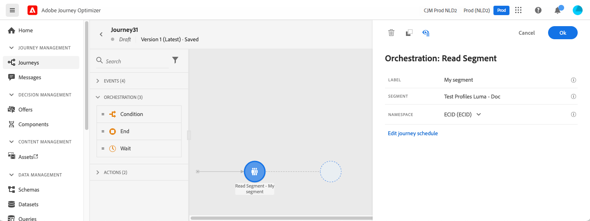
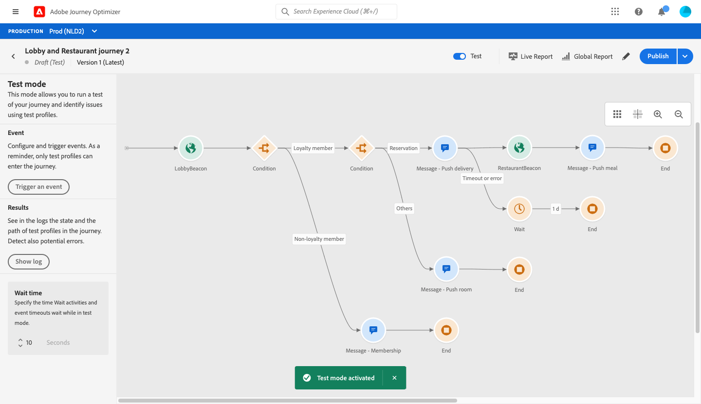
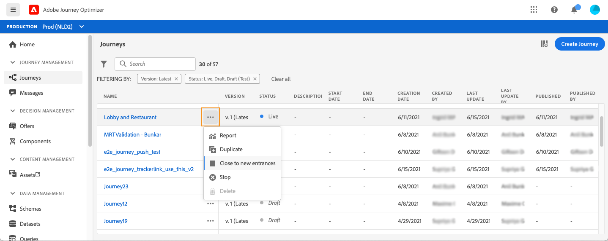

# Introduzione ai percorsi{#jo-quick-start}

## Prerequisiti

Per inviare messaggi con percorsi, è necessaria la seguente configurazione:

1. **Configura un evento**: se desideri attivare i percorsi in modo unitario quando viene ricevuto un evento, devi configurare un evento. Puoi definire le informazioni previste e come elaborarle. e viene eseguita da un **utente tecnico**. [Ulteriori informazioni](../event/about-events.md).

   

1. **Crea un segmento**: il tuo percorso può anche ascoltare i segmenti Adobe Experience Platform per inviare messaggi in batch a un set specifico di profili. A questo scopo, devi creare dei segmenti. [Ulteriori informazioni](../segment/about-segments.md).

   

1. **Configura l&#39;origine** dati: puoi definire una connessione a un sistema per recuperare informazioni aggiuntive che verranno utilizzate nei tuoi percorsi, ad esempio nelle tue condizioni. Al momento del provisioning, viene configurata anche un’origine dati integrata in Adobe Experience Platform. Se sfrutti solo i dati degli eventi del tuo percorso, questo passaggio non è necessario e viene eseguita da un **utente tecnico**. [Ulteriori informazioni](../datasource/about-data-sources.md)

   

1. **Configura un&#39;azione**: Le funzionalità dei messaggi di Journey Optimizer sono integrate e ti basta progettare il contenuto e pubblicare il messaggio. Vedi [questa sezione](../get-started-content.md). Se utilizzi un sistema di terze parti per l’invio dei messaggi, puoi creare un’azione personalizzata. Ulteriori informazioni in questa sezione [sezione](../action/action.md). e viene eseguita da un **utente tecnico**.

   

## Creazione del percorso{#jo-build}

Questo passaggio viene eseguito dall&#39; **utente aziendale**. Qui è dove si creano i percorsi. Combina le diverse attività relative a un evento, un percorso e un’azione in modo da creare scenari tra canali con più passaggi.

Di seguito sono riportati i passaggi principali per l’invio di messaggi attraverso i percorsi:

1. Nella sezione del menu GESTIONE PERCORSO, fare clic su **[!UICONTROL Journeys]**. Viene visualizzato l’elenco dei percorsi.

   

1. Fai clic su **[!UICONTROL Create Journey]** per creare un nuovo percorso.

1. Modifica le proprietà del percorso nel riquadro di configurazione visualizzato sul lato destro. Ulteriori informazioni in questa sezione [sezione](journey-gs.md#change-properties).

   

1. Inizia trascinando un evento o un&#39;attività **Leggi segmento** dalla palette nell&#39;area di lavoro. Per ulteriori informazioni sulla progettazione del percorso, consulta [questa sezione](using-the-journey-designer.md).

   

1. Trascina e rilascia i passaggi successivi che verranno seguiti dall’utente. Ad esempio, puoi aggiungere una condizione seguita da un messaggio. Per ulteriori informazioni sulle attività, consulta [questa sezione](using-the-journey-designer.md).

1. Testa il percorso utilizzando i profili di test. Ulteriori informazioni in questa [sezione](testing-the-journey.md)

1. Pubblica il percorso per attivarlo. Ulteriori informazioni in questa sezione [sezione](publishing-the-journey.md).

   

1. Monitora il percorso utilizzando gli strumenti di reporting dedicati per misurare l&#39;efficacia del percorso. Ulteriori informazioni in questa sezione [sezione](../reports/live-report.md).

   

## Modifica delle proprietà {#change-properties}

Fai clic sull’icona della matita, in alto a destra, per accedere alle proprietà del percorso.

Puoi modificare il nome del percorso, aggiungere una descrizione, consentire il rientro, scegliere le date di inizio e di fine e definire una **[!UICONTROL Timeout and error]** durata se sei un amministratore.

Per i percorsi live, questa schermata mostra la data di pubblicazione e il nome dell’utente che ha pubblicato il percorso.

Il **Copia dettagli tecnici** consente di copiare informazioni tecniche sul percorso che il team di supporto può utilizzare per la risoluzione dei problemi. Vengono copiate le seguenti informazioni: JourneyVersion UID, OrgID, orgName, sandboxName, lastDeployedBy, lastDeployedAt.

### Ingresso{#entrance}

Per impostazione predefinita, i nuovi percorsi consentono il rientro. È possibile deselezionare l&#39;opzione per percorsi &quot;una ripresa&quot;, ad esempio se si desidera offrire un regalo una tantum quando una persona entra in un negozio. In tal caso, non vuoi che il cliente sia in grado di reinserire il percorso e ricevere nuovamente l&#39;offerta.

Quando un percorso &quot;termina&quot;, lo stato sarà **[!UICONTROL Closed]**. Il percorso smetterà di lasciare entrare nuovi individui nel percorso. Le persone già nel percorso finiranno normalmente il percorso.

Dopo il timeout globale predefinito di 30 giorni, il percorso passa allo stato **Finished** . Vedere questa sezione .

### Timeout ed errore nelle attività del percorso {#timeout_and_error}

Quando modifichi un’attività di azione o condizione, puoi definire un percorso alternativo in caso di errore o timeout. Se l’elaborazione dell’attività che esegue l’interrogazione a un sistema di terze parti supera la durata di timeout definita nel campo delle proprietà del percorso (**[!UICONTROL Timeout and  error]** ), verrà scelto il secondo percorso per eseguire una potenziale azione di fallback.

I valori autorizzati sono compresi tra 1 e 30 secondi.

È consigliabile definire un valore molto breve **[!UICONTROL Timeout and error]** se il percorso è sensibile al tempo (ad esempio: reagire alla posizione in tempo reale di una persona) perché non è possibile ritardare l&#39;azione per più di pochi secondi. Se il percorso è meno sensibile al tempo, puoi utilizzare un valore più lungo per dare più tempo al sistema chiamato per inviare una risposta valida.

I percorsi utilizzano anche un timeout globale. Vedere la sezione [successiva](#global_timeout).

### Timeout percorso globale {#global_timeout}

Oltre al [timeout](#timeout_and_error) utilizzato nelle attività di percorso, esiste anche un timeout di percorso globale che non viene visualizzato nell’interfaccia e non può essere modificato. Questo timeout interrompe il progresso dei singoli utenti nel percorso 30 giorni dopo l’accesso. Ciò significa che il percorso di un individuo non può durare più di 30 giorni. Dopo il periodo di timeout di 30 giorni, i dati del singolo utente vengono eliminati. Gli utenti che continuano a scorrere nel percorso alla fine del periodo di timeout verranno arrestati e verranno presi in considerazione come errori nel reporting.

>[!NOTE]
>
>I percorsi non reagiscono direttamente alle richieste di rinuncia, accesso o cancellazione della privacy. Tuttavia, il timeout globale assicura che gli individui non rimangano mai più di 30 giorni in un percorso.

A causa del timeout di 30 percorsi, quando non è consentito l’accesso al percorso, non possiamo assicurarci che il blocco del rientro funzioni per più di 30 giorni. Infatti, poiché rimuoviamo tutte le informazioni sulle persone che sono entrate nel percorso 30 giorni dopo il loro ingresso, non possiamo sapere che la persona è entrata in precedenza, più di 30 giorni fa.

### Fuso orario e fuso orario del profilo {#timezone}

Il fuso orario è definito a livello di percorso.

Puoi immettere un fuso orario fisso oppure utilizzare i profili Adobe Experience Platform per definire il fuso orario percorso.

Per ulteriori informazioni sulla gestione del fuso orario, consulta [questa pagina](../building-journeys/timezone-management.md).

### Modalità Burst {#burst}

La modalità Burst è un componente aggiuntivo a pagamento che consente l&#39;invio rapido di messaggi push in grandi volumi. Viene utilizzato per percorsi semplici che includono un segmento di lettura e un messaggio push semplice. Burst viene utilizzato quando il ritardo nella consegna dei messaggi è di importanza business, quando si desidera inviare un avviso push urgente sui telefoni cellulari, ad esempio una notizia di emergenza per gli utenti che hanno installato la tua app del canale di notizie.

Limitazioni:

* Il percorso deve iniziare con un segmento di lettura. Eventi non consentiti.
* Il passaggio successivo deve essere un messaggio push. Non sono consentiti altri passaggi o attività (eccetto l’attività finale facoltativa):
   * Solo canale push
   * Nel messaggio non è consentita alcuna personalizzazione
   * Il messaggio deve essere piccolo (&lt;2 KB)

Nota importante:

Se uno dei requisiti non è soddisfatto, la modalità burst non sarà disponibile nel percorso.

Per attivare la modalità Burst, apri il percorso e fai clic sull’icona a forma di matita, in alto a destra, per accedere alle proprietà del percorso. Quindi, attiva l&#39;interruttore **Abilita modalità burst**.

La modalità Burst verrà disattivata se modifichi un percorso burst e aggiungi un&#39;attività non conforme a burst (messaggio, qualsiasi altra azione, un evento, ecc.). Verrà visualizzato un messaggio.

Quindi testa e pubblica normalmente il tuo percorso. I messaggi in modalità di test non vengono inviati tramite la modalità burst.

## Terminazione di un percorso

Un percorso può terminare per un individuo per due motivi:

* La persona arriva all&#39;ultima attività di un percorso. Quest’ultima attività può essere un’attività finale o un’altra. Non vi è alcun obbligo di terminare un percorso con un’attività finale. Consulta [questa pagina](../building-journeys/end-activity.md).
* La persona arriva a un’attività condizione (o un’attività di attesa con una condizione) e non corrisponde a nessuna delle condizioni.

La persona può quindi rientrare nel percorso se è consentito il rientro. Consulta [questa pagina](../building-journeys/journey-gs.md#change-properties)

Un percorso può chiudersi per i motivi seguenti:

* Il percorso viene chiuso manualmente tramite il pulsante **[!UICONTROL Close to new entrances]** .
* Un percorso basato su segmenti una tantum che ha completato l’esecuzione.
* Dopo l’ultima occorrenza di un percorso basato su segmenti ricorrente.

Quando un percorso viene chiuso (per uno qualsiasi dei motivi di cui sopra), avrà lo stato **[!UICONTROL Closed]**. Il percorso smetterà di lasciare entrare nuovi individui nel percorso. Le persone già nel percorso finiranno normalmente il percorso. Dopo il timeout globale predefinito di 30 giorni, il percorso passa allo stato **Finished** . Vedere questa sezione .

Nel caso tu debba interrompere il progresso di tutti gli individui nel percorso, puoi fermarlo. Arrestare il percorso causerà il timeout di tutti gli individui nel percorso.

Ecco come si chiude o si interrompe manualmente un percorso:

Le opzioni **[!UICONTROL Stop]** e **[!UICONTROL Close to new entrances]** consentono di terminare i percorsi **live**. La chiusura di un percorso implica **che l&#39;arrivo di nuovi clienti nel percorso è bloccato** e che i clienti che sono già entrati nel percorso sono in grado di sperimentarlo fino alla fine. Questo è il modo più consigliato per mettere fine a un percorso in quanto offre la migliore esperienza per i clienti. Arrestare un percorso implica che le persone che sono già entrate in un percorso vengono tutte fermate nel loro progresso. Il percorso è fondamentalmente spento.

>[!NOTE]
>
>Non è possibile riprendere un percorso chiuso o interrotto.

### Chiusura di un percorso

È possibile chiudere manualmente un percorso per garantire che i clienti che sono già entrati nel percorso possano completare il loro percorso ma i nuovi utenti non siano in grado di accedere al percorso.

Una volta chiuso, un percorso avrà lo stato **[!UICONTROL Closed]**. Dopo il timeout globale predefinito di 30 giorni, il percorso passa allo stato **Finished** . Vedere questa sezione .

Impossibile riavviare o eliminare una versione di un percorso chiuso. Puoi crearne una nuova versione o duplicarla. È possibile eliminare solo i percorsi finiti.

Per chiudere un percorso dall&#39;elenco dei percorsi, fare clic sul pulsante **[!UICONTROL Ellipsis]** situato a destra del nome del percorso e selezionare **[!UICONTROL Close to new entrances]**.

È inoltre possibile:

1. Nell&#39;elenco **[!UICONTROL Journeys]** fare clic sul percorso da chiudere.
1. In alto a destra, fai clic sulla freccia giù.

   

1. Fai clic su **[!UICONTROL Close to new entrances]**. Viene visualizzata una finestra di dialogo.
1. Fai clic su **[!UICONTROL Close to new entrances]** per confermare.

### Arresto di un percorso

È possibile interrompere un percorso quando si è verificata un&#39;emergenza e tutte le operazioni di elaborazione devono essere terminate immediatamente su un percorso.

Impossibile riavviare una versione di percorso interrotta.

Quando viene arrestato, un percorso avrà lo stato **[!UICONTROL Stopped]**.

È possibile interrompere un percorso, ad esempio, se un addetto al marketing si rende conto che il percorso esegue il targeting del pubblico errato o che un&#39;azione personalizzata che dovrebbe inviare i messaggi non funziona correttamente. Per interrompere un percorso dall&#39;elenco dei percorsi, fare clic sul pulsante **[!UICONTROL Ellipsis]** situato a destra del nome del percorso e selezionare **[!UICONTROL Stop]**.

È inoltre possibile:

1. Nell&#39;elenco **[!UICONTROL Journeys]** fare clic sul percorso che si desidera arrestare.
1. In alto a destra, fai clic sulla freccia giù.

1. Fai clic su **[!UICONTROL Stop]**. Viene visualizzata una finestra di dialogo.
1. Fai clic su **[!UICONTROL Stop]** per confermare.
