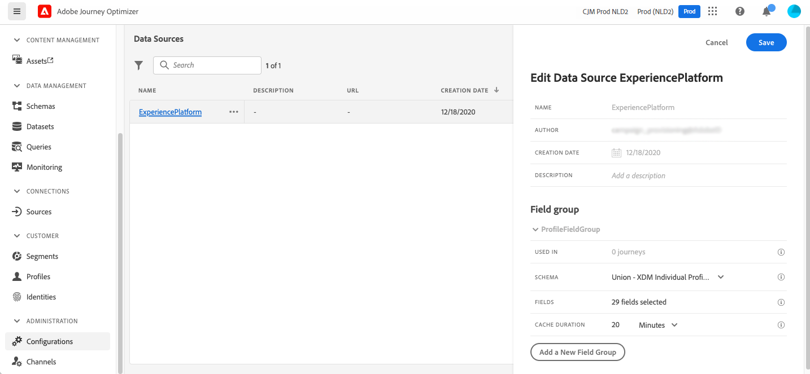
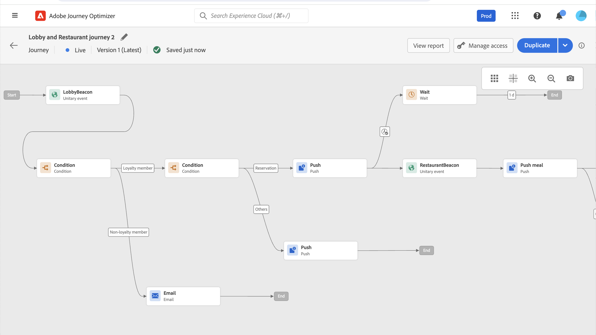

# Creare il primo percorso {#jo-quick-start}

>[!CONTEXTUALHELP]
>id="ajo_homepage_card2"
>title="Creare i percorsi"
>abstract="Utilizza **Adobe Journey Optimizer** per generare l’orchestrazione in tempo reale per diversi casi d’uso, sfruttando i dati contestuali provenienti da eventi od origini dati."

>[!CONTEXTUALHELP]
>id="ajo_journey_create"
>title="Percorsi"
>abstract="Progetta i percorsi cliente per offrire esperienze personalizzate e contestuali. Journey Optimizer consente di creare casi d’uso di orchestrazione in tempo reale sfruttando i dati contestuali archiviati negli eventi o nelle origini dati. La scheda **Panoramica** visualizza una dashboard con metriche chiave relative ai percorsi. La scheda **Sfoglia** presenta l’elenco dei percorsi esistenti."

Adobe Journey Optimizer include un’area di lavoro di orchestrazione omnicanale, che consente ai marketer di armonizzare le attività di marketing con il coinvolgimento dei clienti in modalità uno a uno. L’interfaccia utente ti consente di trascinare facilmente le attività dalla palette all’interno dell’area di lavoro per creare il percorso. L&#39;interfaccia utente del percorso è descritta in [questa pagina](journey-ui.md).

I passaggi principali per la creazione di un percorso sono descritti in questa pagina. Sono semplificate come segue:

Crea percorsi di clienti in più passaggi per avviare in tempo reale una sequenza di interazioni, offerte e messaggi tra i canali. Questo approccio assicura il coinvolgimento dei clienti nei momenti ottimali in base alle loro azioni e ai segnali di business rilevanti. I tipi di pubblico di Target sono definiti in base al comportamento, ai dati contestuali e agli eventi di business. I prerequisiti dipendono dal caso d&#39;uso e dal [tipo di percorso](entry-management.md#types-of-journeys) che si sta creando.

Prima di iniziare a creare il percorso, assicurarsi di aver completato i passaggi di configurazione pertinenti:

* Se si desidera attivare singolarmente i percorsi quando viene ricevuto un evento, **configurare un evento**. Definisci le informazioni previste e come elaborarle. [Ulteriori informazioni](../event/about-events.md).

<!--     -->

* Il percorso può anche ascoltare i tipi di pubblico di Adobe Experience Platform per inviare messaggi in batch a un set specifico di profili. Per questo, **crea tipi di pubblico**. [Ulteriori informazioni](../audience/about-audiences.md).

<!--     -->

* Definire una connessione a un sistema per il recupero di informazioni aggiuntive che verranno utilizzate nei percorsi, ad esempio nelle condizioni specificate. Questa connessione si basa su un&#39;origine dati **1&rbrace;.** [Ulteriori informazioni](../datasource/about-data-sources.md).

<!--     -->

* Journey Optimizer viene fornito con le funzionalità di [messaggio integrato](../building-journeys/journeys-message.md). Se si utilizza un sistema di terze parti per l&#39;invio dei messaggi, è possibile **creare un&#39;azione personalizzata**. Ulteriori informazioni in questa [sezione](../action/action.md).

<!--      -->

Per i data engineer, i passaggi per configurare i percorsi, inclusi Origini dati, Eventi e Azioni, sono descritti in [questa sezione](../configuration/about-data-sources-events-actions.md).

>[!NOTE]
>
>I guardrail e le limitazioni applicabili ai percorsi sono descritti in [questa pagina](../start/guardrails.md).

## Creare un percorso {#jo-build}

Per creare un percorso con più passaggi, effettuare le seguenti operazioni:

1. Nella sezione del menu GESTIONE PERCORSO fare clic su **[!UICONTROL Percorsi]**.

1. Fare clic sul pulsante **[!UICONTROL Crea Percorso]** per creare un nuovo percorso.

1. Modificate il riquadro di configurazione del percorso per definire il nome del percorso e impostarne le proprietà. Scopri come impostare le proprietà del percorso in [questa pagina](journey-properties.md).

   

A questo punto è possibile iniziare a progettare il percorso.

## Progettare il percorso {#jo-design}

Il designer di percorsi omnicanale, con la sua interfaccia intuitiva basata su selezione e trascinamento, ti aiuta a creare percorsi con più passaggi per tipi di pubblico target, aggiornamenti basati su interazioni del cliente o aziendali in tempo reale e messaggi omnicanale

1. Per iniziare, trascina un evento o un&#39;attività **Read Audience** dalla palette nell&#39;area di lavoro. Per ulteriori informazioni sulla progettazione del percorso, consulta [questa sezione](using-the-journey-designer.md).

   

1. Trascina e rilascia un evento o un&#39;attività **Read Audience** dalla palette nell&#39;area di lavoro. Per ulteriori informazioni sulla progettazione del percorso, consulta [questa sezione](using-the-journey-designer.md).

## Test del percorso {#jo-test}

Dopo aver creato il percorso, testarlo prima di pubblicarlo. Journey Optimizer offre una **modalità di test** per visualizzare i profili di test mentre si spostano lungo il percorso, rilevando potenziali errori prima dell&#39;attivazione. L’esecuzione di test rapidi garantisce il corretto funzionamento dei percorsi, in modo da consentirne la pubblicazione sicura. Scopri come testare il percorso [&#x200B; in questa sezione](testing-the-journey.md)

Puoi anche eseguire il percorso in **Dry run**. La prova del percorso è una modalità speciale di pubblicazione di un percorso in Adobe Journey Optimizer che consente ai professionisti del percorso di poterne effettuare un test, utilizzando dati di produzione reali e senza la necessità di contattare la clientela reale o aggiornare le informazioni di profilo. Questa funzione aiuta i professionisti del percorso ad acquisire fiducia nella progettazione del percorso e nel targeting del pubblico prima di pubblicarlo in diretta. Scopri come pubblicare un percorso in modalità di esecuzione a secco [in questa sezione](journey-dry-run.md).

## Pubblicare il percorso {#jo-pub}

Devi pubblicare un percorso per attivarlo e renderlo disponibile per i nuovi profili per poterlo inserire. Prima di pubblicare il percorso, verificarne la validità e verificare che non siano presenti errori. Impossibile pubblicare un percorso con errori. Ulteriori informazioni sulla pubblicazione di percorso in questa [sezione](publishing-the-journey.md).

Dopo la pubblicazione, puoi monitorare il percorso utilizzando gli strumenti di reporting dedicati per misurare l’efficacia del percorso.

Ulteriori informazioni sui report di percorso sono disponibili in questa [sezione](../reports/live-report.md).

>[!NOTE]
>
>Se devi modificare un percorso **live**, [crea una nuova versione](journey-ui.md#journey-versions) del percorso.
