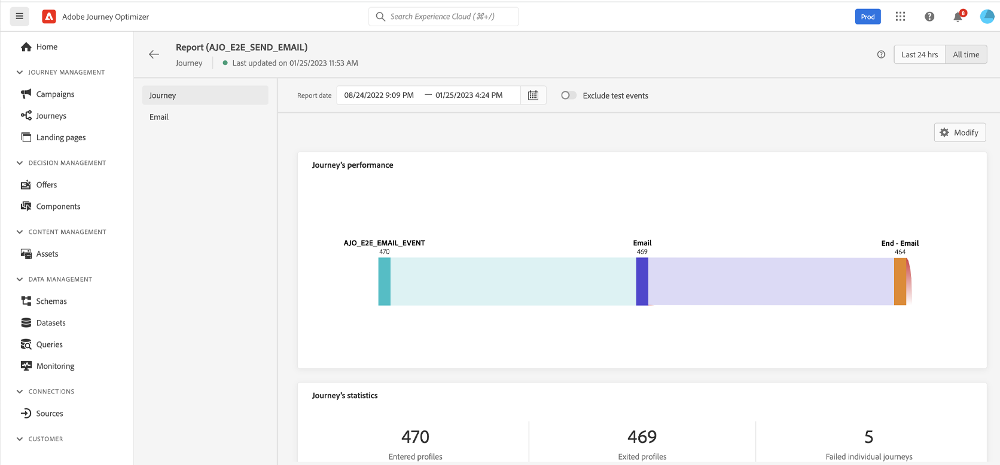

# Introduzione ai percorsi{#jo-quick-start}

## Prerequisiti{#start-prerequisites}

Per inviare messaggi con percorsi, sono necessarie le seguenti configurazioni:

1. **Configurare un evento**: se desideri attivare i percorsi in modo unitario quando viene ricevuto un evento, devi configurare un evento. Puoi definire le informazioni previste e come elaborarle. e viene eseguita da un **utente tecnico**. [Ulteriori informazioni](../event/about-events.md).

   

1. **Creare un segmento**: il tuo percorso può anche ascoltare i segmenti Adobe Experience Platform per inviare messaggi in batch a un set specifico di profili. A questo scopo, devi creare dei segmenti. [Ulteriori informazioni](../segment/about-segments.md).

   

1. **Configurare l’origine dati**: puoi definire una connessione a un sistema per recuperare informazioni aggiuntive che verranno utilizzate nei tuoi percorsi, ad esempio nelle tue condizioni. Al momento del provisioning, viene configurata anche un’origine dati integrata in Adobe Experience Platform. Se sfrutti solo i dati degli eventi del tuo percorso, questo passaggio non è necessario e viene eseguita da un **utente tecnico**. [Ulteriori informazioni](../datasource/about-data-sources.md)

   

1. **Configurare un’azione**: Se utilizzi un sistema di terze parti per l’invio dei messaggi, puoi creare un’azione personalizzata. Ulteriori informazioni [sezione](../action/action.md). e viene eseguita da un **utente tecnico**. Se utilizzi funzionalità di messaggistica integrate di Journey Optimizer, devi solo aggiungere un’azione canale al percorso e progettare i contenuti. Vedi [questa sezione](../messages/get-started-content.md).

   

## Crea il tuo percorso{#jo-build}

>[!CONTEXTUALHELP]
>id="ajo_journey_create"
>title="Crea il tuo percorso"
>abstract="In questa schermata viene visualizzato l’elenco dei percorsi esistenti. Apri un percorso o fai clic su &quot;Crea percorso&quot; e combina le diverse attività di evento, orchestrazione e azione per creare scenari multicanale con più passaggi."

Questo passaggio viene eseguito da **utente aziendale**. Qui è dove si creano i percorsi. Combina le diverse attività relative a un evento, un percorso e un’azione in modo da creare scenari tra canali con più passaggi.

Di seguito sono riportati i passaggi principali per l’invio di messaggi attraverso i percorsi:

1. Nella sezione del menu GESTIONE PERCORSO fare clic su **[!UICONTROL Journeys]**. Viene visualizzato l’elenco dei percorsi.

   

1. Fai clic su **[!UICONTROL Create Journey]** per creare un nuovo percorso.

1. Modifica le proprietà del percorso nel riquadro di configurazione visualizzato sul lato destro. Ulteriori informazioni [sezione](journey-gs.md#change-properties).

   

1. Inizia trascinando un evento o un **Leggi segmento** attività dalla palette all’area di lavoro. Per ulteriori informazioni sulla progettazione dei percorsi, consulta [questa sezione](using-the-journey-designer.md).

   

1. Trascina e rilascia i passaggi successivi che verranno seguiti dall’utente. Ad esempio, puoi aggiungere una condizione seguita da un’azione canale. Per ulteriori informazioni sulle attività, consulta [questa sezione](using-the-journey-designer.md).

1. Testa il percorso utilizzando i profili di test. Ulteriori informazioni [sezione](testing-the-journey.md)

1. Pubblica il percorso per attivarlo. Ulteriori informazioni [sezione](publishing-the-journey.md).

   

1. Monitora il percorso utilizzando gli strumenti di reporting dedicati per misurare l&#39;efficacia del percorso. Ulteriori informazioni [sezione](../reports/live-report.md).

   

## Definire le proprietà del percorso {#change-properties}

>[!CONTEXTUALHELP]
>id="ajo_journey_properties"
>title="Proprietà del percorso"
>abstract="Questa sezione mostra le proprietà del percorso. Per impostazione predefinita, i parametri di sola lettura sono nascosti. Le impostazioni disponibili dipendono dallo stato del percorso, dalle autorizzazioni e dalla configurazione del prodotto."

Fai clic sull’icona della matita, in alto a destra, per accedere alle proprietà del percorso.

Puoi modificare il nome del percorso, aggiungere una descrizione, consentire il rientro, scegliere le date di inizio e di fine e, come utente amministratore, definire una **[!UICONTROL Timeout and error]** durata. Se abilitato per la tua organizzazione, puoi anche attivare [messaggio burst](#burst).

Per i percorsi live, questa schermata mostra la data di pubblicazione e il nome dell’utente che ha pubblicato il percorso.

La **Copia dettagli tecnici** consente di copiare le informazioni tecniche sul percorso che il team di supporto può utilizzare per la risoluzione dei problemi. Vengono copiate le seguenti informazioni: JourneyVersion UID, OrgID, orgName, sandboxName, lastDeployedBy, lastDeployedAt.

### Ingresso{#entrance}

Per impostazione predefinita, i nuovi percorsi consentono il rientro. È possibile deselezionare l&#39;opzione per percorsi &quot;una ripresa&quot;, ad esempio se si desidera offrire un regalo una tantum quando una persona entra in un negozio. In tal caso, non vuoi che il cliente sia in grado di reinserire il percorso e ricevere nuovamente l&#39;offerta.

Quando un percorso &quot;termina&quot;, avrà lo stato **[!UICONTROL Closed]**. Il percorso smetterà di lasciare entrare nuovi individui nel percorso. Le persone già nel percorso finiranno normalmente il percorso.

Dopo il timeout globale predefinito di 30 giorni, il percorso passerà al **Completato** stato. Vedi questo [sezione](../building-journeys/journey-gs.md#global_timeout).

### Timeout ed errore nelle attività del percorso {#timeout_and_error}

Quando modifichi un’attività di azione o condizione, puoi definire un percorso alternativo in caso di errore o timeout. Se l’elaborazione dell’attività che esegue l’interrogazione a un sistema di terze parti supera la durata di timeout definita nelle proprietà del percorso (**[!UICONTROL Timeout and  error]** (campo ), verrà scelto il secondo percorso per eseguire una potenziale azione di fallback.

I valori autorizzati sono compresi tra 1 e 30 secondi.

È consigliabile definire un valore molto breve **[!UICONTROL Timeout and error]** se il percorso è sensibile all&#39;ora (ad esempio: reagire alla posizione in tempo reale di una persona) perché non è possibile ritardare l&#39;azione per più di pochi secondi. Se il percorso è meno sensibile al tempo, puoi utilizzare un valore più lungo per dare più tempo al sistema chiamato per inviare una risposta valida.

I percorsi utilizzano anche un timeout globale. Consulta la sezione [sezione successiva](#global_timeout).

### Timeout percorso globale {#global_timeout}

Oltre al [timeout](#timeout_and_error) utilizzato nelle attività di percorso, esiste anche un timeout di percorso globale che non viene visualizzato nell’interfaccia e non può essere modificato. Questo timeout interrompe il progresso dei singoli utenti nel percorso 30 giorni dopo l’accesso. Ciò significa che il percorso di un individuo non può durare più di 30 giorni. Dopo il periodo di timeout di 30 giorni, i dati del singolo utente vengono eliminati. Gli utenti che continuano a scorrere nel percorso alla fine del periodo di timeout verranno arrestati e verranno presi in considerazione come errori nel reporting.

>[!NOTE]
>
>I percorsi non reagiscono direttamente alle richieste di rinuncia, accesso o cancellazione della privacy. Tuttavia, il timeout globale assicura che gli individui non rimangano mai più di 30 giorni in un percorso.

A causa del timeout di 30 percorsi, quando non è consentito l’accesso al percorso, non possiamo assicurarci che il blocco del rientro funzioni per più di 30 giorni. Infatti, poiché rimuoviamo tutte le informazioni sulle persone che sono entrate nel percorso 30 giorni dopo il loro ingresso, non possiamo sapere che la persona è entrata in precedenza, più di 30 giorni fa.

### Fuso orario e fuso orario del profilo {#timezone}

Il fuso orario è definito a livello di percorso.

Puoi immettere un fuso orario fisso oppure utilizzare i profili Adobe Experience Platform per definire il fuso orario percorso.

Se un fuso orario è definito nel profilo Adobe Experience Platform, può essere recuperato nel percorso.

Per ulteriori informazioni sulla gestione del fuso orario, vedi [questa pagina](../building-journeys/timezone-management.md).

### Modalità Burst {#burst}

La modalità Burst è un componente aggiuntivo di Journey Optimizer che consente l&#39;invio rapido di messaggi push in grandi volumi. Viene utilizzato per percorsi semplici che includono **Leggi segmento** e un semplice messaggio push. Burst viene utilizzato quando il ritardo nella consegna dei messaggi è di importanza business, quando si desidera inviare un avviso push urgente sui telefoni cellulari, ad esempio una notizia di interruzione per gli utenti che hanno installato la tua app del canale di notizie.

La messaggistica Burst prevede i seguenti requisiti:

* Il percorso deve iniziare con un **Leggi segmento** attività. Eventi non consentiti.
* Il passaggio successivo deve essere un messaggio push. Nessun altro canale, attività o passaggio è consentito.
* Nel messaggio push non è consentita alcuna personalizzazione.
* Il messaggio deve essere piccolo (&lt;2 KB).

>[!CAUTION]
>
>Se uno dei requisiti non è soddisfatto, la modalità burst non sarà disponibile nel percorso.

Per attivare **Modalità Burst**, apri il percorso e fai clic sull’icona a forma di matita, in alto a destra, per accedere alle proprietà del percorso. Quindi, attiva il **Attiva modalità burst** alternare.

La modalità Burst viene disattivata automaticamente se modifichi un percorso burst e aggiungi un’attività non conforme ai messaggi burst, come un messaggio e-mail, qualsiasi altra azione, un evento e così via.

Quindi testa e pubblica il tuo percorso come di consueto. In modalità di test i messaggi non vengono inviati tramite la modalità burst.

In questo video puoi comprendere i casi d’uso applicabili ai messaggi burst e come configurare un percorso per i messaggi burst:

>[!VIDEO](https://video.tv.adobe.com/v/334523?quality=12)
