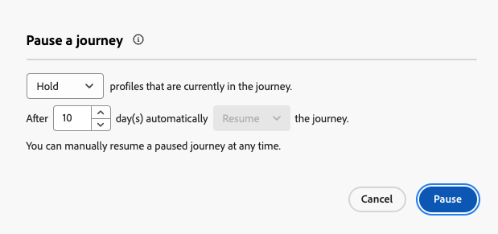

# Mettere in pausa un percorso {#journey-pause}

>[!CONTEXTUALHELP]
>id="ajo_journey_pause"
>title="Mettere in pausa il percorso"
>abstract="Metti in pausa un percorso live per impedire l’ingresso di nuovi profili. Scegli se eliminare i profili attualmente nel percorso o mantenerli dove sono. Se vengono mantenuti, una volta riavviato il percorso la sua esecuzione riprenderà dall’attività dell’azione successiva. Ideale per aggiornamenti o interruzioni di emergenza, senza perdere l’avanzamento."

Puoi mettere in pausa i percorsi live, apportare tutte le modifiche necessarie e riprenderli in qualsiasi momento.<!--You can choose whether the journey is resumed at the end of the pause period, or whether it stops completely. --> Durante la pausa, puoi [applicare i criteri di uscita dell&#39;attributo del profilo](#journey-exit-criteria) per escludere i profili in base ai loro attributi. Il percorso viene ripreso automaticamente al termine del periodo di pausa. Puoi anche [riprenderla manualmente](#journey-resume-steps).

## Vantaggi chiave {#journey-pause-benefits}

I percorsi di pausa e ripresa offrono ai professionisti del percorso maggiore controllo e flessibilità, consentendo la sospensione temporanea dei percorsi live senza interrompere l’esperienza del cliente. Quando il percorso è in pausa, le comunicazioni non vengono inviate e i profili rimangono in stato di sospensione fino a quando il percorso non viene ripreso.

Questa funzionalità riduce i rischi di invio di messaggi non desiderati durante errori o aggiornamenti (ad esempio, modifiche al contenuto dei messaggi), supporta una gestione più sicura del percorso e aumenta la fiducia degli utenti. La visibilità nei percorsi in pausa e il loro stato direttamente nell’interfaccia utente migliorano ulteriormente la trasparenza e l’agilità operativa.

>[!CAUTION]
>
>* Le autorizzazioni per la sospensione e la ripresa dei percorsi sono limitate agli utenti con l&#39;autorizzazione di alto livello **[!DNL Publish journeys]**. Ulteriori informazioni sulla gestione dei diritti di accesso degli utenti [!DNL Journey Optimizer] in [questa sezione](../administration/permissions-overview.md).
>
>* Prima di iniziare a utilizzare la funzionalità di pausa/ripresa, [leggi i guardrail e le limitazioni](#journey-pause-guardrails).


## Come sospendere un percorso {#journey-pause-steps}

Puoi sospendere qualsiasi **Live** percorso.

Per mettere in pausa il percorso, effettuare le seguenti operazioni:

1. Aprire il percorso che si desidera sospendere.
1. Fai clic sul pulsante **...More** nella sezione superiore destra dell&#39;area di lavoro del percorso e seleziona **Pause**.

   

1. Seleziona la modalità di gestione dei profili attualmente presenti nel percorso.

   {width="50%" align="left"}

   Puoi eseguire le seguenti operazioni:

   * **Blocca** profili - I profili attenderanno sul prossimo nodo **Azione** la ripresa del percorso
   * **Ignora** profili - I profili verranno esclusi dal percorso nel prossimo nodo **Azione**

   Quando si mette in pausa un percorso, si presume che si intenda riprenderlo a un certo punto. Tuttavia, un percorso non può rimanere sospeso a tempo indeterminato. Per evitare questo problema, puoi definire per quanto tempo il percorso deve rimanere in pausa (tra 1 e 14 giorni). Dopo il numero di giorni selezionato, il percorso riprende automaticamente.

1. Fai clic sul pulsante **Pausa** per confermare.

Il numero massimo di profili che possono essere mantenuti nei percorsi in pausa per la tua organizzazione è visibile nell’inventario dei percorsi. È visibile solo quando almeno un percorso viene messo in pausa. Questo indicatore mostra anche il numero totale di percorsi in pausa. Viene aggiornato ogni 30 minuti. Ulteriori informazioni in [Guardrail e limitazioni](#guardrails-and-limitations).

{width="50%" align="left"}

Dall&#39;elenco dei percorsi, puoi sospendere uno o più **Live** percorsi. Per mettere in pausa un gruppo di percorsi (_pausa collettiva_), selezionali nell&#39;elenco e fai clic sul pulsante **Pausa** nella barra blu nella parte inferiore della schermata. Il pulsante **Pausa** è disponibile solo quando sono selezionati **percorsi di disponibilità**.


## Logica di esecuzione dei percorsi in pausa {#journey-pause-exec}

Quando un percorso viene messo in pausa, gli ingressi nuovi vengono sempre scartati, indipendentemente dalla modalità Hold / Discard.

Quando un percorso viene messo in pausa, la gestione del profilo e l’esecuzione dell’attività dipendono dall’attività. I comportamenti sono descritti di seguito. Per una comprensione completa, vedi anche questo [Fine del campione](#journey-pause-sample).


| Attività percorso | Quando il percorso è in pausa |
|-------------------------|--------------------------------------------------|
| [Qualificazione del pubblico](audience-qualification-events.md) | <ul> <li>Nel primo nodo dell’area di lavoro: qualsiasi qualifica di profilo per il pubblico viene eliminata </li><li>In altri nodi: comportamento identico a quello di un percorso live. Tuttavia, se la qualifica del pubblico è dopo un&#39;attività <strong>Azione</strong> e l&#39;utente viene messo in pausa su tale azione, la qualifica del pubblico viene scartata. </li></ul> |
| [Evento unitario](general-events.md) | <ul> <li>Nel primo nodo dell’area di lavoro: l’evento viene eliminato</li><li>In altri nodi: comportamento identico a quello di un percorso live. Tuttavia, se l&#39;evento è successivo a un&#39;attività <strong>Action</strong> e l&#39;utente viene messo in pausa per tale azione, l&#39;evento viene ignorato. </li></ul> |
| [Read Audience](read-audience.md) | Stesso comportamento di un percorso live, con alcune specificità: <ol> <li> Se <strong>Pausa</strong> è stato premuto dopo l&#39;avvio dell&#39;attività <strong>Read audience</strong>, i profili che sono entrati nel percorso continueranno (fino alla successiva attività <strong>Azione</strong>). Poiché il percorso legge i tipi di pubblico a una certa velocità, se il pubblico completo non è ancora entrato, i profili rimanenti nella coda verranno scartati.</li><li> Per esecuzioni singole: non verrà visualizzato alcun errore all’ora di ripresa se la data pianificata era precedente alla data di ripresa. Tale pianificazione verrebbe ignorata.</li><li>Per percorsi incrementali: <ul><li>Se la pausa si verifica prima della prima occorrenza, al momento della ripresa verrà riprodotto il pubblico completo. </li><li>Se si verifica una pausa, ad esempio il 4° giorno di una ricorrenza giornaliera e il percorso rimane in pausa fino al 9° giorno, allora al momento della ripresa tutti i profili che sono entrati dal 4° al 9° saranno inclusi  </li></ul></ol> |
| [Reazione](reaction-events.md) | Stesso comportamento di un percorso live. Tuttavia, se la reazione è dopo un&#39;attività <strong>Azione</strong> e l&#39;utente è in pausa per tale azione, l&#39;evento di reazione viene ignorato. |
| [Attendi](wait-activity.md) | Stesso comportamento di un percorso live |
| [Condizione](condition-activity.md) | Stesso comportamento di un percorso live |
| [Decisione contenuto](content-decision.md) | I profili vengono parcheggiati o eliminati in base alla scelta effettuata dall&#39;utente quando il percorso viene messo in pausa |
| [Azione canale](journeys-message.md) | I profili vengono parcheggiati o eliminati in base alla scelta effettuata dall&#39;utente quando il percorso viene messo in pausa |
| [Azione personalizzata](../action/action.md) | I profili vengono parcheggiati o eliminati in base alla scelta effettuata dall&#39;utente quando il percorso viene messo in pausa |
| [Aggiorna profilo](update-profiles.md) e [Salta](jump.md) | I profili vengono parcheggiati o eliminati in base alla scelta effettuata dall&#39;utente quando il percorso viene messo in pausa |
| [Source dati esterno](../datasource/external-data-sources.md) | Stesso comportamento di un percorso live |
| [Criteri di uscita](journey-properties.md#exit-criteria) | Stesso comportamento di un percorso live |


Scopri come risolvere i problemi di eliminazione in [questa sezione](#discards-troubleshoot).

## Come riprendere un percorso in pausa {#journey-resume-steps}

>[!CONTEXTUALHELP]
>id="ajo_journey_resume"
>title="Riprendere il percorso"
>abstract="Riprendi un percorso in pausa per consentire ai nuovi profili di effettuare nuovamente l’ingresso. Se alcuni profili erano in attesa durante la pausa, questi continueranno il proprio percorso. Ideale per un riavvio sicuro dei percorsi dopo aggiornamenti o pause."

I percorsi in pausa vengono ripresi automaticamente al termine del periodo massimo di pausa di 14 giorni. Possono essere ripresi manualmente in qualsiasi momento. La ripresa di un percorso in pausa consente ai nuovi profili di accedere nuovamente. Se alcuni profili erano in attesa durante la pausa, questi continueranno il proprio percorso. Ideale per un riavvio sicuro dei percorsi dopo aggiornamenti o pause.

Per riprendere un percorso in pausa e ricominciare ad ascoltare gli eventi di percorso, effettuare le seguenti operazioni:

1. Aprire il percorso che si desidera riprendere.
1. Selezionare il pulsante **...More** nella sezione superiore destra dell&#39;area di lavoro del percorso, quindi **Riprendi**.

   Il percorso passa allo stato **Ripresa**. Quando il percorso riprende, i nuovi ingressi iniziano entro un minuto. La ripresa dei profili conservati può richiedere un po’ di tempo; i profili vengono ripresi a una velocità di 5k tps.  Poiché è necessario riprendere tutti i profili affinché il percorso sia di nuovo **Live**, la transizione dallo stato **Ripresa** allo stato **Live** può richiedere un po&#39; di tempo.

1. Fai clic sul pulsante **Riprendi** per confermare.


Dall&#39;elenco dei percorsi, puoi riprendere uno o più **percorsi in pausa**. Per riprendere un gruppo di percorsi (_Riprendi in blocco_), selezionali e fai clic sul pulsante **Riprendi** nella barra blu nella parte inferiore della schermata. Il pulsante **Riprendi** sarà disponibile solo quando sono selezionati **percorsi in pausa**.


## Applicare un criterio di uscita in un percorso in pausa {#journey-exit-criteria}

Quando un percorso viene messo in pausa, puoi applicare un criterio di uscita in base agli attributi del profilo. Questo filtro abilita l’esclusione dei profili che corrispondono all’espressione definita al momento della ripresa. Una volta impostati i criteri di uscita basati sull’attributo del profilo, questo verrà applicato ai nodi di azione, anche per l’ingresso di nuovi profili. I profili esistenti che corrispondono ai criteri e i nuovi profili che entrano nel percorso verranno esclusi dal percorso **nel nodo azione successivo** incontrato.

Ad esempio, per escludere tutti i clienti francesi da un percorso in pausa, effettua le seguenti operazioni:

1. Individuare il percorso in pausa che si desidera modificare.

1. Seleziona l&#39;icona **Criteri di uscita**.

   

1. Nelle impostazioni **Criteri di uscita**, fare clic su **Aggiungi criteri di uscita** per definire un filtro basato sugli attributi del profilo.

1. Imposta l’espressione per escludere i profili in cui l’attributo paese è uguale a Francia.

   

1. Salva il filtro e fai clic sul pulsante **Aggiorna percorso** per applicare le modifiche.

1. [Riprendi il percorso](#journey-resume-steps).

   Al momento della ripresa, tutti i profili con l’attributo country impostato su France verranno automaticamente esclusi dal percorso nel nodo dell’azione successivo. Anche eventuali nuovi profili con l’attributo country impostato sulla Francia che tentano di entrare nel percorso vengono bloccati nel nodo dell’azione successivo.

Tieni presente che le esclusioni di profilo per i profili attualmente nel percorso e per i nuovi profili si verificheranno solo **quando raggiungeranno un nodo di azione**.

>[!CAUTION]
>
>* È possibile impostare solo **un** criterio di uscita basato su attributo profilo al percorso.
>
>* Puoi creare, aggiornare o eliminare un criterio di uscita basato su un attributo di profilo solo tra **percorsi in pausa**.
>
>* Ulteriori informazioni sui criteri di uscita [ basati sull&#39;attributo di profilo in questa sezione](journey-properties.md#profile-exit-criteria).

## Guardrail e limitazioni {#journey-pause-guardrails}

* Una versione di percorso può essere sospesa per un massimo di **14 giorni**, con un massimo di **10 milioni di profili** consentiti nei percorsi in pausa in tutta l&#39;organizzazione.
Questo limite viene controllato ogni 30 minuti. Ciò significa che potresti temporaneamente superare la soglia di 10 milioni, ma una volta rilevata dal sistema, eventuali profili aggiuntivi verranno automaticamente eliminati.

  Se riprendi i percorsi per riportare il numero di profili bloccati al di sotto del limite, il percorso riprende immediatamente, ma l’aggiornamento del conteggio dei profili può richiedere fino a 30 minuti. Durante tale periodo, il sistema può ancora considerare tali profili come in pausa.

* Per i percorsi che includono [attività in entrata](../channels/gs-channels.md#inbound-channels) (ad esempio in-app, web, ecc.), la sospensione del percorso non interrompe le comunicazioni già attivate. Se un profilo è qualificato per un’attività in entrata prima della pausa, il messaggio corrispondente verrà comunque consegnato. Per interrompere completamente tutte le comunicazioni in entrata, è necessario arrestare il percorso.
* I percorsi in pausa vengono conteggiati ai fini della quota di percorsi vivi
* I profili che sono entrati nel percorso ma sono stati scartati durante la pausa vengono comunque conteggiati come profili coinvolgibili
* I percorsi in pausa vengono considerati in tutte le regole aziendali, come se fossero live
* Il timeout globale del percorso si applica ancora ai percorsi in pausa. Ad esempio, se un profilo è rimasto in un percorso per 90 giorni e il percorso è in pausa, questo profilo uscirà comunque dal percorso il 91° giorno
* I profili sono **scartati** in un percorso in pausa quando raggiungono un&#39;attività di azione. Se rimangono in attesa durante il periodo di pausa e di uscita di un percorso dopo che è stato ripreso, continueranno il percorso e non verranno eliminati. [Vedi l&#39;esempio end-to-end](#journey-pause-sample)
* Anche dopo la pausa, man mano che gli eventi continuano a essere elaborati, questi eventi verrebbero conteggiati nella quota relativa al numero di eventi di Percorso al secondo, dopo di che la limitazione verrà visualizzata per l’evento unitario
* Quando i profili rimangono in un percorso in pausa, al momento della ripresa gli attributi del profilo vengono aggiornati
* Le condizioni vengono ancora eseguite nei percorsi in pausa, quindi se un percorso è stato sospeso a causa di problemi di qualità dei dati, qualsiasi condizione precedente a un nodo di azione può essere valutata con dati errati
* Per i **percorsi di lettura del pubblico** basati su pubblico incrementale, viene presa in considerazione la durata della pausa. Questo non è il caso dei percorsi basati su eventi o di qualificazione del pubblico (se durante una pausa vengono ricevuti una qualificazione del pubblico o un evento e rappresentano la prima attività del percorso, tali eventi vengono scartati)
* Se i profili vengono mantenuti in un percorso e questo percorso riprende automaticamente dopo alcuni giorni, i profili continuano il percorso e non vengono eliminati. Se vuoi rilasciarle, devi fermare il percorso
* Nei percorsi in pausa, gli avvisi non vengono attivati per [avvisi sui segmenti batch](../reports/alerts.md#alert-read-audiences)
* Non sono presenti registri di controllo nel percorso quando dopo 14 giorni lo stato di pausa viene terminato
* Alcuni profili eliminati possono essere visibili nell’evento del passaggio del Percorso, ma non nel reporting. Ad esempio:
   * Ignora eventi business per **Read Audience**
   * **Leggi pubblico** processi eliminati a causa di percorso in pausa
   * Eventi ignorati quando l&#39;attività **Event** era dopo un&#39;azione in cui il profilo era in attesa


## Esempio end-to-end {#journey-pause-sample}

Prendiamo ad esempio il percorso seguente:

{zoomable="yes"}

Quando si mette in pausa questo percorso, si seleziona se i profili sono **scartati** o **bloccati**, quindi la gestione dei profili è la seguente:

1. **Attività AddToCart**: tutte le nuove entrate dei profili sono bloccate. Se un profilo è già entrato nel percorso prima di una pausa, continua fino al nodo dell’azione successivo.
1. Attività **Wait**: i profili continuano ad attendere normalmente sul nodo e lo chiudono, anche se il percorso è in pausa.
1. **Condizione**: i profili continuano a superare le condizioni e passano al ramo destro, in base all&#39;espressione definita nella condizione.
1. **Attività push**/**E-mail**: durante un percorso in pausa, i profili iniziano ad attendere o vengono scartati (in base alla scelta effettuata dall&#39;utente al momento della pausa) sul nodo dell&#39;azione successivo. Quindi i profili inizieranno ad attendere o verranno eliminati lì.
1. **Eventi** dopo **Azione** nodi: se un profilo è in attesa su un nodo **Azione** e dopo di esso è presente un&#39;attività **Evento**, se l&#39;evento viene attivato, l&#39;evento viene ignorato.

In base a questo comportamento, puoi vedere i numeri dei profili aumentare nel percorso in pausa, per lo più nelle attività precedenti alle attività **Azione**. Ad esempio, in questo esempio, l&#39;attività **Wait** è ancora abilitata, aumentando il numero di profili che passano attraverso l&#39;attività **Condition**, quando vengono chiusi.

Quando riprendi questo percorso:

1. Gli ingressi dei percorsi freschi iniziano entro un minuto.
1. I profili attualmente in attesa nel percorso per le attività **Azione** vengono ripresi a una velocità di 5k tps. Potranno quindi immettere l&#39;**Azione** che stavano aspettando e continuare il percorso.

## Risoluzione dei problemi di eliminazione dei profili nei percorsi in pausa {#discards-troubleshoot}

È possibile utilizzare [Adobe Experience Platform Query Service](https://experienceleague.adobe.com/docs/experience-platform/query/api/getting-started.html){target="_blank"} per eseguire query sugli eventi dei passaggi, che possono fornire ulteriori informazioni sugli scarti di profilo, a seconda di quando si sono verificati.

* Per gli scarti che si verificano prima che il profilo entri nel percorso, utilizza il seguente codice:

  ```sql
  SELECT
  TIMESTAMP,
  _experience.journeyOrchestration.profile.ID,
  to_json(_experience.journeyOrchestration)
  FROM
  journey_step_events
  WHERE
  _experience.journeyOrchestration.serviceEvents.dispatcher.eventType = 'PAUSED_JOURNEY_VERSION'
  AND _experience.journeyOrchestration.journey.versionID=<jvId>  
  ```

  In questo elenco verranno elencati i rigetti che si sono verificati al punto di ingresso del percorso:

   1. Quando un percorso di pubblico è in esecuzione e il primo nodo è ancora in elaborazione, se il percorso è in pausa, tutti i profili non elaborati vengono scartati.

   1. Quando arriva un nuovo evento unitario per il nodo iniziale (per attivare un ingresso) mentre il percorso viene messo in pausa, l’evento viene scartato.

* Per gli scarti che si verificano quando il profilo è già nel percorso, utilizza il seguente codice:

  ```sql
  SELECT
  TIMESTAMP,
  _experience.journeyOrchestration.profile.ID,
  to_json(_experience.journeyOrchestration)
  FROM
  journey_step_events
  WHERE
  _experience.journeyOrchestration.serviceEvents.stateMachine.eventType = 'JOURNEY_IN_PAUSED_STATE'
  AND _experience.journeyOrchestration.journey.versionID=<jvId> 
  ```

  Questo comando elenca gli scarti che si sono verificati quando i profili si trovano in un percorso:

   1. Se il percorso viene messo in pausa con l’opzione Elimina abilitata e un profilo è già stato inserito prima della pausa, tale profilo verrà eliminato quando raggiunge il nodo dell’azione successivo.

   1. Se il percorso è stato messo in pausa con l’opzione di sospensione selezionata ma i profili sono stati scartati a causa del superamento della quota di 10 milioni, tali profili verranno comunque scartati quando raggiungeranno il nodo di azione successivo.


