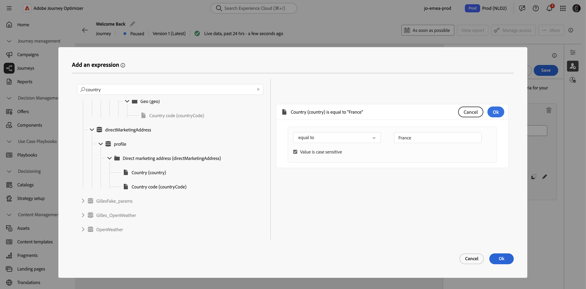

# Sospendi un percorso {#journey-pause}

>[!CONTEXTUALHELP]
>id="ajo_journey_pause"
>title="Metti in pausa il percorso"
>abstract="Sospendi un percorso live per impedire l’accesso di nuovi profili. Scegli se eliminare i profili attualmente nel percorso o mantenerli in posizione. Se vengono mantenuti, riprenderanno l’esecuzione all’attività di azione successiva una volta riavviato il percorso. Ideale per aggiornamenti o arresti di emergenza senza perdere l’avanzamento."

Puoi mettere in pausa i percorsi live, apportare tutte le modifiche necessarie e riprenderli in qualsiasi momento.<!--You can choose whether the journey is resumed at the end of the pause period, or whether it stops completely. --> Durante la pausa, puoi [applicare filtri globali](#journey-global-filters) per escludere profili in base ai loro attributi. Il percorso viene ripreso automaticamente al termine del periodo di pausa. Puoi anche [riprenderla manualmente](#journey-resume-steps).

>[!AVAILABILITY]
>
>Questa funzionalità è disponibile solo per un set di organizzazioni (disponibilità limitata) e verrà implementata a livello globale in una versione futura.

## Vantaggi chiave {#journey-pause-benefits}

I percorsi di pausa e ripresa offrono ai professionisti del percorso maggiore controllo e flessibilità, consentendo la sospensione temporanea dei percorsi live senza interrompere l’esperienza del cliente. Quando è in pausa, non vengono inviate comunicazioni e i profili rimangono in stato di sospensione fino alla ripresa del percorso.

Questa funzionalità riduce i rischi di invio di messaggi non desiderati durante errori o aggiornamenti (ad esempio, modifiche al contenuto dei messaggi), supporta una gestione più sicura del percorso e aumenta la fiducia degli utenti. La visibilità nei percorsi in pausa e il loro stato direttamente nell’interfaccia utente migliorano ulteriormente la trasparenza e l’agilità operativa.

>[!CAUTION]
>
>* Le autorizzazioni per la sospensione e la ripresa dei percorsi sono limitate agli utenti con l&#39;autorizzazione di alto livello **[!DNL Publish journeys]**. Ulteriori informazioni sulla gestione dei diritti di accesso degli utenti [!DNL Journey Optimizer] in [questa sezione](../administration/permissions-overview.md).
>
>* Prima di iniziare a utilizzare la funzionalità di pausa/ripresa, [leggere i guardrail e le limitazioni](#journey-pause-guardrails).

## Come sospendere un percorso {#journey-pause-steps}

Puoi sospendere qualsiasi **Live** percorso.

Per mettere in pausa il percorso, effettuare le seguenti operazioni:

1. Aprire il percorso che si desidera sospendere.
1. Fai clic sul pulsante **...More** nella sezione superiore destra dell&#39;area di lavoro del percorso e seleziona **Pause**.

   {width="80%" align="left"}

1. Seleziona la modalità di gestione dei profili attualmente presenti nel percorso.

   {width="50%" align="left"}

   Puoi eseguire le seguenti operazioni:

   * **Blocca** profili - I profili attenderanno la ripresa del percorso
   * **Ignora** profili - I profili verranno esclusi dal percorso nel nodo azione successivo

1. Fai clic sul pulsante **Pausa** per confermare.

Dall&#39;elenco dei percorsi, puoi sospendere uno o più **Live** percorsi. Per mettere in pausa un gruppo di percorsi (_pausa collettiva_), selezionali nell&#39;elenco e fai clic sul pulsante **Pausa** nella barra blu nella parte inferiore della schermata. Il pulsante **Pausa** è disponibile solo quando sono selezionati **percorsi di disponibilità**.

### Comportamento nei percorsi in pausa

Quando un percorso viene messo in pausa, gli ingressi nuovi vengono sempre scartati, indipendentemente dalla modalità Hold / Discard.

La gestione dei profili quando un percorso viene messo in pausa dipende dall’attività. I comportamenti sono descritti di seguito. Per una comprensione completa, vedi anche questo [Fine del campione](#journey-pause-sample).

| Attività percorso | Gestione dei profili |
|-------------------------|--------------------------------------------------|
| [Qualificazione del pubblico](audience-qualification-events.md) | Nel primo nodo: scartato   In altri nodi: comportamento identico a quello di un percorso live. Tuttavia, se la qualifica del pubblico è dopo un&#39;attività di azione e l&#39;utente viene messo in pausa su tale azione, la qualifica del pubblico viene scartata. |
| [Evento unitario](general-events.md) | Nel primo nodo: scartato  In altri nodi: comportamento identico a quello di un percorso live. Tuttavia, se l&#39;evento è successivo a un&#39;attività di azione e l&#39;utente viene messo in pausa su tale azione, l&#39;evento viene scartato. |
| [Read Audience](read-audience.md) | Stesso comportamento di un percorso live, con alcune specificità: 1.  Se <strong>Pausa</strong> è stato premuto dopo l&#39;avvio dell&#39;attività <strong>Read audience</strong>, i profili che sono entrati nel percorso continueranno (fino alla successiva attività <strong>Azione</strong>). Poiché il percorso legge i tipi di pubblico a una certa velocità, se il pubblico completo non è ancora entrato, i profili rimanenti nella coda verranno scartati.    2. Per esecuzioni singole: non viene visualizzato alcun errore all’ora di ripresa se la data pianificata era precedente alla data di ripresa. Tale pianificazione verrebbe ignorata.  3. Per percorsi incrementali:  - Se la pausa si verifica prima della prima occorrenza, al momento della ripresa verrà riprodotto il pubblico completo.  - Se si verifica una pausa, ad esempio, il 4° giorno di una ricorrenza giornaliera e il percorso rimane in pausa fino al 9° giorno, allora al momento della ripresa tutti i profili che sono entrati dal 4° al 9° saranno inclusi |
| [Reazione](reaction-events.md) | Stesso comportamento di un percorso live. Tuttavia, se la reazione si verifica dopo un’attività di azione e l’utente viene messo in pausa su tale azione, l’evento viene scartato. |
| [Attendi](wait-activity.md) | Stesso comportamento di un percorso live |
| [Condizione](condition-activity.md) | Stesso comportamento di un percorso live |
| Decisione contenuto | I profili vengono parcheggiati o eliminati in base alla scelta effettuata dall&#39;utente quando il percorso viene messo in pausa |
| [Azione canale](journeys-message.md) | I profili vengono parcheggiati o eliminati in base alla scelta effettuata dall&#39;utente quando il percorso viene messo in pausa |
| [Azione personalizzata](../action/action.md) | I profili vengono parcheggiati o eliminati in base alla scelta effettuata dall&#39;utente quando il percorso viene messo in pausa |
| [Aggiorna profilo](update-profiles.md) e [Salta](jump.md) | Stesso comportamento di un percorso live |
| [Source dati esterno](../datasource/external-data-sources.md) | Stesso comportamento di un percorso live |
| [Criteri di uscita](journey-properties.md#exit-criteria) | Stesso comportamento di un percorso live |

## Come riprendere un percorso in pausa {#journey-resume-steps}

>[!CONTEXTUALHELP]
>id="ajo_journey_resume"
>title="Riprendi il percorso"
>abstract="Riprendi un percorso in pausa per consentire ai nuovi profili di accedere nuovamente. Se i profili erano in attesa durante la pausa, continueranno il loro percorso. Ideale per il riavvio sicuro dei percorsi dopo aggiornamenti o pause."

I percorsi in pausa vengono ripresi automaticamente al termine del periodo massimo di pausa di 14 giorni. Possono essere ripresi manualmente in qualsiasi momento. La ripresa di un percorso in pausa consente ai nuovi profili di accedere nuovamente. Se i profili erano in attesa durante la pausa, continueranno il loro percorso. Ideale per il riavvio sicuro dei percorsi dopo aggiornamenti o pause.

Per riprendere un percorso in pausa e ricominciare ad ascoltare gli eventi di percorso, effettuare le seguenti operazioni:

1. Aprire il percorso che si desidera riprendere.
1. Fai clic sul pulsante **...More** nella sezione superiore destra dell&#39;area di lavoro del percorso e seleziona **Riprendi**.

   Il percorso passa allo stato **Ripresa**. Quando il percorso riprende, i nuovi ingressi iniziano entro un minuto. La ripresa dei profili conservati può richiedere un po’ di tempo.  Poiché è necessario riprendere tutti i profili affinché il percorso sia di nuovo **Live**, la transizione dallo stato **Ripresa** allo stato **Live** può richiedere un po&#39; di tempo.

1. Fai clic sul pulsante **Riprendi** per confermare.

Dall&#39;elenco dei percorsi, puoi riprendere uno o più **percorsi in pausa**. Per riprendere un gruppo di percorsi (_Riprendi in blocco_), selezionali e fai clic sul pulsante **Riprendi** nella barra blu nella parte inferiore della schermata. Il pulsante **Riprendi** sarà disponibile solo quando sono selezionati **percorsi in pausa**.

## Applicare un filtro globale ai profili in un percorso in pausa  {#journey-global-filters}

Quando un percorso viene messo in pausa, puoi applicare un filtro globale basato sugli attributi del profilo. Questo filtro abilita l’esclusione dei profili che corrispondono all’espressione definita al momento della ripresa. Una volta impostato, il filtro globale viene applicato ai nodi di azione, anche per l’ingresso di nuovi profili. I profili corrispondenti ai criteri e i nuovi profili che tenteranno di immettere verranno esclusi dal percorso **nel nodo azione successivo** rilevato.

Ad esempio, per escludere tutti i clienti francesi da un percorso in pausa, effettua le seguenti operazioni:

1. Individuare il percorso in pausa che si desidera modificare.

1. Fai clic sull&#39;icona **Criteri di uscita e filtro globale**.

   {width="50%" align="left"}

1. Nelle impostazioni **Criteri di uscita e filtro globale**, fai clic su **Aggiungi filtro globale** per definire un filtro basato sugli attributi del profilo.

1. Imposta l’espressione per escludere i profili in cui l’attributo paese è uguale a Francia.

   {width="50%" align="left"}

1. Salva il filtro e fai clic sul pulsante **Aggiorna percorso** per applicare le modifiche.

1. [Riprendi il percorso](#journey-resume-steps).

   Al momento della ripresa, tutti i profili con l’attributo country impostato su France verranno automaticamente esclusi dal percorso nel nodo dell’azione successivo. Tutti i nuovi profili con l’attributo country impostato sulla Francia che tentano di accedere al percorso vengono bloccati nel nodo dell’azione successivo.

Tieni presente che le esclusioni di profilo per i profili attualmente nel percorso e per i nuovi profili si verificheranno solo quando raggiungeranno un nodo di azione.

>[!CAUTION]
>
>* È possibile impostare solo **un** filtro globale al percorso.
>
>* Puoi creare, aggiornare o eliminare un filtro globale solo tra **percorsi in pausa**.

## Guardrail e limitazioni {#journey-pause-guardrails}

* Una versione di percorso può essere sospesa per un massimo di 14 giorni.
* I percorsi in pausa vengono considerati in tutte le regole aziendali, come se fossero in diretta.
* I profili vengono &quot;scartati&quot; in un percorso in pausa quando raggiungono un’attività di azione. Se rimangono in attesa durante il periodo di pausa e di uscita di un percorso dopo che è stato ripreso, continueranno il percorso e non verranno eliminati.
* Anche dopo la pausa, man mano che gli eventi continuano a essere elaborati, questi eventi verrebbero conteggiati nella quota relativa al numero di eventi di Percorso al secondo, dopo di che la limitazione viene visualizzata per l’impostazione unitaria.
* I profili che sono entrati nel percorso ma sono stati scartati durante la pausa vengono comunque conteggiati come profili coinvolgibili.
* Quando i profili rimangono in un percorso in pausa, al momento della ripresa gli attributi del profilo vengono aggiornati
* Le condizioni vengono comunque eseguite nei percorsi in pausa, quindi se un percorso è stato sospeso a causa di problemi di qualità dei dati, qualsiasi condizione precedente a un nodo di azione può essere valutata con dati errati.
* Per il percorso di pubblico di lettura incrementale basato sul pubblico, viene presa in considerazione la durata di pausa. Ad esempio, per un percorso giornaliero, se è stato messo in pausa il 2 e ripreso il 5 del mese, l’esecuzione il 6 prenderà tutti i profili qualificati dal 1° al 6. Questo non avviene per la qualificazione del pubblico o i percorsi basati su eventi (se una qualificazione del pubblico o un evento vengono ricevuti durante una pausa, tali eventi vengono scartati).
* I percorsi in pausa vengono conteggiati ai fini della quota di percorsi vivi.
* Il timeout globale del percorso si applica ancora ai percorsi in pausa. Ad esempio, se un profilo è rimasto in un percorso per 90 giorni e il percorso è in pausa, questo profilo uscirà comunque dal percorso il 91° giorno.
* Se i profili vengono mantenuti in un percorso e questo percorso riprende automaticamente dopo alcuni giorni, i profili continuano il percorso e non vengono eliminati. Se vuoi farli cadere, devi fermare il percorso.
* Nei percorsi in pausa, gli avvisi non vengono attivati per gli avvisi sui segmenti batch.
* Non sono presenti registri di controllo nel percorso quando dopo 14 giorni lo stato di pausa viene terminato.
* Alcuni profili eliminati possono essere visibili nell’evento del passaggio del Percorso, ma non nel reporting. Ad esempio: Ignora gli eventi di business per Read Audience, i processi Read Audience vengono eliminati a causa della sospensione del percorso, gli eventi scartati quando l’attività dell’evento era dopo un’azione in cui il profilo era in attesa.
  <!--* There is a guardrail (at an org level) on the max number of profiles that can be held in paused journeys. This guardrail is per org, and is visible in the journey inventory on a new bar (only visible when there are paused journeys).-->

## Campione end-to-end {#journey-pause-sample}

Prendiamo ad esempio il percorso seguente:

{width="50%" align="left"}

Quando si mette in pausa questo percorso, si seleziona se i profili sono **scartati** o **bloccati** e quindi la gestione dei profili è la seguente:

1. **Attività AddToCart**: tutte le nuove entrate dei profili sono bloccate. Se un profilo è già entrato nel percorso prima di una pausa, continuerà fino al nodo dell’azione successivo.
1. Attività **Wait**: i profili continuano ad attendere normalmente sul nodo e lo chiudono, anche se il percorso è in pausa.
1. **Condizione**: i profili continuano a superare le condizioni e passano al ramo destro, in base all&#39;espressione definita nella condizione.
1. **Attività push**/**E-mail**: durante un percorso in pausa, i profili iniziano ad attendere o vengono scartati (in base alla scelta effettuata dall&#39;utente al momento della pausa) sul nodo dell&#39;azione successivo. Quindi i profili inizieranno ad attendere o verranno eliminati lì.
1. **Eventi** dopo i nodi di azione: se un profilo è in attesa su un nodo di azione ed è presente un evento dopo di esso, se tale evento viene attivato, il profilo verrà eliminato.

In base a questo comportamento, puoi vedere i numeri dei profili aumentare sul percorso in pausa, per lo più nelle attività precedenti alle azioni. Ad esempio, in tale esempio, Wait viene ignorato, aumentando il numero di profili che passano attraverso l’attività Condition.

Quando riprendi questo percorso:

1. Gli ingressi dei percorsi freschi iniziano entro un minuto
1. I profili attualmente in attesa nel percorso sulle attività di Azione vengono ripresi a una velocità di 5.000 punti base. Entreranno quindi nell&#39;Azione che stavano aspettando e continueranno il percorso.
