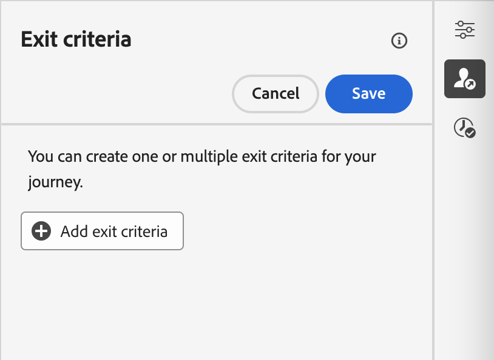
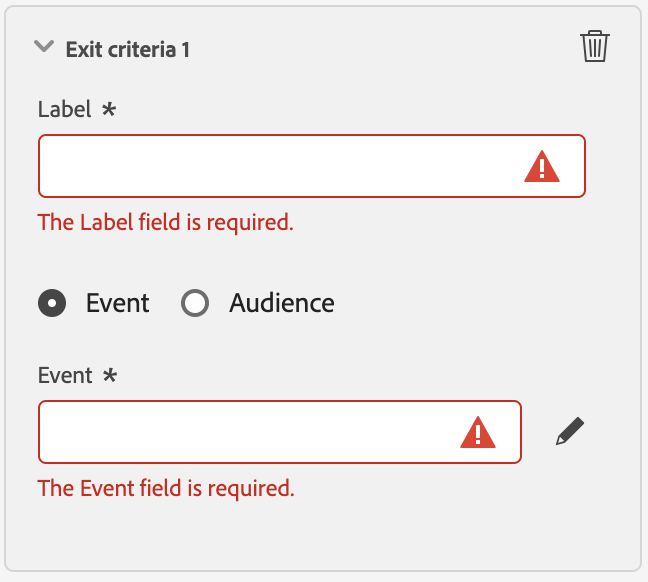

# Impostare le proprietà del percorso {#jo-properties}

>[!CONTEXTUALHELP]
>id="ajo_journey_properties"
>title="Proprietà del percorso"
>abstract="Questa sezione mostra le proprietà del percorso. Per impostazione predefinita, i parametri di sola lettura sono nascosti. Le impostazioni disponibili dipendono dallo stato del percorso, dalle autorizzazioni e dalla configurazione del prodotto."

## Accedere alle proprietà di un percorso {#access-properties}

Le proprietà di un percorso sono centralizzate nella barra a destra. Questa sezione viene visualizzata per impostazione predefinita durante la creazione di un nuovo percorso. Per i percorsi esistenti, fai clic sull’icona della matita accanto al nome del percorso per aprirlo.

Da questa sezione puoi definire il nome del percorso, aggiungere una descrizione e:

* gestisci [ingresso e rientro](#entrance),
* scegli [date](#dates) di inizio e fine,
* gestire l&#39;[accesso ai dati](#manage-access),
* definire una [durata timeout](#timeout) nelle attività di percorso (solo per gli utenti amministratori),
* seleziona il percorso e il profilo [fusi orari](#timezone)
* assegna i tag unificati Adobe Experience Platform al tuo percorso, per classificarli facilmente e migliorare la ricerca dall’elenco delle campagne. [Scopri come utilizzare i tag](../start/search-filter-categorize.md#tags)

>[!NOTE]
>
>Per i percorsi live, questa schermata mostra solo la data di pubblicazione e il nome dell’utente che ha pubblicato il percorso.

**Copia dettagli tecnici** consente di copiare informazioni tecniche sul percorso che il team di supporto può utilizzare per la risoluzione dei problemi. Sono state copiate le seguenti informazioni: `JourneyVersion UID`, `OrgID`, `orgName`, `sandboxName`, `lastDeployedBy`, `lastDeployedAt`.

Ulteriori informazioni sui campi tecnici relativi a un percorso per un determinato profilo e su come utilizzarli [in questa pagina](expression/journey-properties.md).

## Ingresso e rientro {#entrance}

La modalità di immissione profilo è definita a livello di percorso, nel riquadro di configurazione di destra. Le impostazioni sono descritte di seguito.

La gestione dell’entrata del profilo dipende dal tipo di percorsi. Ulteriori informazioni sulla gestione dell&#39;entrata e del rientro del profilo, in [questa pagina](entry-management.md).

### Consenti rientro  {#allow-reentrance}

>[!CONTEXTUALHELP]
>id="ajo_journey_properties_entrance"
>title="Consenti rientro"
>abstract="Per impostazione predefinita, i nuovi percorsi consentono il rientro. È possibile deselezionare l&#39;opzione **Consenti rientro**, ad esempio se si desidera offrire un regalo occasionale quando una persona entra in un negozio."
>additional-url="https://experienceleague.adobe.com/it/docs/journey-optimizer/using/orchestrate-journeys/manage-journey/entry-management" text="Gestione dell’ingresso del profilo"

Per impostazione predefinita, i nuovi percorsi consentono il rientro. È possibile deselezionare l&#39;opzione **Consenti rientro** per i percorsi &quot;one shot&quot;, ad esempio se si desidera offrire un regalo occasionale quando una persona entra in un negozio.

### Periodo di attesa per rientro  {#reentrance-wait}

>[!CONTEXTUALHELP]
>id="ajo_journey_properties_re-entrance_wait"
>title="Periodo di attesa per rientro"
>abstract="Imposta il tempo di attesa prima di consentire a un profilo di entrare nuovamente in un percorso unitario. In questo modo gli utenti non potranno più accedere al percorso per una determinata durata. Durata massima: 90 giorni."
>additional-url="https://experienceleague.adobe.com/it/docs/journey-optimizer/using/orchestrate-journeys/manage-journey/entry-management" text="Gestione dell’ingresso del profilo"

Quando l&#39;opzione **Consenti rientro** è attivata, viene visualizzato il campo **Periodo di attesa rientro**. Questo campo ti consente di definire il tempo di attesa prima di consentire a un profilo di accedere nuovamente al percorso in percorsi unitari (a partire da un evento o da una qualificazione del pubblico). In questo modo si evita che i percorsi vengano attivati erroneamente più volte per lo stesso evento. Per impostazione predefinita, il campo è impostato su 5 minuti. La durata massima è di 90 giorni.

## Gestisci accesso {#manage-access}

Per assegnare etichette di utilizzo dei dati personalizzate o di base al percorso, fare clic sul pulsante **[!UICONTROL Gestisci accesso]**. [Ulteriori informazioni sul controllo degli accessi a livello di oggetto (OLAC)](../administration/object-based-access.md)

## Fusi orari di percorso e profilo {#timezone}

Fuso orario definito a livello di percorso. Puoi immettere un fuso orario fisso o utilizzare i profili Adobe Experience Platform per definire il fuso orario del percorso. Se nel profilo Adobe Experience Platform è definito un fuso orario, questo può essere recuperato nel percorso.

Per ulteriori informazioni sulla gestione del fuso orario, vedere [questa pagina](../building-journeys/timezone-management.md).

## Date di inizio e fine {#dates}

>[!CONTEXTUALHELP]
>id="ajo_journey_properties_start_date"
>title="Start date (Data di inizio)"
>abstract="Scegli la data di inizio per l’ingresso nel percorso. Se non viene specificata alcuna data di inizio, questa viene impostata automaticamente in modo da coincidere con il momento della pubblicazione."

>[!CONTEXTUALHELP]
>id="ajo_journey_properties_end_date"
>title="End date (Data di fine)"
>abstract="Scegli la data di fine del percorso. Una volta raggiunta tale data, i profili in tale percorso escono automaticamente e nessun nuovo profilo potrà più accedervi."

Puoi definire una **data di inizio**. Se non ne hai specificato uno, verrà definito automaticamente al momento della pubblicazione.

Puoi anche aggiungere una **Data di fine**. Questo consente ai profili di uscire automaticamente quando viene raggiunta la data. Se non viene specificata una data di fine, i profili possono rimanere fino al [timeout percorso globale](#global_timeout) (in genere 91 giorni). L&#39;unica eccezione è rappresentata dai percorsi di pubblico di lettura ricorrenti con **Forza il rientro alla ricorrenza** attivata, che terminano alla data di inizio dell&#39;occorrenza successiva.

## Timeout {#timeout}

### Timeout o errore nelle attività del percorso {#timeout_and_error}

>[!CONTEXTUALHELP]
>id="ajo_journey_properties_timeout"
>title="Timeout"
>abstract="Definisci per quanto tempo il percorso tenterà di eseguire un’azione o di verificare una condizione prima che si verifichi una situazione di timeout."

Quando modifichi un’attività di azione o condizione, puoi definire un percorso alternativo in caso di errore o timeout. Se l&#39;elaborazione dell&#39;attività di interrogazione di un sistema di terze parti supera la durata di timeout definita nel campo **[!UICONTROL Timeout o errore]** delle proprietà del percorso, verrà scelto il secondo percorso per eseguire una potenziale azione di fallback.

I valori autorizzati sono compresi tra 1 e 30 secondi.

È consigliabile definire un valore di **[!UICONTROL Timeout o errore]** molto breve se il percorso è sensibile all&#39;ora (ad esempio, per reagire alla posizione in tempo reale di una persona) perché non è possibile ritardare l&#39;azione per più di alcuni secondi. Se il percorso è meno sensibile al tempo, è possibile utilizzare un valore più lungo per dare più tempo al sistema chiamato per inviare una risposta valida.

I percorsi utilizzano anche un timeout globale, come descritto di seguito.

### Timeout percorso globale {#global_timeout}

Oltre al [timeout](#timeout_and_error) utilizzato nelle attività di percorso, viene applicato un timeout di percorso globale. Non viene visualizzato nell’interfaccia e non può essere modificato.

Questo timeout globale interrompe l&#39;avanzamento dei singoli utenti nel percorso **91 giorni** dopo l&#39;immissione. Ciò significa che la durata del percorso di un individuo non può superare i 91 giorni. Dopo questo periodo di timeout, i dati dell’individuo vengono eliminati. Gli individui che ancora scorrono nel percorso alla fine del periodo di timeout verranno interrotti e non verranno presi in considerazione nella generazione dei rapporti. Potresti quindi vedere più persone entrare nel percorso che uscire.

A causa del timeout di 91 percorsi, quando il rientro del percorso non è consentito, non possiamo assicurarci che il blocco del rientro funzioni per più di 91 giorni. Infatti, poiché si eliminano tutte le informazioni sulle persone che sono entrate nel percorso 91 giorni dopo il loro ingresso, non è possibile conoscere la persona che è entrata in precedenza, più di 91 giorni fa.

Un singolo utente può accedere a un’attività di attesa solo se nel percorso gli è rimasto abbastanza tempo per completare la durata dell’attesa prima del timeout di 91 percorsi. Consulta [questa pagina](../building-journeys/wait-activity.md).

#### Time-to-Live (TTL) e domande frequenti sulla conservazione dei dati {#timeout-faq}

A partire dalla versione di Adobe Journey Optimizer di giugno 2024, il timeout globale del percorso è stato spostato da 30 a 91 giorni. Gli impatti sono elencati nelle domande frequenti riportate di seguito:

**Per Percorsi unitari**
<table style="table-layout:auto">
  <tr style="border: 1;">
    <td>
      
Cosa succederà al percorso pubblicato dopo il rollout dell’estensione TTL?

    </td>
    <td>
      
I profili che entrano nel nuovo percorso avranno automaticamente un TTL di 91 giorni.

    </td>
  </tr>
  <tr style="border: 1;">
    <td>
      
Cosa succede a un profilo che entra in un percorso pubblicato prima dell’avvio dell’estensione TTL?

    </td>
    <td>
      
Il profilo avrà un TTL di 30 giorni (7 giorni per HIPAA), in linea con l’ora in cui il percorso è stato pubblicato originariamente.

    </td>
  </tr>
  <tr style="border: 1;">
    <td>
      
Cosa succede a un profilo che è già entrato in un percorso quando viene avviata l’estensione TTL?

    </td>
    <td>
      
Il profilo mantiene un TTL di 30 giorni (7 giorni per HIPAA), come da orario di pubblicazione originale del percorso.

    </td>
  </tr>
  <tr style="border: 1;">
    <td>
      
Cosa succede a un profilo in una versione di percorso precedente che viene ripubblicata dopo l’avvio dell’estensione TTL?

    </td>
    <td>
      
Il profilo manterrà un TTL di 30 giorni (7 giorni per HIPAA), allineato con l’orario di pubblicazione della versione originale del percorso.

    </td>
  </tr>
  <tr style="border: 1;">
    <td>
      
Cosa succede a un nuovo profilo che entra in una versione di percorso ripubblicata dopo il lancio dell’estensione TTL?

    </td>
    <td>
      
Il profilo avrà un TTL di 91 giorni, corrispondente al TTL della versione di percorso appena ripubblicata.

    </td>
  </tr>
</table>

**Per Percorsi Trigger Segmento**

<table style="table-layout:auto">
  <tr style="border: 1;">
    <td>
      
Cosa succederà ai nuovi percorsi una tantum pubblicati dopo l’estensione TTL?

    </td>
    <td>
      
I profili che entrano nel nuovo percorso avranno automaticamente un TTL di 91 giorni.

    </td>
  </tr>
  <tr style="border: 1;">
    <td>
      
Cosa succederà ai nuovi percorsi ricorrenti senza rientro forzato pubblicati dopo l’estensione TTL?

    </td>
    <td>
      
I profili che entrano nel nuovo percorso avranno automaticamente un TTL di 91 giorni.

    </td>
  </tr>
  <tr style="border: 1;">
    <td>
      
Cosa succederà ai nuovi percorsi ricorrenti con rientro forzato pubblicati dopo l’estensione TTL?

    </td>
    <td>
      
I profili che entrano nel nuovo percorso avranno un TTL uguale al periodo di ricorrenza. Ad esempio, se il percorso viene eseguito ogni giorno, il TTL sarà di 1 giorno.

    </td>
  </tr>
  <tr style="border: 1;">
    <td>
      
Cosa succede a un profilo che entra in un percorso pubblicato prima dell’avvio dell’estensione TTL?

    </td>
    <td>
      
Il profilo avrà un TTL di 30 giorni (7 giorni per HIPAA), in linea con il tempo di pubblicazione originale. Per i percorsi ricorrenti con rientro forzato, il TTL corrisponderà al periodo di ricorrenza.

    </td>
  </tr>
  <tr style="border: 1;">
    <td>
      
Cosa succede a un profilo in esecuzione in un percorso quando viene avviata l’estensione TTL?

    </td>
    <td>
      
Il profilo mantiene un TTL di 30 giorni (7 giorni per HIPAA), come da orario di pubblicazione originale del percorso. Per i percorsi ricorrenti con rientro forzato, il TTL corrisponderà al periodo di ricorrenza.

    </td>
  </tr>
  <tr style="border: 1;">
    <td>
      
Cosa succede a un profilo in esecuzione in una versione di percorso precedente che viene ripubblicata dopo l’avvio dell’estensione TTL?

    </td>
    <td>
      
Il profilo manterrà un TTL di 30 giorni (7 giorni per HIPPA), in linea con l’orario di pubblicazione della versione originale del percorso. Per i percorsi ricorrenti con rientro forzato, il TTL corrisponderà al periodo di ricorrenza.

    </td>
  </tr>
  <tr style="border: 1;">
    <td>
      
Cosa succede a un nuovo profilo che entra in una versione di percorso ripubblicata dopo il lancio dell’estensione TTL?

    </td>
    <td>
      
Il profilo avrà un TTL di 91 giorni, corrispondente al TTL della versione di percorso appena ripubblicata. Per i percorsi ricorrenti con rientro forzato, il TTL corrisponderà al periodo di ricorrenza.

    </td>
  </tr>
</table>

## Criteri di unione {#merge-policies}

Il percorso utilizza i criteri di unione per recuperare i dati del profilo da Adobe Experience Platform. A seconda del tipo di percorso, vengono utilizzati diversi criteri di unione:

* In percorsi di lettura del pubblico o di qualificazione del pubblico: viene utilizzato il criterio di unione del pubblico
* Nei percorsi di eventi unitari: viene utilizzato il criterio di unione predefinito
* Nei percorsi di eventi aziendali: viene utilizzato il criterio di unione del pubblico di destinazione nella seguente attività Read audience

Il percorso rispetterà il criterio di unione utilizzato in tutto il percorso. Pertanto, se in un percorso vengono utilizzati più tipi di pubblico (ad esempio, nelle funzioni &quot;inAudience&quot;), creando incoerenze con il criterio di unione utilizzato dal percorso, viene generato un errore e la pubblicazione viene bloccata. Tuttavia, se nella personalizzazione dei messaggi viene utilizzato un pubblico incoerente, non viene generato un avviso, nonostante l’incoerenza. Per questo motivo, si consiglia vivamente di controllare il criterio di unione associato al pubblico quando questo è utilizzato nella personalizzazione dei messaggi.

Per ulteriori informazioni sui criteri di unione, consulta la [documentazione di Adobe Experience Platform](https://experienceleague.adobe.com/en/docs/experience-platform/profile/merge-policies/overview){target="_blank"}.

## Criteri di uscita {#exit-criteria}

>[!CONTEXTUALHELP]
>id="ajo_journey_exit_criterias"
>title="Criteri di uscita dal percorso"
>abstract="In questa sezione sono illustrate le opzioni relative ai criteri di uscita. Puoi creare una o più regole di criteri di uscita per il percorso."

### Descrizione

Spesso gli esperti di marketing desiderano rimuovere profili da un percorso quando non soddisfano più lo scopo del percorso. Ciò verrà ottenuto mediante **criteri di uscita globali**, strettamente associati alla gestione degli obiettivi.

**Caso d&#39;uso di esempio:**

Un addetto al marketing dispone di un percorso promozionale con una serie di comunicazioni. Ciascuna di queste comunicazioni ha lo scopo di spingere il cliente ad effettuare un acquisto. Appena effettuato l&#39;acquisto, il cliente non dovrebbe ricevere il resto dei messaggi della serie. Definendo un criterio di uscita, tutti i profili che hanno effettuato un acquisto verranno rimossi dal percorso.

### Configurazione e utilizzo

I criteri di uscita sono impostati a livello di percorso. Un percorso può avere più criteri di uscita. Se sono impostati più criteri di uscita, la valutazione viene eseguita dall&#39;alto verso il basso con una logica OR. Pertanto, se si dispone di Exit Criteria n°1 e Exit Criteria n°2, verrà valutato come n°1 **o** n°2. I criteri vengono valutati in ogni fase del percorso.

Per **creare** un criterio di uscita:

* Fare clic sull&#39;icona seguente {width="40%" align="left"} nella barra a destra.
* Fai clic sul pulsante **Aggiungi criteri di uscita**.

{width="40%" align="left"}

* È possibile aggiungere più criteri di uscita.
* Immetti un **Etichetta** e seleziona se i criteri di uscita sono basati su un evento o un pubblico.

### Criteri di uscita basati su un evento

Scegli solo un evento unitario.

{width="40%" align="left"}

### Criteri di uscita basati su un pubblico

Scegli un pubblico.

{width="40%" align="left"}

Nota: l’utilizzo dei criteri di uscita da un pubblico può richiedere fino a 10 minuti per essere operativo.

### Vincoli e limitazioni

* I criteri di uscita sono definiti nello stato Bozza
* Coerenza dello spazio dei nomi del percorso tra eventi e criteri di uscita basati su eventi

