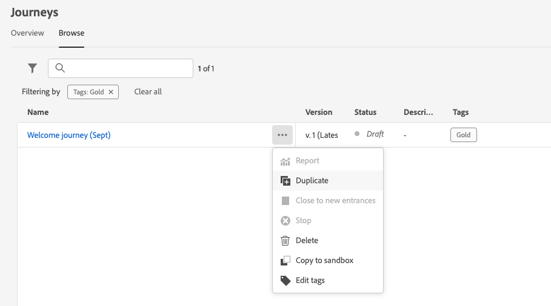

# Sfogliare e filtrare i percorsi {#browse-journeys}

>[!CONTEXTUALHELP]
>id="ajo_journey_view"
>title="Visualizzazioni calendario ed elenco percorsi"
>abstract="Oltre all’elenco percorsi, [!DNL Journey Optimizer] fornisce una visualizzazione del calendario dei percorsi, offrendo una chiara rappresentazione visiva delle relative pianificazioni. È possibile passare dalla visualizzazione elenco alla visualizzazione calendario in qualsiasi momento utilizzando questi pulsanti."

## Dashboard del percorso {#dashboard-jo}

Nella sezione del menu GESTIONE PERCORSO fare clic su **[!UICONTROL Percorsi]**. Sono disponibili due schede: **[!UICONTROL Panoramica]** e **[!UICONTROL Sfoglia]**.

### Panoramica sui percorsi

Nella scheda **[!UICONTROL Panoramica]** è visualizzata una dashboard con le metriche chiave correlate ai percorsi.

* **Profili elaborati**: numero totale di profili elaborati nelle ultime 24 ore
* **percorsi live**: numero totale di percorsi live con traffico nelle ultime 24 ore. I percorsi attivi includono **percorsi unitari** (basati su eventi) e **percorsi batch** (pubblico di lettura).
* **Frequenza errori**: rapporto tra tutti i profili con errore e il numero totale di profili immessi nelle ultime 24 ore.
* **Percentuale di eliminazione**: rapporto tra tutti i profili eliminati e il numero totale di profili immessi nelle ultime 24 ore. Un profilo scartato rappresenta un utente non idoneo per l’accesso al percorso, ad esempio a causa di uno spazio dei nomi o di regole di rientro non corrette.

>[!NOTE]
>
>Questa dashboard tiene conto dei percorsi con traffico nelle ultime 24 ore. Vengono visualizzati solo i percorsi a cui hai accesso. Le metriche vengono aggiornate ogni 30 minuti e solo quando sono disponibili nuovi dati.

### Elenco percorsi

La scheda **[!UICONTROL Sfoglia]** mostra l&#39;elenco dei percorsi esistenti. Puoi cercare percorsi, utilizzare filtri ed eseguire azioni di base su ciascun elemento. Ad esempio, è possibile duplicare o eliminare un elemento.

Nell’elenco dei percorsi vengono visualizzate tutte le versioni dei percorsi e i relativi numeri di versione. Quando cerchi un percorso, la prima volta che apri l’applicazione le versioni più recenti vengono visualizzate nella parte superiore dell’elenco. Successivamente, puoi definire l’ordinamento desiderato, che verrà mantenuto dall’applicazione come preferenza utente. La versione del percorso viene visualizzata anche nella parte superiore dell’interfaccia dell’edizione del percorso, sopra l’area di lavoro. Ulteriori informazioni sulla [gestione versione percorso](publish-journey.md#journey-versions).

### Calendario percorsi {#calendar}

Oltre all&#39;elenco percorsi, [!DNL Journey Optimizer] fornisce una visualizzazione calendario dei percorsi, offrendo una chiara rappresentazione visiva delle loro pianificazioni.

Modalità di rappresentazione dei percorsi:

* Per impostazione predefinita, la griglia del calendario mostra tutti i percorsi attivi e pianificati per la settimana selezionata. Altre opzioni di filtro possono mostrare attivazioni o attivazioni completate, interrotte e terminate.
* I percorsi 2D e i percorsi in modalità di test non vengono visualizzati.
* I percorsi che si estendono su più giorni vengono visualizzati nella parte superiore della griglia del calendario.
* Se non viene specificato alcun orario di inizio, viene utilizzato il tempo di attivazione manuale più vicino per posizionarlo nel calendario.
* I percorsi vengono visualizzati come intervalli di 1 ora, ma questo non riflette l’ora effettiva di invio o completamento.

Per spostarsi nel calendario dei Percorsi:

1. Per accedere alla vista calendario, aprire l&#39;elenco percorsi e fare clic sull&#39;icona .

1. Utilizza i pulsanti freccia o il selettore data sopra il calendario per spostarti tra le settimane.

   Nel calendario vengono visualizzati tutti i percorsi programmati per la settimana corrente.

   

1. Fai clic sull&#39;icona  per attivare/disattivare la visualizzazione degli elementi che si estendono su più giorni o settimane.

   

1. Fai clic sull&#39;icona  per gestire e aggiungere fino a tre calendari esterni.

   

1. Trascina e rilascia i file CSV contenenti i nomi degli eventi, le date di inizio e di fine.

   Gli eventi caricati vengono visualizzati per tutti gli utenti dell’organizzazione e sono visualizzati sia sul calendario di Percorso che su quello di Campaign.

   +++Il formato CSV deve essere il seguente:

   | Colonna1 | Colonna2 | Colonna3 |
   |-|-|-|
   | Nome evento | Data di inizio in formato mm/gg/aa | Data di fine in formato mm/gg/aa |

   +++

1. Se necessario, è possibile nascondere, visualizzare o rimuovere i calendari esterni aggiunti.

   

1. Per ulteriori dettagli su un percorso, fai clic sul relativo blocco visivo per aprirne ed esplorarne i dettagli.

   

## Filtrare i percorsi {#journey-filter}

Nell’elenco dei percorsi, utilizza vari filtri per perfezionare l’elenco dei percorsi.

Puoi filtrare i percorsi in base al loro [stato](#journey-statuses), [tipo](#journey-types), [versione](publish-journey.md#journey-versions) e assegnare [tag](../start/search-filter-categorize.md#tags) dai **[!UICONTROL filtri di stato e versione]**.

Utilizza **[!UICONTROL Creation filters]** per filtrare i percorsi in base alla data di creazione o all&#39;utente che li ha creati.

Visualizza percorsi che utilizzano un evento, un gruppo di campi o un&#39;azione specifica dei **[!UICONTROL Filtri di attività]** e **[!UICONTROL Filtri di dati]**.

Utilizza **[!UICONTROL Filtri di pubblicazione]** per selezionare una data di pubblicazione o un utente. Ad esempio, puoi scegliere di visualizzare le versioni più recenti dei percorsi live pubblicati ieri.

Per filtrare i percorsi in base a un intervallo di date specifico, seleziona **[!UICONTROL Personalizzato]** dall&#39;elenco a discesa **[!UICONTROL Pubblicato]**.

Inoltre, nei riquadri di configurazione dell&#39;evento, dell&#39;origine dati e dell&#39;azione, il campo **[!UICONTROL Usato in]** mostra il numero di percorsi che utilizzano quel particolare evento, gruppo di campi o azione. Per visualizzare l’elenco dei percorsi corrispondenti, puoi fare clic sul pulsante **[!UICONTROL Visualizza percorsi]**.

## Tipi di percorso {#journey-types}

Il tipo di percorso dipende dalle attività utilizzate in tale percorso. Può essere:

* **[!UICONTROL Evento unitario]** - I percorsi di eventi unitari sono collegati a un profilo specifico. Gli eventi si riferiscono al comportamento di una persona o a qualcosa che si verifica in relazione a una persona (ad esempio, una persona ha raggiunto 10.000 punti fedeltà). [Ulteriori informazioni](../event/about-events.md).
* **[!UICONTROL Evento di business]**. Il percorso degli eventi di business inizia con un evento non correlato al profilo. La configurazione dell’evento viene eseguita da un utente tecnico e non può essere modificata. [Ulteriori informazioni](../event/about-events.md).
* **[!UICONTROL Qualificazione del pubblico]** - I percorsi di qualificazione del pubblico ascoltano le entrate e le uscite dei profili nei tipi di pubblico di Adobe Experience Platform per consentire a singoli utenti di entrare o proseguire in un percorso. [Ulteriori informazioni](audience-qualification-events.md).
* **[!UICONTROL Read audience]** - Nei percorsi Read audience, tutti i singoli utenti del pubblico entrano nel percorso e ricevono i messaggi inclusi nel percorso.  [Ulteriori informazioni](read-audience.md).

Ulteriori informazioni sui tipi di percorso e sulla gestione delle voci associate in [questa pagina](entry-management.md).

## Stati percorso {#journey-statuses}

Lo stato del percorso dipende dal suo ciclo di vita. Può essere:

* **Bozza**: il percorso è nella prima fase. Non è ancora stata pubblicata.
* **Bozza (Test)**: la modalità di test è stata attivata utilizzando il pulsante **Modalità di test**. [Ulteriori informazioni](../building-journeys/testing-the-journey.md)
* **Fine**: il percorso passa automaticamente a questo stato dopo il [timeout globale](journey-properties.md#global_timeout) di 91 giorni. I profili già presenti nel percorso completano normalmente il percorso. I nuovi profili non possono più entrare nel percorso.
* **Live**: il percorso è stato pubblicato utilizzando il pulsante **Pubblica**. [Ulteriori informazioni](../building-journeys/publish-journey.md)
* **Sospeso**: il percorso live è stato messo in pausa utilizzando il pulsante **Sospendi**. [Ulteriori informazioni](../building-journeys/journey-pause.md)
* **Interrotto**: il percorso è stato disattivato utilizzando il pulsante **Interrompi**. Tutti gli individui escono immediatamente dal percorso. [Ulteriori informazioni](../building-journeys/end-journey.md#stop-journey)
* **Chiuso**: il percorso è stato chiuso utilizzando il pulsante **Chiudi ai nuovi ingressi**. Il percorso non consente più l&#39;ingresso di nuovi individui nel percorso. Le persone già nel percorso possono finire il percorso normalmente. [Ulteriori informazioni](../building-journeys/end-journey.md)

>[!NOTE]
>
>* Il ciclo di vita di authoring del Percorso include anche un set di stati intermedi che non sono disponibili per il filtro: **Pubblicazione** (tra &quot;Bozza&quot; e &quot;Live&quot;), **Attivazione modalità test** o **Disattivazione modalità test** (tra **Bozza** e **Bozza (test)**), **Interruzione** (tra **Live** e **Interrotto**), **Ripresa** (tra **In pausa** e **Live**), **In pausa** (tra **Live** e **In pausa**) Quando un percorso si trova in uno stato intermedio, è di sola lettura.
>
>* Se devi modificare un percorso **Live**, [crea una nuova versione](#journey-versions) del percorso. Puoi anche mettere in pausa i percorsi live, apportare tutte le modifiche necessarie e riprenderli in qualsiasi momento. [Ulteriori informazioni sulla sospensione dei percorsi](../building-journeys/journey-pause.md)

## Duplicare un percorso {#duplicate-a-journey}

Puoi duplicare un percorso esistente dalla scheda **Sfoglia**. Tutti gli oggetti e le impostazioni vengono duplicati nella copia di percorso.

Per farlo, segui la procedura indicata di seguito:

1. Passa al percorso da copiare, fai clic sull&#39;icona **Altre azioni** (i tre punti accanto al nome del percorso).
1. Seleziona **Duplica**.

   

1. Inserisci il nome del percorso e conferma. È inoltre possibile modificare il nome nella schermata delle proprietà del percorso. Per impostazione predefinita, il nome è impostato come segue: `[JOURNEY-NAME]_copy`

   

1. Il nuovo percorso viene creato e disponibile nell&#39;elenco percorso.

## Operazioni in blocco {#bulk-operations}

Dall&#39;elenco dei percorsi, puoi sospendere più di **Live** percorsi. Per mettere in pausa un gruppo di percorsi (_pausa collettiva_), selezionali nell&#39;elenco e fai clic sul pulsante **Pausa** nella barra blu nella parte inferiore della schermata. Il pulsante **Pausa** è disponibile solo quando sono selezionati **percorsi di disponibilità**.

Puoi anche riprendere uno o più **percorsi in pausa**. Per riprendere un gruppo di percorsi (_Riprendi in blocco_), selezionali e fai clic sul pulsante **Riprendi** nella barra blu nella parte inferiore della schermata. Il pulsante **Riprendi** sarà disponibile solo quando sono selezionati **percorsi in pausa**.

[Ulteriori informazioni sui percorsi di pausa/ripresa](journey-pause.md).

>[!NOTE]
>
>Puoi sospendere/riprendere fino a 10 percorsi per operazione.

