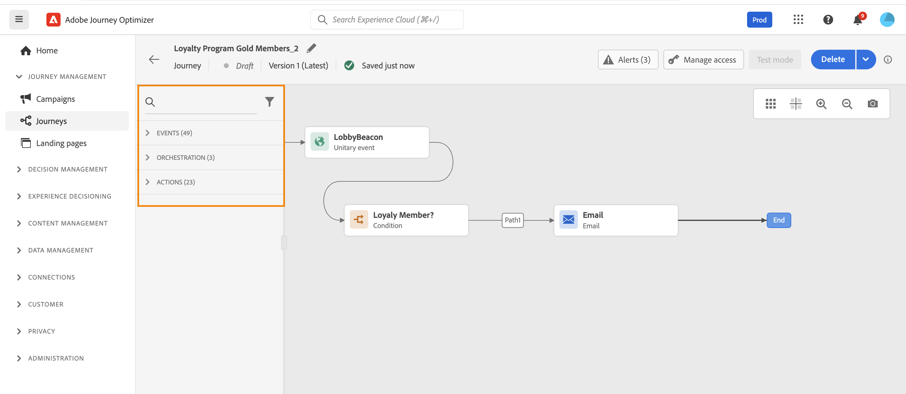

# Introduzione ai percorsi{#jo-general-principle}

Utilizza [!DNL Journey Optimizer] per generare l’orchestrazione in tempo reale per diversi casi d’uso, sfruttando i dati contestuali provenienti da eventi o da origini dati.

Puoi progettare scenari avanzati a più passaggi basati sulle seguenti funzionalità:

* Invia in tempo reale una **consegna unitaria** attivata quando viene ricevuto un evento o **in batch** utilizzando i tipi di pubblico di Adobe Experience Platform.

* Sfrutta **dati contestuali** da eventi, informazioni da Adobe Experience Platform o dati da servizi API di terze parti.

* Utilizza le **azioni incorporate** per inviare messaggi progettati in [!DNL Journey Optimizer] o crea **azioni personalizzate** se utilizzi un sistema di terzi per l’invio dei messaggi.

* Con **journey designer**, genera casi d’uso a più passaggi: trascina facilmente un evento di ingresso o un’attività Leggi pubblico, aggiungi delle condizioni e invia messaggi personalizzati.

>[!NOTE]
>
>Per i guardrail e le limitazioni applicabili ai percorsi, visita [questa pagina](../start/guardrails.md).

## Passaggi per creare un percorso{#steps-journey}

Utilizza Adobe Journey Optimizer per progettare e orchestrare percorsi personalizzati da un’unica area di lavoro. I passaggi principali per creare un percorso sono i seguenti:

➡️ [Scopri questa funzione nel video](#video)

Adobe Journey Optimizer include un’area di lavoro di orchestrazione omni-channel, che consente ai marketer di armonizzare le attività di marketing con il coinvolgimento dei clienti in modalità uno a uno. L’interfaccia utente consente di trascinare facilmente le attività dalla palette all’area di lavoro, per generare il tuo percorso.

Per capire come iniziare e come creare il primo percorso, visita [questa pagina](journey-gs.md).

Il designer di percorsi omni-channel, con la sua un’interfaccia intuitiva basata su selezione e trascinamento, ti aiuta a creare percorsi con più passaggi per tipi di pubblico target, aggiornamenti basati su interazioni del cliente o aziendali in tempo reale e messaggi omni-channel.

Per ulteriori informazioni, consulta [questa sezione](using-the-journey-designer.md).

Per i data engineer, i passaggi per configurare i percorsi, inclusi Origini dati, Eventi e Azioni, sono descritti in [questa sezione](../configuration/about-data-sources-events-actions.md).

## Casi d’uso{#uc-journey}

Scopri come creare percorsi nei seguenti casi d’uso end-to-end.

Casi d’uso aziendali:

* [Inviare messaggi multicanale](journeys-uc.md)
* [Inviare un messaggio con Campaign v7/v8](ajo-ac.md)
* [Inviare un messaggio agli abbonati](message-to-subscribers-uc.md)

Casi d’uso tecnici:

* [Passaggio dinamico delle raccolte tramite azioni personalizzate](collections.md)
* [Incrementare gradualmente le consegne](ramp-up-deliveries-uc.md)
* [Limite di trasmissione con origini dati esterne e azioni personalizzate](limit-throughput.md)

## Versioni del percorso{#journey-versions}

Nell’elenco dei percorsi vengono visualizzate tutte le versioni dei percorsi e i relativi numeri di versione. Consulta [questa pagina](../building-journeys/using-the-journey-designer.md).

Quando cerchi un percorso, la prima volta che apri l’applicazione le versioni più recenti vengono visualizzate nella parte superiore dell’elenco. Successivamente, puoi definire l’ordinamento desiderato, che verrà mantenuto dall’applicazione come preferenza utente. La versione del percorso viene visualizzata anche nella parte superiore dell’interfaccia di modifica del percorso, sopra l’area di lavoro.

>[!NOTE]
>
>In genere, un profilo non può essere presente più volte nello stesso percorso contemporaneamente. Se è stato abilitato il reingresso, un profilo può entrare di nuovo in un percorso, ma solo dopo che sarà completamente uscito dall’istanza precedente del percorso. [Ulteriori informazioni](end-journey.md).

Se devi apportare delle modifiche a un percorso live, crea una nuova versione del percorso.

1. Apri la versione più recente del percorso live, fai clic su **[!UICONTROL Crea una nuova versione]** e conferma.

   

   >[!NOTE]
   >
   >È possibile creare una nuova versione solo a partire dalla versione più recente di un percorso.

1. Apporta le modifiche necessarie, quindi fai clic su **[!UICONTROL Pubblica]** e conferma.

   

Dal momento in cui il percorso viene pubblicato, i singoli utenti inizieranno a confluire nell’ultima versione del percorso. Le persone che erano già entrate in una versione precedente vi rimangono fino alla fine del percorso. Se in un secondo momento entrano di nuovo nello stesso percorso, passeranno nella versione più recente.

È possibile interrompere le versioni di percorso singolarmente. Tutte le versioni di un percorso hanno lo stesso nome.

Quando pubblichi una nuova versione di un percorso, la versione precedente termina automaticamente e il suo stato diventa **Chiuso**. Un percorso chiuso non accetta alcun ingresso. Anche se si interrompe la versione più recente, la versione precedente rimane chiusa.

## Video introduttivo {#video}

Scopri i componenti di un percorso e le nozioni di base sulla creazione di un percorso nell’area di lavoro.

>[!VIDEO](https://video.tv.adobe.com/v/3424996?quality=12)
