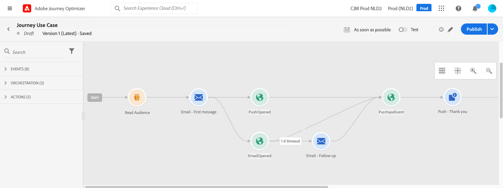
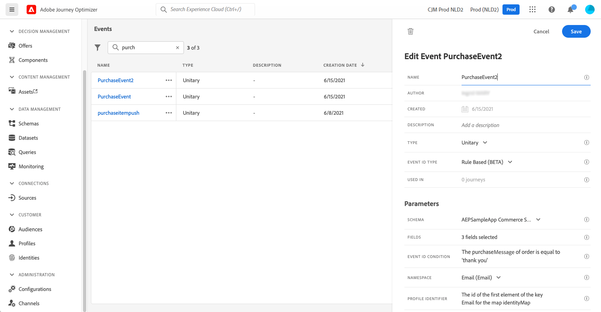

# Inviare messaggi multicanale {#send-multi-channel-messages}

Questa sezione presenta un caso d’uso che combina un Read Audience, un evento, eventi di reazione e messaggi e-mail/push.

## Descrizione del caso d’uso

In questo caso d’uso, l’obiettivo è quello di inviare un primo messaggio e-mail a tutti i clienti appartenenti a un pubblico specifico.

In base alla loro reazione al primo messaggio, vengono inviati messaggi di follow-up specifici.

Se il cliente apre l’e-mail, il sistema attende un acquisto e invia un messaggio push per ringraziare il cliente.

In assenza di reazioni, viene inviata un’e-mail di follow-up.

## Prerequisiti

Affinché questo caso d’uso funzioni, configura quanto segue:

* Un pubblico per tutti i clienti che vivono ad Atlanta, San Francisco o Seattle e sono nati dopo il 1980
* Un evento di acquisto

### Creare il pubblico

In questo percorso, viene utilizzato un pubblico specifico di clienti. Tutti gli individui appartenenti al pubblico entrano nel percorso e seguono i diversi passaggi. In questo esempio, il pubblico esegue il targeting di tutti i clienti che vivono ad Atlanta, San Francisco o Seattle e sono nati dopo il 1980.

Per ulteriori informazioni sui tipi di pubblico, [fai riferimento a questa pagina](../audience/about-audiences.md).

1. Dalla sezione del menu CUSTOMER, seleziona **[!UICONTROL Tipi di pubblico]**.
1. Fai clic sul pulsante **[!UICONTROL Crea pubblico]** in alto a destra nell&#39;elenco del pubblico.
1. Nel riquadro **[!UICONTROL Proprietà pubblico]** immettere un nome per il pubblico.
1. Trascina e rilascia i campi desiderati dal riquadro di sinistra all’area di lavoro centrale e configurali in base alle tue esigenze. In questo esempio, utilizzare i campi attributo **Città** e **Anno di nascita**.
1. Fai clic su **[!UICONTROL Salva]**.

   

Il pubblico ora è stato creato ed è pronto per essere utilizzato nel percorso. Utilizzando un&#39;attività **Read Audience**, tutti gli utenti appartenenti al pubblico possono entrare nel percorso.

### Configurare l’evento

Configura un evento inviato al percorso quando un cliente effettua un acquisto. Quando il percorso riceve l&#39;evento, attiva il messaggio di ringraziamento.

Per questo, utilizza un [evento basato su regole](../event/about-events.md).

1. Nella sezione del menu AMMINISTRAZIONE, seleziona **[!UICONTROL Configurazioni]**, quindi fai clic su **[!UICONTROL Eventi]**. Fai clic su **[!UICONTROL Crea evento]** per creare un nuovo evento.

1. Inserisci il nome dell’evento.

1. Nel campo **[!UICONTROL Tipo ID evento]**, seleziona **[!UICONTROL Basato su regole]**.

1. Definisci lo **[!UICONTROL Schema]** e il payload **[!UICONTROL Campi]**. Utilizza diversi campi, ad esempio il prodotto acquistato, la data di acquisto e l’ID acquisto.

1. Nel campo **[!UICONTROL Condizione ID evento]**, definire la condizione utilizzata dal sistema per identificare gli eventi che attivano il percorso. Ad esempio, aggiungere un campo `purchaseMessage` e definire la seguente regola: `purchaseMessage="thank you"`

1. Definisci **[!UICONTROL Spazio dei nomi]** e **[!UICONTROL Identificatore profilo]**.

1. Fai clic su **[!UICONTROL Salva]**.

   

L’evento è ora configurato e pronto per essere utilizzato nel percorso. Utilizzando l’attività evento corrispondente, è possibile attivare un’azione ogni volta che un cliente effettua un acquisto.

## Progettare il percorso

1. Avvia il percorso con un&#39;attività **Read Audience**. Seleziona il pubblico creato in precedenza. Tutti gli individui appartenenti al pubblico entrano nel percorso.

   

1. Rilascia un&#39;attività di azione **E-mail** e definisci il contenuto del &quot;primo messaggio&quot;. Questo messaggio viene inviato a tutti i singoli utenti del percorso. Consulta questa [sezione](../email/create-email.md) per scoprire come configurare e progettare un messaggio e-mail.

   

1. Aggiungi un evento **Reaction** e seleziona **Email open**. L’evento viene attivato quando una persona appartenente al pubblico apre l’e-mail.

1. Seleziona la casella **Definisci il timeout dell&#39;evento**, definisci una durata (1 giorno in questo esempio) e seleziona **Imposta un percorso di timeout**. In questo modo viene creato un altro percorso per i singoli utenti che non aprono il primo messaggio push o e-mail.

1. Nel percorso di timeout, rilascia un&#39;attività di azione **E-mail** e definisci il contenuto del messaggio di completamento. Questo messaggio viene inviato alle persone che non aprono l’e-mail o non inviano il primo messaggio push entro il giorno successivo. [Scopri come configurare e progettare un&#39;e-mail](../email/create-email.md).

1. Nel primo percorso, aggiungi l’evento di acquisto creato in precedenza. L’evento viene attivato quando un individuo effettua un acquisto.

1. Dopo l&#39;evento, rilascia un&#39;attività di azione **Push** e definisci il contenuto del messaggio di ringraziamento. Consulta questa [sezione](../push/create-push.md) per scoprire come configurare e progettare un push.

## Test e pubblicazione del percorso

1. Prima di eseguire il test del percorso, verificare che sia valido e che non vi siano errori.

1. Utilizza l&#39;interruttore **Test**, che si trova nell&#39;angolo in alto a destra, per attivare la modalità di test. Consulta questa [sezione](testing-the-journey.md) per scoprire come utilizzare la modalità di test.

1. Quando il percorso è pronto, pubblicalo utilizzando il pulsante **Pubblica**, in alto a destra.
