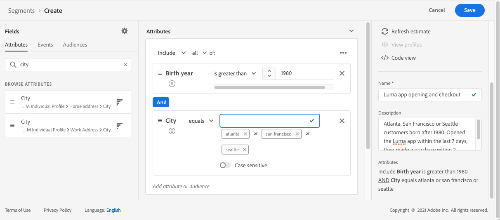

# Caso di utilizzo percorso

Questa sezione presenta un caso d’uso che combina un segmento Read , un evento, eventi di reazione e messaggi e-mail/push.

## Descrizione del caso d’uso

In questo caso d’uso, desideri inviare un primo messaggio (e-mail e push) a tutti i clienti appartenenti a un segmento specifico.

In base alla loro reazione al primo messaggio, vogliamo inviare messaggi specifici.

Dopo il primo messaggio, attendiamo un giorno che i clienti aprano il messaggio push o e-mail. Se non ci sono reazioni, gli inviamo un&#39;e-mail di follow-up.

Quindi attendiamo un acquisto e inviamo un messaggio push per ringraziare il cliente.

## Prerequisiti

Affinché questo caso d’uso funzioni, devi configurare quanto segue:

* un segmento per tutti i clienti che vivono ad Atlanta, San Francisco o Seattle e sono nati dopo il 1980.
* un evento di acquisto
* tre messaggi

### Creare il segmento

Nel nostro percorso, vogliamo sfruttare un segmento specifico di clienti. Tutti gli individui appartenenti al segmento entrano nel percorso e seguono i diversi passaggi. Nel nostro esempio, abbiamo bisogno di un segmento che si rivolga a tutti i clienti che vivono ad Atlanta, San Francisco, o Seattle e che sono nati dopo il 1980.

Per ulteriori informazioni sui segmenti, consulta questa [pagina](../segment/about-segments.md).

1. Dal menu **[!UICONTROL Segments]**, fai clic su **[!UICONTROL Create segment]**.

1. Nel riquadro **[!UICONTROL Segment properties]**, immetti un nome per il segmento.

1. Trascina e rilascia i campi desiderati dal riquadro di sinistra all’area di lavoro centrale, quindi configurali in base alle tue esigenze. In questo esempio, utilizziamo i campi degli attributi **Città** e **Anno di nascita** .

1. Fai clic su **[!UICONTROL Save]**.

   

Il segmento viene ora creato e pronto per essere utilizzato nel percorso. Utilizzando un&#39;attività **Leggi segmento**, puoi fare entrare nel percorso tutti gli individui appartenenti al segmento.

### Configurare l’evento

Devi configurare un evento inviato al tuo percorso quando un cliente effettua un acquisto. Quando il percorso riceve l&#39;evento, attiva il messaggio di &quot;grazie&quot;.

A questo scopo, utilizziamo un evento basato su regole. Per ulteriori informazioni sugli eventi, consulta questa [pagina](../event/about-events.md).

1. Nella sezione AMMINISTRAZIONE, seleziona **[!UICONTROL Configurations]**, quindi fai clic su **[!UICONTROL Events]**. Per creare un nuovo evento, fai clic su **[!UICONTROL Add]**. 

1. Inserisci il nome dell’evento.

1. Nel campo **[!UICONTROL Event ID type]** seleziona **[!UICONTROL Rule Based]**.

1. Definisci il **[!UICONTROL Schema]** e il payload **[!UICONTROL Fields]**. Puoi utilizzare diversi campi, ad esempio il prodotto acquistato, la data di acquisto e l’ID acquisto.

1. Nel campo **[!UICONTROL Event ID condition]** , definisci la condizione utilizzata dal sistema per identificare gli eventi che attivano il percorso. Ad esempio, puoi aggiungere un campo `purchaseMessage` e definire la regola seguente: `purchaseMessage="thank you"`

1. Definisci i valori **[!UICONTROL Namespace]** e **[!UICONTROL Key]**.

1. Fai clic su **[!UICONTROL Save]**.

   

L’evento è ora configurato e pronto per essere utilizzato nel percorso. Utilizzando l’attività evento corrispondente, puoi attivare un’azione ogni volta che un cliente effettua un acquisto.

### Creare i messaggi

Per questo caso d’uso, è necessario creare tre messaggi:

* un primo messaggio push ed e-mail
* un messaggio push di ringraziamento
* un messaggio di follow-up e-mail

Per informazioni su come progettare e pubblicare questi messaggi, consulta questa [sezione](../segment/about-segments.md) .

## Progettare il percorso

1. Avvia il percorso con un&#39;attività **Leggi segmento** . Seleziona il segmento creato in precedenza. Tutti i singoli utenti appartenenti al segmento entrano nel percorso.

   

1. Rilascia un’attività **Messaggio** e seleziona il primo messaggio push ed e-mail. Questo messaggio viene inviato a tutti gli individui del percorso.

   

1. Posiziona il cursore sull’attività del messaggio e fai clic sul simbolo &quot;+&quot; per creare un nuovo percorso.

1. Nel primo percorso, aggiungi un evento **Reaction** e seleziona **Push open**. L’evento viene attivato quando una persona appartenente al segmento apre la versione push del primo messaggio.

1. Nel secondo percorso, aggiungi un evento **Reaction** e seleziona **E-mail aperta**. L’evento viene attivato quando l’utente apre l’e-mail.

1. In una delle attività di reazione, seleziona la casella **Definisci il timeout dell&#39;evento**, definisci una durata (1 giorno nel nostro esempio) e seleziona **Imposta un percorso di timeout**. Questo crea un altro percorso per gli utenti che non aprono il primo messaggio push o e-mail.

   >[!NOTE]
   >
   >Quando configuri un timeout su più eventi (le due reazioni in questo caso), devi configurare il timeout solo su uno di questi eventi.

1. Nel percorso di timeout, rilascia un’attività **Messaggio** e seleziona il messaggio di follow-up e-mail. Questo messaggio viene inviato agli utenti che non aprono l’e-mail o non inviano il primo messaggio push il giorno successivo.

1. Collega i tre percorsi all’evento di acquisto creato in precedenza. L’evento viene attivato quando un singolo utente effettua un acquisto.

1. Dopo l’evento, rilascia un’attività **Messaggio** e seleziona il messaggio di ringraziamento per l’e-mail.

1. Aggiungi un&#39;attività **End**.

## Test e pubblicazione del percorso

1. Prima di testare il percorso, verifica che sia valido e che non vi sia alcun errore.

1. Fai clic sull&#39;interruttore **Test**, situato nell&#39;angolo in alto a destra, per attivare la modalità di test. Definisci come desideri che i profili di test entrino nel test: un singolo profilo, o fino a 100 alla volta. Per informazioni su come utilizzare la modalità di test, consulta questa [sezione](testing-the-journey.md) .

1. Quando il percorso è pronto, pubblicalo utilizzando il pulsante **Pubblica** , situato nell&#39;angolo in alto a destra.
