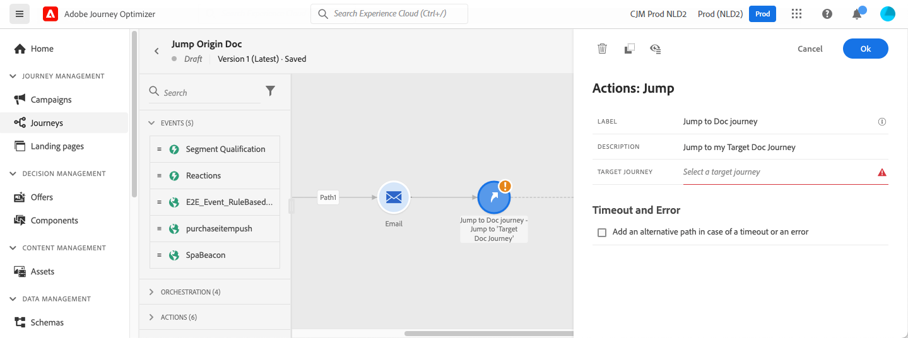

# Passaggio da un percorso a un altro {#jump}

>[!BEGINSHADEBOX]

**In questa pagina:** Scopri come utilizzare l&#39;attività Salta per inviare utenti da un percorso all&#39;altro, semplificando le progettazioni complesse e creando pattern di percorso comuni e riutilizzabili.

>[!ENDSHADEBOX]

>[!CONTEXTUALHELP]
>id="ajo_journey_jump"
>title="Attività Salta"
>abstract="L’azione Passa a consente di far passare singoli utenti da un percorso all’altro. Questa funzione semplifica la progettazione di percorsi molto complessi e consente di creare percorsi basati su modelli di percorso comuni e riutilizzabili."

L&#39;attività azione **[!UICONTROL Salta]** consente di inviare singoli utenti da un percorso all&#39;altro. Questa funzione consente di:

* semplificare la progettazione di percorsi molto complessi suddividendoli in diversi percorsi più semplici;
* creare percorsi basati su pattern di percorso comuni e riutilizzabili.

Nel percorso di origine, aggiungi un&#39;attività **[!UICONTROL Salta]** e seleziona un percorso di destinazione. Quando l&#39;utente accede al passaggio **[!UICONTROL Jump]**, viene inviato un evento interno al primo evento del percorso di destinazione. Se l&#39;azione **[!UICONTROL Salta]** ha esito positivo, l&#39;utente continua ad avanzare nel percorso. Il comportamento è simile ad altre azioni.

Nel percorso di destinazione, il primo evento attivato internamente dall&#39;attività **[!UICONTROL Jump]** crea il flusso individuale nel percorso.

## Ciclo di vita {#jump-lifecycle}

Si supponga di aver aggiunto un&#39;attività **[!UICONTROL Salta]** nel percorso A al percorso B. Il Percorso A è il **percorso di origine** e il percorso B è il **percorso di destinazione**.

Di seguito sono riportati i diversi passaggi del processo di esecuzione:

**Il Percorso A** è attivato da un evento esterno:

1. Il percorso A riceve un evento esterno correlato a un individuo.
1. Il singolo utente raggiunge il passaggio **[!UICONTROL Salta]**.
1. L&#39;utente viene inviato al percorso B e passa ai passaggi successivi nel percorso A, dopo il passaggio **[!UICONTROL Salta]**.

Nel percorso B, il primo evento viene attivato internamente tramite l&#39;attività **[!UICONTROL Jump]** dal percorso A:

1. Il percorso B riceve un evento interno dal percorso A.
1. L&#39;individuo inizia a fluire nel percorso B.

>[!NOTE]
>
>Il percorso B può essere attivato anche tramite un evento esterno.

### Comportamento del profilo durante un salto {#jump-profile-behavior}

Quando un profilo raggiunge il passaggio **[!UICONTROL Salta]**, continua a progredire nel percorso di origine (Percorso A) mentre entra simultaneamente nel percorso di destinazione (Percorso B). Il profilo è quindi attivo in entrambi i percorsi contemporaneamente.

Ciò significa che:

* Il profilo completa tutti i passaggi rimanenti nel Percorso A dopo l’attività Salta (ad esempio, un’azione di attesa di follow-up o di chiusura).
* Il profilo inizia anche a scorrere attraverso il Percorso B dal suo primo evento, indipendentemente dal Percorso A.
* Se il profilo è **già attivo** nel Percorso B al momento dell&#39;esecuzione del salto, **non** immetterà nuovamente il Percorso B. Il percorso A continua normalmente; non viene segnalato alcun errore.

>[!NOTE]
>
>Il caso precedente, profilo già attivo nel Percorso B, genera un **salto invisibile all&#39;utente**: non viene generato alcun errore e il Percorso A continua normalmente. In altre situazioni, il Salto può **non riuscire** e il Percorso A applica la gestione standard degli errori di azione. Per l&#39;elenco completo dei casi, vedere [Errori di runtime](#jump-troubleshoot).

## Best practice e limitazioni {#jump-limitations}

Utilizza queste linee guida per mantenere il comportamento dell’attività Salta prevedibile e sicuro.

### Authoring {#jump-limitations-authoring}

* L&#39;attività **[!UICONTROL Jump]** è disponibile solo nei percorsi che utilizzano uno spazio dei nomi.
* È possibile passare solo a un percorso che utilizza lo stesso spazio dei nomi del percorso di origine.
* Non puoi passare a un percorso che inizia con un evento **Qualificazione del pubblico** o **Read Audience**.
* Non puoi avere un&#39;attività **[!UICONTROL Jump]** e un evento **Qualificazione del pubblico** o **Read Audience** nello stesso percorso.
* Puoi includere in un percorso tutte le **[!UICONTROL attività Salta]** necessarie. Dopo un **[!UICONTROL Salto]**, puoi aggiungere qualsiasi attività necessaria.
* Puoi avere tutti i livelli di salto necessari. Il percorso A, ad esempio, passa al percorso B, che passa al percorso C e così via.
* Il percorso di destinazione può inoltre includere tutte le **[!UICONTROL attività Salta]** necessarie.
* I pattern di loop non sono supportati. Non esiste un modo per collegare due o più percorsi, il che creerebbe un loop infinito. La schermata di configurazione dell&#39;attività **[!UICONTROL Jump]** non consente di eseguire questa operazione.

### Execution {#jump-limitations-exec}

* Quando l&#39;attività **[!UICONTROL Jump]** viene eseguita, viene attivata la versione più recente del percorso di destinazione.
* Un individuo univoco può essere presente solo una volta nello stesso percorso. Di conseguenza, se l’individuo inviato dal percorso di origine è già nel percorso target, non entrerà in tale percorso. Non verrà segnalato alcun errore nell&#39;attività **[!UICONTROL Jump]** perché si tratta di un comportamento normale.

## Strategia di progettazione: percorsi di dimensioni ridotte {#jump-strategy}

Percorsi di clienti complessi possono diventare rapidamente difficili da creare e mantenere, soprattutto con l’introduzione di canali o punti di contatto aggiuntivi. Anche un percorso con una manciata di milestone può esporre 20 o più percorsi univoci che un cliente può seguire, e tale complessità cresce in modo esponenziale con ogni aggiunta.

Un approccio pratico alla gestione di questo problema consiste nel suddividere percorsi di grandi dimensioni in percorsi secondari più piccoli e mirati, uno per ogni fase aziendale o attività cardine, e collegarli utilizzando l&#39;attività **[!UICONTROL Salta]**. In questo modo ogni percorso è leggibile, testabile e manutenibile in modo indipendente.

**Passaggio 1: visualizzare il percorso end-to-end**

Mappatura dell&#39;intero percorso di clienti e identificazione delle sue fasi di alto livello. Ad esempio, un percorso di onboarding del programma fedeltà potrebbe includere tre fasi distinte: scaricare l’app mobile, effettuare una prima transazione, effettuare una seconda transazione.

**Passaggio 2: annota le fasi e definisci i percorsi secondari**

Contrassegna il limite di ogni fase e definisci il relativo obiettivo aziendale. Ogni fase diventa un percorso secondario candidato con una chiara condizione di ingresso e un obiettivo.

**Passaggio 3: generare e connettere percorsi secondari**

Crea ogni fase come percorso separato in Journey Optimizer, quindi utilizza le attività **[!UICONTROL Jump]** per passare i profili da un percorso secondario all&#39;altro. Il risultato è una serie di percorsi più semplici e riutilizzabili che si combinano per produrre un&#39;esperienza end-to-end completa, riducendo i rischi di introdurre errori.

>[!TIP]
>
>Per un esempio di utilizzo di un programma di fidelizzazione multifase, vedere [percorso di fidelizzazione multifase](journeys-uc.md#multi-phase-loyalty).

## Configurazione dell’attività Salta {#jump-configure}

1. Progetta il tuo **percorso di origine**.

   

1. In qualsiasi passaggio del percorso, aggiungi un&#39;attività **[!UICONTROL Jump]** dalla categoria **[!UICONTROL ACTIONS]**. Aggiungi un’etichetta e una descrizione.

   

1. Fai clic nel campo **percorso di destinazione**.
L’elenco mostra tutte le versioni del percorso che sono bozza, live o in modalità di test. I percorsi che utilizzano uno spazio dei nomi diverso o che iniziano con un evento **Qualificazione del pubblico** non sono disponibili. Anche i percorsi target che creerebbero un pattern di loop vengono filtrati.

   

   >[!NOTE]
   >
   >Puoi fare clic sull&#39;icona **Apri percorso di destinazione**, a destra, per aprire il percorso di destinazione in una nuova scheda.

1. Selezionare il percorso di destinazione in cui si desidera passare.
Il campo **Primo evento** è precompilato con il nome del primo evento del percorso di destinazione. Se il percorso di destinazione include più eventi, il **[!UICONTROL Salto]** è consentito solo sul primo evento.

   

1. La sezione **Parametri azione** visualizza tutti i campi dell&#39;evento di destinazione. Mappa ogni campo con i campi dell’evento di origine o dell’origine dati, come con altri tipi di azioni. Queste informazioni verranno passate al percorso target in fase di runtime.
1. Aggiungi le attività successive per completare il percorso di origine.

   

   >[!NOTE]
   >
   >L’identità dell’individuo viene mappata automaticamente. Queste informazioni non sono visibili nell’interfaccia.

L&#39;attività **[!UICONTROL Jump]** è configurata. Non appena il percorso è attivo o in modalità di test, gli utenti che raggiungono il passaggio **[!UICONTROL Salta]** verranno inviati al percorso di destinazione.

Quando un&#39;attività **[!UICONTROL Jump]** è configurata in un percorso, viene aggiunta automaticamente un&#39;icona di voce **[!UICONTROL Jump]** all&#39;inizio del percorso di destinazione. Questo consente di identificare che il percorso può essere attivato esternamente ma anche internamente da un&#39;attività **[!UICONTROL Jump]**.

## Risoluzione dei problemi {#jump-troubleshoot}

### Errori di configurazione

I seguenti problemi impediscono il corretto funzionamento del Salto e vengono visualizzati come errori nell’area di lavoro del percorso:

* Il percorso di destinazione non esiste più.
* Il percorso di destinazione è bozza, chiuso o interrotto.
* Il primo evento del percorso target è stato modificato e la mappatura è interrotta.

### Errori di runtime

Nei casi seguenti, il passaggio di salto viene trattato come **azione non riuscita** nel Percorso A. Il Percorso A applica la gestione standard degli errori di azione e continua:

* L&#39;istanza del percorso di destinazione esistente è stata terminata e il percorso di destinazione non è un nuovo partecipante.
* Nel percorso di destinazione è configurato un periodo di rientro. Anche se il reinserimento è consentito in linea di principio, il profilo non può rientrare finché non è trascorso il periodo (il salto non riesce con lo stato &quot;non rientro per il periodo&quot;).
* La versione del percorso di destinazione non può essere individuata, è stata eliminata, è terminata o è stata interrotta.

+++ Guida di riferimento della Knowledge Base di AI

Questa sezione contiene informazioni strutturate che supportano l&#39;interpretazione, il recupero e la risposta alle domande relative a questo argomento.

Per una comprensione completa, queste informazioni devono essere unite alla documentazione su questa pagina. Nessuna delle due origini è progettata per essere indipendente; la pagina descrive la funzione, mentre questa sezione fornisce un contesto aggiuntivo che aiuta a non ambiguare la terminologia, le finalità, l’applicabilità e i vincoli.

* **TL;DR:** In questa pagina viene illustrata l&#39;attività Salta, che spinge i profili da un percorso all&#39;altro per semplificare le progettazioni complesse del percorso tramite modelli di percorsi secondari riutilizzabili.

**Intenti:**

* Utilizzare l’attività Salta per trasferire i profili da un percorso di origine a un percorso target
* Scomporre un percorso complesso in percorsi secondari più piccoli e gestibili connessi da attività Jump
* Configurare l’attività Jump selezionando un percorso target e mappando i parametri delle azioni
* Comprendere il comportamento del profilo quando viene eseguito un salto (profilo attivo in entrambi i percorsi simultaneamente)
* Risolvere i problemi relativi agli errori di configurazione Jump e di runtime
* Evitare i pattern di loop quando si concatenano più percorsi con le attività Salta

**Glossario:**

* **Attività Jump**: attività di azione che invia un evento interno al primo evento di un percorso di destinazione, causando il flusso del profilo attraverso tale percorso. *(specifico per prodotto)*
* **percorso di origine**: percorso che contiene l&#39;attività Salta e avvia il trasferimento di un profilo a un altro percorso. *(specifico per prodotto)*
* **percorso di destinazione**: percorso che riceve il profilo tramite il trigger di evento interno dell&#39;attività Salta. *(specifico per prodotto)*
* **Salto invisibile all&#39;utente**: comportamento quando un profilo è già attivo nel percorso di destinazione al momento di un salto, il salto viene saltato senza errori e il percorso di origine continua normalmente. *(specifico per prodotto)*

**Guardrail:**

* L’attività Salta è disponibile solo nei percorsi che utilizzano uno spazio dei nomi; i percorsi di origine e di destinazione devono condividere lo stesso spazio dei nomi
* Impossibile passare a un percorso che inizia con un evento di qualificazione del pubblico o Read Audience
* Impossibile utilizzare un’attività Jump (Salta) e un evento Qualificazione del pubblico o Read Audience (Leggi pubblico) nello stesso percorso
* I pattern di loop (catene di percorsi circolari) non sono supportati e sono impediti dall’interfaccia utente di configurazione
* In fase di runtime, viene attivata l’ultima versione live del percorso target
* Un profilo può essere presente solo una volta nello stesso percorso alla volta; se è già attivo nel percorso target, il salto viene saltato in modo silenzioso
* Se il percorso di destinazione è bozza, chiuso, interrotto, eliminato o la sua prima mappatura evento è interrotta, il Salto genera un errore di configurazione

**Terminologia:**

* Nome canonico: Jump activity — Acronimo: none — varianti: Jump action, percorsi jump
* Sinonimi: &quot;percorso origine&quot; = &quot;percorso origine&quot;; &quot;percorso destinazione&quot; = &quot;percorso destinazione&quot;
* Non confondere: &quot;salto invisibile all’utente&quot; ≠ &quot;errore di runtime&quot;: un salto invisibile all’utente si verifica quando il profilo è già nel percorso target (nessun errore generato); un errore di runtime si verifica quando il percorso target non è raggiungibile o non è rientro (considerato come un’azione non riuscita)

**Domande frequenti:**

* **D: cosa succede a un profilo nel percorso di origine dopo un salto?** — Il profilo continua a progredire attraverso tutti i passaggi rimanenti nel percorso di origine dopo il passaggio Salta mentre entra simultaneamente nel percorso di destinazione; è attivo in entrambi i percorsi contemporaneamente.
* **Q: posso passare a un percorso Read Audience?** — No; non è possibile passare a un percorso che inizia con un evento Read Audience o Audience Qualification.
* **D: cosa attiva il percorso di destinazione quando viene eseguito un salto?** — L&#39;attività Jump invia un evento interno al primo evento del percorso target; il profilo scorre quindi attraverso il percorso target a partire da tale primo evento.
* **D: come è possibile evitare cicli infiniti durante il concatenamento di percorsi con Jump?** — I pattern di loop vengono bloccati dall&#39;interfaccia utente di configurazione dell&#39;attività Salta, che filtra i percorsi di destinazione che creerebbero una catena circolare.
* **D: quale versione del percorso di destinazione è attivata da un salto?** — la versione live più recente (o in modalità di test) del percorso target viene attivata in fase di runtime.

+++
