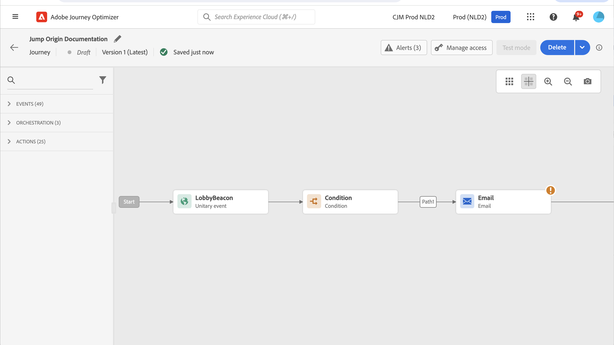

# Passaggio da un percorso a un altro {#jump}

>[!CONTEXTUALHELP]
>id="ajo_journey_jump"
>title="Attività Salta"
>abstract="L’azione Passa a consente di far passare singoli utenti da un percorso all’altro. Questa funzione semplifica la progettazione di percorsi molto complessi e consente di creare percorsi basati su modelli di percorso comuni e riutilizzabili."

L&#39;attività azione **[!UICONTROL Salta]** consente di inviare singoli utenti da un percorso all&#39;altro. Questa funzione consente di:

* semplificare la progettazione di percorsi molto complessi suddividendoli in diversi percorsi più semplici;
* creare percorsi basati su pattern di percorso comuni e riutilizzabili.

Nel percorso di origine, aggiungi un&#39;attività **[!UICONTROL Salta]** e seleziona un percorso di destinazione. Quando l&#39;utente accede al passaggio **[!UICONTROL Jump]**, viene inviato un evento interno al primo evento del percorso di destinazione. Se l&#39;azione **[!UICONTROL Salta]** ha esito positivo, l&#39;utente continua ad avanzare nel percorso. Il comportamento è simile ad altre azioni.

Nel percorso di destinazione, il primo evento attivato internamente dall&#39;attività **[!UICONTROL Jump]** crea il flusso individuale nel percorso.

## Ciclo di vita {#jump-lifecycle}

Si supponga di aver aggiunto un&#39;attività **[!UICONTROL Salta]** nel percorso A al percorso B. Il Percorso A è il **percorso di origine** e il percorso B è il **percorso di destinazione**.

Di seguito sono riportati i diversi passaggi del processo di esecuzione:

**Il Percorso A** è attivato da un evento esterno:

1. Il percorso A riceve un evento esterno correlato a un individuo.
1. Il singolo utente raggiunge il passaggio **[!UICONTROL Salta]**.
1. L&#39;utente viene inviato al percorso B e passa ai passaggi successivi nel percorso A, dopo il passaggio **[!UICONTROL Salta]**.

Nel percorso B, il primo evento viene attivato internamente tramite l&#39;attività **[!UICONTROL Jump]** dal percorso A:

1. Il percorso B riceve un evento interno dal percorso A.
1. L&#39;individuo inizia a fluire nel percorso B.

>[!NOTE]
>
>Il percorso B può essere attivato anche tramite un evento esterno.

## Best practice e limitazioni {#jump-limitations}

### Authoring {#jump-limitations-authoring}

* L&#39;attività **[!UICONTROL Jump]** è disponibile solo nei percorsi che utilizzano uno spazio dei nomi.
* È possibile passare solo a un percorso che utilizza lo stesso spazio dei nomi del percorso di origine.
* Non puoi passare a un percorso che inizia con un evento **Qualificazione del pubblico** o **Read Audience**.
* Non puoi avere un&#39;attività **[!UICONTROL Jump]** e un evento **Qualificazione del pubblico** o **Read Audience** nello stesso percorso.
* Puoi includere in un percorso tutte le **[!UICONTROL attività Salta]** necessarie. Dopo un **[!UICONTROL Salto]**, puoi aggiungere qualsiasi attività necessaria.
* Puoi avere tutti i livelli di salto necessari. Il percorso A, ad esempio, passa al percorso B, che passa al percorso C e così via.
* Il percorso di destinazione può inoltre includere tutte le **[!UICONTROL attività Salta]** necessarie.
* I pattern di loop non sono supportati. Non esiste un modo per collegare due o più percorsi, il che creerebbe un loop infinito. La schermata di configurazione dell&#39;attività **[!UICONTROL Jump]** non consente di eseguire questa operazione.

### Execution {#jump-limitations-exec}

* Quando l&#39;attività **[!UICONTROL Jump]** viene eseguita, viene attivata la versione più recente del percorso di destinazione.
* Un individuo univoco può essere presente solo una volta nello stesso percorso. Di conseguenza, se l’individuo inviato dal percorso di origine è già nel percorso target, non entrerà in tale percorso. Non verrà segnalato alcun errore nell&#39;attività **[!UICONTROL Jump]** perché si tratta di un comportamento normale.

## Configurazione dell’attività Salta {#jump-configure}

1. Progetta il tuo **percorso di origine**.

   

1. In qualsiasi passaggio del percorso, aggiungi un&#39;attività **[!UICONTROL Jump]** dalla categoria **[!UICONTROL ACTIONS]**. Aggiungi un’etichetta e una descrizione.

   

1. Fai clic nel campo **percorso di destinazione**.
L’elenco mostra tutte le versioni del percorso che sono bozza, live o in modalità di test. I percorsi che utilizzano uno spazio dei nomi diverso o che iniziano con un evento **Qualificazione del pubblico** non sono disponibili. Anche i percorsi target che creerebbero un pattern di loop vengono filtrati.

   

   >[!NOTE]
   >
   >Puoi fare clic sull&#39;icona **Apri percorso di destinazione**, a destra, per aprire il percorso di destinazione in una nuova scheda.

1. Selezionare il percorso di destinazione in cui si desidera passare.
Il campo **Primo evento** è precompilato con il nome del primo evento del percorso di destinazione. Se il percorso di destinazione include più eventi, il **[!UICONTROL Salto]** è consentito solo sul primo evento.

   

1. La sezione **Parametri azione** visualizza tutti i campi dell&#39;evento di destinazione. Mappa ogni campo con i campi dell’evento di origine o dell’origine dati, come con altri tipi di azioni. Queste informazioni verranno passate al percorso target in fase di runtime.
1. Aggiungi le attività successive per completare il percorso di origine.

   

   >[!NOTE]
   >
   >L’identità dell’individuo viene mappata automaticamente. Queste informazioni non sono visibili nell’interfaccia.

L&#39;attività **[!UICONTROL Jump]** è configurata. Non appena il percorso è attivo o in modalità di test, gli utenti che raggiungono il passaggio **[!UICONTROL Salta]** verranno inviati al percorso di destinazione.

Quando un&#39;attività **[!UICONTROL Jump]** è configurata in un percorso, viene aggiunta automaticamente un&#39;icona di voce **[!UICONTROL Jump]** all&#39;inizio del percorso di destinazione. Questo consente di identificare che il percorso può essere attivato esternamente ma anche internamente da un&#39;attività **[!UICONTROL Jump]**.

## Risoluzione dei problemi {#jump-troubleshoot}

Si verificano errori se:

* Il percorso di destinazione non esiste più
* Il percorso di destinazione è bozza, chiuso o interrotto
* Il primo evento del percorso target è stato modificato e la mappatura è interrotta

