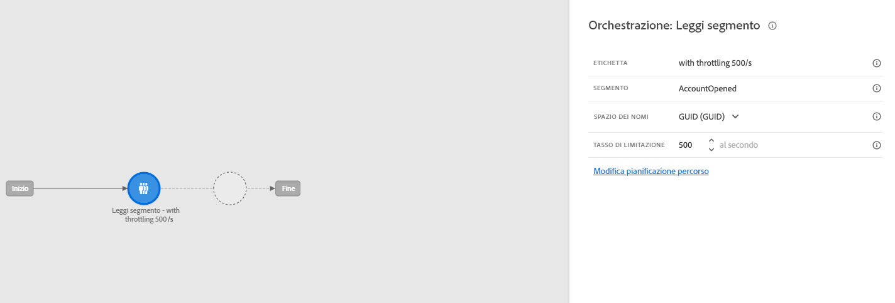
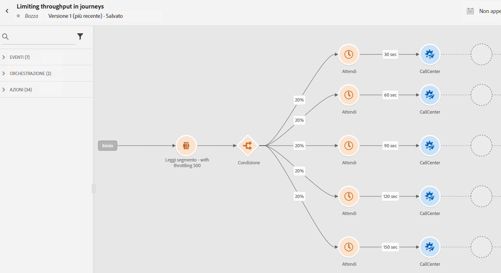

# Caso d’uso: limitare la velocità effettiva con origini dati esterne e azioni personalizzate{#limit-throughput}

## Descrizione del caso d’uso

Adobe Journey Optimizer consente ai professionisti di inviare chiamate API a sistemi esterni tramite l’utilizzo di azioni personalizzate e origini dati.

Questa operazione può essere eseguita con:

* **Origini dati**: per raccogliere informazioni da sistemi esterni e utilizzarle nel contesto del percorso, ad esempio per ottenere informazioni meteo sulla città del profilo e disporre di un flusso di percorso dedicato basato su tale città.

* **Azioni personalizzate**: per inviare informazioni a sistemi esterni, ad esempio per inviare e-mail tramite una soluzione esterna utilizzando le funzionalità di orchestrazione di Journey Optimizer insieme a informazioni di profilo, dati sul pubblico e contesto di percorso.

>[!NOTE]
>
>Poiché le risposte sono ora supportate, per i casi d’uso relativi a origini dati esterne devi utilizzare azioni personalizzate anziché origini dati. Per ulteriori informazioni sulle risposte, consulta questa [sezione](../action/action-response.md)

Se utilizzi origini dati esterne o azioni personalizzate, puoi proteggere i sistemi esterni limitando la velocità effettiva del percorso: fino a 5.000 istanze/secondo per i percorsi unitari e fino a 20.000 istanze/secondo per quelli attivati dal pubblico. Ulteriori informazioni sulle velocità di elaborazione e la velocità effettiva del percorso in [questa sezione](entry-management.md#journey-processing-rate).

Per le azioni personalizzate, sono disponibili funzionalità di limitazione a livello di prodotto. Consulta [questa pagina](../configuration/external-systems.md#capping).

Per le origini dati esterne, puoi definire un limite a livello di endpoint per evitare di sopraffare tali sistemi esterni tramite le API di limitazione di utilizzo di Journey Optimizer. Tuttavia, tutte le richieste rimanenti dopo il raggiungimento del limite verranno ignorate. In questa sezione troverai delle soluzioni alternative che puoi utilizzare per ottimizzare la velocità effettiva.

Per ulteriori informazioni su come eseguire l&#39;integrazione con i sistemi esterni, consulta questa [pagina](../configuration/external-systems.md).

## Implementazione

Per **percorsi attivati dal pubblico**, puoi definire la velocità di lettura dell&#39;attività Read Audience che influirà sulla velocità effettiva del percorso. [Ulteriori informazioni](../building-journeys/read-audience.md)

>[!NOTE]
>
> Questo è il numero massimo di profili che possono entrare nel percorso al secondo. Questo tasso si applica solo a questa attività e non ad altre nel percorso. [Ulteriori informazioni](../building-journeys/read-audience.md)

Potete modificare questo valore da 500 a 20.000 istanze al secondo. Se devi andare al di sotto di 500/s, puoi anche aggiungere condizioni di &quot;suddivisione percentuale&quot; con attività di attesa per suddividere il percorso in più rami e farli eseguire in un momento specifico.

Prendiamo ad esempio un **percorso attivato dal pubblico** che lavora con una popolazione di **10.000 profili** e invia dati a un sistema esterno che supporta **100 richieste/secondo**.

1. Puoi definire il pubblico di lettura per leggere i profili con una velocità effettiva di 500 profili/secondo, il che significa che occorreranno 20 secondi per leggere tutti i profili. Al secondo 1, ne leggerete 500, al secondo 2 500, ecc.

1. Puoi quindi aggiungere un’attività Condizione &quot;suddivisione percentuale&quot; con una suddivisione del 20% in modo da avere a ogni secondo 100 profili in ogni ramo.

1. Dopodiché, aggiungi le attività Attendi con un timer specifico in ciascun ramo. Abbiamo impostato un&#39;attesa di 30 secondi per ciascuno di essi. Ogni secondo, 100 profili confluiranno in ogni ramo.

   * Nel ramo 1, attenderanno 30 secondi, il che significa che:
      * il secondo 1, 100 profili attenderanno il secondo 31
      * al secondo 2, 100 profili attenderanno il secondo 32, ecc.

   * Nel ramo 2, attenderanno 60 secondi, il che significa che:
      * Al secondo 1, 100 profili attenderanno il secondo 61 (1&#39;01&#39;&#39;)
      * Al secondo 2, 100 profili attenderanno il secondo 62 (1&#39;02&#39;&#39;), ecc.

   * Sapendo che ci aspettiamo un massimo di 20 secondi per leggere tutti i profili, non ci sarà alcuna sovrapposizione tra ciascun ramo, il secondo 20 è l’ultimo in cui i profili confluiranno nella condizione. Tra il secondo 31 e il secondo 51, verranno elaborati tutti i profili nel ramo 1. Tra il secondo 61 (1&#39;01&#39;&#39;) e il secondo 81 (1&#39;21&#39;&#39;), verranno elaborati tutti i profili nel ramo 2, ecc.

   * Come guardrail, puoi anche aggiungere un sesto ramo per avere meno di 100 profili per ramo, soprattutto se il sistema esterno supporta solo 100 richieste/secondo.

>[!IMPORTANT]
>
>Come per qualsiasi soluzione alternativa, eseguire il test completo della soluzione prima di passare alla fase di produzione per assicurarsi che esegua le operazioni desiderate.

Come guardrail aggiuntivo, puoi anche utilizzare le funzionalità di limitazione.

>[!NOTE]
>
>A differenza delle funzionalità di limitazione, che proteggono un endpoint come globale per tutti i percorsi di una sandbox, questa soluzione alternativa funziona solo a livello di percorso. Ciò significa che se più percorsi vengono eseguiti in parallelo e hanno come destinazione lo stesso endpoint, dovrai tenerne conto durante la progettazione del percorso. Questa soluzione alternativa non è quindi adatta a ogni caso d’uso.
