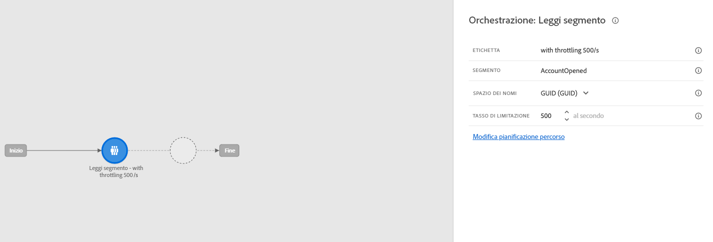
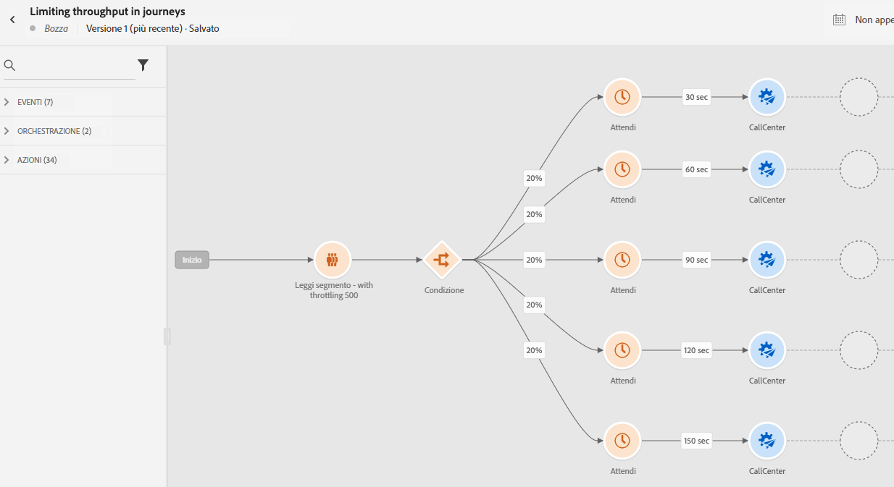

# Caso d’uso: limitare la velocità effettiva con origini dati esterne e azioni personalizzate{#limit-throughput}

>[!BEGINSHADEBOX]

**In questa pagina:** Scopri come limitare l&#39;elaborazione del percorso con azioni personalizzate e origini dati esterne in modo che i sistemi esterni non vengano sovraccaricati oltre il numero di richieste al secondo supportato.

>[!ENDSHADEBOX]

Utilizzare questo caso d&#39;uso per limitare l&#39;elaborazione del percorso quando i sistemi esterni devono gestire un numero massimo di richieste al secondo.

## Descrizione del caso d’uso

[!DNL Adobe Journey Optimizer] consente ai professionisti di inviare chiamate API a sistemi esterni tramite l&#39;utilizzo di azioni personalizzate e origini dati.

Questa operazione può essere eseguita con:

* **Origini dati**: per raccogliere informazioni da sistemi esterni e utilizzarle nel contesto del percorso, ad esempio per ottenere informazioni meteo sulla città del profilo e disporre di un flusso di percorso dedicato basato su tale città.

* **Azioni personalizzate**: per inviare informazioni a sistemi esterni, ad esempio per inviare e-mail tramite una soluzione esterna utilizzando le funzionalità di orchestrazione di Journey Optimizer insieme a informazioni di profilo, dati sul pubblico e contesto di percorso.

>[!NOTE]
>
>Poiché le risposte sono ora supportate, per i casi d’uso relativi a origini dati esterne devi utilizzare azioni personalizzate anziché origini dati. Per ulteriori informazioni sulle risposte, consulta questa [sezione](../action/action-response.md)

Se utilizzi origini dati esterne o azioni personalizzate, puoi proteggere i sistemi esterni limitando la velocità effettiva del percorso: fino a 5.000 istanze/secondo per i percorsi unitari e fino a 20.000 istanze/secondo per quelli attivati dal pubblico. Ulteriori informazioni sulle velocità di elaborazione e la velocità effettiva del percorso in [questa sezione](entry-management.md#journey-processing-rate).

Per le azioni personalizzate, sono disponibili funzionalità di limitazione a livello di prodotto. Consulta [questa pagina](../configuration/external-systems.md#capping).

Per le origini dati esterne, puoi definire un limite a livello di endpoint per evitare di sopraffare tali sistemi esterni tramite le API di limitazione di utilizzo di Journey Optimizer. Tuttavia, tutte le richieste rimanenti dopo il raggiungimento del limite verranno ignorate. In questa sezione troverai delle soluzioni alternative che puoi utilizzare per ottimizzare la velocità effettiva.

Per ulteriori informazioni su come eseguire l&#39;integrazione con i sistemi esterni, consulta questa [pagina](../configuration/external-systems.md).

## Implementazione

Per **percorsi attivati dal pubblico**, puoi definire la velocità di lettura dell&#39;attività Read Audience che influirà sulla velocità effettiva del percorso. [Ulteriori informazioni](../building-journeys/read-audience.md)

>[!NOTE]
>
> Questo è il numero massimo di profili che possono entrare nel percorso al secondo. Questo tasso si applica solo a questa attività e non ad altre nel percorso. [Ulteriori informazioni](../building-journeys/read-audience.md)

Potete modificare questo valore da 500 a 20.000 istanze al secondo. Se devi andare al di sotto di 500/s, puoi anche aggiungere condizioni di &quot;suddivisione percentuale&quot; con attività di attesa per suddividere il percorso in più rami e farli eseguire in un momento specifico.

Prendiamo ad esempio un **percorso attivato dal pubblico** che lavora con una popolazione di **10.000 profili** e invia dati a un sistema esterno che supporta **100 richieste/secondo**.

1. Puoi definire il pubblico di lettura per leggere i profili con una velocità effettiva di 500 profili/secondo, il che significa che occorreranno 20 secondi per leggere tutti i profili. Al secondo 1, ne leggerete 500, al secondo 2 500, ecc.

1. Puoi quindi aggiungere un’attività Condizione &quot;suddivisione percentuale&quot; con una suddivisione del 20% in modo da avere a ogni secondo 100 profili in ogni ramo.

1. Dopodiché, aggiungi le attività Attendi con un timer specifico in ciascun ramo. Abbiamo impostato un&#39;attesa di 30 secondi per ciascuno di essi. Ogni secondo, 100 profili confluiranno in ogni ramo.

   * Nel ramo 1, attenderanno 30 secondi, il che significa che:
      * il secondo 1, 100 profili attenderanno il secondo 31
      * al secondo 2, 100 profili attenderanno il secondo 32, ecc.

   * Nel ramo 2, attenderanno 60 secondi, il che significa che:
      * Al secondo 1, 100 profili attenderanno il secondo 61 (1&#39;01&#39;&#39;)
      * Al secondo 2, 100 profili attenderanno il secondo 62 (1&#39;02&#39;&#39;), ecc.

   * Sapendo che ci aspettiamo un massimo di 20 secondi per leggere tutti i profili, non ci sarà alcuna sovrapposizione tra ciascun ramo, il secondo 20 è l’ultimo in cui i profili confluiranno nella condizione. Tra il secondo 31 e il secondo 51, verranno elaborati tutti i profili nel ramo 1. Tra il secondo 61 (1&#39;01&#39;&#39;) e il secondo 81 (1&#39;21&#39;&#39;), verranno elaborati tutti i profili nel ramo 2, ecc.

   * Come guardrail, puoi anche aggiungere un sesto ramo per avere meno di 100 profili per ramo, soprattutto se il sistema esterno supporta solo 100 richieste/secondo.

>[!IMPORTANT]
>
>Come per qualsiasi soluzione alternativa, eseguire il test completo della soluzione prima di passare alla fase di produzione per assicurarsi che esegua le operazioni desiderate.

Come guardrail aggiuntivo, puoi anche utilizzare le funzionalità di limitazione.

>[!NOTE]
>
>A differenza delle funzionalità di limitazione, che proteggono un endpoint come globale per tutti i percorsi di una sandbox, questa soluzione alternativa funziona solo a livello di percorso. Ciò significa che se più percorsi vengono eseguiti in parallelo e hanno come destinazione lo stesso endpoint, dovrai tenerne conto durante la progettazione del percorso. Questa soluzione alternativa non è quindi adatta a ogni caso d’uso.

+++ Guida di riferimento della Knowledge Base di AI

Questa sezione contiene informazioni strutturate che supportano l&#39;interpretazione, il recupero e la risposta alle domande relative a questo argomento.

Per una comprensione completa, queste informazioni devono essere unite alla documentazione su questa pagina. Nessuna delle due origini è progettata per essere indipendente; la pagina descrive la funzione, mentre questa sezione fornisce un contesto aggiuntivo che aiuta a non ambiguare la terminologia, le finalità, l’applicabilità e i vincoli.

* **TL;DR:** Questa pagina spiega come limitare la velocità effettiva del percorso quando le origini dati esterne o le azioni personalizzate hanno un numero massimo di richieste al secondo, utilizzando la configurazione della frequenza di lettura del pubblico, le divisioni percentuali e le attività di attesa.

**Intenti:**

* Limitare il throughput di un percorso attivato dal pubblico per evitare che un sistema esterno venga sovraccaricato
* Configurare la velocità di lettura di un’attività Read Audience per controllare il numero di profili immessi al secondo
* Combinare le condizioni di suddivisione della percentuale e le attività di attesa per distribuire l’elaborazione del profilo nel tempo
* Comprendere la differenza tra le soluzioni di throughput a livello di percorso e le funzionalità di limitazione a livello di sandbox
* Applicare le funzionalità di limitazione alle azioni personalizzate a livello di prodotto

**Glossario:**

* **Limitazione/limitazione della velocità effettiva**: controllo della velocità di flusso dei profili in un percorso per evitare di superare la capacità di richiesta di un sistema esterno. *(specifico per prodotto)*
* **Frequenza di lettura del pubblico di lettura**: parametro configurabile nell&#39;attività Read audience che imposta il numero massimo di profili che entrano nel percorso al secondo (intervallo: 500-20.000 istanze/secondo). *(specifico per prodotto)*
* **API di limitazione**: un&#39;API Journey Optimizer che definisce un limite massimo di richieste per endpoint per le origini dati esterne; le richieste oltre il limite vengono eliminate. *(specifico per prodotto)*
* **Condizione di suddivisione percentuale**: un&#39;attività condizione che divide il flusso del profilo in rami per percentuale, utilizzata qui per distribuire i profili tra percorsi di attesa scaglionati nel tempo. *(specifico per prodotto)*

**Guardrail:**

* La velocità di lettura dei tipi di pubblico può essere impostata tra 500 e 20.000 istanze al secondo; valori inferiori a 500/s richiedono una soluzione alternativa utilizzando le suddivisioni percentuali e le attività di attesa
* I percorsi unitari supportano fino a 5.000 istanze/secondo; i percorsi attivati dal pubblico supportano fino a 20.000 istanze/secondo
* La soluzione alternativa suddivisa in percentuale e attendi funziona solo a livello di percorso e non in tutti i percorsi della sandbox
* Quando più percorsi eseguono il targeting in parallelo dello stesso endpoint esterno, questa soluzione alternativa non tiene conto del carico combinato. In alternativa, è necessario utilizzare le funzionalità di limitazione
* Le richieste rimanenti che superano il limite di limite per le origini dati esterne vengono ignorate, non accodate
* La soluzione alternativa deve essere testata accuratamente prima di procedere alla produzione

**Terminologia:**

* Nome canonico: limitazione della velocità effettiva — Acronimo: none — varianti: limitazione della velocità, controllo della velocità effettiva del percorso
* Sinonimi: &quot;Limitazione&quot; = &quot;limitazione&quot; nel contesto della protezione degli endpoint esterni
* Non confondere: &quot;Capping API (livello endpoint)&quot; ≠ &quot;reading rate (livello percorso)&quot; — L’API Capping si applica a livello globale a tutti i percorsi in una sandbox che esegue il targeting di un endpoint; la velocità di lettura e la soluzione alternativa di suddivisione/attesa si applicano solo al singolo percorso

**Domande frequenti:**

* **D: qual è la velocità massima di lettura che è possibile impostare in un&#39;attività Read Audience?** — Tra 500 e 20.000 profili al secondo; per scendere al di sotto di 500/s, utilizza una suddivisione percentuale con le attività di attesa.
* **D: in che modo le divisioni percentuali e le attività di attesa aiutano a limitare la velocità effettiva?** suddividendo i profili in rami (ad esempio, 20% ciascuno) e aggiungendo timer di attesa sfalsati per ramo, potrai garantire che solo un numero controllato di profili raggiunga il sistema esterno al secondo.
* **D: la soluzione alternativa suddivisa in percentuale protegge tutti i percorsi che hanno come destinazione lo stesso endpoint?** — No; funziona solo a livello di singolo percorso. Se più percorsi vengono eseguiti in parallelo sullo stesso endpoint, utilizza le funzionalità di limitazione a livello di sandbox.
* **D: cosa succede alle richieste che superano il limite di limitazione su un&#39;origine dati esterna?** — Vengono eliminati; l’API di limite non mette in coda le richieste in eccesso.
* **Q: devo utilizzare azioni personalizzate o origini dati per casi di utilizzo di dati esterni?** — Le azioni personalizzate sono preferite perché supportano la gestione delle risposte; le origini dati devono essere utilizzate solo quando il caso d’uso le richiede specificamente.

+++
