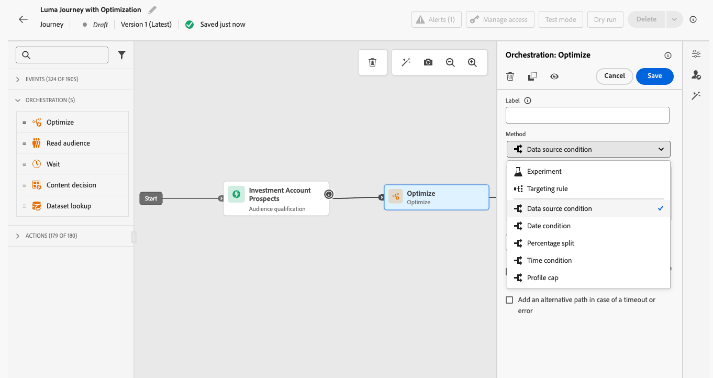
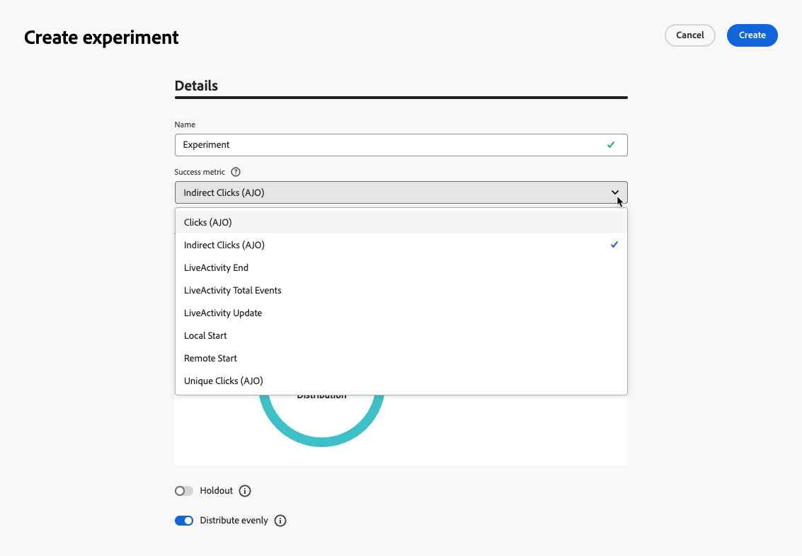
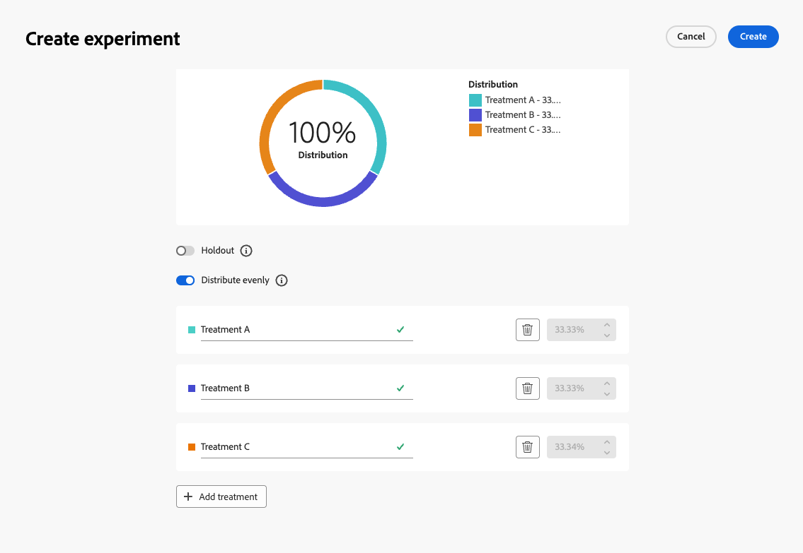
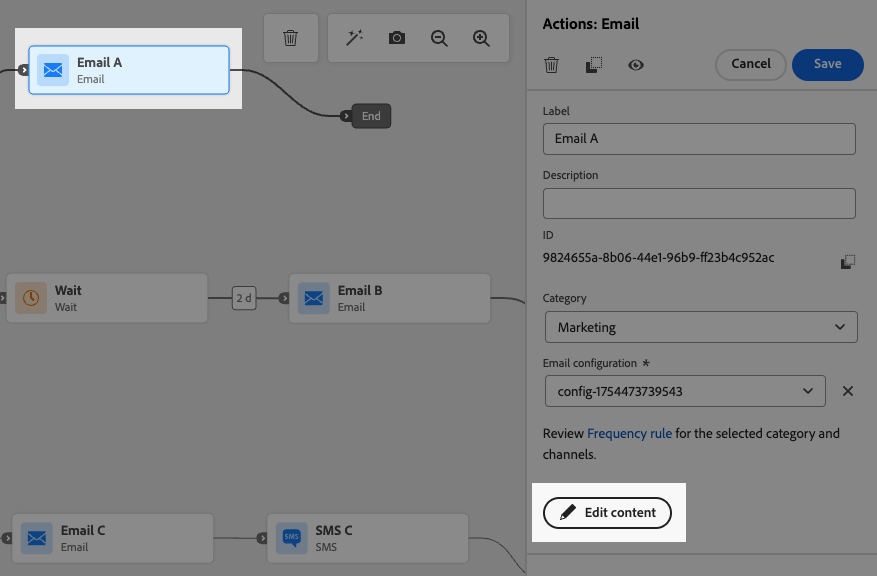
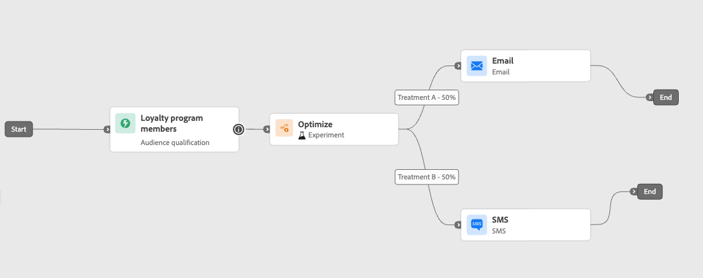
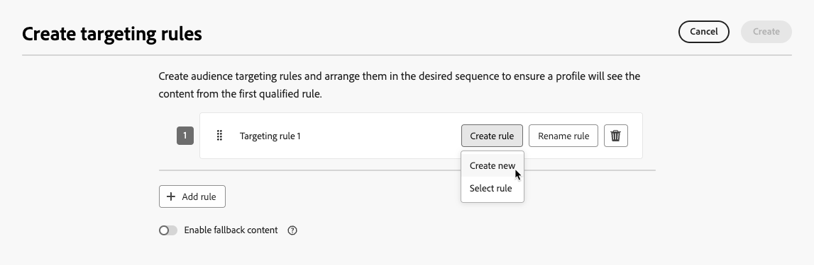

# Attività Ottimizza {#journey-path-optimization}

>[!CONTEXTUALHELP]
>id="ajo_journey_optimize"
>title="Attività Ottimizza"
>abstract="L’attività **Ottimizza** consente di definire il modo in cui i singoli utenti avanzano nel percorso creando più percorsi in base a criteri specifici, inclusi sperimentazione, targeting e condizioni specifiche."

>[!AVAILABILITY]
>
>Questa funzionalità è in disponibilità limitata. Per ottenere l’accesso, contatta il rappresentante Adobe.

L&#39;attività **Ottimizza** consente di definire il modo in cui i singoli utenti avanzano nel percorso creando più **percorsi** in base a criteri specifici, tra cui sperimentazione, targeting e condizioni specifiche, garantendo il massimo coinvolgimento e successo nella creazione di percorsi altamente personalizzati ed efficaci.

Un percorso **percorso** può essere costituito da uno dei seguenti elementi: sequenza di comunicazioni, tempo che intercorre tra di esse, numero di comunicazioni o una combinazione di queste tre variabili.

Ad esempio, un percorso potrebbe contenere un messaggio e-mail, un altro potrebbe contenere due messaggi SMS e un terzo potrebbe contenere un messaggio e-mail, un nodo Attendi di due ore e quindi un messaggio SMS.

<!--With this feature, [!DNL Journey Optimizer] empowers you with the tools to deliver personalized and optimized paths to your audience, ensuring maximum engagement and success to create highly customized and effective journeys.-->

Tramite l&#39;attività **Ottimizza**, è possibile eseguire le azioni seguenti sui percorsi risultanti:

* Esegui [esperimenti percorso](#experimentation)
* Sfrutta le regole di [targeting](#targeting) in ogni percorso di percorso
* Applica [condizioni](#conditions) ai tuoi percorsi

Una volta che il percorso è attivo, i profili vengono valutati in base ai criteri definiti e, in base ai criteri di corrispondenza, vengono inviati lungo il percorso appropriato dal percorso.

## Utilizzare la sperimentazione {#experimentation}

>[!CONTEXTUALHELP]
>id="ajo_path_experiment_success_metric"
>title="Metrica di successo"
>abstract="La metrica di successo viene utilizzata per tracciare e valutare il trattamento dalle prestazioni migliori in un esperimento."
>additional-url="https://experienceleague.adobe.com/en/docs/journey-optimizer/using/orchestrate-journeys/create-journey/success-metrics" text="Configurare e tenere traccia della metriche del percorso"

La sperimentazione consente di testare percorsi diversi in base a una suddivisione casuale per determinare quale funziona meglio in base a metriche di successo predefinite.

Per impostare la sperimentazione dei percorsi in un percorso, segui i passaggi riportati di seguito.

Supponiamo che tu voglia confrontare tre percorsi:

* un percorso con un messaggio e-mail;
* un secondo percorso con un nodo **[!UICONTROL Wait]** di due giorni e un&#39;e-mail;
* un terzo percorso con un’e-mail e quindi un messaggio SMS.

1. Dalla sezione **[!UICONTROL Orchestrazione]**, trascina l&#39;attività **[!UICONTROL Ottimizza]** nell&#39;area di lavoro del percorso.

1. Aggiungi un’etichetta facoltativa che può essere utile per identificare l’attività nei rapporti e nei registri della modalità di test.

1. Selezionare **[!UICONTROL Esperimento]** dall&#39;elenco a discesa **[!UICONTROL Metodo]**.

   {width=65%}

1. Fai clic su **[!UICONTROL Crea esperimento]**.

1. Seleziona la **[!UICONTROL metrica di successo]** da impostare per l&#39;esperimento. Ulteriori informazioni sulle metriche disponibili e su come configurare l&#39;elenco in [questa sezione](success-metrics.md).

   {width=80%}

1. Puoi scegliere di aggiungere un gruppo **[!UICONTROL Holdout]** alla consegna. Questo gruppo non entrerà in alcun percorso da questo esperimento.

   >[!NOTE]
   >
   >Il passaggio alla barra di attivazione occuperà automaticamente il 10% della popolazione. Se necessario, puoi regolare questa percentuale.

   <!--
    DOES THIS APPLY TO PATH EXPERIMENT?
    IMPORTANT: When a holdout group is used in an action for path experimentation, the holdout assignment only applies to that specific action. After the action is completed, profiles in the holdout group will continue down the journey path and can receive messages from other actions. Therefore, ensure that any subsequent messages do not rely on the receipt of a message by a profile that might be in a holdout group. If they do, you may need to remove the holdout assignment.-->

1. Puoi allocare una percentuale precisa a ogni **[!UICONTROL Trattamento]** o semplicemente attivare la barra di selezione **[!UICONTROL Distribuisci uniformemente]**.

   {width=80%}

1. Fai clic su **[!UICONTROL Crea]**.

1. Definisci gli elementi desiderati per ogni ramo risultante dall’esperimento, ad esempio:

   * Trascina e rilascia un&#39;attività [E-mail](../email/create-email.md) nel primo ramo (**Trattamento A**).

   * Trascina e rilascia un&#39;attività [Wait](wait-activity.md) di due giorni sul primo ramo, seguita da un&#39;attività [Email](../email/create-email.md) (**Trattamento B**).

   * Trascina e rilascia un&#39;attività [E-mail](../email/create-email.md) nel terzo ramo, seguito da un&#39;attività [SMS](../sms/create-sms.md) (**Trattamento C**).

   {width=100%}

1. Facoltativamente, utilizzare **[!UICONTROL Aggiungi un percorso alternativo in caso di timeout o errore]** per definire un&#39;azione di fallback. [Ulteriori informazioni](using-the-journey-designer.md#paths)

1. Seleziona un&#39;azione del canale e utilizza il pulsante **[!UICONTROL Modifica contenuto]** per accedere agli strumenti di progettazione.

   {width=70%}

1. Da lì, utilizzando il riquadro a sinistra puoi spostarti tra i diversi contenuti di ogni azione nell’esperimento. Seleziona ogni contenuto e progettalo in base alle esigenze.

   {width=100%}

1. [Pubblica](publishing-the-journey.md) il tuo percorso.

Una volta che il percorso è attivo, gli utenti vengono assegnati in modo casuale per seguire percorsi diversi. [!DNL Journey Optimizer] tiene traccia del percorso più performante e fornisce informazioni fruibili.

Segui il successo del tuo percorso con il rapporto Percorsi Path Experiment (Esperimento percorso ). [Ulteriori informazioni](../reports/journey-global-report-cja-experimentation.md)

### Casi di utilizzo dell’esperimento {#uc-experiment}

Gli esempi seguenti mostrano come utilizzare l&#39;attività **[!UICONTROL Ottimizza]** con il metodo **[!UICONTROL Esperimento]** per determinare quale percorso funziona meglio nel complesso.

+++Efficacia del canale

Verifica se l’invio del primo messaggio tramite e-mail rispetto agli SMS determina conversioni più elevate.

➡️ Utilizza il tasso di conversione come metrica di successo (ad esempio: acquisti, iscrizioni).

+++

+++Frequenza dei messaggi

Esegui un esperimento per verificare se l’invio di un’e-mail rispetto a tre e-mail in una settimana comporta più acquisti.

➡️ Utilizza gli acquisti o il tasso di annullamento dell&#39;iscrizione come metrica di successo.

+++

+++Tempo di attesa tra le comunicazioni

Confronta un’attesa di 24 ore con un’attesa di 72 ore prima di un follow-up per determinare quale tempistica massimizza il coinvolgimento.

➡️ Utilizza il tasso di click-through o i ricavi come metrica di successo.

+++

## Utilizzo del targeting {#targeting}

>[!CONTEXTUALHELP]
>id="ajo_path_targeting_fallback"
>title="Cos’è il percorso di fallback?"
>abstract="I percorsi di fallback consentono al pubblico di accedere a un percorso alternativo quando non sono qualificate regole di targeting.  Se non selezioni questa opzione, qualsiasi pubblico non idoneo per una regola di targeting non entrerà nel percorso di fallback ed uscirà dal percorso."

Le regole di targeting consentono di determinare regole o qualifiche specifiche che devono essere soddisfatte affinché un cliente possa accedere a uno dei percorsi di percorso, in base a segmenti di pubblico specifici<!-- depending on profile attributes or contextual attributes-->.

A differenza della sperimentazione, che è un’assegnazione casuale di un determinato percorso, il targeting è deterministico in termini di garantire che il pubblico o il profilo giusto entri nel percorso specificato.

<!--With targeting, specific rules can be defined based on:

* **User profile attributes** such as location (eg. geo-targeting), age, or preferences. For example, users in the US receive a "Golden Gate" promotion, while users in France receive an "Eiffel Tower" promotion.

* **Contextual data** such as device type (eg. device-targeting), time of day, or session details. For example, desktop users receive desktop-optimized content, while mobile users receive mobile-optimized content.

* **Audiences** which can be used to include or exclude profiles that have a particular audience membership.-->

Per impostare il targeting in un percorso, segui i passaggi indicati di seguito.

1. Dalla sezione **[!UICONTROL Orchestrazione]**, trascina l&#39;attività **[!UICONTROL Ottimizza]** nell&#39;area di lavoro del percorso.

1. Aggiungi un’etichetta facoltativa che può essere utile per identificare l’attività nei rapporti e nei registri della modalità di test.

1. Selezionare **[!UICONTROL Regola di targeting]** dall&#39;elenco a discesa **[!UICONTROL Metodo]**.

   {width=60%}

1. Fai clic su **[!UICONTROL Crea regola di targeting]**.

1. Fai clic su **[!UICONTROL Crea regola]** > **[!UICONTROL Crea nuovo]** e utilizza il generatore di regole per definire i criteri.

   {width=100%}

   Definire ad esempio una regola per i membri Gold del programma fedeltà (`loyalty.status.equals("Gold", false)`) e una regola per gli altri membri (`loyalty.status.notEqualTo("Gold", false)`).

   

1. Puoi anche fare clic su **[!UICONTROL Crea regola]** > **[!UICONTROL Seleziona regola]** per selezionare una regola di targeting esistente creata dal menu **[!UICONTROL Regole]**. [Ulteriori informazioni](../experience-decisioning/rules.md)

   {width=70%}

   In questo caso, la formula che costituisce la regola viene semplicemente copiata nell’attività di percorso. Eventuali modifiche successive apportate alla regola dal menu **[!UICONTROL Regole]** non influiranno sulla copia del percorso.

   >[!AVAILABILITY]
   >
   >[La creazione di regole di targeting](../experience-decisioning/rules.md#create) dal menu dedicato [!DNL Journey Optimizer] è attualmente disponibile per le organizzazioni che hanno acquistato l&#39;offerta del componente aggiuntivo Decisioning e per le altre organizzazioni (disponibilità limitata).
   >
   >Questa capacità verrà gradualmente estesa a tutti i clienti. Nel frattempo, contatta il tuo rappresentante Adobe per ottenere l’accesso.

1. Dopo aver aggiunto una regola, puoi comunque modificarla. Scegli **[!UICONTROL Modifica in linea]** per aggiornarlo in movimento utilizzando il generatore di regole, oppure **[!UICONTROL Seleziona regola]** per raccogliere un&#39;altra regola esistente.

   {width=100%}

   >[!NOTE]
   >
   >La modifica in linea di una regola non influisce sulla regola esistente da cui ha origine.

1. Selezionare l&#39;opzione **[!UICONTROL Abilita percorso di fallback]** in base alle esigenze. Questa azione crea un percorso di fallback per il pubblico che non soddisfa nessuna delle regole di targeting definite in precedenza.

   >[!NOTE]
   >
   >Se non selezioni questa opzione, qualsiasi pubblico non idoneo per una regola di targeting non entra nel percorso di fallback ed esce dal percorso.

1. Fai clic su **[!UICONTROL Crea]** per salvare le impostazioni delle regole di targeting.

1. Sempre nel percorso, rilascia azioni specifiche per personalizzare ogni percorso. Ad esempio, crea un’e-mail con offerte personalizzate per i membri Gold Loyalty e un promemoria SMS per tutti gli altri membri.

   

1. Se hai selezionato l&#39;opzione **[!UICONTROL Abilita contenuto di fallback]** durante la definizione delle impostazioni della regola, definisci una o più azioni per il percorso di fallback aggiunto automaticamente.

   {width=70%}

1. Facoltativamente, utilizzare **[!UICONTROL Aggiungi un percorso alternativo in caso di timeout o errore]** per definire un&#39;azione alternativa in caso di problemi. [Ulteriori informazioni](using-the-journey-designer.md#paths)

1. Progetta il contenuto appropriato per ogni azione corrispondente a ciascun gruppo definito dalle impostazioni della regola di targeting. Puoi navigare facilmente tra i diversi contenuti di ogni azione.

   

   In questo esempio, progetta un’e-mail con offerte speciali per gli iscritti Gold e un promemoria SMS per gli altri membri.

1. [Pubblica](publishing-the-journey.md) il tuo percorso.

Una volta che il percorso è attivo, il percorso specificato per ciascun segmento viene elaborato in modo che i membri Gold entrino nel percorso con le offerte e-mail, mentre gli altri membri entrino nel percorso con il promemoria SMS.

Segui il successo del tuo percorso con il rapporto sul Percorso. [Ulteriori informazioni](../reports/journey-global-report-cja.md#targeting)

### Casi di utilizzo delle regole di targeting {#uc-targeting}

Gli esempi seguenti mostrano come utilizzare l&#39;attività **[!UICONTROL Ottimizza]** con il metodo **[!UICONTROL Regola di targeting]** per personalizzare i percorsi per diversi tipi di pubblico secondario.

+++Canali specifici del segmento

I membri fedeltà con stato Gold possono ricevere offerte personalizzate tramite e-mail, mentre tutti gli altri membri sono indirizzati a promemoria SMS.

<!--➡️ Use the revenue per profile or conversion rate as the optimization metric.-->

+++

+++Targeting basato sul comportamento

Ai clienti che hanno aperto un’e-mail ma non hanno fatto clic su viene inviata una notifica push, mentre a quelli che non hanno aperto viene inviato un SMS.

<!--➡️ Use the click-through rate or downstream conversions as the optimization metric.-->

+++

+++Targeting cronologia acquisti

I clienti che hanno acquistato di recente possono entrare in un breve percorso di &quot;Grazie + Cross-selling&quot;, mentre quelli senza cronologia di acquisto entrano in un percorso di sviluppo più lungo.

<!--➡️ Use the repeat purchase rate or engagement rate as the optimization metric.-->

+++

### Aggiungere una condizione {#conditions}

Le condizioni sono un tipo di regole di [targeting](#targeting) che ti consentono di definire il modo in cui i singoli utenti avanzano nel percorso creando più percorsi in base a criteri specifici.

Scopri come definire una condizione in [questa sezione](conditions.md).

Sono disponibili i seguenti tipi di condizioni:

* [Condizione Data Source](condition-activity.md#data_source_condition)
* [Condizione temporale](condition-activity.md#time_condition)
* [Divisione percentuale](condition-activity.md#percentage_split)
* [Condizione data](condition-activity.md#date_condition)
* [Limite del profilo](condition-activity.md#profile_cap)
