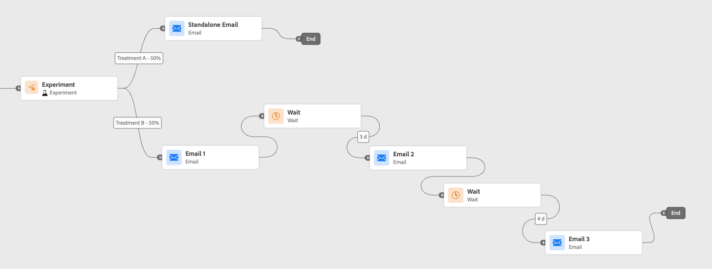
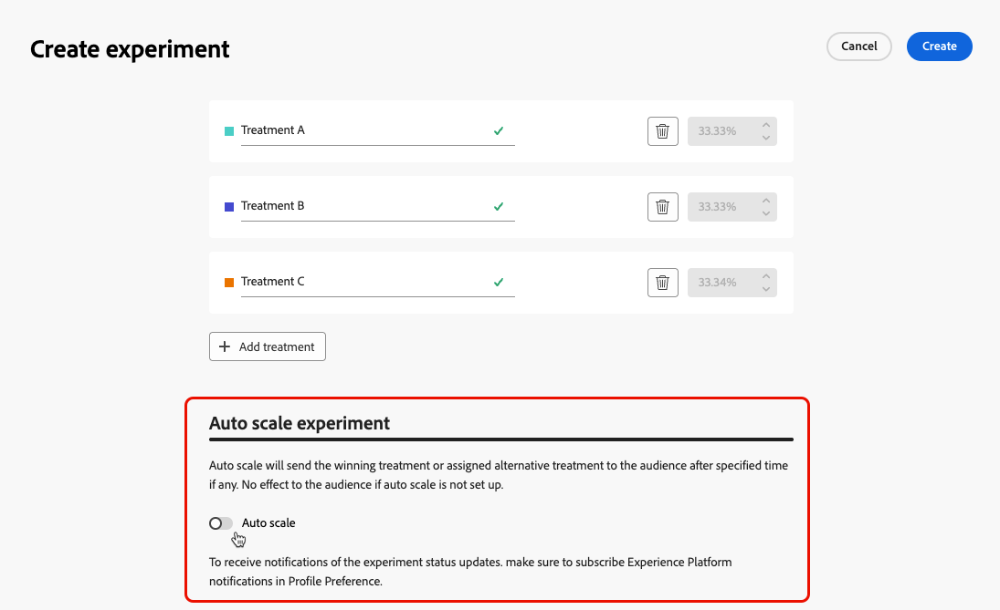

# Utilizzare la sperimentazione del percorso {#experimentation}

>[!CONTEXTUALHELP]
>id="ajo_path_experiment_success_metric"
>title="Metrica di successo"
>abstract="La metrica di successo viene utilizzata per monitorare e valutare il trattamento dalle prestazioni migliori in un esperimento."
>additional-url="https://experienceleague.adobe.com/it/docs/journey-optimizer/using/orchestrate-journeys/create-journey/success-metrics" text="Configurare e tenere traccia della metriche del percorso"

La sperimentazione consente di testare percorsi diversi in base a una suddivisione casuale per determinare quale funziona meglio in base a metriche di successo predefinite.

Per impostare la sperimentazione dei percorsi in un percorso, segui i passaggi riportati di seguito.

Supponiamo che tu voglia confrontare tre percorsi:

* un percorso con un messaggio e-mail;
* un secondo percorso con un nodo **[!UICONTROL Wait]** di due giorni e un&#39;e-mail;
* un terzo percorso con un’e-mail e quindi un messaggio SMS.

1. Dalla sezione **[!UICONTROL Orchestrazione]**, trascina l&#39;attività **[!UICONTROL Ottimizza]** nell&#39;area di lavoro del percorso.

1. Aggiungi un’etichetta facoltativa che può essere utile per identificare l’attività nei rapporti e nei registri della modalità di test.

1. Selezionare **[!UICONTROL Esperimento]** dall&#39;elenco a discesa **[!UICONTROL Metodo]**.

   {width=65%}

1. Fai clic su **[!UICONTROL Crea esperimento]**.

1. Seleziona la **[!UICONTROL metrica di successo]** da impostare per l&#39;esperimento. Ulteriori informazioni sulle metriche disponibili e su come configurare l&#39;elenco in [questa sezione](success-metrics.md).

   {width=80%}

1. Seleziona il **[!UICONTROL tipo di esperimento]** per l&#39;esperimento del percorso:

   * **[!UICONTROL Esperimento A/B]**: definire la suddivisione del traffico tra i trattamenti all&#39;inizio del test. Le prestazioni vengono valutate in base alla metrica principale scelta; il reporting mostra l’incremento osservato tra i trattamenti.

   * **[!UICONTROL Slot multi-armed]**: il traffico suddiviso tra i trattamenti viene gestito automaticamente. Ogni 7 giorni, le prestazioni sulla metrica principale vengono riviste e i pesi vengono regolati di conseguenza. Il reporting continua a mostrare l’incremento, come per i test A/B.

   {width=80%}

   ➡️ [Ulteriori informazioni sulla differenza tra esperimenti A/B e Multi-armed bandit](../content-management/mab-vs-ab.md)

1. Puoi scegliere di aggiungere un gruppo **[!UICONTROL Holdout]** alla consegna. Questo gruppo non entrerà in alcun percorso da questo esperimento.

   >[!NOTE]
   >
   >Il passaggio alla barra di attivazione occuperà automaticamente il 10% della popolazione. Se necessario, puoi regolare questa percentuale.

   <!--
    DOES THIS APPLY TO PATH EXPERIMENT?
    IMPORTANT: When a holdout group is used in an action for path experimentation, the holdout assignment only applies to that specific action. After the action is completed, profiles in the holdout group will continue down the journey path and can receive messages from other actions. Therefore, ensure that any subsequent messages do not rely on the receipt of a message by a profile that might be in a holdout group. If they do, you may need to remove the holdout assignment.
-->

1. Puoi allocare una percentuale precisa a ogni **[!UICONTROL Trattamento]** o semplicemente attivare la barra di selezione **[!UICONTROL Distribuisci uniformemente]**.

   {width=80%}

1. Abilita l’esperimento di scalabilità automatica per distribuire automaticamente la variante vincente dell’esperimento. [Ulteriori informazioni sulla scalabilità del vincitore](#scale-winner)

1. Fai clic su **[!UICONTROL Crea]**.

1. Definisci gli elementi desiderati per ogni ramo risultante dall’esperimento, ad esempio:

   * Trascina e rilascia un&#39;attività [E-mail](../email/create-email.md) nel primo ramo (**Trattamento A**).

   * Trascina e rilascia un&#39;attività [Wait](wait-activity.md) di due giorni sul primo ramo, seguita da un&#39;attività [Email](../email/create-email.md) (**Trattamento B**).

   * Trascina e rilascia un&#39;attività [E-mail](../email/create-email.md) nel terzo ramo, seguito da un&#39;attività [SMS](../mobile/create-mobile-message.md) (**Trattamento C**).

   {width=100%}

1. Facoltativamente, utilizzare **[!UICONTROL Aggiungi un percorso alternativo in caso di timeout o errore]** per definire un&#39;azione di fallback. [Ulteriori informazioni](using-the-journey-designer.md#paths)

1. [Pubblica](publish-journey.md) il tuo percorso.

<!--
    Select a channel action and use the **[!UICONTROL Edit content]** button to access the design tools.

    {width=70%}

    From there, using the left pane you can navigate between the different contents for each action in your experiment. Select each content and design it as needed.

    {width=100%}
-->

Una volta che il percorso è attivo, gli utenti vengono assegnati in modo casuale per seguire percorsi diversi. [!DNL Journey Optimizer] tiene traccia del percorso più performante e fornisce informazioni fruibili.

Segui il successo del tuo percorso con il rapporto Percorsi Path Experiment (Esperimento percorso ). [Ulteriori informazioni](../reports/journey-global-report-cja-experimentation.md)

<!--
REMOVED WITH GA

>[!CAUTION]
>
>Do not edit the metadata of a path experiment once it has been published. Editing the metadata will disrupt the calculation and reporting of experiment results.
-->

## Casi di utilizzo dell’esperimento {#uc-experiment}

Gli esempi seguenti mostrano come utilizzare l&#39;attività **[!UICONTROL Ottimizza]** con il metodo **[!UICONTROL Esperimento]** per determinare quale percorso funziona meglio nel complesso.

+++Efficacia del canale

Verifica se l’invio del primo messaggio tramite e-mail rispetto agli SMS determina conversioni più elevate.

➡️ Utilizza il tasso di conversione come metrica di successo (ad esempio: acquisti, iscrizioni).

+++

+++Frequenza dei messaggi

Esegui un esperimento per verificare se l’invio di un’e-mail rispetto a tre e-mail in una settimana comporta più acquisti.

➡️ Utilizza gli acquisti o il tasso di annullamento dell&#39;iscrizione come metrica di successo.

+++

+++Tempo di attesa tra le comunicazioni

Confronta un’attesa di 24 ore con un’attesa di 72 ore prima di un follow-up per determinare quale tempistica massimizza il coinvolgimento.

➡️ Utilizza il tasso di click-through o i ricavi come metrica di successo.

+++

## Ridimensiona il vincitore {#scale-winner}

>[!AVAILABILITY]
>
>Per gli esperimenti di percorso, la funzione Scala vincitore è disponibile solo in percorsi unitari (qualifiche attivate da eventi e Pubblico).
>
>Non è disponibile per percorsi Leggi pubblico.

Per &quot;scalare il vincitore&quot; si intende presentare automaticamente o manualmente la variante vincente di un esperimento a tutto il pubblico. Questa funzione assicura che, una volta determinato il vincitore, sia possibile amplificarne la portata e l&#39;efficacia senza monitorare costantemente l&#39;esperimento.

Puoi scegliere tra due modalità:

* **Ridimensionamento automatico**: configura le impostazioni di ridimensionamento automatico durante la creazione dell&#39;esperimento scegliendo il momento e le condizioni per il ridimensionamento del trattamento vincente o un&#39;opzione di fallback se non emerge alcun vincitore.

* **Ridimensionamento manuale**: rivedi manualmente i risultati dell&#39;esperimento e avvia il rollout del trattamento vincente, mantenendo il controllo completo sui tempi e sulle decisioni.

### Ridimensionamento automatico {#autoscaling}

Il ridimensionamento automatico consente di impostare regole predefinite per il momento in cui eseguire il rollout del trattamento vincente o di un fallback, in base ai risultati dell’esperimento.

Si noti che, una volta eseguito il ridimensionamento automatico, il ridimensionamento manuale non è più disponibile.

Per abilitare la scalabilità automatica negli esperimenti:

1. Imposta il percorso e configura l’esperimento in base alle esigenze. [Ulteriori informazioni](#experimentation)

1. Abilita l’opzione di scalabilità automatica durante la configurazione dell’esperimento.

   

1. Seleziona quando ridimensionare il vincitore:

   * Non appena viene trovato il vincitore.
   * Dopo l’esperimento è attivo per il tempo selezionato.

   Il tempo di ridimensionamento automatico deve essere pianificato prima della data di fine dell’esperimento. Se è impostato per un periodo di tempo successivo alla data di fine, verrà visualizzato un avviso di convalida e il percorso non verrà pubblicato.

   

1. Scegli il comportamento di fallback se non viene trovato alcun vincitore in base al tempo di scala:

   * Continua l’esperimento fino alla fine come pianificato.
   * Ridimensionare il trattamento alternativo dopo un tempo specificato.

Una volta soddisfatti tutti i parametri, il trattamento vincente o alternativo viene inviato al pubblico.

### Ridimensionamento manuale {#manual-scaling}

La scalabilità manuale consente di esaminare i risultati dell’esperimento e di decidere quando distribuire il trattamento vincente secondo la propria pianificazione.

Se si ridimensiona manualmente il vincitore prima del tempo di scalabilità automatica programmato, la scalabilità automatica viene annullata.

Per ridimensionare manualmente il vincitore degli esperimenti:

1. Imposta il percorso e configura l’esperimento in base alle esigenze. [Ulteriori informazioni](#experimentation)

1. Consenti l’esecuzione dell’esperimento fino a quando non viene identificato un vincitore o non viene raggiunta la significatività statistica.

1. Apri il percorso e seleziona l&#39;attività **[!UICONTROL Ottimizza]** che contiene l&#39;esperimento del percorso.

   Esaminare i risultati nella visualizzazione **[!UICONTROL Esperimento percorso]** per identificare il trattamento dalle prestazioni migliori.

   

1. Fai clic su **[!UICONTROL Scala trattamento]** per inviare il trattamento vincente al resto del pubblico.

   <!---->

1. Selezionare il trattamento da scalare dal menu a discesa e fare clic su **[!UICONTROL Scala]**.

   {width=80%}

Si noti che la modifica in scala del trattamento può richiedere fino a un’ora. Riceverai una notifica al termine del processo di ridimensionamento manuale.
