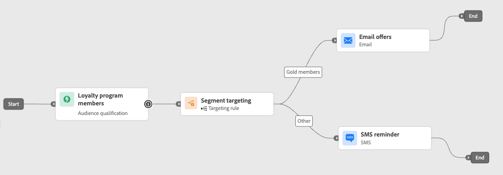

# Sfruttare il targeting del percorso {#targeting}

>[!CONTEXTUALHELP]
>id="ajo_path_targeting_fallback"
>title="Cos’è un percorso di fallback?"
>abstract="I percorsi di fallback consentono al pubblico di entrare in un percorso alternativo qualora non si qualifichi alcuna regola di targeting.  Se questa opzione non è selezionata, qualsiasi pubblico non idoneo per una regola di targeting non entrerà nel percorso di fallback ed uscirà dal percorso."

Le regole di targeting consentono di determinare regole o qualifiche specifiche che devono essere soddisfatte affinché un cliente possa accedere a uno dei percorsi di percorso, in base a segmenti di pubblico specifici<!-- depending on profile attributes or contextual attributes-->.

A differenza della sperimentazione, che è un’assegnazione casuale di un determinato percorso, il targeting è deterministico in termini di garantire che il pubblico o il profilo giusto entri nel percorso specificato.

<!--
With targeting, specific rules can be defined based on:

* **User profile attributes** such as location (eg. geo-targeting), age, or preferences. For example, users in the US receive a "Golden Gate" promotion, while users in France receive an "Eiffel Tower" promotion.

* **Contextual data** such as device type (eg. device-targeting), time of day, or session details. For example, desktop users receive desktop-optimized content, while mobile users receive mobile-optimized content.

* **Audiences** which can be used to include or exclude profiles that have a particular audience membership.
-->

Per impostare il targeting in un percorso, segui i passaggi indicati di seguito.

1. Dalla sezione **[!UICONTROL Orchestrazione]**, trascina l&#39;attività **[!UICONTROL Ottimizza]** nell&#39;area di lavoro del percorso.

1. Aggiungi un’etichetta facoltativa che può essere utile per identificare l’attività nei rapporti e nei registri della modalità di test.

1. Selezionare **[!UICONTROL Regola di targeting]** dall&#39;elenco a discesa **[!UICONTROL Metodo]**.

   {width=60%}

1. Fai clic su **[!UICONTROL Crea regola di targeting]**.

1. Fai clic su **[!UICONTROL Crea regola]** > **[!UICONTROL Crea nuovo]** e utilizza il generatore di regole per definire i criteri.

   {width=100%}

   Definire ad esempio una regola per i membri Gold del programma fedeltà (`loyalty.status.equals("Gold", false)`) e una regola per gli altri membri (`loyalty.status.notEqualTo("Gold", false)`).

   

1. Puoi anche fare clic su **[!UICONTROL Crea regola]** > **[!UICONTROL Seleziona regola]** per selezionare una regola di targeting esistente creata dal menu **[!UICONTROL Regole]**. [Ulteriori informazioni](../experience-decisioning/rules.md)

   {width=70%}

   In questo caso, la formula che costituisce la regola viene semplicemente copiata nell’attività di percorso. Eventuali modifiche successive apportate alla regola dal menu **[!UICONTROL Regole]** non influiranno sulla copia del percorso.

   >[!AVAILABILITY]
   >
   >[La creazione di regole di targeting](../experience-decisioning/rules.md#create) dal menu dedicato [!DNL Journey Optimizer] è attualmente disponibile per le organizzazioni che hanno acquistato l&#39;offerta del componente aggiuntivo Decisioning e per le altre organizzazioni (disponibilità limitata).
   >
   >Questa capacità verrà gradualmente estesa a tutti i clienti. Nel frattempo, contatta il tuo rappresentante Adobe per ottenere l’accesso.

1. Dopo aver aggiunto una regola, puoi comunque modificarla. Scegli **[!UICONTROL Modifica in linea]** per aggiornarlo in movimento utilizzando il generatore di regole, oppure **[!UICONTROL Seleziona regola]** per raccogliere un&#39;altra regola esistente.

   {width=100%}

   >[!NOTE]
   >
   >La modifica in linea di una regola non influisce sulla regola esistente da cui ha origine.

1. Selezionare l&#39;opzione **[!UICONTROL Abilita percorso di fallback]** in base alle esigenze. Questa azione crea un percorso di fallback per il pubblico che non soddisfa nessuna delle regole di targeting definite in precedenza.

   >[!NOTE]
   >
   >Se non selezioni questa opzione, qualsiasi pubblico non idoneo per una regola di targeting non entra nel percorso di fallback ed esce dal percorso.

1. Fai clic su **[!UICONTROL Crea]** per salvare le impostazioni delle regole di targeting.

1. Sempre nel percorso, rilascia azioni specifiche per personalizzare ogni percorso. Ad esempio, crea un’e-mail con offerte personalizzate per i membri Gold Loyalty e un promemoria SMS per tutti gli altri membri.

   

1. Se hai selezionato l&#39;opzione **[!UICONTROL Abilita contenuto di fallback]** durante la definizione delle impostazioni della regola, definisci una o più azioni per il percorso di fallback aggiunto automaticamente.

   {width=70%}

1. Facoltativamente, utilizzare **[!UICONTROL Aggiungi un percorso alternativo in caso di timeout o errore]** per definire un&#39;azione alternativa in caso di problemi. [Ulteriori informazioni](using-the-journey-designer.md#paths)

1. Progetta il contenuto appropriato per ogni azione corrispondente a ciascun gruppo definito dalle impostazioni della regola di targeting.

   In questo esempio, progettare un&#39;e-mail con offerte speciali per gli iscritti Gold e un promemoria SMS per gli altri membri.<!--You can seamlessly navigate between the different contents for each action. -->

1. [Pubblica](publish-journey.md) il tuo percorso.

Una volta che il percorso è attivo, il percorso specificato per ciascun segmento viene elaborato in modo che i membri Gold entrino nel percorso con le offerte e-mail, mentre gli altri membri entrino nel percorso con il promemoria SMS.

Segui il successo del tuo percorso con il rapporto sul Percorso. [Ulteriori informazioni](../reports/journey-global-report-cja.md#targeting)

## Casi di utilizzo delle regole di targeting {#uc-targeting}

Gli esempi seguenti mostrano come utilizzare l&#39;attività **[!UICONTROL Ottimizza]** con il metodo **[!UICONTROL Regola di targeting]** per personalizzare i percorsi per diversi tipi di pubblico secondario.

+++Canali specifici del segmento

I membri fedeltà con stato Gold possono ricevere offerte personalizzate tramite e-mail, mentre tutti gli altri membri sono indirizzati a promemoria SMS.

<!--➡️ Use the revenue per profile or conversion rate as the optimization metric.-->

+++

+++Targeting basato sul comportamento

Ai clienti che hanno aperto un’e-mail ma non hanno fatto clic su viene inviata una notifica push, mentre a quelli che non hanno aperto viene inviato un SMS.

<!--➡️ Use the click-through rate or downstream conversions as the optimization metric.-->

+++

+++Targeting cronologia acquisti

I clienti che hanno acquistato di recente possono entrare in un breve percorso di &quot;Grazie + Cross-selling&quot;, mentre quelli senza cronologia di acquisto entrano in un percorso di sviluppo più lungo.

<!--➡️ Use the repeat purchase rate or engagement rate as the optimization metric.-->

+++
