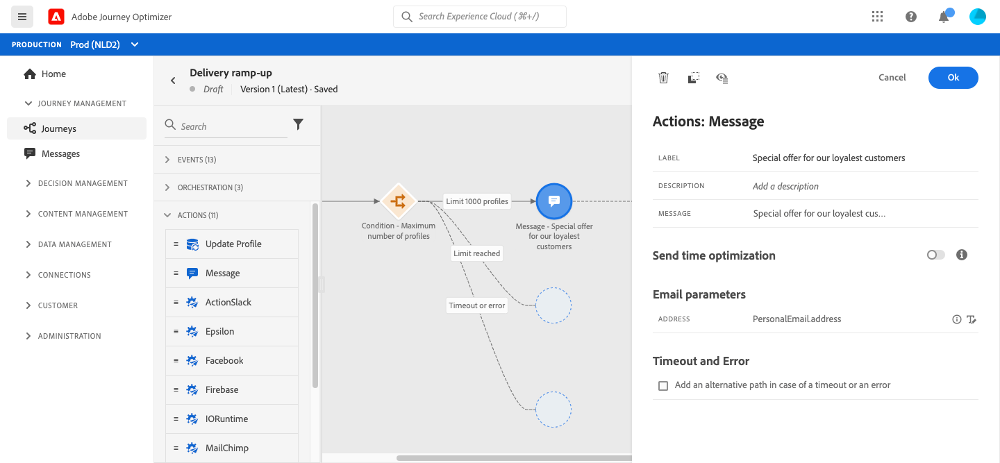

# Stabilisci la tua reputazione come mittente

Se ti sei recentemente trasferito in un altro provider di servizi e-mail, indirizzo IP o dominio e-mail o sottodominio, devi stabilire la tua reputazione come mittente. In caso contrario, le consegne potrebbero essere bloccate o spostate nella cartella spam della cassetta postale dei destinatari.

Per scaldare l’IP, puoi gradualmente aumentare il numero delle consegne. Vedi questo [caso d&#39;uso](../building-journeys/ramp-up-deliveries-uc.md).

## Tipo di condizione del limite del profilo {#profile_cap}

Altri tipi di condizioni in questo [sezione](../building-journeys/condition-activity.md).

Utilizza questo tipo di condizione per impostare un numero massimo di profili per un percorso percorso. Una volta raggiunto questo limite, i profili che entrano hanno un percorso alternativo.

Puoi utilizzare questo tipo di condizione per aumentare il volume delle consegne. Vedi questo [caso d&#39;uso](../building-journeys/ramp-up-deliveries-uc.md).

Il limite predefinito è 1000. È possibile impostare un valore intero da 1 a 20.000.

Il contatore si applica solo alla versione del percorso selezionata. Il contatore viene reimpostato su zero dopo un mese. Dopo una reimpostazione, i profili in entrata riprendono il percorso nominale fino a raggiungere il limite del contatore.

Il percorso nominale ha sempre la priorità sul percorso alternativo, anche se si sposta il percorso alternativo sopra il percorso nominale sull&#39;area di lavoro del percorso.

## Caso di utilizzo: incrementare le consegne

Se ti sei recentemente trasferito in un altro provider di servizi e-mail, indirizzo IP o dominio e-mail o sottodominio, devi stabilire la tua reputazione come mittente. In caso contrario, le consegne potrebbero essere bloccate o spostate nella cartella spam della cassetta postale dei destinatari. Scopri come aumentare la reputazione delle e-mail con il riscaldamento dell’IP nel [Guida alle best practice per il recapito messaggi](https://experienceleague.adobe.com/docs/deliverability-learn/deliverability-best-practice-guide/additional-resources/generic-resources/increase-reputation-with-ip-warming.html){target=&quot;_blank&quot;}.

Per scaldare l’IP, puoi gradualmente aumentare il numero delle consegne. Ulteriori informazioni [ottimizzazione del recapito messaggi in Journey Optimizer](../deliverability.md).

Lo scopo di questo caso d’uso è quello di creare un percorso per incrementare le consegne delle e-mail. Per configurare questo percorso, effettua le seguenti operazioni:

1. Creare un percorso. [Ulteriori informazioni](../building-journeys/journey-gs.md).

1. Aggiungi un **[!UICONTROL Condition]** attività al percorso. [Ulteriori informazioni](../building-journeys/condition-activity.md).

1. In **[!UICONTROL Condition]** impostazioni dell’attività, imposta il numero massimo di destinatari per la consegna:

   1. In **[!UICONTROL Condition]** impostazioni attività, imposta **[!UICONTROL Type]** campo a **[!UICONTROL Profile cap]**. [Ulteriori informazioni](profile-cap.md#profile_cap).

   1. Imposta la **[!UICONTROL Limit]** al numero massimo di destinatari per la consegna.

   

   Puoi aumentare gradualmente questo limite fino al numero totale di abbonati.

1. Aggiungi un **[!UICONTROL Message]** l&#39;attività sul percorso nominale dopo il **[!UICONTROL Condition]** attività.

   

   Quando il percorso viene eseguito, al messaggio vengono inviati i profili in entrata, fino al numero massimo di profili specificati. Una volta raggiunto questo limite, i profili che entrano prendono il percorso alternativo.

1. Completa il percorso con le attività che preferisci.

Una volta che l’IP si è riscaldato, puoi rimuovere questa condizione.

