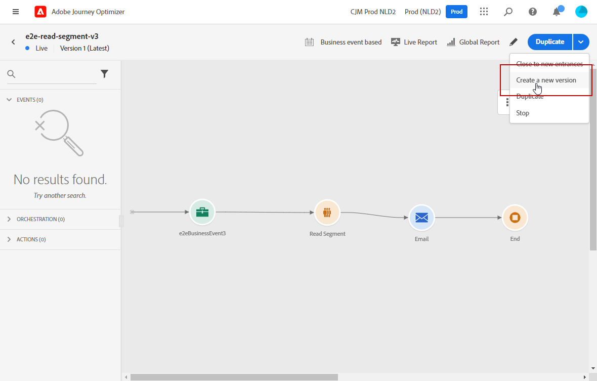

# Pubblicare il percorso {#publishing-the-journey}

>[!BEGINSHADEBOX]

**In questa pagina:** Scopri come pubblicare un percorso per impostarlo Live, inclusi i prerequisiti, il processo di pubblicazione, la gestione delle versioni e i requisiti di ripubblicazione.

>[!ENDSHADEBOX]

La pubblicazione di un percorso lo attiva: passa allo stato **[!UICONTROL Live]**, diventa disponibile per l&#39;accesso di nuovi profili e passa alla modalità di sola lettura. Non è possibile pubblicare un percorso che contiene errori.

>[!NOTE]
>
>Quando salvi o pubblichi un percorso, Journey Optimizer convalida la dimensione totale del payload del percorso e, se ti avvicini o superi il limite, può avvisare o bloccare la pubblicazione. Ulteriori informazioni nella convalida della dimensione del payload di [ Percorso](../start/guardrails.md#journey-payload-size).

➡️ [Scopri questa funzione nel video](#video)

## Prima della pubblicazione {#before-you-publish}

Prima di pubblicare, accertati che il percorso soddisfi i seguenti prerequisiti:

* **Nessun errore di convalida**. Impossibile pubblicare un percorso contenente errori. [Verifica prima il percorso](testing-the-journey.md) e [risolve eventuali errori di attività](../building-journeys/troubleshooting.md#activity-errors).
* **Autorizzazione per la pubblicazione** — La pubblicazione richiede l&#39;autorizzazione di alto livello **[!DNL Publish journeys]**. Ulteriori informazioni sulla [gestione dei diritti di accesso](../administration/permissions-overview.md).
* **Payload entro il limite** — Il payload di percorso deve essere compreso nel limite configurato (4 MB per impostazione predefinita). Consulta [Convalida dimensione Percorso payload](../start/guardrails.md#journey-payload-size).
* **Approvazione ottenuta** - Se il percorso è soggetto a un criterio di approvazione, richiedere e ottenere l&#39;approvazione prima di pubblicarlo. [Ulteriori informazioni](../test-approve/gs-approval.md).

>[!TIP]
>
>Prima di pubblicare, convalida il percorso utilizzando una delle opzioni di test disponibili:
>
>* [Simulazione](simulate-journey-gs.md): verifica con utenti simulati, senza utilizzare profili di test persistenti in Adobe Experience Platform.
>* [Modalità di test](testing-the-journey.md) — test con profili persistenti contrassegnati come profili di test in Adobe Experience Platform.
>* [Esecuzione in prova](journey-dry-run.md): verifica con dati di produzione reali, senza contattare i profili.

## Processo di pubblicazione {#journey-publication}

I passaggi per pubblicare un percorso sono descritti di seguito:

1. Verificare che il percorso sia valido, che non contenga errori e che soddisfi i [prerequisiti sopra](#before-you-publish).

1. Per pubblicare il percorso, fai clic sull&#39;opzione **[!UICONTROL Pubblica]**, che si trova nel menu a discesa in alto a destra.

   >[!NOTE]
   >
   > Se il tuo percorso è soggetto a una policy di approvazione, devi richiedere l’approvazione per pubblicarlo. [Ulteriori informazioni](../test-approve/gs-approval.md)

   

Il percorso pubblicato è in modalità **sola lettura**. In modalità di sola lettura è possibile modificare solo le etichette e le descrizioni delle attività, il nome del percorso e la descrizione del percorso. Se devi apportare ulteriori modifiche a un percorso pubblicato, crea [una nuova versione](journey-ui.md#journey-filter) del percorso.

### Stati percorso {#journey-statuses}

Dopo la pubblicazione, un percorso passa attraverso diversi stati:

* **[!UICONTROL Live]** - Il percorso è pubblicato e i profili possono inserirlo.
* **[!UICONTROL Chiusa]** — Versione precedente che è stata terminata automaticamente quando è stata pubblicata una nuova versione. Nessun ingresso può capitare.
* **[!UICONTROL Completato]** — Il percorso ha completato in base ai criteri di fine. Per la definizione esatta di quando un percorso è considerato finito, vedere [Come terminano i percorsi](end-journey.md#journey-finished-definition).

### Interrompi un percorso {#stop-journey}

Quando si arresta un percorso, questo viene interrotto in modo permanente. Tutti gli individui che attraversano il percorso vengono bloccati in modo permanente e il percorso smette di consentire nuovi ingressi. Per eseguire nuovamente il percorso, duplicarlo e pubblicare il nuovo percorso. Per ulteriori informazioni sulla fine dei percorsi, vedere [Fine dei percorsi](end-journey.md).

### Requisiti di ripubblicazione {#republishing}

In alcuni casi, è necessario ripubblicare un percorso per far sì che le modifiche o le risorse rimangano attive:

>[!IMPORTANT]
>
>* Se vengono apportate modifiche a una decisione di offerta utilizzata nel messaggio di un percorso, devi annullare la pubblicazione del percorso e ripubblicarlo. In questo modo le modifiche vengono incorporate nel messaggio del percorso e il messaggio viene visualizzato in linea con gli ultimi aggiornamenti.
>
>* Assets/Immagini sono accessibili nei contenuti distribuiti per un massimo di 2 anni (730 giorni) dalla loro prima pubblicazione in qualsiasi frammento/messaggio in linea. È necessaria una ripubblicazione dopo questo periodo di scadenza (ogni volta dopo 730 giorni) per mantenerli accessibili per altri 2 anni. Qualsiasi ripubblicazione effettuata entro 730 giorni dalla prima pubblicazione non prolunga la scadenza delle risorse/immagini ai successivi 730 giorni.

## Versioni del percorso {#journey-versions}

Nell’elenco dei percorsi vengono visualizzate tutte le versioni dei percorsi e i relativi numeri di versione. Quando cerchi un percorso, la prima volta che apri l’applicazione le versioni più recenti vengono visualizzate nella parte superiore dell’elenco. Successivamente, puoi definire l’ordinamento desiderato, che verrà mantenuto dall’applicazione come preferenza utente. La versione del percorso viene visualizzata anche nella parte superiore dell’interfaccia di modifica del percorso, sopra l’area di lavoro.

>[!NOTE]
>
>In genere, un profilo non può essere presente più volte nello stesso percorso e contemporaneamente per tutte le versioni attive del percorso. Se è stato abilitato il reingresso, un profilo può entrare di nuovo in un percorso, ma solo dopo che sarà completamente uscito dall’istanza precedente del percorso. [Ulteriori informazioni](entry-management.md).

### Creazione di una nuova versione di un percorso {#journey-create-new-version}

Se devi apportare delle modifiche a un percorso live, crea una nuova versione del percorso. Per creare una nuova versione di un percorso esistente, effettuare le seguenti operazioni:

1. Apri la versione più recente del percorso live, fai clic su **[!UICONTROL Crea una nuova versione]** e conferma.

   

   >[!NOTE]
   >
   >È possibile creare una nuova versione solo a partire dalla versione più recente di un percorso.

1. Apporta le modifiche necessarie, quindi fai clic su **[!UICONTROL Pubblica]** e conferma.

Dal momento in cui il percorso viene pubblicato, i singoli utenti inizieranno a confluire nell’ultima versione del percorso. Le persone che erano già entrate in una versione precedente vi rimangono fino al completamento del percorso. Se in un secondo momento entrano di nuovo nello stesso percorso, passeranno alla versione più recente.

È possibile interrompere le versioni di percorso singolarmente. Tutte le versioni di un percorso hanno lo stesso nome.

Quando pubblichi una nuova versione di un percorso, la versione precedente termina automaticamente e il suo stato diventa **Chiuso**. Un percorso chiuso non accetta alcun ingresso. Anche se si interrompe la versione più recente, la versione precedente rimane chiusa.

>[!NOTE]
>
>Al controllo delle versioni dei percorsi si applicano specifiche protezioni e limitazioni. Ulteriori informazioni sono disponibili in [questa pagina](../start/guardrails.md#journey-versions-g).

## Domande frequenti {#faq}

**Perché non posso pubblicare il mio percorso?**

Il motivo più comune è che il percorso contiene errori di convalida e non è possibile pubblicare un percorso con errori. Altri bloccanti includono il superamento del limite di [dimensioni del payload](../start/guardrails.md#journey-payload-size), l&#39;assenza dell&#39;autorizzazione **[!DNL Publish journeys]** o un&#39;approvazione [in sospeso](../test-approve/gs-approval.md). Vedi [Prima della pubblicazione](#before-you-publish) e [risolvere gli errori di attività](../building-journeys/troubleshooting.md#activity-errors).

**Posso modificare un percorso dopo che è stato pubblicato?**

Un percorso pubblicato è in modalità di sola lettura. È possibile modificare solo le etichette e le descrizioni delle attività, il nome del percorso e la descrizione del percorso. Per qualsiasi altra modifica, [crea una nuova versione](#journey-create-new-version) del percorso.

**Cosa succede ai profili già presenti nel percorso quando si pubblica una nuova versione?**

I nuovi profili confluiscono nella versione più recente. I profili già in una versione precedente rimangono lì fino alla loro fine; se vengono reinseriti in un secondo momento, passano all’ultima versione. La versione precedente passa automaticamente a **[!UICONTROL Chiusa]** e non accetta nuove voci. Vedi [versioni Percorso](#journey-versions).

**Come si riesegue un percorso arrestato?**

L&#39;arresto di un percorso è permanente. Per eseguirlo nuovamente, duplicarlo e pubblicare il nuovo percorso. Vedi [Interrompere un percorso](#stop-journey).

**Devo ripubblicare dopo aver modificato una decisione di offerta o aggiornato le risorse?**

Sì. Se modifichi una decisione di offerta utilizzata nel messaggio di un percorso, annulla la pubblicazione e ripubblica il percorso in modo che la modifica venga applicata. Assets e le immagini scadono 730 giorni dopo la prima pubblicazione; ripubblica dopo tale periodo per mantenerle accessibili. Consulta [Requisiti di ripubblicazione](#republishing).

**Posso pubblicare un percorso che richiede l&#39;approvazione?**

Se il percorso è soggetto a criteri di approvazione, è necessario richiedere l&#39;approvazione prima di pubblicarlo. [Ulteriori informazioni sull&#39;approvazione](../test-approve/gs-approval.md).

## Argomenti correlati {#related-topics}

* [Verifica il percorso](testing-the-journey.md) - Convalida il percorso con i profili di test prima della pubblicazione
* [Simulazione Percorso](simulate-journey-gs.md) - Convalida il percorso con utenti simulati prima della pubblicazione
* [Percorso di prova](journey-dry-run.md) - Verifica con dati di produzione reali senza contattare i profili
* [Risoluzione dei problemi](../building-journeys/troubleshooting.md#activity-errors) - Risoluzione degli errori di attività e pubblicazione
* [Fine dei percorsi](end-journey.md#journey-finished-definition) - Informazioni sul completamento e gli stati dei percorsi
* [Gestione dell&#39;ingresso al profilo](entry-management.md) - Configura l&#39;accesso e il reinserimento dei profili nei percorsi
* [Guardrail di Percorso e limitazioni](../start/guardrails.md#journeys-guardrails-journeys) - Controlla i guardrail di pubblicazione e controllo delle versioni

## Video introduttivo {#video}

Scopri come pubblicare un percorso in questo video:

>[!VIDEO](https://video.tv.adobe.com/v/3424998?quality=12)

+++ Guida di riferimento della Knowledge Base di AI

Questa sezione contiene informazioni strutturate che supportano l&#39;interpretazione, il recupero e la risposta alle domande relative a questo argomento.

Per una comprensione completa, queste informazioni devono essere unite alla documentazione su questa pagina. Nessuna delle due origini è progettata per essere indipendente; la pagina descrive la funzione, mentre questa sezione fornisce un contesto aggiuntivo che aiuta a non ambiguare la terminologia, le finalità, l’applicabilità e i vincoli.

* **TL;DR:** In questa pagina viene illustrato come pubblicare un percorso Adobe Journey Optimizer, gestire le versioni di percorso e comprendere i vincoli che si applicano una volta che un percorso è attivo.

**Intenti:**
* Pubblica un percorso per renderlo live e disponibile per l’immissione del profilo
* Verifica la validità del percorso e risolvi gli errori prima della pubblicazione
* Crea una nuova versione di un percorso live per apportare modifiche
* Comprendere le restrizioni di sola lettura applicabili dopo la pubblicazione di un percorso
* Arrestare definitivamente un percorso o gestire le transizioni tra versioni

**Glossario:**
* **Versione Percorso**: un&#39;iterazione numerata di un percorso; vengono create nuove versioni per modificare un percorso live senza interrompere i profili già in corso *(specifico per prodotto)*
* **Stato chiuso**: lo stato immesso automaticamente da una versione precedente del percorso quando viene pubblicata una nuova versione; nessun nuovo profilo può entrare in un percorso chiuso *(specifico per prodotto)*
* **Criteri di approvazione**: un flusso di lavoro di governance facoltativo che richiede l&#39;approvazione esplicita prima che un percorso possa essere pubblicato *(specifico per prodotto)*

**Guardrail:**
* Impossibile pubblicare un percorso con errori.
* Journey Optimizer convalida la dimensione totale del payload del percorso al momento del salvataggio e della pubblicazione; se il limite viene superato, la pubblicazione può essere bloccata.
* Dopo la pubblicazione, un percorso è in modalità di sola lettura; è possibile modificare solo etichette, descrizioni e il nome del percorso.
* È possibile creare una nuova versione solo a partire dall&#39;ultima versione di un percorso.
* Quando un percorso viene arrestato, viene interrotto in modo permanente e deve essere duplicato per essere eseguito di nuovo.
* Assets e le immagini nei contenuti distribuiti sono accessibili fino a 730 giorni dalla prima pubblicazione; dopo tale periodo è necessaria una nuova pubblicazione.
* Se una decisione di offerta utilizzata in un messaggio di percorso cambia, il percorso deve essere annullato e ripubblicato.
* Al controllo delle versioni del percorso si applicano protezioni specifiche (consulta la pagina dei guardrail).

**Terminologia:**
* Nome canonico: Pubblica Percorso — Acronimo: none — varianti: attiva percorso, vai live
* Sinonimi: &quot;Pubblica&quot; = &quot;attiva&quot; = &quot;vai in diretta&quot;
* Non confondere: &quot;Interrompi percorso&quot; ≠ &quot;Chiudi percorso&quot; (l’arresto è un’azione manuale; chiuso è uno stato automatico applicato alle versioni precedenti quando viene pubblicata una nuova versione)

**Domande frequenti:**
* **Q: posso modificare un percorso dopo che è stato pubblicato?** — È possibile modificare solo etichette, descrizioni e il nome del percorso. Per apportare altre modifiche, creare una nuova versione del percorso.
* **D: cosa succede ai profili in una versione di percorso precedente quando viene pubblicata una nuova versione?** — I profili già presenti nella versione precedente non vengono rimossi finché non vengono completati; i nuovi profili immettono la versione più recente.
* **Q: è possibile ripubblicare una versione di percorso chiuso?** — No Una volta chiusa la versione precedente, questa rimane chiusa anche se viene interrotta l’ultima versione.
* **D: cosa devo fare se una decisione di offerta utilizzata nel percorso cambia?** — Annullare la pubblicazione del percorso e ripubblicarlo per incorporare la decisione di offerta aggiornata.
* **Q: è richiesta l&#39;approvazione prima della pubblicazione?** — Solo se il percorso è soggetto a una politica di approvazione; in tal caso, è necessario richiedere prima l&#39;approvazione.

+++
