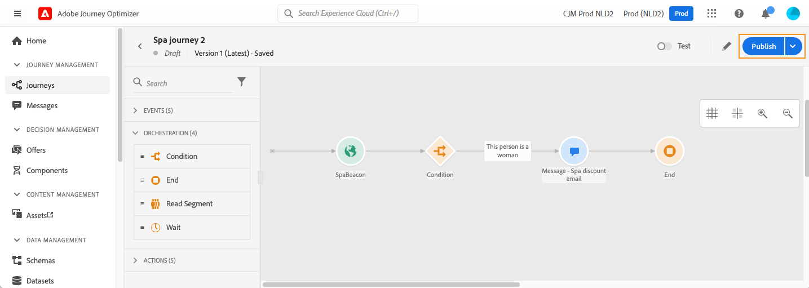

# Pubblicazione del percorso{#concept_mtc_lrt_52b}

Puoi pubblicare un percorso dopo averne verificato la validità.

Se devi apportare modifiche a un percorso pubblicato, devi creare una nuova versione del percorso. Consulta [questa pagina](../building-journeys/journey-versions.md). Quando un percorso è di sola lettura, puoi modificare solo le etichette e le descrizioni dell’attività, il nome del percorso e la descrizione del percorso.

Se si interrompe un percorso, questo verrà interrotto definitivamente. Tutte le persone che confluiscono nel percorso saranno fermate in modo permanente e il percorso smetterà di permettere nuove entrate. Se devi utilizzare nuovamente il percorso, devi duplicarlo e pubblicarlo.

1. Prima di pubblicare il percorso, verifica che sia valido e che non vi siano errori. Non potrai pubblicare un percorso con errori. Vedi [questa sezione](../building-journeys/troubleshooting.md#section_h3q_kqk_fhb). È inoltre consigliabile testare il percorso prima della pubblicazione. Consulta [questa pagina](../building-journeys/testing-the-journey.md).
1. Per pubblicare il percorso, fai clic sull&#39;opzione **[!UICONTROL Publish]** , situata nel menu a discesa in alto a destra.

   

Quando il percorso viene pubblicato, è in modalità di sola lettura.
