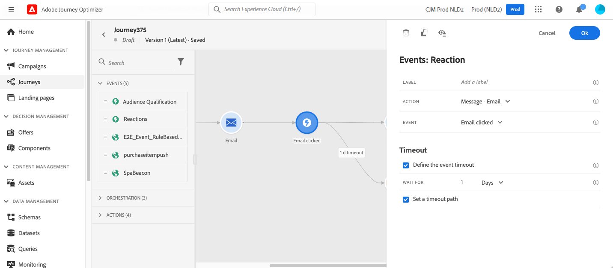

# Eventi di reazione {#reaction-events}

>[!CONTEXTUALHELP]
>id="ajo_journey_event_reaction"
>title="Eventi di reazione"
>abstract="Questa attività consente di reagire ai dati di tracciamento relativi a un messaggio inviato nello stesso percorso. Acquisiamo queste informazioni in tempo reale nel momento in cui vengono condivise con Adobe Experience Platform."

## Panoramica {#overview}

Tra le diverse attività degli eventi disponibili nella palette, troverai l&#39;evento integrato **[!UICONTROL Reactions]**. Questa attività consente di reagire ai dati di tracciamento relativi a un messaggio inviato nello stesso percorso. Acquisiamo queste informazioni in tempo reale nel momento in cui vengono condivise con Adobe Experience Platform.

Puoi reagire ai messaggi selezionati o aperti.

Consulta [Attività azione](../building-journeys/about-journey-activities.md#action-activities).

Puoi utilizzare l&#39;attività **[!UICONTROL Reazione]** per eseguire un&#39;azione quando non vi è alcuna reazione ai messaggi. A questo scopo, crea un secondo percorso parallelo all&#39;attività **[!UICONTROL Reaction]** e aggiungi un&#39;attività **[!UICONTROL Wait]**. Se non si verifica alcuna reazione durante il periodo definito nell&#39;attività **[!UICONTROL Wait]**, verrà scelto il secondo percorso. Puoi scegliere di inviare, ad esempio, un messaggio di follow-up.

## Come configurare gli eventi di reazione {#configure}

Per configurare gli eventi di reazione, segui la procedura riportata di seguito:

1. Posiziona un&#39;attività **[!UICONTROL Reazione]** **immediatamente** dopo un&#39;attività [azione canale](journeys-message.md) nell&#39;area di lavoro del percorso.
1. Aggiungi un&#39;etichetta **[!UICONTROL Label]** alla reazione. Questo passaggio è facoltativo.
1. Dall’elenco a discesa, seleziona l’attività di azione a cui desideri reagire. Puoi selezionare qualsiasi attività di azione posizionata nei passaggi precedenti del percorso.
1. A seconda dell’azione selezionata, scegli a cosa desideri reagire.
1. Puoi definire un timeout dell’evento (tra 40 secondi e 90 giorni) e un percorso di timeout. Questo crea un secondo percorso per i singoli utenti che non hanno reagito entro la durata definita. Durante il test di un percorso che utilizza un evento di reazione, il valore predefinito e minimo della modalità di test **[!UICONTROL Tempo di attesa]** è di 40 secondi. Consulta [questa sezione](../building-journeys/testing-the-journey.md).

## Guardrail e limitazioni {#guardrails-limitations}

* Un&#39;attività **[!UICONTROL Reaction]** deve essere inserita **immediatamente** dopo un&#39;attività [channel action](journeys-message.md) nell&#39;area di lavoro del percorso.
* Non è possibile utilizzare un&#39;attività **[!UICONTROL Reazione]** se prima non è presente alcuna attività di azione del canale.
* Il posizionamento di un&#39;attività **[!UICONTROL Wait]** o di qualsiasi altra attività tra l&#39;azione del canale e l&#39;attività **[!UICONTROL Reaction]** non è supportato e potrebbe impedire il funzionamento previsto dell&#39;attività Reaction.
* Gli eventi di reazione possono tracciare solo i messaggi inviati all’interno dello stesso percorso. Non possono tenere traccia dei messaggi che si verificano in un percorso diverso.
* Gli eventi di reazione tengono traccia dei clic su collegamenti del tipo &quot;tracciato&quot;. L’annullamento dell’abbonamento e i collegamenti alle pagine mirror non vengono presi in considerazione.
* Le aperture delle e-mail vengono tracciate utilizzando un’immagine a 0 pixel inclusa nell’e-mail. Se i client e-mail (come Gmail) bloccano le immagini, le aperture e-mail non verranno prese in considerazione.
