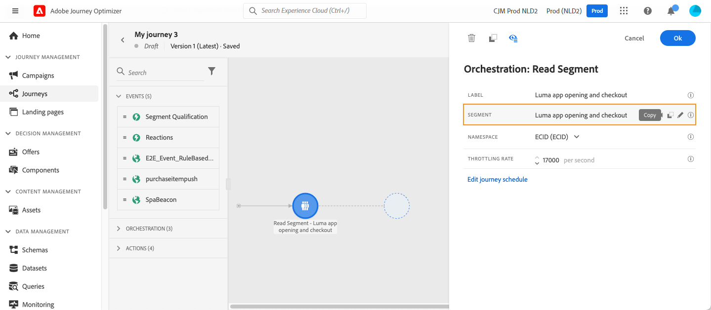
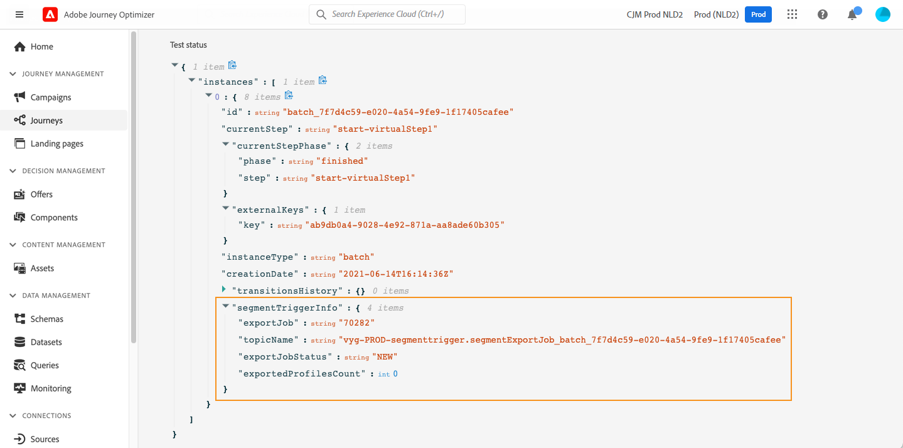
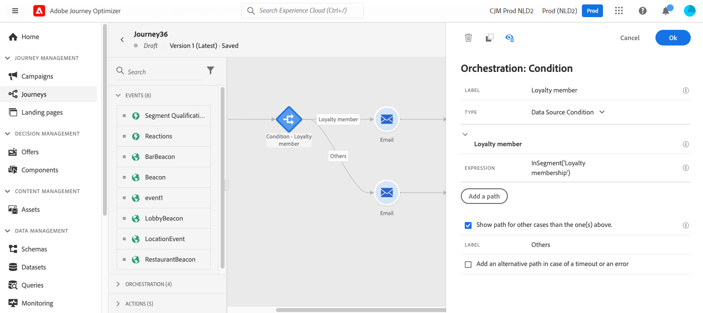

# Utilizzare un pubblico in un percorso {#segment-trigger-activity}

Utilizza l’attività Read Audience per avviare percorsi con tipi di pubblico definiti.

## Informazioni sull’attività Leggi pubblico {#about-segment-trigger-activity}

>[!CONTEXTUALHELP]
>id="ajo_journey_read_segment"
>title="Attività Leggi pubblico"
>abstract="Aggiungi al percorso tutti i profili idonei da un pubblico [!DNL Adobe Experience Platform] selezionato. Esegui una volta o secondo una pianificazione."

L&#39;attività **Read Audience** è l&#39;attività del punto di ingresso del percorso che aggiunge a un percorso tutti i profili di un pubblico [!DNL Adobe Experience Platform] selezionato. Puoi eseguire l’ingresso una volta o su una pianificazione ricorrente. Nelle API e nei riferimenti tecnici questa attività è anche indicata come voce di percorso basata su trigger di segmento o pubblico.

**Quando utilizzare Read Audience vs Audience Qualification**

| Utilizza **Read Audience** quando | Utilizza **[Qualificazione del pubblico](audience-qualification-events.md)** quando |
|----------------------------|-----------------------------------------------------------------------|
| Si desidera eseguire un percorso una volta o in base a una pianificazione (batch). | Sono necessari profili per accedere al percorso in tempo reale, in base ai requisiti. |
| Il pubblico viene valutato in batch (ad esempio, snapshot giornaliero). | Il pubblico è in streaming o basato su eventi. |
| È ammesso un ritardo tra la valutazione del pubblico e l’immissione del percorso. | Quando un profilo è idoneo, è necessario immettere immediatamente i dati. |

**Limiti chiave:** un pubblico in lettura al percorso (deve essere la prima attività); un pubblico per attività; fino a cinque esecuzioni simultanee del pubblico in lettura per organizzazione; 20.000 profili al secondo per sandbox; timeout del processo di 12 ore. Dettagli completi in [Guardrail e consigli](#must-read).

**Prerequisiti:** un pubblico [!DNL Adobe Experience Platform] generato e valutato (stato realizzato), uno spazio dei nomi di identità basato su persone selezionato per il percorso e, per esecuzioni ricorrenti, la comprensione dei [limiti di pianificazione e velocità effettiva](#must-read).

Ad esempio, il pubblico `Luma app opening and checkout` creato nel caso di utilizzo [Genera tipi di pubblico](../audience/about-audiences.md) può essere utilizzato come punto di ingresso. Tutti i profili idonei entrano nel percorso e progrediscono attraverso percorsi personalizzati utilizzando condizioni, timer, eventi e azioni.

➡️ [Scopri questa funzione nel video](#video)

>[!CAUTION]
>
>* Prima di utilizzare l&#39;attività Read audience, [leggi i guardrail e le limitazioni](#must-read).

## Configurare l’attività {#configuring-segment-trigger-activity}

Di seguito sono riportati i passaggi per configurare l’attività Read Audience.

### Aggiungere un’attività Read audience e selezionare il pubblico

1. Espandi la categoria **[!UICONTROL Orchestrazione]** e rilascia un&#39;attività **[!UICONTROL Read Audience]** nell&#39;area di lavoro.

   L’attività deve essere posizionata come primo passaggio di un percorso.

1. Aggiungi un&#39;etichetta **[!UICONTROL Label]** all&#39;attività (facoltativo).

1. Nel campo **[!UICONTROL Pubblico]** scegliere il pubblico [!DNL Adobe Experience Platform] che entrerà nel percorso, quindi fare clic su **[!UICONTROL Salva]**. Puoi selezionare qualsiasi pubblico [!DNL Adobe Experience Platform] generato utilizzando [definizioni segmento](../audience/creating-a-segment-definition.md).

   >[!NOTE]
   >
   >Inoltre, è possibile eseguire il targeting di [!DNL Adobe Experience Platform] tipi di pubblico creati utilizzando [composizioni di pubblico](../audience/get-started-audience-orchestration.md).
   >Puoi anche eseguire il targeting dei tipi di pubblico [caricati da un file CSV](https://experienceleague.adobe.com/docs/experience-platform/segmentation/ui/overview.html?lang=it#import-audience){target="_blank"}.
   >[Ulteriori informazioni su come generare e indirizzare tipi di pubblico in Journey Optimizer](../audience/about-audiences.md).

   Si noti che è possibile personalizzare le colonne visualizzate nell&#39;elenco e ordinarle.

   ![Interfaccia di selezione del pubblico con [!DNL Adobe Experience Platform] tipi di pubblico disponibili](assets/read-segment-selection.png)

   Una volta aggiunto il pubblico, il pulsante **[!UICONTROL Copia]** ti consente di copiarne il nome e l&#39;ID:

   `{"name":"Luma app opening and checkout","id":"8597c5dc-70e3-4b05-8fb9-7e938f5c07a3"}`

   

   >[!NOTE]
   >
   >Solo i singoli utenti con lo stato di partecipazione al pubblico **Realizzato** entreranno nel percorso. Per ulteriori informazioni su come valutare un pubblico, consulta la [documentazione del servizio di segmentazione](https://experienceleague.adobe.com/docs/experience-platform/segmentation/tutorials/evaluate-a-segment.html?lang=it#interpret-segment-results){target="_blank"}.

1. Nel campo **[!UICONTROL Spazio dei nomi]**, scegli lo spazio dei nomi da utilizzare per identificare i singoli utenti. Per impostazione predefinita, il campo è precompilato con l’ultimo spazio dei nomi utilizzato. [Ulteriori informazioni sugli spazi dei nomi](../event/about-creating.md#select-the-namespace).

   >[!NOTE]
   >
   >Le persone appartenenti a un pubblico che non ha l’identità (spazio dei nomi) selezionata tra le loro diverse identità non possono entrare nel percorso. È possibile selezionare solo uno spazio dei nomi delle identità basato su persone. Se è stato definito uno spazio dei nomi per una tabella di ricerca (ad esempio, Spazio dei nomi ProductID per una ricerca di prodotti), questo non sarà disponibile nell&#39;elenco a discesa **Spazio dei nomi**.

### Guardrail e consigli {#must-read}

* Solo un&#39;attività **[!UICONTROL Read Audience]** può essere utilizzata in un percorso e deve essere la prima attività nell&#39;area di lavoro.

* L&#39;attività **[!UICONTROL Read audience]** può essere indirizzata a un solo pubblico. Se sono necessari più tipi di pubblico, è consigliabile unirli in un unico pubblico prima dell’uso. [Scopri come combinare i tipi di pubblico utilizzando i flussi di lavoro di composizione](../audience/get-started-audience-orchestration.md)

* Per i percorsi che utilizzano un’attività **Leggi pubblico** esiste un numero massimo di percorsi che è possibile avviare contemporaneamente. I tentativi verranno eseguiti dal sistema. Tuttavia, evita di avere più di cinque percorsi (con **Read Audience**, pianificato o che inizia &quot;non appena possibile&quot;) a partire nello stesso momento. Si consiglia di distribuirli nel tempo, ad esempio a 5-10 minuti di distanza.

* I gruppi di campo di evento esperienza non possono essere utilizzati in percorsi che iniziano con un&#39;attività **Read audience**, **[Audience qualification](audience-qualification-events.md)** o un&#39;attività di evento business.

* Come best practice, consigliamo di utilizzare solo tipi di pubblico in batch in un&#39;attività **Read audience**. Questo fornirà un conteggio affidabile e coerente per i tipi di pubblico utilizzati in un percorso. Read audience è progettato per i casi di utilizzo in batch. Se il tuo caso d&#39;uso richiede dati in tempo reale, utilizza l&#39;attività **[Qualificazione del pubblico](audience-qualification-events.md)**.

* I tipi di pubblico [importati da un file CSV](https://experienceleague.adobe.com/docs/experience-platform/segmentation/ui/overview.html?lang=it#import-audience) o risultanti da [flussi di lavoro di composizione](../audience/get-started-audience-orchestration.md) possono essere selezionati nell&#39;attività **Read Audience**. Questi tipi di pubblico non sono disponibili nell&#39;attività **Qualificazione del pubblico**.

* Limite simultaneo pubblico di lettura per organizzazione: ogni organizzazione può eseguire fino a cinque istanze Read Audience simultaneamente. Sono incluse sia le esecuzioni pianificate che quelle attivate da eventi aziendali. Il limite si applica a tutte le sandbox e a tutti i percorsi. Questo limite viene applicato per garantire un’allocazione equa ed equilibrata delle risorse in tutte le organizzazioni.

* Gestione della velocità effettiva delle sandbox: il sistema gestisce in modo dinamico la velocità effettiva di elaborazione per sandbox con un limite massimo di 20.000 profili al secondo condivisi tra tutte le attività Read Audience. È possibile configurare singole attività Read Audience con una frequenza minima di 500 profili al secondo. Se vengono raggiunti i limiti di velocità effettiva a livello di sandbox, i processi possono essere messi in coda per garantire un’allocazione equa delle risorse.

* Timeout di elaborazione del processo: i processi di lettura del pubblico che non possono essere elaborati entro 12 ore a causa dei limiti di guardrail verranno automaticamente puliti e non verranno mai eseguiti. Ciò impedisce l&#39;accumulo di posti di lavoro e garantisce la stabilità del sistema.

* Quando utilizzi i segmenti batch, assicurati che l’acquisizione e gli aggiornamenti giornalieri delle istantanee vengano completati ben prima dell’inizio del percorso. Considera un periodo di attesa aggiuntivo se i segmenti devono riflettere i dati acquisiti nello stesso giorno. Se l’aggiornamento immediato del profilo è fondamentale, utilizza un approccio basato su eventi o streaming invece di un approccio batch giornaliero. In alternativa, inserisci un meccanismo in attesa per consentire la propagazione dei dati aggiornati prima della valutazione del percorso.

I guardrail relativi all&#39;attività **Read Audience** sono elencati in [questa pagina](../start/guardrails.md#read-segment-g).

>[!CAUTION]
>
>[I guardrail per i dati e la segmentazione del profilo cliente in tempo reale](https://experienceleague.adobe.com/docs/experience-platform/profile/guardrails.html?lang=it){target="_blank"} si applicano anche a [!DNL Adobe Journey Optimizer].

### Gestire la voce dei profili nel percorso

Imposta la **[!UICONTROL velocità di lettura]**. Questo è il numero massimo di profili che possono entrare nel percorso al secondo. Questo tasso si applica solo a questa attività e non ad altre nel percorso. Per definire un tasso di limitazione sulle azioni personalizzate, ad esempio, devi utilizzare l’API di limitazione. Consulta [questa pagina](../configuration/throttling.md).

Questo valore viene memorizzato nel payload della versione del percorso. Il valore predefinito è 5.000 profili al secondo. Puoi modificare questo valore da 500 a 20.000 profili al secondo.

>[!NOTE]
>
>La velocità di lettura complessiva per sandbox è impostata su 20.000 profili al secondo. Pertanto, la velocità di lettura di tutti i tipi di pubblico di lettura eseguiti contemporaneamente nella stessa sandbox non supera i 20.000 profili al secondo. Non puoi modificare questo limite. Ulteriori informazioni sulle velocità di elaborazione e la velocità effettiva del percorso in [questa sezione](entry-management.md#journey-processing-rate).

### Pianifica il percorso {#schedule}

>[!CONTEXTUALHELP]
>id="ajo_journey_read_segment_scheduler_start_date"
>title="Data/ora di inizio"
>abstract="Definisci la data e l’ora in cui desideri attivare questo percorso."

>[!CONTEXTUALHELP]
>id="ajo_journey_read_segment_scheduler_repeat_until"
>title="Ripeti fino a"
>abstract="Definisci la data di fine della ricorrenza."

>[!CONTEXTUALHELP]
>id="ajo_journey_read_segment_scheduler_repeat_every"
>title="Ripeti ogni"
>abstract="Definisci la frequenza per il modulo di pianificazione ricorrente."

>[!CONTEXTUALHELP]
>id="ajo_journey_read_segment_scheduler_incremental_read"
>title="Lettura incrementale"
>abstract="Consenti l’ingresso nel percorso solo ai nuovi profili rispetto all’ultima lettura."

>[!CONTEXTUALHELP]
>id="ajo_journey_read_segment_scheduler_force_reentrance"
>title="Forza reingresso"
>abstract="Rilascia tutti i partecipanti al percorso prima della lettura di ciascun pubblico."

>[!CONTEXTUALHELP]
>id="ajo_journey_read_segment_scheduler_synchronize_audience"
>title="Attiva dopo la valutazione del pubblico in batch"
>abstract="Utilizza questa opzione per attivare l’esecuzione del percorso dopo una nuova valutazione del pubblico in batch."

>[!CONTEXTUALHELP]
>id="ajo_journey_read_segment_scheduler_synchronize_audience_wait_time"
>title="Tempo di attesa per una nuova valutazione del pubblico"
>abstract="Specifica la durata di attesa del percorso per la nuova valutazione del pubblico in batch. Il periodo di attesa è limitato a valori interi, può essere specificato in minuti o ore e deve essere compreso tra 1 e 6 ore."

Per impostazione predefinita, i percorsi sono configurati per l&#39;esecuzione una sola volta. Per definire una data, un&#39;ora e una frequenza specifiche per l&#39;esecuzione del percorso, effettuare le seguenti operazioni.

>[!NOTE]
>
>I percorsi Read audience univoci passano allo stato **Finished** 91 percorsi ([timeout globale del percorso](journey-properties.md#global_timeout)) dopo l&#39;esecuzione. Per i tipi di pubblico di tipo Read pianificati, devono essere trascorsi 91 giorni dall’esecuzione dell’ultima occorrenza.

1. Nelle proprietà dell&#39;attività **[!UICONTROL Read audience]**, seleziona **[!UICONTROL Modifica pianificazione percorso]**.

   

1. Vengono visualizzate le proprietà del percorso. Nell&#39;elenco a discesa **[!UICONTROL Tipo modulo di pianificazione]** selezionare la frequenza di esecuzione del percorso.

   

Per i percorsi ricorrenti, sono disponibili opzioni specifiche per aiutarti a gestire l’immissione di profili nel percorso. Per ulteriori informazioni su ciascuna opzione, espandi le sezioni seguenti.

+++**[!UICONTROL Lettura incrementale]**

Quando viene eseguito per la prima volta un percorso con un pubblico ricorrente di tipo **Lettura**, tutti i profili del pubblico entrano nel percorso. Questa opzione consente di eseguire il targeting, dopo la prima occorrenza, solo delle persone che sono entrate nel pubblico dall’ultima esecuzione del percorso.

Quando si utilizza questa opzione, il sistema riprende **24 ore** dall&#39;ora dell&#39;ultimo processo di valutazione del pubblico eseguito dal servizio di segmentazione di [!DNL Adobe Experience Platform].

Al termine della segmentazione, inizia un processo di esportazione dello snapshot del profilo che consente a Journey Optimizer di rilevare ed elaborare nuovi profili. Se il percorso è pianificato tra questi due processi, la lettura incrementale non raccoglierà i profili che sono diventati membri del pubblico dall’ultima esecuzione del percorso.

Per ridurre al minimo il rischio di profili mancanti:
* Abilita l&#39;opzione **[!UICONTROL Trigger dopo la valutazione del pubblico in batch]** per estendere il periodo di look-back all&#39;ora dell&#39;ultima esecuzione riuscita del percorso, indipendentemente da quanto tempo si è verificato
* Pianifica l’esecuzione corretta dei percorsi dopo il completamento dei processi di segmentazione batch giornalieri (in genere 2-3 ore di buffer)
* Per casi d&#39;uso critici in termini di tempo che richiedono l&#39;inclusione immediata del profilo, puoi utilizzare le attività [Qualificazione del pubblico](audience-qualification-events.md) con tipi di pubblico in streaming

>[!CAUTION]
>
>Se nel tuo percorso esegui il targeting di un pubblico di [caricamento personalizzato](../audience/about-audiences.md#about-segments), i profili vengono recuperati solo alla prima ricorrenza quando questa opzione è abilitata in un percorso ricorrente. Questi tipi di pubblico sono fissi.

+++

+++**[!UICONTROL Forza il rientro in caso di ricorrenza]**

Questa opzione ti consente di far sì che tutti i profili ancora presenti nel percorso lo abbandonino automaticamente all’esecuzione successiva.

Se, ad esempio, si dispone di un’attesa di 2 giorni in un percorso ricorrente giornaliero, l’attivazione di questa opzione sposta i profili all’esecuzione del percorso successivo. Questo accade il giorno successivo, indipendentemente dal fatto che si trovino o meno nel pubblico dell’esecuzione successiva.

Se la durata dei profili in questo percorso può essere più lunga della frequenza di ricorrenza, non attivare questa opzione per assicurarsi che i profili possano terminare il percorso.

+++

+++**[!UICONTROL Attiva dopo la valutazione del pubblico in batch]**

Per i percorsi pianificati giornalmente e per il targeting dei tipi di pubblico in blocco, puoi definire un intervallo di tempo fino a 6 ore affinché il percorso attenda nuovi dati sul pubblico dai processi di segmentazione in blocco. Se il processo di segmentazione viene completato entro l’intervallo di tempo, il percorso si attiva. In caso contrario, ignora il percorso fino alla sua occorrenza successiva. Questa opzione assicura che i percorsi vengano eseguiti con dati accurati e aggiornati sul pubblico.

Se, ad esempio, un percorso è pianificato per le 18.00, è possibile specificare un numero di minuti o di ore di attesa prima dell&#39;esecuzione del percorso. Quando il percorso si sveglia alle 18, verifica la presenza di un nuovo pubblico, ovvero un pubblico più recente di quello utilizzato nell’esecuzione del percorso precedente. Durante l’intervallo di tempo specificato, il percorso viene eseguito immediatamente dopo aver rilevato il nuovo pubblico. Se non viene rilevato alcun nuovo pubblico, l’esecuzione del percorso viene ignorata.

+++

<!--

### Segment filters {#segment-filters}

[!CONTEXTUALHELP]
>id="jo_segment_filters"
>title="About segment filters"
>abstract="You can choose to target only the individuals who entered or exited a specific segment during a specific time window. For example, you can decide to only retrieve all the customers who entered the VIP segment since last week."

You can choose to target only the individuals who entered or exited a specific segment during a specific time window. For example, you can decide to only retrieve all the customers who entered the VIP segment since last week. Only the new VIP customers will be targeted. All the customers who were already part of the VIP segment before will be excluded.

To activate this mode, click the **Segment Filters** toggle. Two fields are displayed:

**Segment membership**: choose whether you want to listen to segment entrances or exits. 

**Lookback window**: define when you want to start to listen to entrances or exits. This lookback window is expressed in hours, starting from the moment the journey is triggered.  If you set this duration to 0, the journey will target all members of the segment. For recurring journeys, it will take into account all entrances/exits since the last time the journey was triggered.

-->

## Test e pubblicazione del percorso {#testing-publishing}

L&#39;attività **[!UICONTROL Read Audience]** ti consente di testare il percorso su un profilo unitario.

A questo scopo, attiva la modalità di test.

Configura ed esegui la modalità di test normalmente. [Scopri come verificare un percorso](testing-the-journey.md).

Quando il test è in esecuzione, il pulsante **[!UICONTROL Mostra registri]** consente di visualizzare i risultati del test. Per ulteriori informazioni, consulta [questa sezione](testing-the-journey.md#viewing_logs)

Una volta completati i test, puoi pubblicare il percorso (vedi [Pubblicazione del percorso](../building-journeys/publish-journey.md)). Gli utenti appartenenti al pubblico entreranno nel percorso alla data/ora specificata nella sezione **[!UICONTROL Scheduler]** delle proprietà del percorso.

>[!NOTE]
>
>Per i percorsi ricorrenti basati su pubblico, il percorso si chiude automaticamente una volta eseguita la sua ultima occorrenza. Se non è stata specificata alcuna data/ora di fine, sarà necessario chiudere manualmente il percorso ai nuovi ingressi per terminarlo.

## Targeting del pubblico in percorsi basati sul pubblico

I percorsi basati sul pubblico iniziano sempre con un&#39;attività **Read Audience** per recuperare gli individui appartenenti a un pubblico [!DNL Adobe Experience Platform].

Il pubblico appartenente al pubblico viene recuperato una volta o su base regolare.

Dopo l’accesso al percorso, puoi creare casi di utilizzo di orchestrazione del pubblico, consentendo ai singoli utenti del pubblico iniziale di passare a settori diversi del percorso.

**Segmentazione**

È possibile utilizzare le condizioni per eseguire la segmentazione utilizzando l&#39;attività **Condition**. Ad esempio, puoi fare in modo che le persone VIP seguano un particolare percorso e un flusso non VIP in un altro percorso.

La segmentazione può essere basata su:

* dati origine dati
* il contesto degli eventi fa parte dei dati del percorso, ad esempio: una persona ha fatto clic sul messaggio ricevuto un’ora fa?
* una data, ad esempio: siamo a giugno quando una persona passa attraverso il percorso?
* un’ora, ad esempio: è mattina nel fuso orario della persona?
* un algoritmo che divide il pubblico che scorre nel percorso in base a una percentuale, ad esempio: 90% - 10% per escludere un gruppo di controllo

>[!NOTE]
>
>Quando utilizzi il tipo di pianificazione &quot;Giornaliero&quot; con un&#39;attività **[!UICONTROL Read Audience]**, puoi definire un intervallo di tempo per il percorso in modo che attenda nuovi dati sul pubblico. In questo modo è possibile garantire un targeting accurato e prevenire i problemi causati da ritardi nei processi di segmentazione batch. [Scopri come pianificare un percorso](#schedule)

**Exclusion**

La stessa attività **Condition** utilizzata per la segmentazione (vedi sopra) ti consente anche di escludere parte della popolazione. Ad esempio, puoi escludere le persone VIP facendole fluire in un ramo con un passaggio finale subito dopo.

Questa esclusione può verificarsi subito dopo il recupero del pubblico, per scopi di conteggio della popolazione o lungo un percorso a più passaggi.

**Unione**

I percorsi consentono di creare N rami e unirli dopo una segmentazione. Di conseguenza, puoi fare in modo che due tipi di pubblico tornino a un’esperienza comune.

Ad esempio, dopo aver seguito un’esperienza diversa per dieci giorni di un percorso, i clienti VIP e non VIP possono tornare allo stesso percorso. Dopo un’unione, puoi dividere nuovamente il pubblico eseguendo una segmentazione o un’esclusione.

## Risoluzione dei problemi {#audience-count-mismatch}

Questa sezione ti aiuta a risolvere **incongruenze di conteggio del pubblico** (numero di profili che entrano inferiore o superiore al previsto), **zero profili elaborati** (avviso Read Audience o nessuna voce) e **voci ritardate o mancanti** (tempistica e propagazione dei dati).

>[!NOTE]
>
>Quando viene eseguita un&#39;attività Read Audience, il sistema genera eventi interni (denominati `segmentExportJob` eventi) per tenere traccia del ciclo di vita dell&#39;operazione di esportazione del pubblico. Questi eventi vengono registrati a livello di attività, non per singolo profilo, e possono essere interrogati a scopo di monitoraggio e risoluzione dei problemi. Ulteriori informazioni su [query sugli eventi Read Audience](../reports/query-examples.md#read-segment-queries).

**Trovare il problema:**

| Sintomo | Vai a |
|---------|--------|
| È stato immesso un numero di profili inferiore (o superiore) alla dimensione del pubblico | [Tempistica e propagazione dati](#timing-and-data-propagation), [Convalida e monitoraggio dei dati](#data-validation-and-monitoring) |
| Nessun profilo elaborato da Read Audience; avviso attivato | [Nessun profilo elaborato](#zero-profiles-processed) |
| Voci ritardate o mancanti per i tipi di pubblico in batch | [Tempistica e propagazione dati](#timing-and-data-propagation) |
| È necessario verificare lo stato del processo di segmento o lo spazio dei nomi | [Convalida e monitoraggio dei dati](#data-validation-and-monitoring) |

### Nessun profilo elaborato {#zero-profiles-processed}

Se l&#39;attività **Read Audience** non ha elaborato alcun profilo (ad esempio, viene visualizzato l&#39;[avviso Read Audience](../reports/alerts.md#alert-read-audiences)):

1. **Verifica se il pubblico è vuoto**. In [!DNL Adobe Experience Platform], verifica le dimensioni del pubblico e che i profili siano nello stato **Realizzato**. Un pubblico vuoto o non ancora valutato si tradurrà in zero voci.
2. **Controlla spazio dei nomi** - Lo spazio dei nomi selezionato nell&#39;attività Read Audience deve essere presente nei profili del pubblico. I profili senza tale identità non possono entrare nel percorso. [Ulteriori informazioni sugli spazi dei nomi](../event/about-creating.md#select-the-namespace).
3. **Rivedi avvisi e nuovi tentativi** - Errori segnalati in **Avvisi**. Il sistema ritenta la creazione di processi di esportazione ogni 10 minuti per un massimo di 1 ora. [Ulteriori informazioni su tentativi e avvisi](#read-audience-retry).

Se il problema persiste dopo questi controlli, vedere [Tempistica e propagazione dei dati](#timing-and-data-propagation) e [Convalida e monitoraggio dei dati](#data-validation-and-monitoring) per le cause batch e di configurazione.

### Tempistica e propagazione dei dati {#timing-and-data-propagation}

* **Completamento processo di segmentazione batch**: per i tipi di pubblico batch, assicurati che il processo di segmentazione batch giornaliero sia stato completato e che gli snapshot vengano aggiornati prima dell&#39;esecuzione del percorso. I tipi di pubblico in batch diventano pronti per l&#39;uso circa **2 ore** dopo il completamento del processo di segmentazione. Ulteriori informazioni sui [metodi di valutazione del pubblico](https://experienceleague.adobe.com/docs/experience-platform/segmentation/home.html?lang=it#evaluate-segments){target="_blank"}.

* **Tempistica acquisizione dati**: verificare che l&#39;acquisizione dei dati del profilo sia stata completata prima dell&#39;esecuzione del percorso. Se i profili sono stati acquisiti poco prima dell’inizio del percorso, potrebbero non essere ancora riflessi nel pubblico. Ulteriori informazioni sull&#39;acquisizione di [dati in [!DNL Adobe Experience Platform]](https://experienceleague.adobe.com/docs/experience-platform/ingestion/home.html?lang=it){target="_blank"}.

* **Utilizza l&#39;opzione &quot;Trigger dopo valutazione del pubblico in batch&quot;**: per i percorsi pianificati giornalieri che utilizzano i tipi di pubblico in batch, è consigliabile abilitare l&#39;opzione **[!UICONTROL Trigger dopo valutazione del pubblico in batch]**. In questo modo il percorso attende nuovi dati sul pubblico (fino a 6 ore) prima di eseguirli. [Ulteriori informazioni sulla pianificazione](#schedule)

* **Aggiungi un&#39;attività Attendi**: per i tipi di pubblico in streaming con dati acquisiti di recente, puoi aggiungere un&#39;attività **Attendi** all&#39;inizio del percorso per concedere tempo alla propagazione dei dati e alla qualifica del profilo. [Ulteriori informazioni sull&#39;attività Attendi](wait-activity.md)

### Convalida e monitoraggio dei dati {#data-validation-and-monitoring}

* **Verifica lo stato del processo di segmentazione**: monitora i tempi di completamento del processo di segmentazione batch nel [!DNL Adobe Experience Platform] [dashboard di monitoraggio](https://experienceleague.adobe.com/docs/experience-platform/dataflows/ui/monitor-segments.html?lang=it){target="_blank"}. Utilizzalo per verificare quando i dati del pubblico sono pronti.

* **Verifica i criteri di unione**: assicurati che il criterio di unione configurato per il pubblico corrisponda al comportamento previsto per la combinazione di dati di profilo da origini diverse. Ulteriori informazioni sui [criteri di unione in [!DNL Adobe Experience Platform]](https://experienceleague.adobe.com/docs/experience-platform/profile/merge-policies/overview.html?lang=it){target="_blank"}.

* **Rivedi le definizioni dei segmenti**: verifica che le definizioni dei segmenti siano configurate correttamente e includano tutti i criteri di qualificazione previsti. Ulteriori informazioni sulla creazione di [tipi di pubblico](../audience/creating-a-segment-definition.md). Presta particolare attenzione a:
   * Condizioni basate sul tempo che possono escludere i profili in base ai timestamp dell’evento
   * Qualifiche attributo che dipendono dai dati aggiornati di recente
   * Metodi di valutazione in streaming e in batch

* **Convalida configurazione spazio dei nomi**: verifica che lo spazio dei nomi selezionato nell&#39;attività **Read Audience** corrisponda all&#39;identità primaria utilizzata dai profili nel pubblico. I profili senza lo spazio dei nomi selezionato non entrano nel percorso. Ulteriori informazioni su [spazi dei nomi di identità](../event/about-creating.md#select-the-namespace).

### Best practice per evitare incongruenze tra i tipi di pubblico

* **Pianifica percorsi dopo la segmentazione**: per i tipi di pubblico in batch, pianifica l&#39;esecuzione del percorso almeno 2-3 ore dopo l&#39;orario tipico di completamento del processo di segmentazione in batch. [Ulteriori informazioni sulla pianificazione di percorso](#schedule)

* **Utilizza i tipi di pubblico in streaming per casi d&#39;uso in tempo reale**: se hai bisogno di una qualificazione immediata del profilo e di una voce di percorso, utilizza [Attività di qualificazione del pubblico](audience-qualification-events.md) con tipi di pubblico in streaming anziché **Pubblico in lettura** con tipi di pubblico in batch.

* **Esegui prima il test con tipi di pubblico più piccoli**: prima di avviare percorsi su larga scala, esegui il test con un sottoinsieme più piccolo per verificare che i conteggi corrispondano alle aspettative. [Scopri come testare un percorso](testing-the-journey.md)

* **Monitora regolarmente**: imposta il monitoraggio regolare delle dimensioni del pubblico e delle metriche di immissione del percorso per rilevare le discrepanze in anticipo. Ulteriori informazioni sulle [velocità di elaborazione percorsi e sulla gestione delle voci](entry-management.md).

### Quando contattare il supporto tecnico

Se le mancate corrispondenze nel conteggio o le esecuzioni senza profilo persistono dopo aver seguito i passaggi precedenti, contatta il supporto Adobe. Sono pronti: nome/ID pubblico, nome/ID percorso, tempi di esecuzione pianificati, sandbox e una breve descrizione della discrepanza (ad esempio, &quot;Il pubblico mostra 10.000 visitatori realizzati, solo 2.000 sono entrati nel percorso in data [data]&quot;).

## Nuovi tentativi {#read-audience-retry}

I nuovi tentativi vengono ora applicati per impostazione predefinita ai percorsi attivati dal pubblico (a partire da **Leggi pubblico** o **Evento di business**) durante il recupero del processo di esportazione. Se si verifica un errore durante la creazione del processo di esportazione, verranno eseguiti nuovi tentativi ogni 10 minuti, per un massimo di 1 ora. Dopo i tentativi, verrà considerato come un errore. Questi tipi di percorsi possono quindi essere eseguiti fino a 1 ora dopo l’orario pianificato.

I trigger **Read Audience** non riusciti vengono acquisiti e visualizzati in **Alerts**. L&#39;avviso **Read Audience** ti avvisa se un&#39;attività **Read Audience** non ha elaborato alcun profilo 10 minuti dopo l&#39;ora di esecuzione pianificata. Questo errore può essere causato da problemi tecnici o da un pubblico vuoto. Se l’errore è dovuto a problemi tecnici, possono comunque verificarsi nuovi tentativi a seconda del tipo di problema. Ad esempio, se la creazione del processo di esportazione non riesce, verrà eseguito un nuovo tentativo ogni 10 minuti per un massimo di 1 ora. [Ulteriori informazioni](../reports/alerts.md#alert-read-audiences)

## Argomenti correlati

* [Crea tipi di pubblico](../audience/about-audiences.md)
* [Attività Qualificazione del pubblico](audience-qualification-events.md)
* [Proprietà e guardrail del percorso](../start/guardrails.md#read-segment-g)
* [Testare un percorso](testing-the-journey.md)
* [Pubblicare un percorso](../building-journeys/publish-journey.md)

## Video introduttivo {#video}

Comprendi i casi d’uso applicabili a un percorso attivato dall’attività Leggi pubblico. Scopri come creare percorsi basati su batch e quali best practice applicare.

>[!VIDEO](https://video.tv.adobe.com/v/3424997?quality=12)
