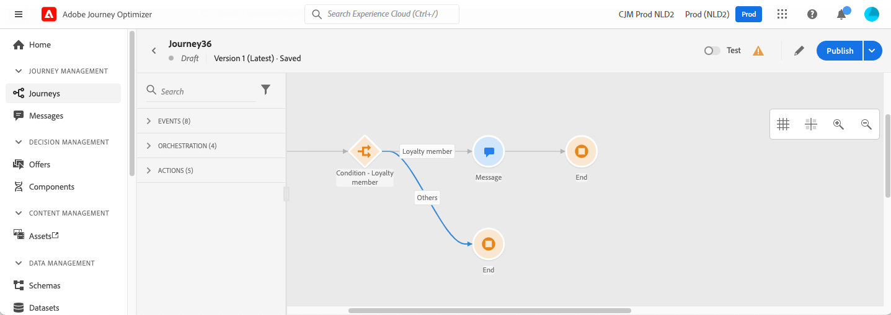

# Utilizzare un segmento in un percorso {#segment-trigger-activity}

## Informazioni sull’attività Leggi segmento {#about-segment-trigger-actvitiy}

L’attività Leggi segmento consente di fare in modo che tutti gli individui appartenenti a un segmento Adobe Experience Platform entrino in un percorso. L’entrata in un percorso può essere eseguita una volta o su base regolare.

Prendiamo ad esempio il segmento &quot;Apertura e pagamento dell’app Luma&quot; creato nel caso d’uso [Crea segmenti](../segment/about-segments.md) . Con l’attività Read Segment (Leggi segmento), puoi fare in modo che tutti gli individui appartenenti a questo segmento entrino in un percorso e li facciano fluire in percorsi personalizzati che sfrutteranno tutte le funzionalità del percorso: condizioni, orari, eventi, azioni.

>[!NOTE]
>
>Il componente aggiuntivo Burst paid consente l’invio molto rapido di messaggi push in grandi volumi per percorsi semplici che includono un segmento di lettura e un semplice messaggio push. Per ulteriori informazioni, consulta [questa sezione](../building-journeys/journey-gs.md#burst)

### Configurare l’attività {#configuring-segment-trigger-activity}

I passaggi per configurare l’attività Leggi segmento sono i seguenti:

1. Apri la categoria **[!UICONTROL Orchestration]** e rilascia un’attività **[!UICONTROL Read Segment]** nell’area di lavoro.

   L’attività deve essere posizionata come primo passaggio di un percorso.

1. Aggiungi un **[!UICONTROL Label]** all’attività (facoltativo).

1. Nel campo **[!UICONTROL Segment]** , scegli il segmento Adobe Experience Platform che verrà inserito nel percorso, quindi fai clic su **[!UICONTROL Save]**.

   È possibile personalizzare e ordinare le colonne visualizzate nell’elenco.

   >[!NOTE]
   >
   >Verranno inclusi nel percorso solo i singoli utenti con gli stati di partecipazione al segmento **Realized** e **Existing**. Per ulteriori informazioni su come valutare un segmento, consulta la [documentazione del servizio di segmentazione](https://experienceleague.adobe.com/docs/experience-platform/segmentation/tutorials/evaluate-a-segment.html#interpret-segment-results){target=&quot;_blank&quot;}.

   

   Una volta aggiunto il segmento, il pulsante **[!UICONTROL Copy]** ti consente di copiarne il nome e l’ID:

   `{"name":"Luma app opening and checkout",”id":"8597c5dc-70e3-4b05-8fb9-7e938f5c07a3"}`

   

1. Nel campo **[!UICONTROL Namespace]** , scegli lo spazio dei nomi da utilizzare per identificare i singoli utenti. [Ulteriori informazioni sugli spazi dei nomi](../event/about-creating.md#select-the-namespace).

   >[!NOTE]
   >
   >Gli individui appartenenti a un segmento che non hanno l’identità selezionata (namespace) tra le loro diverse identità non possono accedere al percorso.

1. Imposta il campo **[!UICONTROL Throttling rate]** sul limite di throughput dell’attività del segmento letto.

   Questo valore viene memorizzato nel payload della versione percorso. Il valore predefinito è 17.000 messaggi al secondo. Puoi modificare questo valore da 500 a 17.000 messaggi al secondo.

   >[!NOTE]
   >
   >Il tasso di limitazione complessivo per sandbox è impostato su 20.000 messaggi al secondo. Pertanto, il tasso di limitazione di tutti i segmenti letti che vengono eseguiti contemporaneamente nella stessa sandbox corrisponde al massimo a 20.000 messaggi al secondo. Non è possibile modificare questo cappuccio.

1. L’attività **[!UICONTROL Read Segment]** ti consente di specificare l’ora in cui il segmento entrerà nel percorso. A questo scopo, fai clic sul collegamento **[!UICONTROL Edit journey schedule]** per accedere alle proprietà del percorso, quindi configura il campo **[!UICONTROL Scheduler type]** .

   

   Per impostazione predefinita, i segmenti immettono il percorso **[!UICONTROL As soon as possible]**. Se desideri che il segmento immetta il percorso in una data/ora specifica o su base ricorrente, seleziona il valore desiderato dall’elenco.

   >[!NOTE]
   >
   >La sezione **[!UICONTROL Schedule]** è disponibile solo quando un’attività **[!UICONTROL Read Segment]** è stata rilasciata nell’area di lavoro.

   

### Test e pubblicazione del percorso {#testing-publishing}

L’ attività **[!UICONTROL Read Segment]** ti consente di testare il percorso su un profilo unitario o su 100 profili di test casuali selezionati tra i profili qualificati per il segmento.

A questo scopo, attiva la modalità di test, quindi seleziona l’opzione desiderata dal riquadro a sinistra.

Puoi quindi configurare ed eseguire la modalità di test come di consueto. [Scopri come verificare un percorso](testing-the-journey.md).

Una volta eseguito il test, il pulsante **[!UICONTROL Show logs]** ti consente di visualizzare i risultati del test in base all’opzione di test selezionata:

* **[!UICONTROL Single profile at a time]**: i registri di test visualizzano le stesse informazioni di quando si utilizza la modalità di test unitario. Per ulteriori informazioni al riguardo, consulta [questa sezione](testing-the-journey.md#viewing_logs)

* **[!UICONTROL Up to 100 profiles at once]**: i registri di test ti consentono di monitorare l’avanzamento dell’esportazione del segmento da Adobe Experience Platform, nonché l’avanzamento individuale di tutte le persone entrate nel percorso.

   Tieni presente che il test del percorso utilizzando fino a 100 profili contemporaneamente non consente di monitorare l’avanzamento dei singoli utenti nel percorso utilizzando il flusso visivo.

   

Una volta eseguiti i test, puoi pubblicare il percorso (consulta [Pubblicazione del percorso](publishing-the-journey.md)). Gli individui appartenenti al segmento entreranno nel percorso alla data/ora specificata nella sezione delle proprietà del percorso **[!UICONTROL Scheduler]** .

>[!NOTE]
>
>Per i percorsi ricorrenti basati su segmenti, il percorso si chiude automaticamente una volta eseguita l’ultima occorrenza. Se non è stata specificata alcuna data/ora di fine, è necessario chiudere manualmente il percorso alle nuove entrate per terminarlo.

## Targeting del pubblico in percorsi basati su segmenti

I percorsi basati su segmenti iniziano sempre con un&#39;attività **Read Segment** per recuperare i singoli utenti appartenenti a un segmento Adobe Experience Platform.

Il pubblico appartenente al segmento viene recuperato una volta o su base regolare.

Dopo aver inserito il percorso, puoi creare casi d’uso di orchestrazione del pubblico, facendo sì che i singoli utenti del segmento iniziale passino a rami diversi del percorso.

**Segmentazione**

Puoi utilizzare le condizioni per eseguire la segmentazione utilizzando l’attività **Condizione** . Ad esempio, puoi fare in modo che VIP persone intraprendano un particolare percorso e che non VIP un flusso in un altro percorso.

La segmentazione può essere basata su:

* dati di origine dati
* il contesto degli eventi fa parte dei dati del percorso, ad esempio: una persona ha fatto clic sul messaggio ricevuto un&#39;ora fa?
* una data, ad esempio: siamo a giugno quando una persona passa attraverso il percorso?
* un’ora, ad esempio: è mattina nel fuso orario della persona?
* un algoritmo che suddivide il pubblico che scorre nel percorso in base a una percentuale, ad esempio: 90% - 10% per escludere un gruppo di controllo

**Exclusion**

La stessa attività **Condition** utilizzata per la segmentazione (vedi sopra) ti consente anche di escludere parte della popolazione. Ad esempio, puoi escludere VIP persone facendole scorrere in un ramo con un passo finale subito dopo.

Questa esclusione potrebbe verificarsi subito dopo il recupero dei segmenti, a scopo di conteggio della popolazione o lungo un percorso a più passaggi.

**Unione**

I percorsi consentono di creare N rami e di unirli dopo una segmentazione.

Di conseguenza, puoi fare in modo che due tipi di pubblico ritornino a un’esperienza comune.

Ad esempio, dopo aver seguito un’esperienza diversa durante dieci giorni di un percorso, i clienti VIP e non VIP possono tornare allo stesso percorso.

Dopo un’unione, puoi dividere nuovamente il pubblico eseguendo una segmentazione o un’esclusione.

