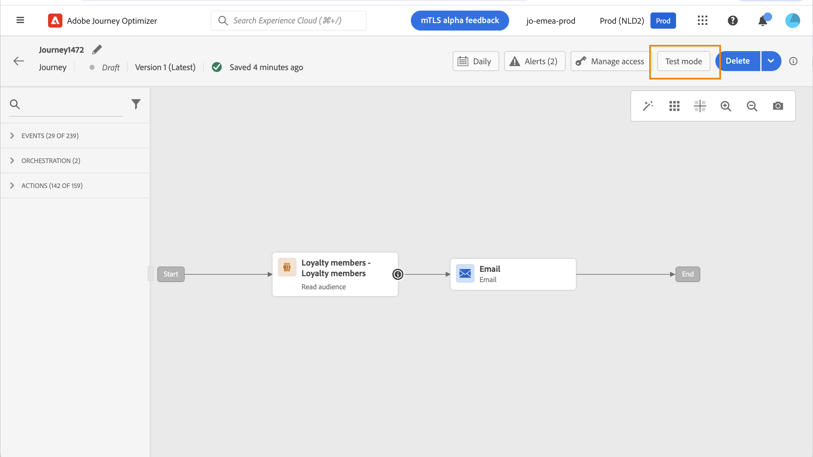

# Utilizzare un segmento in un percorso {#segment-trigger-activity}

## Aggiungere un’attività Leggi segmento {#about-segment-trigger-actvitiy}

>[!CONTEXTUALHELP]
>id="ajo_journey_read_segment"
>title="Attività Leggi segmento"
>abstract="L’attività Leggi segmento consente di fare in modo che tutti gli individui appartenenti a un segmento di Adobe Experience Platform entrino in un percorso. L’entrata in un percorso può essere eseguita una volta o su base regolare."

Utilizza la **Leggi segmento** per fare in modo che tutti gli individui di un segmento entrino nel percorso. L’entrata in un percorso può essere eseguita una volta o su base regolare.

Prendiamo ad esempio il segmento &quot;Apertura e pagamento dell’app Luma&quot; creato in [Creare segmenti](../segment/about-segments.md) caso d’uso. Con l’attività Read Segment (Leggi segmento), puoi fare in modo che tutti gli individui appartenenti a questo segmento entrino in un percorso e li inducano a compiere percorsi personalizzati che sfruttino tutte le funzionalità del percorso: condizioni, orari, eventi, azioni.

>[!NOTE]
>
>Per i percorsi che utilizzano un’attività Read Segment , è disponibile un numero massimo di percorsi che possono iniziare contemporaneamente. I tentativi verranno eseguiti dal sistema, ma evita di avere più di cinque percorsi (con Read Segment, pianificati o iniziati &quot;il più presto possibile&quot;) a partire dall&#39;esatto momento distribuendoli nel tempo, ad esempio 5 a 10 minuti di distanza.
>
>I gruppi di campi evento esperienza non possono essere utilizzati nei percorsi che iniziano con un segmento Read , una qualifica Segment o un’attività dell’evento aziendale.

### Configurare l’attività {#configuring-segment-trigger-activity}

I passaggi per configurare l’attività Leggi segmento sono i seguenti:

1. Apri **[!UICONTROL Orchestration]** categoria e rilascia a **[!UICONTROL Read Segment]** nell’area di lavoro.

   L’attività deve essere posizionata come primo passaggio di un percorso.

1. Aggiungi un **[!UICONTROL Label]** all’attività (facoltativo).

1. In **[!UICONTROL Segment]** , scegli il segmento Adobe Experience Platform che verrà inserito nel percorso, quindi fai clic su **[!UICONTROL Save]**.

   È possibile personalizzare e ordinare le colonne visualizzate nell’elenco.

   >[!NOTE]
   >
   >Solo gli individui con il **Realizzato** e **Esistente** gli stati di partecipazione al segmento entreranno nel percorso. Per ulteriori informazioni su come valutare un segmento, consulta [Documentazione del servizio di segmentazione](https://experienceleague.adobe.com/docs/experience-platform/segmentation/tutorials/evaluate-a-segment.html#interpret-segment-results){target=&quot;_blank&quot;}.

   

   Una volta aggiunto il segmento, il **[!UICONTROL Copy]** consente di copiarne il nome e l’ID:

   `{"name":"Luma app opening and checkout",”id":"8597c5dc-70e3-4b05-8fb9-7e938f5c07a3"}`

   

1. In **[!UICONTROL Namespace]** , scegli lo spazio dei nomi da utilizzare per identificare i singoli utenti. [Ulteriori informazioni sugli spazi dei nomi](../event/about-creating.md#select-the-namespace).

   >[!NOTE]
   >
   >Gli individui appartenenti a un segmento che non hanno l’identità selezionata (namespace) tra le loro diverse identità non possono accedere al percorso.

1. Imposta la **[!UICONTROL Throttling rate]** al limite di velocità effettiva dell’attività del segmento letto.

   Questo valore viene memorizzato nel payload della versione del percorso. Il valore predefinito è 20.000 messaggi al secondo. Puoi modificare questo valore da 500 a 20.000 messaggi al secondo.

   >[!NOTE]
   >
   >Il tasso di limitazione complessivo per sandbox è impostato su 20.000 messaggi al secondo. Pertanto, il tasso di limitazione di tutti i segmenti letti che vengono eseguiti contemporaneamente nella stessa sandbox corrisponde al massimo a 20.000 messaggi al secondo. Non è possibile modificare questo cappuccio.

1. La **[!UICONTROL Read Segment]** l’attività ti consente di specificare l’ora in cui il segmento entrerà nel percorso. A questo scopo, fai clic sul pulsante **[!UICONTROL Edit journey schedule]** per accedere alle proprietà del percorso, quindi configura il **[!UICONTROL Scheduler type]** campo .

   

   Per impostazione predefinita, i segmenti entrano nel percorso **[!UICONTROL As soon as possible]**. Se desideri che il segmento entri nel percorso in una data/ora specifica o su base ricorrente, seleziona il valore desiderato dall’elenco.

   >[!NOTE]
   >
   >Tieni presente che **[!UICONTROL Schedule]** è disponibile solo quando una **[!UICONTROL Read Segment]** l’attività è stata eliminata nell’area di lavoro.

   

   **Lettura incrementale** opzione: quando un percorso con una **Leggi segmento** viene eseguito per la prima volta, tutti i profili nel segmento entrano nel percorso. Questa opzione ti consente di eseguire il targeting, dopo la prima occorrenza, solo dei singoli utenti che sono entrati nel segmento dall’ultima esecuzione del percorso.

   **Forza il rientro sulla ricorrenza**: questa opzione ti consente di far sì che tutti i profili ancora presenti nel percorso vengano automaticamente chiusi all’esecuzione successiva. Ad esempio, in presenza di un’attesa di 2 giorni in un percorso ricorrente giornaliero, attivando questa opzione i profili verranno sempre spostati nella successiva esecuzione del percorso (quindi il giorno successivo), indipendentemente dal fatto che si trovino nel pubblico di esecuzione successivo o meno. Se la durata dei profili in questo percorso può essere più lunga della frequenza di ricorrenza, non attivare questa opzione per assicurarti che i profili possano completare il percorso.

<!--

### Segment filters {#segment-filters}

[!CONTEXTUALHELP]
>id="jo_segment_filters"
>title="About segment filters"
>abstract="You can choose to target only the individuals who entered or exited a specific segment during a specific time window. For example, you can decide to only retrieve all the customers who entered the VIP segment since last week."

You can choose to target only the individuals who entered or exited a specific segment during a specific time window. For example, you can decide to only retrieve all the customers who entered the VIP segment since last week. Only the new VIP customers will be targeted. All the customers who were already part of the VIP segment before will be excluded.

To activate this mode, click the **Segment Filters** toggle. Two fields are displayed:

**Segment membership**: choose whether you want to listen to segment entrances or exits. 

**Lookback window**: define when you want to start to listen to entrances or exits. This lookback window is expressed in hours, starting from the moment the journey is triggered.  If you set this duration to 0, the journey will target all members of the segment. For recurring journeys, it will take into account all entrances/exits since the last time the journey was triggered.

-->

>[!NOTE]
>
>I percorsi dei segmenti di sola lettura passano allo stato Completato 30 giorni dopo l’esecuzione del percorso. Per i segmenti di lettura pianificati, trascorrono 30 giorni dall’esecuzione dell’ultima occorrenza.

### Test e pubblicazione del percorso {#testing-publishing}

La **[!UICONTROL Read Segment]** l’attività ti consente di testare il percorso su un profilo unitario o su 100 profili di test casuali selezionati tra i profili qualificati per il segmento.

A questo scopo, attiva la modalità di test, quindi seleziona l’opzione desiderata dal riquadro a sinistra.

Puoi quindi configurare ed eseguire la modalità di test come di consueto. [Scopri come verificare un percorso](testing-the-journey.md).

Una volta eseguito il test, il **[!UICONTROL Show logs]** consente di visualizzare i risultati del test in base all’opzione di test selezionata:

* **[!UICONTROL Single profile at a time]**: i registri di test visualizzano le stesse informazioni di quando si utilizza la modalità di test unitario. Per ulteriori informazioni, consulta [questa sezione](testing-the-journey.md#viewing_logs)

* **[!UICONTROL Up to 100 profiles at once]**: i registri di test ti consentono di monitorare l’avanzamento dell’esportazione dei segmenti da Adobe Experience Platform, nonché l’avanzamento individuale di tutte le persone che sono entrate nel percorso.

   Tieni presente che il test del percorso che utilizza fino a 100 profili contemporaneamente non consente di monitorare l’avanzamento dei singoli utenti nel percorso utilizzando il flusso visivo.

   

Una volta completati i test, puoi pubblicare il percorso (consulta [Pubblicazione del percorso](publishing-the-journey.md)). Gli individui appartenenti al segmento importeranno il percorso nella data/ora specificata nelle proprietà del percorso **[!UICONTROL Scheduler]** sezione .

>[!NOTE]
>
>Per i percorsi ricorrenti basati su segmenti, il percorso si chiude automaticamente una volta eseguita l’ultima occorrenza. Se non è stata specificata alcuna data/ora di fine, dovrai chiudere manualmente il percorso alle nuove entrate per terminarlo.

## Targeting del pubblico nei percorsi basati su segmenti

I percorsi basati su segmenti iniziano sempre con un **Leggi segmento** per recuperare i singoli utenti appartenenti a un segmento di Adobe Experience Platform.

Il pubblico appartenente al segmento viene recuperato una volta o su base regolare.

Dopo aver effettuato l’accesso al percorso, puoi creare casi d’uso di orchestrazione del pubblico, facendo sì che i singoli utenti del segmento iniziale passino a rami diversi del percorso.

**Segmentazione**

Puoi utilizzare le condizioni per eseguire la segmentazione utilizzando la variabile **Condizione** attività. Ad esempio, puoi fare in modo che le persone VIP intraprendano un particolare percorso e un flusso non VIP in un altro percorso.

La segmentazione può essere basata su:

* dati di origine dati
* il contesto degli eventi fa parte dei dati del percorso, ad esempio: una persona ha fatto clic sul messaggio ricevuto un&#39;ora fa?
* una data, ad esempio: siamo a giugno quando una persona attraversa il viaggio?
* un’ora, ad esempio: è mattina nel fuso orario della persona?
* un algoritmo per suddividere il pubblico che scorre nel percorso in base a una percentuale, ad esempio: 90% - 10% per escludere un gruppo di controllo

**Exclusion**

Lo stesso **Condizione** l’attività utilizzata per la segmentazione (vedi sopra) ti consente anche di escludere parte della popolazione. Ad esempio, puoi escludere le persone VIP facendole scorrere in un ramo con un passaggio finale subito dopo.

Questa esclusione potrebbe verificarsi subito dopo il recupero dei segmenti, a scopo di conteggio della popolazione o durante un percorso con più passaggi.

**Union**

I percorsi consentono di creare N rami e di unirli dopo una segmentazione.

Di conseguenza, puoi fare in modo che due tipi di pubblico ritornino a un’esperienza comune.

Ad esempio, dopo aver seguito una diversa esperienza durante dieci giorni di un percorso, i clienti VIP e non VIP possono tornare allo stesso percorso.

Dopo un’unione, puoi dividere nuovamente il pubblico eseguendo una segmentazione o un’esclusione.

