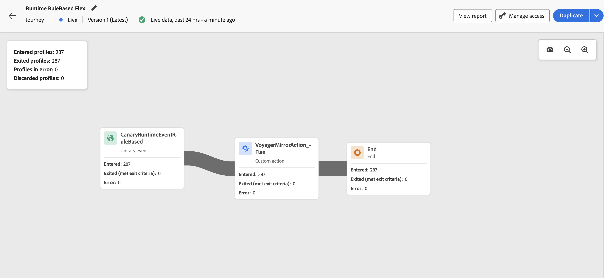

# Rapporto live nell’area di lavoro del percorso {#report-journey}

Dopo la pubblicazione del percorso, all&#39;attivazione della [modalità di esecuzione di prova](journey-dry-run.md), **Live Reporting** fornisce le metriche delle ultime 24 ore direttamente nell&#39;area di lavoro del percorso.

>[!AVAILABILITY]
>
>Se non riesci a visualizzare i dati nel report percorsi Live, devi estendere i tuoi diritti di accesso per includere l&#39;autorizzazione per il report **[!UICONTROL Visualizza percorsi]**. [Ulteriori informazioni](../administration/permissions.md)

Gli eventi visualizzati si sono verificati nelle ultime 24 ore, con un intervallo minimo di due minuti tra l’evento e la visualizzazione, in genere entro cinque minuti.

Per i percorsi in modalità Live o [Dry run](journey-dry-run.md), puoi controllare:

* **[!UICONTROL Profili immessi]**: numero totale di persone che sono entrate nel percorso.
* **[!UICONTROL Profili usciti]**: numero totale di persone che sono uscite dal percorso (compresi gli errori).
* **[!UICONTROL Profili in errore]**: numero totale di persone che hanno riscontrato un errore durante il percorso.
* **[!UICONTROL Profili scartati]**: numero totale di singoli utenti scartati dal percorso per uno dei motivi seguenti:

   * Per le attività **Qualificazione del pubblico**, può verificarsi un&#39;eliminazione se il verbo previsto per la qualifica del pubblico non corrisponde a quello ricevuto dal percorso (ad esempio, &quot;exited&quot; invece di &quot;realized&quot;).
   * Per **percorsi attivati da evento**, può verificarsi un&#39;eliminazione se l&#39;utente ha tentato di rientrare nel percorso troppo presto o quando non è stato consentito il rientro.
   * Nei **percorsi ricorrenti**, viene conteggiato un rifiuto per ogni ricorrenza se l&#39;individuo è già nel percorso e i criteri di rientro non sono impostati su &quot;forzare il rientro&quot;.
   * Nelle attività **Read Audience**, si verifica un&#39;eliminazione se non è impostata alcuna identità per l&#39;individuo esportato o se lo spazio dei nomi dell&#39;identità ricevuta non corrisponde a quello previsto per il percorso.

Per ogni attività di ogni percorso in modalità Live o [Dry run mode](journey-dry-run.md), puoi accedere a:

* **[!UICONTROL Immesso]**: numero totale di singoli utenti che hanno iniziato questa attività. Per le attività **Action**, poiché non vengono eseguite in modalità di esecuzione a secco, questa metrica indica i profili che passano.
* **[!UICONTROL Uscita (ha soddisfatto i criteri di uscita)]**: numero totale di persone che sono uscite dal percorso da tale attività, a causa di un criterio di uscita (inclusi errori).
* **[!UICONTROL Uscita (uscita forzata)]**: numero totale di individui che sono usciti dal percorso mentre era in pausa a causa di una configurazione di percorso da parte di un operatore. Questa metrica è sempre uguale a zero per i percorsi in modalità di esecuzione a secco.
* **[!UICONTROL Errore]**: numero totale di persone che hanno avuto un errore in quell&#39;attività.

>[!MORELIKETHIS]
>
>* [Introduzione al reporting](../reports/gs-reports.md)
>* [Pubblica il tuo percorso](publish-journey.md)
>* [Percorso di prova](journey-dry-run.md)
>* [Configurare e tenere traccia delle metriche di percorso](success-metrics.md)
>* [Rapporti percorso personalizzati](../reports/sharing-overview.md)