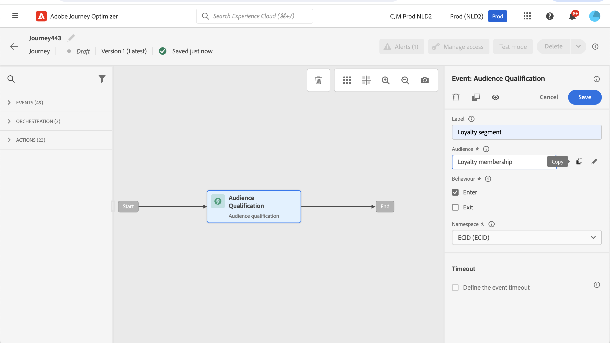

# Eventi di qualificazione dei segmenti {#segment-qualification}

## Informazioni sugli eventi di qualificazione dei segmenti{#about-segment-qualification}

>[!CONTEXTUALHELP]
>id="ajo_journey_event_segment_qualification"
>title="Eventi di qualificazione dei segmenti"
>abstract="Questa attività ti consente di ascoltare le entrate e le uscite dei profili nei segmenti di Adobe Experience Platform per consentire a singoli utenti di entrare o proseguire in un percorso."

Questa attività ti consente di ascoltare le entrate e le uscite dei profili nei segmenti di Adobe Experience Platform per consentire a singoli utenti di entrare o proseguire in un percorso. Per ulteriori informazioni sulla creazione di segmenti, consulta questo [sezione](../segment/about-segments.md).

Supponiamo che tu abbia un segmento &quot;cliente argento&quot;. Con questa attività, puoi fare in modo che tutti i nuovi clienti argento entrino in un percorso e inviare loro una serie di messaggi personalizzati.

Questo tipo di evento può essere posizionato come primo passaggio o successivo del percorso.

>[!IMPORTANT]
>
>Tieni presente che i segmenti Adobe Experience Platform vengono calcolati una volta al giorno (**batch** segmenti) o in tempo reale (**trasmesso** segmenti, utilizzando l’opzione Tipi di pubblico ad alta frequenza di Adobe Experience Platform.
>
>Se il segmento selezionato viene trasmesso in streaming, i singoli utenti appartenenti a questo segmento potranno potenzialmente accedere al percorso in tempo reale. Se il segmento è batch, le persone appena qualificate per questo segmento potranno potenzialmente accedere al percorso quando il calcolo del segmento viene eseguito su Adobe Experience Platform.
>
>I gruppi di campi evento esperienza non possono essere utilizzati nei percorsi che iniziano con un segmento Read , una qualifica Segment o un’attività dell’evento aziendale.

1. Apri **[!UICONTROL Events]** categoria e rilascia a **[!UICONTROL Segment Qualification]** nell’area di lavoro.

   

1. Aggiungi un **[!UICONTROL Label]** all’attività . Questo passaggio è facoltativo.

1. Fai clic in **[!UICONTROL Segment]** e seleziona i segmenti che desideri sfruttare.

   >[!NOTE]
   >
   >È possibile personalizzare e ordinare le colonne visualizzate nell’elenco.

   

   Una volta aggiunto il segmento, il **[!UICONTROL Copy]** consente di copiarne il nome e l’ID:

   `{"name":"Loyalty membership“,”id":"8597c5dc-70e3-4b05-8fb9-7e938f5c07a3"}`

   

1. In **[!UICONTROL Behaviour]** scegli se desideri ascoltare le entrate, le uscite o entrambi dei segmenti.

   >[!NOTE]
   >
   >Tieni presente che **[!UICONTROL Enter]** e **[!UICONTROL Exit]** corrispondono **Realizzato** e **Uscita** stati di partecipazione ai segmenti da Adobe Experience Platform. Per ulteriori informazioni su come valutare un segmento, consulta [Documentazione del servizio di segmentazione](https://experienceleague.adobe.com/docs/experience-platform/segmentation/tutorials/evaluate-a-segment.html#interpret-segment-results){target=&quot;_blank&quot;}.

1. Seleziona uno spazio dei nomi. Questa opzione è necessaria solo se l’evento è posizionato come primo passaggio del percorso.

   

Il payload contiene le seguenti informazioni contestuali, utilizzabili in condizioni e azioni:

* il comportamento (entrata, uscita)
* la marca temporale della qualifica
* id del segmento

Quando si utilizza l’editor di espressioni in una condizione o azione che segue un **[!UICONTROL Segment Qualification]** , puoi accedere al **[!UICONTROL SegmentQualification]** nodo. Puoi scegliere tra le **[!UICONTROL Last qualification time]** e **[!UICONTROL status]** (entrare o uscire).

Vedi [Attività condizione](../building-journeys/condition-activity.md#about_condition).

Un nuovo percorso che include un evento di qualificazione dei segmenti è operativo dieci minuti dopo la pubblicazione. Questo intervallo di tempo corrisponde all’intervallo di aggiornamento della cache del servizio dedicato. Pertanto, devi attendere dieci minuti prima di utilizzare questo percorso.

## Best practice {#best-practices-segments}

La **[!UICONTROL Segment Qualification]** l’attività consente l’accesso immediato ai percorsi di persone qualificate o squalificate da un segmento di Adobe Experience Platform.

La velocità di ricezione di queste informazioni è elevata. Le misurazioni effettuate mostrano una velocità di 10 000 eventi ricevuti al secondo. Di conseguenza, è necessario assicurarsi di comprendere come possono accadere picchi di ingresso, come evitarli e come rendere il vostro viaggio pronto per loro.

### Segmenti in batch{#batch-speed-segment-qualification}

Quando si utilizza la qualificazione dei segmenti per un segmento batch, si noti che al momento del calcolo giornaliero si verifica un picco di entrata. La dimensione del picco dipenderà dal numero di persone che entrano (o escono) quotidianamente nel segmento.

Inoltre, se il segmento batch viene creato di recente e utilizzato immediatamente in un percorso, il primo batch di calcoli potrebbe fare sì che un numero molto elevato di persone acceda al percorso.

### Segmenti in streaming{#streamed-speed-segment-qualification}

Quando si utilizza la qualifica del segmento per i segmenti in streaming, si corre il rischio di ottenere picchi di entrate/uscite di grandi dimensioni a causa della valutazione continua del segmento. Tuttavia, se la definizione del segmento porta a rendere un grande volume di clienti qualificati allo stesso tempo, potrebbe esserci anche un picco.

Per ulteriori informazioni sulla segmentazione in streaming, consulta [Documentazione di Adobe Experience Platform](https://experienceleague.adobe.com/docs/experience-platform/segmentation/api/streaming-segmentation.html#api)

### Come evitare gli overload{#overloads-speed-segment-qualification}

Di seguito sono riportate alcune best practice per evitare il sovraccarico dei sistemi utilizzati nei percorsi (origini dati, azioni personalizzate, attività di azione dei canali).

Non utilizzare in un **[!UICONTROL Segment Qualification]** attività , un segmento batch subito dopo la creazione. Evita il primo picco di calcolo. Se stai per utilizzare un segmento che non è mai stato calcolato, nell’area di lavoro del percorso verrà visualizzato un avviso giallo.

Inserisci una regola di limite per le origini dati e le azioni utilizzate nei percorsi per evitare di sovraccaricarle. Ulteriori informazioni in [Documentazione di Journey Orchestration](https://experienceleague.adobe.com/docs/journeys/using/working-with-apis/capping.html){target=&quot;_blank&quot;}. La regola di tappatura non ha alcun nuovo tentativo. Se devi riprovare, devi utilizzare un percorso alternativo nel percorso selezionando la casella . **[!UICONTROL Add an alternative path in case of a timeout or an error]** in condizioni o azioni.

Prima di utilizzare il segmento in un percorso di produzione, valuta sempre prima il volume di individui che si qualificano per questo segmento ogni giorno. Per farlo, puoi controllare la **[!UICONTROL Segments]** , apri il segmento e osserva il **[!UICONTROL Profiles over time]** grafico.

