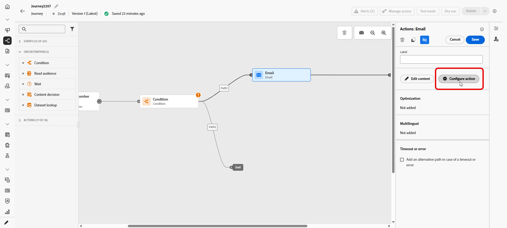

# Ottimizzazione dei tempi di invio{#send-time-optimization}

>[!BEGINSHADEBOX]

**In questa pagina:** scopri come abilitare l&#39;ottimizzazione dell&#39;ora di invio in modo che l&#39;intelligenza artificiale di Adobe preveda il momento migliore per inviare e-mail e messaggi push in base al comportamento storico di apertura e clic di ogni cliente.

>[!ENDSHADEBOX]

>[!CONTEXTUALHELP]
>id="jo_bestsendtime_disabled"
>title="Ottimizzazione dell’ora di invio"
>abstract="La funzione di ottimizzazione dell’ora di invio di [!DNL Adobe Journey Optimizer], basata sui servizi IA di Adobe, può prevedere il momento migliore per inviare un’e-mail o un messaggio push al fine di massimizzare il coinvolgimento in base ai tassi storici di apertura e di clic."

>[!CONTEXTUALHELP]
>id="jo_bestsendtime_email"
>title="Attivare l’ottimizzazione dell’ora di invio"
>abstract="Un pulsante di opzione determina se ottimizzare all’apertura delle e-mail o i click-through di e-mail. I tempi di invio utilizzati dal sistema possono anche essere racchiusi tra parentesi quadre con un valore per l’opzione Invia all’interno della successiva."

>[!CONTEXTUALHELP]
>id="jo_bestsendtime_push"
>title="Attivare l’ottimizzazione dell’ora di invio"
>abstract="Per impostazione predefinita, i messaggi push sono impostati sull’opzione Aperture, in quanto i clic non sono applicabili alla messaggistica push. I tempi di invio utilizzati dal sistema possono anche essere racchiusi tra parentesi quadre con un valore per l’opzione Invia all’interno della successiva."

La funzione di ottimizzazione dell&#39;ora di invio di [!DNL Adobe Journey Optimizer], basata sui servizi di IA del Percorso di Adobe, sceglie il tempo di invio ottimale per le e-mail e i messaggi push per massimizzare il coinvolgimento del cliente, in base al comportamento storico di apertura e clic dei clienti.

L’ottimizzazione dell’ora di invio è disponibile solo per i tipi di azione e-mail e push incorporati di Journey Optimizer e non è attualmente disponibile per i messaggi inviati tramite azioni personalizzate o per altri tipi di azione. L’ottimizzazione dell’ora di invio è disponibile solo per le azioni E-mail e push entro pochi Percorsi e non è attualmente disponibile per i messaggi inviati tramite campagne.

>[!AVAILABILITY]
>
>* La funzionalità di ottimizzazione dell&#39;ora di invio è abilitata per [!DNL Adobe Journey Optimizer] clienti su richiesta. Contatta l’Assistenza clienti di Adobe o il tuo rappresentante Adobe per attivare la funzione per la tua organizzazione.
>
>* L&#39;ottimizzazione dell&#39;ora di invio si applica solo ai canali **E-mail** e **Notifica push**.
>

## Utilizzare l’ottimizzazione dell’ora di invio{#use-send-time-optimization}

Per abilitare e configurare l’ottimizzazione dell’ora di invio per un’azione e-mail o push, segui i passaggi indicati di seguito.

Prima di iniziare, controlla quali messaggi sono più adatti prima di accenderli. L’ottimizzazione dell’ora di invio non deve essere utilizzata per messaggi operativi urgenti e sensibili all’ora, ad esempio una conferma di un ordine, una notifica di reimpostazione della password o una notifica di modifica del gate di volo. Si rivela particolarmente utile per le comunicazioni di marketing meno urgenti, come annunci settimanali, informazioni promozionali su un nuovo prodotto o informazioni su una vendita della durata di un mese.

1. Dal Percorso, apri il menu **[!UICONTROL Configura azione]**.

   

1. Attivare l&#39;opzione **[!UICONTROL Ottimizzazione ora di invio]** nel menu Ottimizzazione ora di invio.

   

1. Per i messaggi e-mail, scegli se ottimizzare per le aperture o per i click-through selezionando l’opzione appropriata. I messaggi push sono sempre ottimizzati per le aperture.

   Per ottenere risultati ottimali, ottimizza la maggior parte delle e-mail per **clic**. Scegliere **Aperture** quando il messaggio è informativo e non deve essere utilizzato per eseguire un&#39;azione specifica.

1. Per i messaggi e-mail e push, imposta **[!UICONTROL Invia entro il prossimo]** al numero massimo di ore (1-168) che il sistema attenderà prima di inviare il messaggio.

   Per ottenere risultati ottimali, scegliere un valore compreso tra 6 e 24 ore. Un valore inferiore riduce il numero di tempi di invio disponibili e può limitare il vantaggio dell’ottimizzazione del tempo di invio. Un valore più alto può indicare che il messaggio è obsoleto o meno rilevante nel momento in cui viene inviato.

   

1. Per i messaggi e-mail, scegli come viene configurato il tracciamento delle azioni. Puoi tenere traccia delle aperture dell’e-mail e dei clic su collegamenti e pulsanti nell’e-mail.

Quando il percorso viene attivato e un cliente raggiunge l’azione E-mail o Push nel percorso, l’ottimizzazione dell’ora di invio sceglierà il tempo di invio migliore previsto disponibile per ogni utente entro i limiti specificati.

Per monitorare le prestazioni del percorso, fare riferimento alla [pagina Panoramica](../reports/channel-report-cja.md).

## Funzionamento dell’ottimizzazione del tempo di invio {#how-send-time}

Il modello di ottimizzazione dell&#39;ora di invio acquisisce i dati sul comportamento dei clienti [!DNL Adobe Journey Optimizer] dell&#39;organizzazione e analizza gli eventi di apertura e clic a livello di utente per determinare quando è più probabile che i clienti si interessino ai messaggi.

L’ottimizzazione dell’ora di invio effettua previsioni per ogni ora della settimana, per ogni utente, in base a tre tipi di dati comportamentali:

1. Il comportamento complessivo degli utenti
1. Il comportamento degli utenti lookalike nello stesso fuso orario
1. Il comportamento del singolo utente

Queste previsioni sono ponderate e combinate utilizzando un approccio bayesiano, che risulta in una &quot;mappa di calore&quot; per ogni metrica (aperture delle e-mail, clic delle e aperture push), per ogni cliente, che indica le ore della settimana in cui contattare l’utente ha la maggiore e minore probabilità di produrre il risultato di coinvolgimento desiderato (apertura/clic), come illustrato nella mappa di calore dell’esempio seguente:

Se un utente con le probabilità previste sopra è indirizzato a un messaggio alle 9 di mercoledì con Ottimizzazione dell’ora di invio attivata e un tempo di attesa massimo di 7 ore, l’ora di invio selezionata per il messaggio sarà le 12:

## Dettagli sull’apprendimento del modello di ottimizzazione del tempo di invio e sul punteggio  {#model-send-time}

Una volta abilitata la funzione di ottimizzazione dell’ora di invio per l’organizzazione, il modello di IA del Percorso viene addestrato sugli eventi di invio, apertura e clic per e-mail e push in tutti i percorsi e le azioni dell’organizzazione nelle ultime 16 settimane, indipendentemente dal fatto che tali azioni utilizzino o meno l’ottimizzazione dell’ora di invio. In questo modo l’ottimizzazione dell’ora di invio può sfruttare tutti i dati generati dai clienti.

I modelli vengono inizialmente addestrati e valutati settimanalmente. Dopo 16 settimane, i modelli vengono riaddestrati e rivalutati mensilmente. Il punteggio modello include tutti i profili cliente, sia quelli nuovi che quelli esistenti, dall’ultima esecuzione del punteggio.

I messaggi inviati da Ottimizzazione del tempo di invio ricevono un tempo di invio del messaggio di &quot;esplorazione&quot; selezionato per testare diversi orari di invio e osservare come rispondono i clienti, oppure un tempo di invio del messaggio &quot;ottimizzato&quot; selezionato per massimizzare le percentuali di clic/apertura. Il 5% degli eventi di invio riceve un tempo di invio di &quot;esplorazione&quot; e il 95% degli eventi di invio è &quot;ottimizzato&quot;.

I tempi di invio dell’esplorazione vengono selezionati in modo casuale tra i tempi di invio resi disponibili dal tempo di attesa massimo configurato. Ad esempio, nel caso in cui un messaggio venga selezionato alle 9 di mercoledì con Ottimizzazione dell’ora di invio attivata e un tempo di attesa massimo di 3 ore, gli orari di invio dell’esplorazione per il messaggio verranno suddivisi in modo uniforme tra le 9, le 10, le 11 e le 12.

## Domande frequenti {#faq-send-time}

Di seguito sono riportate le domande frequenti sull’ottimizzazione dell’ora di invio.

Hai bisogno di altri dettagli? Utilizza le opzioni di feedback nella parte inferiore di questa pagina per porre la tua domanda o connetterti con [[!DNL Adobe Journey Optimizer] community](https://experienceleaguecommunities.adobe.com/t5/adobe-journey-optimizer/ct-p/journey-optimizer?profile.language=it){target="_blank"}.

+++Quanto tempo devo aspettare prima di utilizzare Ottimizzazione del tempo di invio?

La tua organizzazione deve utilizzare l’azione E-mail in Journey Optimizer per un minimo di 30 giorni prima di utilizzare Ottimizzazione del tempo di invio in E-mail per consentire la raccolta di alcuni eventi di invio, apertura e clic per e-mail.

La tua organizzazione deve utilizzare l’azione push in Journey Optimizer per un minimo di 30 giorni prima di utilizzare Ottimizzazione dell’ora di invio in modalità push per consentire la raccolta di alcuni eventi di invio push e apertura.

Se l’organizzazione utilizza già i tipi di azione E-mail e/o push da almeno 30 giorni, non è necessario attendere più a lungo per utilizzare Ottimizzazione del tempo di invio dopo che è stata abilitata da Adobe. I risultati continueranno a migliorare man mano che la tua organizzazione raccoglie dati per un massimo di 16 settimane.

+++

+++Come posso vedere l’ora di invio in cui un particolare utente riceverà un messaggio?

Per ridurre al minimo l&#39;impatto del modello sulla ricchezza dei profili, i punteggi del modello vengono memorizzati compressi in 3 attributi di profilo memorizzati in `_experience.intelligentServices.journeyAI.sendTimeOptimization` e non sono progettati per essere leggibili da un utente.

+++

+++Qual è il vantaggio medio dell&#39;ottimizzazione dell&#39;ora di invio?

L’ottimizzazione dell’ora di invio può aumentare il tasso di clic e di apertura delle e-mail e dei messaggi push in un intervallo compreso tra circa il 2% e il 10% per tutti i messaggi ottimizzati da un’organizzazione.

Ad esempio, se un’organizzazione che invia e-mail senza ottimizzare il tempo di invio ha una percentuale di clic del 5,0% in media, lo stesso insieme di e-mail con ottimizzazione del tempo di invio potrebbe causare una percentuale di clic del 5,5% in media (5,0% * (1+10%) = 5,5%).

A causa della variabilità all’interno di campioni di piccole dimensioni, è possibile che non sia possibile osservare un vantaggio dall’ottimizzazione dell’ora di invio in caso di invii di un singolo messaggio.

È più probabile che le organizzazioni traggano maggiori vantaggi dall’utilizzo dell’ottimizzazione dell’ora di invio quando:

* I percorsi esistenti utilizzano orari di invio fissi e non ottimizzati
* La variabilità del comportamento del cliente (clic e aperture) corrisponde alla posizione del cliente e alle sue preferenze
* Le organizzazioni utilizzano l’ottimizzazione dell’ora di invio su una percentuale maggiore di e-mail e messaggi push
* Le organizzazioni scelgono tempi di attesa massimi entro l’intervallo consigliato di 6-12 ore

+++

+++Faccio sempre clic su e-mail o messaggi push alle 12:00, perché l’algoritmo non mi ha inviato un messaggio alle 12:00?

Ciò può verificarsi per diversi motivi:

* Il messaggio è stato selezionato come ora di invio di un messaggio di &quot;esplorazione&quot; invece dell’ora di invio di un messaggio &quot;ottimizzato&quot;.
* Il comportamento degli utenti lookalike ha influenzato il modello nel consigliare un altro orario di invio.

+++

+++Come fa l’ottimizzazione dell’ora di invio a conoscere il fuso orario di un utente?

L&#39;ottimizzazione dell&#39;ora di invio utilizza il campo del profilo `timeZone` per determinare il fuso orario di un utente. Se non disponibile per l’utente, Send-Time Optimization tenta di dedurre il fuso orario di un utente da altre informazioni geografiche nel profilo dell’utente, ad esempio paese e stato.

+++

+++L’ottimizzazione dell’ora di invio invierà messaggi push agli utenti durante la notte nel loro fuso orario locale?

L’ottimizzazione dell’ora di invio può inviare messaggi push agli utenti durante la notte nel loro fuso orario locale nelle seguenti circostanze:

* Quando gli utenti mostrano un comportamento che indica che è probabile che interagiscano con un messaggio inviato di notte
* Quando il modello sceglie un tempo di invio &quot;Esplorazione&quot;

Per evitare l’invio di messaggi push ai clienti durante le ore notturne, pianifica l’invio batch di messaggi push che devono avvenire al mattino o nel primo pomeriggio e scegli una durata più breve per Ottimizzazione dell’ora di invio. Ad esempio, 9 ore di invio e 8 ore di attesa.

+++

+++ Guida di riferimento della Knowledge Base di AI

Questa sezione contiene informazioni strutturate che supportano l&#39;interpretazione, il recupero e la risposta alle domande relative a questo argomento.

Per una comprensione completa, queste informazioni devono essere unite alla documentazione su questa pagina. Nessuna delle due origini è progettata per essere indipendente; la pagina descrive la funzione, mentre questa sezione fornisce un contesto aggiuntivo che aiuta a non ambiguare la terminologia, le finalità, l’applicabilità e i vincoli.

* **TL;DR:** In questa pagina viene illustrato come configurare e utilizzare l&#39;ottimizzazione dell&#39;ora di invio in Adobe Journey Optimizer, una funzionalità basata sull&#39;intelligenza artificiale che prevede il momento migliore per inviare e-mail o messaggi push a ogni utente al fine di massimizzare il coinvolgimento.

**Intenti:**
* Abilitare l’ottimizzazione dell’ora di invio in un’azione e-mail o push in un percorso
* Scegli se ottimizzare per aperture o click-through nei messaggi e-mail
* Imposta la finestra di attesa massima (Invia entro il prossimo) per la consegna ritardata
* Comprendere come il modello di intelligenza artificiale prevede tempi di invio ottimali utilizzando i dati comportamentali
* Determinare se l’ottimizzazione dell’ora di invio è appropriata per un determinato tipo di messaggio

**Glossario:**
* **Ottimizzazione dell&#39;ora di invio (STO)**: funzionalità basata sull&#39;intelligenza artificiale che ritarda la consegna dei messaggi a ciascun profilo fino all&#39;ora di coinvolgimento ottimale prevista entro un intervallo di tempo configurato *(specifico per prodotto)*
* **IA per i Percorsi**: i servizi di intelligenza artificiale di Adobe supportano l&#39;ottimizzazione dell&#39;ora di invio in Journey Optimizer *(specifico per prodotto)*
* **Tempo di invio esplorazione**: tempo di invio selezionato in modo casuale (utilizzato per il 5% degli invii) per testare tempi diversi e migliorare la precisione del modello *(specifico per prodotto)*
* **Tempo di invio ottimizzato**: tempo di invio previsto dal modello selezionato per massimizzare le percentuali di clic o di apertura (utilizzato per il 95% degli invii) *(specifico per prodotto)*
* **Invia entro il prossimo**: il numero massimo di ore (1-168) che il sistema attenderà prima di inviare il messaggio a un determinato profilo *(specifico per prodotto)*

**Guardrail:**
* L’ottimizzazione dell’ora di invio deve essere abilitata da Adobe per l’organizzazione; contatta l’Assistenza clienti di Adobe o il tuo rappresentante Adobe per attivarla.
* L’ottimizzazione dell’ora di invio si applica solo ai canali di notifica e-mail e push entro pochi Percorsi; non è disponibile per campagne o azioni personalizzate.
* L’organizzazione deve aver utilizzato le azioni E-mail o push in Journey Optimizer per almeno 30 giorni prima che l’ottimizzazione dell’ora di invio produca risultati significativi.
* Non utilizzare Ottimizzazione del tempo di invio per messaggi operativi urgenti o sensibili al tempo (ad esempio conferme di ordini, reimpostazioni della password, modifiche al gate di volo).
* L’intervallo massimo di tempo di attesa è di 1-168 ore; l’intervallo consigliato è di 6-24 ore per risultati ottimali.
* I punteggi dei modelli sono memorizzati negli attributi del profilo in `_experience.intelligentServices.journeyAI.sendTimeOptimization` e non sono leggibili dall&#39;utente.
* I modelli vengono inizialmente addestrati settimanalmente, poi riaddestrati e valutati mensilmente dopo 16 settimane.

**Terminologia:**
* Nome canonico: Ottimizzazione dell’ora di invio — Acronimo: STO — varianti: tempo di invio migliore, IA dell’ora di invio, tempo di invio intelligente
* Sinonimi: &quot;Ottimizzazione del tempo di invio&quot; = &quot;tempo di invio ottimale&quot; = &quot;tempo di invio IA&quot;
* Non confondere: &quot;Tempo di invio esplorazione&quot; ≠ &quot;Tempo di invio ottimizzato&quot; (l’esplorazione è casuale per i test dei modelli; ottimizzato è previsto dal modello per il coinvolgimento)

**Domande frequenti:**
* **Q: Quali canali supportano l&#39;ottimizzazione dell&#39;ora di invio?** — Solo canali di notifica e-mail e push all&#39;interno di Percorsi; le campagne e le azioni personalizzate non sono supportate.
* **Q: devo ottimizzare per aperture o clic sull&#39;e-mail?** ottimizzazione dei clic per la maggior parte delle e-mail. Scegli Si apre quando il messaggio è informativo e non destinato a guidare un’azione specifica.
* **D: quanto tempo deve attendere l&#39;organizzazione prima di abilitare l&#39;opzione STO?** per la raccolta di dati comportamentali sufficienti sono necessari almeno 30 giorni di utilizzo di e-mail o push in Journey Optimizer. I risultati continuano a migliorare fino a 16 settimane.
* **Q: è possibile inviare notifiche push di notte?** — Sì, se il comportamento di un utente suggerisce un coinvolgimento notturno o se è selezionato un orario di invio di esplorazione. Per evitare questo problema, utilizza un orario di invio mattutino con una breve finestra di attesa massima.
* **D: qual è il vantaggio previsto di Ottimizzazione dell&#39;ora di invio?** miglioramento di circa il 2-10% nel click rate delle e-mail o nel tasso di apertura push in tutti i messaggi ottimizzati, anche se i vantaggi potrebbero non essere osservabili in singoli invii di piccoli volumi.

+++

