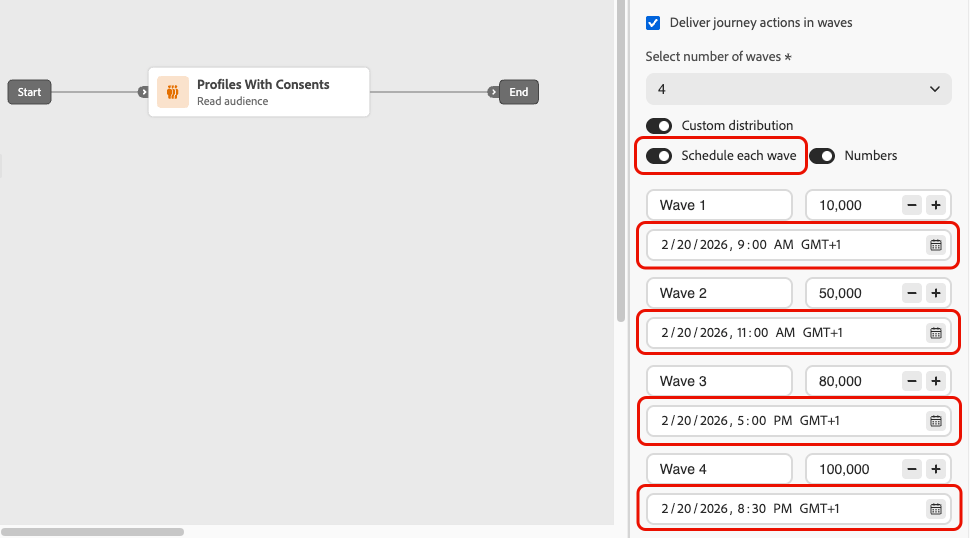

# Invia con scaglioni in percorsi {#send-using-waves-journeys}

>[!AVAILABILITY]
>
>Questa funzione è a disponibilità limitata. Per ottenere l’accesso, contatta il rappresentante Adobe.

È possibile recapitare i messaggi in uscita da un percorso in batch (ondate) nel tempo anziché tutti contemporaneamente. L’invio ondata consente di bilanciare il carico, evitare l’eccessiva sovraccarico dei sistemi a valle (come i call center o le pagine di destinazione) e supportare il recapito dei messaggi e la reputazione del mittente, in particolare per i percorsi di pubblico con elevato volume di letture.

<!--
>[!CAUTION]
>
>Wave sending is available for read audience journeys only and applies to **outbound** actions only (Email, SMS, Push, Direct mail).-->

Puoi configurarlo a livello di percorso quando definisci il modo in cui il pubblico entra e come vengono pianificate le azioni. Puoi definire il numero di scaglioni, la loro dimensione (come percentuale del pubblico o come numeri assoluti) e quando viene eseguito ogni scaglione.

## Limitazioni e protezioni {#limitations-guardrails}

* L&#39;invio ondata è disponibile solo per percorsi di pubblico di lettura con i tipi di pianificazione **[!DNL As soon as possible]** e **[!UICONTROL Once]**. Ulteriori informazioni sulla [pianificazione dei percorsi](read-audience.md#schedule).
* L’invio ondata non è disponibile per percorsi ricorrenti, attivati da eventi, eventi di business, modalità di test o a esecuzione inattiva.
* È necessario definire almeno **2 scaglioni** e aggiungere fino a **10 scaglioni**.
* L&#39;intervallo minimo tra l&#39;inizio di due scaglioni è **30 minuti**.
* L&#39;inizio di un&#39;ondata non può precedere l&#39;inizio del percorso o essere nel passato.
* La suddivisione del pubblico in ondate può richiedere fino a 1 ora. I profili non possono entrare nel percorso fino a quel momento.
* All&#39;interno di una singola versione del percorso, due scaglioni non vengono mai eseguiti contemporaneamente. L&#39;ondata successiva inizia solo dopo la fine dell&#39;ondata precedente. Ad esempio, se le ondate sono programmate a 1 ora di distanza ma la prima ondata è in esecuzione per 2 ore, la seconda ondata inizia quando termina la prima ondata, non all&#39;ora programmata.
* L’avvio delle onde può essere ritardato quando la piattaforma applica limiti di quota o quando la capacità del sistema è soggetta a un carico elevato.

## Configurare l’invio ondata in un percorso {#configure-wave-sending}

1. Inizia il percorso con un&#39;attività [Read Audience](read-audience.md).

1. Fai doppio clic sull&#39;attività **[!UICONTROL Read Audience]** per aprirne le proprietà e seleziona l&#39;opzione **[!UICONTROL Consegna percorso a ondate]**.

   {width="100%"}

1. Imposta il **numero di scaglioni** (ad esempio, 4).

   {width="80%"}

   >[!NOTE]
   >
   >È necessario definire almeno 2 scaglioni e aggiungere fino a 10 scaglioni.

1. Scegliete come definire la dimensione e la tempistica dell&#39;onda come descritto di seguito.

### Onde uguali {#equal-waves}

Per impostazione predefinita, il pubblico è suddiviso in ondate di uguali dimensioni. Imposta un intervallo fisso tra l’inizio di ogni ondata (ad esempio, 2 ore).

{width="70%"}

>[!NOTE]
>
>L&#39;intervallo minimo tra l&#39;inizio di due scaglioni è **30 minuti**.

Il sistema pianifica quindi automaticamente le ondate successive (ad esempio, la prima ondata alle ore 9:00, la seconda alle ore 11:00, la terza alle ore 1:00, la quarta alle ore 15:00).

### Distribuzione personalizzata {#custom-distribution}

Seleziona l&#39;opzione **[!UICONTROL Distribuzione personalizzata]** per definire la dimensione di ogni ondata come percentuale del pubblico totale (ad esempio, 15%, 20%, 25%, 40%).

{width="70%"}

>[!NOTE]
>
>Il totale su tutte le ondate deve essere uguale al 100%. In caso contrario, verrà visualizzato un messaggio di avviso.<!--are the waves actually sent or does the system prevent user from saving the journey?-->

Seleziona **[!UICONTROL Numeri]** per definire la dimensione di ogni ondata come numero assoluto di profili (ad esempio, 10.000; 50.000).

{width="70%"}

>[!NOTE]
>
>Quando si utilizzano i numeri, il sistema non verifica che la somma copra l&#39;intero pubblico. È necessario assicurarsi che le dimensioni delle onde coprano il pubblico al quale si intende inviare il messaggio. Ulteriori informazioni sono disponibili nelle [Domande frequenti](#faq).

### Pianificazione personalizzata {#custom-schedule}

Seleziona **[!UICONTROL Pianifica ogni scaglione]** per definire una data e un&#39;ora di inizio specifiche per ogni scaglione. Non è necessario che le onde siano equidistanti (ad esempio, 9:00 AM, 11:00 AM, 5:00 PM, 8:30 PM).

{width="70%"}

>[!NOTE]
>
>L&#39;intervallo minimo tra l&#39;inizio di due scaglioni è **30 minuti**.

## Casi d’uso {#use-cases}

L’invio ondata consente di controllare quando e quanti messaggi vengono inviati, migliorando il recapito messaggi, proteggendo la reputazione del mittente e allineando gli invii con la capacità operativa. Considera l’utilizzo delle onde in questi scenari:

* **Gestione call center o risposta:** limitare il numero di messaggi inviati al giorno o all&#39;ora in modo che i team a valle (ad esempio, l&#39;assistenza clienti) possano gestire le risposte. Ad esempio, invia 20 messaggi al giorno per far corrispondere la capacità del call center.

  {width="55%"}

* **Volume elevato e recapito messaggi:** Evita di inviare un percorso molto grande in un&#39;unica ripresa. Distribuisci la consegna nel tempo per contribuire a mantenere la reputazione del mittente e ridurre il rischio di essere segnalato come spam.

  {width="55%"}

* **Incremento:** Quando si utilizza una nuova piattaforma o un nuovo indirizzo IP, aumentare progressivamente il volume (ad esempio, 10% nella prima ondata, quindi 15%, 20% e così via) per creare la reputazione gradualmente.

  {width="55%"}

## Domande frequenti {#faq}

+++ Cosa succede se la somma delle dimensioni delle onde non è uguale al pubblico totale?

* Se la somma delle dimensioni dell&#39;ondata **supera** il pubblico (ad esempio, pianifichi 100.000 nella prima ondata per un pubblico di 100.000), la prima ondata verrà inviata al pubblico completo e le ondate rimanenti non avranno più nessuno a cui inviare, non verranno eseguite.
* Se la somma **è inferiore** rispetto al pubblico (ad esempio, si definiscono quattro ondate per un totale di 40.000 profili per un pubblico di 100.000), solo i profili inclusi in tali ondate riceveranno il messaggio. Il resto del pubblico non riceverà la comunicazione e non verrà ritentato nelle ondate successive.

+++

+++ Posso assegnare segmenti o criteri diversi a singole ondate?

È possibile definire solo la dimensione e la tempistica delle onde. Lo stesso pubblico attraversa il percorso; non è possibile assegnare segmenti o criteri diversi a singole ondate.

+++

## Vedi anche {#see-also}

* [Utilizza un pubblico in un percorso](read-audience.md): configura l&#39;attività Read audience.
