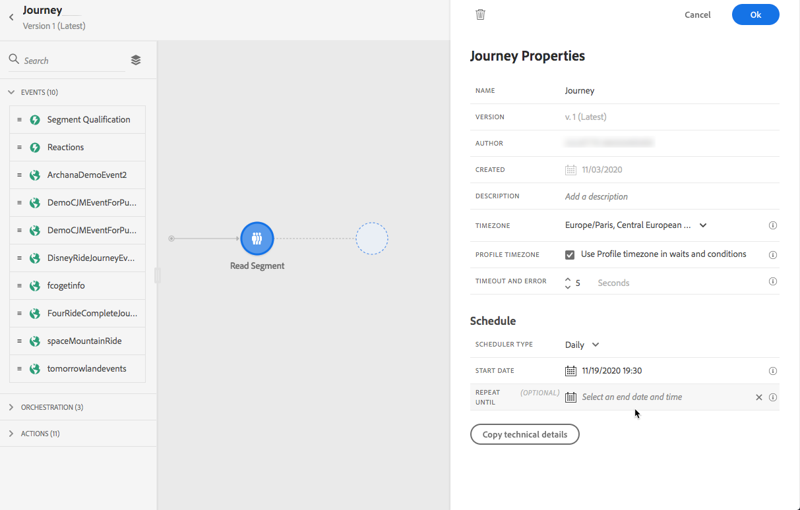

# Esecuzione del percorso {#message-execution}

## Test del percorso

Puoi testare il percorso utilizzando i profili di test. Questo passaggio è consigliato per convalidare le impostazioni e i messaggi.

Ulteriori informazioni in questa sezione [sezione](testing-the-journey.md).

## Attiva il tuo percorso

Devi pubblicare il percorso per attivarlo.

Ulteriori informazioni in questa sezione [sezione](publishing-the-journey.md).

Una volta pubblicato, puoi monitorare il percorso utilizzando gli strumenti di reporting dedicati per misurare l’efficacia del percorso.

[Ulteriori informazioni sui report](../reports/live-report.md)

## Inviare messaggi {#send-messages}

Quando il messaggio presenta un contenuto definito e pubblicato, è pronto per essere inviato tramite un [percorso](journey.md).

>[!NOTE]
>
>Puoi aggiungere a un percorso un messaggio ancora in modalità bozza, ma accertati che il messaggio sia pubblicato prima di pubblicare il percorso.

Una volta inviato un messaggio, puoi monitorarne l’esecuzione tramite più indicatori. [Ulteriori informazioni sul monitoraggio dell’esecuzione](../message-monitoring.md) dei messaggi.

## Pianifica messaggi {#schedule-messages}

I messaggi possono essere pianificati tramite l&#39;attività **[!UICONTROL Read Segment]** in un [percorso](journey.md). Puoi specificare quando il segmento entrerà nel percorso. [Ulteriori informazioni sull’attività](read-segment.md) Leggi segmento .

Per farlo, segui la procedura indicata di seguito:

1. Modifica un percorso, trascina e rilascia un’attività **[!UICONTROL Read Segment]** e inizia a configurarla. [Ulteriori informazioni sulla configurazione dell’attività](read-segment.md#configuring-segment-trigger-activity) Read Segment .

1. Fai clic sul collegamento **[!UICONTROL Edit journey schedule]** per accedere alle proprietà del percorso.

   

1. Configura il campo **[!UICONTROL Scheduler type]** : seleziona il valore desiderato dall’elenco per far sì che il segmento immetta il percorso in una data/ora specifica o su base ricorrente.

   >[!NOTE]
   >
   >La sezione **[!UICONTROL Schedule]** è disponibile solo quando un’attività **[!UICONTROL Read Segment]** è stata rilasciata nell’area di lavoro.

   

1. Se selezioni **[!UICONTROL Once]**, definisci una data e un’ora specifiche in cui il segmento entrerà nel percorso.

   

1. Se selezioni un metodo ricorrente, modifica la data e l&#39;ora di inizio. Puoi anche definire una data e un’ora di fine facoltative.

   

   >[!NOTE]
   >
   >Per impostazione predefinita, i segmenti immettono il percorso **[!UICONTROL As soon as possible]**, ovvero 1 ora dopo la pubblicazione del percorso.

1. Fai clic su **[!UICONTROL OK]** per salvare le modifiche.

<!--Unitary messages that are triggered by an event within a journey cannot be scheduled.-->
