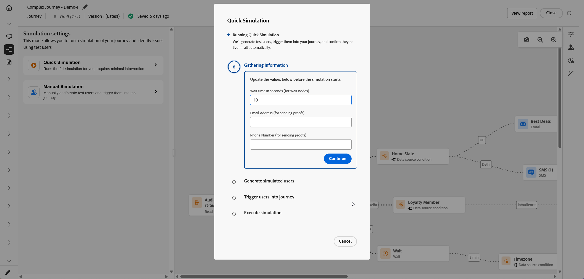
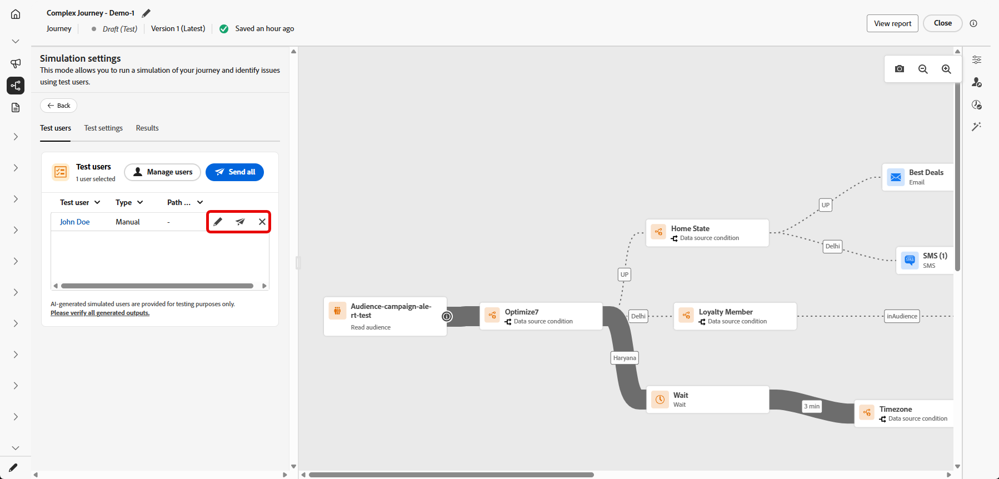
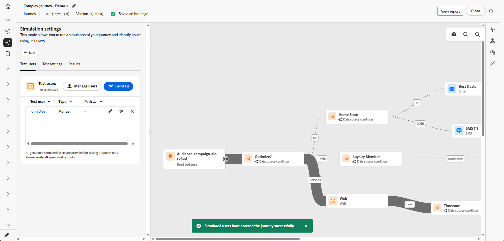
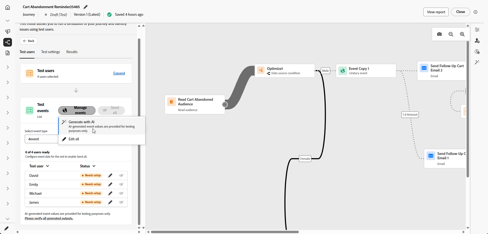
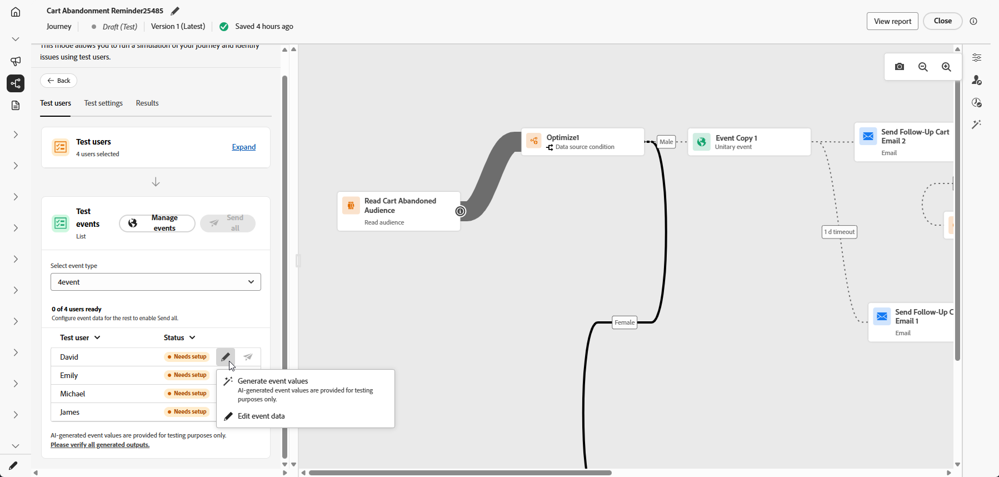

# Simulare il percorso{#simulate-journey}

Utilizza **[!UICONTROL Simulazione]** per convalidare il percorso con **utenti simulati** prima di pubblicare. Questa pagina illustra **[!UICONTROL Simulazione rapida]** e **[!UICONTROL Simulazione manuale]**, creazione e invio di utenti simulati, attivazione di eventi unitari quando il percorso ne ha bisogno e revisione del registro **[!UICONTROL Risultati]**.

Per una panoramica per tipo di percorso, vedere [Introduzione alla simulazione di Percorso](simulate-journey-gs.md).

## Tipi di simulazione {#simulation-types}

Dopo l’attivazione, i percorsi batch con voce Read audience offrono due modi per eseguire una simulazione:

* **[!UICONTROL La simulazione rapida]** viene eseguita in modalità end-to-end con gli utenti generati e le impostazioni predefinite. La simulazione rapida non è disponibile con i percorsi unitari.

* **[!UICONTROL Simulazione manuale]** consente di scegliere gli utenti, inviare gli ordini, i payload degli eventi e attendere le sostituzioni passo dopo passo.

### Simulazione rapida {#quick-simulation}

In un percorso batch in **[!UICONTROL Simulazione]**, **[!UICONTROL Simulazione rapida]** esegue il percorso con gli utenti generati e le impostazioni precompilate.

1. Selezionare **[!UICONTROL Simulazione rapida]**.

1. Esamina i campi raccolti da Adobe Journey Optimizer per l’esecuzione. Fai clic su **[!UICONTROL Aggiorna valori]** per modificare le impostazioni della bozza o del canale oppure continua senza modifiche.

   

1. Se hai aperto **[!UICONTROL Aggiorna valori]**, modifica le impostazioni, ad esempio l&#39;indirizzo utilizzato per le bozze dei messaggi, quindi conferma l&#39;avvio della simulazione.

   

1. Adobe Journey Optimizer genera utenti simulati dalla definizione del percorso e attiva ogni utente nel percorso.

1. Al termine dell&#39;esecuzione, fare clic su **[!UICONTROL Visualizza risultati]** per esaminare percorsi, errori e rami individuati. Vedi [Visualizza risultati](#viewing-results).

   

### Simulazione manuale {#manual-simulation}

Scegli **[!UICONTROL Simulazione manuale]** quando devi scegliere ogni utente simulato, controllare l&#39;ordine di invio, configurare i payload degli eventi e ignorare le **[!UICONTROL Durate di attesa]** per l&#39;esecuzione. Questo flusso si applica ai percorsi batch e unitari.

Continua con [Crea e gestisci utenti simulati](#test-users), [Attiva i tuoi eventi](#firing_events) e [Visualizza i risultati](#viewing-results).

## Creare e gestire utenti simulati {#test-users}

>[!IMPORTANT]
>
>Per accedere alla funzionalità **[!UICONTROL Simulazione]** è necessaria almeno una delle seguenti autorizzazioni: **Simula percorsi**, **Pubblica percorsi** o **Approva e pubblica percorsi**. [Ulteriori informazioni](../administration/permissions.md)

Gli utenti simulati sono entità temporanee simili a profili definite in **[!UICONTROL Impostazioni simulazione]**. Questa sezione descrive come crearli, salvarli per il riutilizzo, regolarli o rimuoverli dall’elenco e inviarli al percorso.

1. Per iniziare, compila l&#39;elenco **[!UICONTROL Utenti test]**:

   +++ Generare utenti con IA

   Adobe Journey Optimizer genera un set di utenti simulati dalla definizione del percorso.

   Per i percorsi con un nodo E-mail o SMS, l’IA richiede di confermare l’indirizzo e-mail o il numero di telefono da utilizzare. Al termine, fai clic su **[!UICONTROL Genera]**.

   

   +++

   +++ Sfoglia inventario

   Scegli **[!UICONTROL Sfoglia inventario]** per aggiungere utenti simulati già salvati, ad esempio utenti creati da un modulo o da un JSON o utenti mantenuti dopo l&#39;esecuzione di una generazione di IA.

   

   +++

   +++ Crea da modulo

   1. Immetti un **[!UICONTROL Nome visualizzato]**, **[!UICONTROL Spazio dei nomi identità]** e **[!UICONTROL Descrizione]** per identificare l&#39;utente simulato.

      

   1. Quindi, seleziona dallo schema di unione gli attributi che desideri compilare per questo utente.

   1. Fai clic su **[!UICONTROL Aggiungi appartenenza a pubblico]** per simulare le appartenenze a segmenti.

   1. Nella finestra **[!UICONTROL Crea utenti simulati]**, fare clic su **[!UICONTROL Aggiungi utente simulato]** per definire più utenti simulati in una sessione.

      È possibile modificare la modalità di visualizzazione degli utenti nell&#39;elenco, comprimere tutte le schede in visualizzazione sovrapposta o aprire i metadati degli attributi di un utente.

      

   1. Dal menu Utente simulato, utilizza **[!UICONTROL Duplica]** per copiare un utente, **[!UICONTROL Applica tutti gli attributi ad altri utenti]** per copiare gli attributi di un utente a tutti gli altri utenti nella sessione o **[!UICONTROL Elimina]** per rimuovere un utente.

      

   1. Fai clic su **[!UICONTROL Salva]** al termine della configurazione degli utenti in questa sessione.

   +++

   +++ Crea da JSON

   Definisci i nuovi utenti simulati aggiornando i campi corrispondenti con i dati utente simulati.

   

   +++

1. Gli utenti simulati creati vengono visualizzati nell&#39;elenco **[!UICONTROL Utenti test]**. Per ogni voce, selezionare una delle opzioni seguenti:

   * : aggiorna i dettagli dell&#39;utente simulato.
   * : esegui la simulazione solo per questo utente simulato.
   * : rimuovere l&#39;utente dall&#39;elenco. L’utente simulato non viene eliminato e rimane disponibile nella selezione Utenti simulati.

   

1. Per modificare l&#39;elenco dopo la selezione, fare clic su **[!UICONTROL Gestisci utenti]** per aggiungere altri utenti simulati, dall&#39;inventario o creandone di nuovi. Per rimuovere ogni utente dall&#39;elenco **[!UICONTROL Utenti di prova]** per questa esecuzione, scegliere **[!UICONTROL Cancella tutti gli utenti]**.

   

1. Se il percorso include un&#39;attività **[!UICONTROL Attendi]**, apri la scheda **[!UICONTROL Impostazioni test]** per ottimizzare la durata dell&#39;attesa durante la simulazione. Ad esempio, se l&#39;attività **[!UICONTROL Attendi]** è configurata per diversi giorni, puoi eseguirne l&#39;override a 10 secondi in modo che l&#39;utente simulato trascorra solo tale tempo sul nodo prima di passare all&#39;attività successiva.

1. Fai clic su **[!UICONTROL Invia tutto]** per inviare al percorso tutti gli utenti simulati nell&#39;elenco, oppure fai clic su  per inviare solo tali utenti. Viene visualizzato un messaggio di conferma `Simulated users have entered the journey successfully.` quando gli utenti simulati entrano correttamente nel percorso.

   

1. Se il percorso include eventi unitari, devi selezionare l’evento da attivare. Consulta [Attivare i tuoi eventi](#firing_events).

1. Accedi alla scheda **[!UICONTROL Risultati]** per aprire il registro di esecuzione e controllare come è stato eseguito ciascun passaggio. Per ulteriori informazioni, vedere [Visualizza risultati](#viewing-results).

Dopo aver convalidato il percorso in **[!UICONTROL Simulazione]**, controlla il registro **[!UICONTROL Risultati]**. Se vengono visualizzati errori, lasciare **[!UICONTROL Simulazione]**, applicare le modifiche necessarie al percorso ed eseguire di nuovo **[!UICONTROL Simulazione]** finché l&#39;esecuzione non risulta corretta. È quindi possibile pubblicare il percorso. Vedi [Pubblica il tuo percorso](../building-journeys/publish-journey.md).

## Attivare gli eventi {#firing_events}

Se il percorso include uno o più eventi unitari, questi vengono attivati mentre la simulazione è attiva.

1. In **[!UICONTROL Seleziona tipo di evento]**, seleziona l&#39;evento da attivare per questa simulazione.

   

1. Per applicare la stessa modifica a ogni utente dell&#39;elenco, utilizzare l&#39;opzione **[!UICONTROL Gestisci eventi]** per:

   * **[!UICONTROL Genera valori evento]** per consentire a Adobe Journey Optimizer di generare il payload utilizzando l&#39;intelligenza artificiale. Quando vengono generati i valori, l&#39;utente viene contrassegnato come **[!UICONTROL Pronto per l&#39;invio]**.
   * **[!UICONTROL Modifica data evento]** per modificare il payload solo per l&#39;utente simulato.

   

1. Configura il payload dell&#39;evento per ogni utente facendo clic su  accanto a un utente per:

   * **[!UICONTROL Genera valori evento]** per consentire a Adobe Journey Optimizer di generare il payload utilizzando l&#39;intelligenza artificiale. Quando vengono generati i valori, l&#39;utente viene contrassegnato come **[!UICONTROL Pronto per l&#39;invio]**.
   * **[!UICONTROL Modifica data evento]** per modificare il payload solo per l&#39;utente simulato.

   

1. In **[!UICONTROL Eventi di test]**, selezionare **[!UICONTROL Invia tutto]** per inviare nel percorso ogni utente simulato elencato in **[!UICONTROL Utenti di test]** oppure selezionare  per consentire a un singolo utente di eseguire la simulazione solo per tale utente.

   

1. Dopo l’attivazione degli eventi, l’area di lavoro si aggiorna per riflettere la progressione di ogni utente. Fare clic su una riga qualsiasi nell&#39;elenco **[!UICONTROL Verifica utenti]** per visualizzare il nuovo percorso seguito dall&#39;utente nel percorso.

1. Accedi alla scheda **[!UICONTROL Risultati]** per aprire il registro di esecuzione e controllare come è stato eseguito ciascun passaggio. Per ulteriori informazioni, vedere [Visualizza risultati](#viewing-results).

## Visualizza risultati {#viewing-results}

La scheda **[!UICONTROL Risultati]** consente di visualizzare i risultati del test. Nell&#39;elenco a discesa **[!UICONTROL Test utente]** selezionare l&#39;utente simulato di cui si desidera verificare l&#39;esecuzione.

Seleziona **[!UICONTROL Tutti]** per visualizzare i risultati aggregati per ogni utente simulato nell&#39;esecuzione. Questa vista consente di esaminare a colpo d’occhio l’intera simulazione, le attività, i risultati e gli errori, senza scegliere prima un singolo utente simulato.

Per ogni attività, il registro può mostrare se l’utente simulato è entrato o uscito dal passaggio e gli errori che si sono verificati durante la simulazione.

Per le attività **Wait**, il registro include due valori relativi alla durata:

* **Durata definita**: la durata specificata nell&#39;attività **Attendi** per il percorso pubblicato e applicata una volta che il percorso è attivo. Il registro registra se Simulazione applica un&#39;esclusione dalle impostazioni del test, ad esempio 10 secondi, anziché basarsi esclusivamente sul valore definito nel percorso.
* **Durata effettiva**: tempo trascorso per cui l&#39;utente simulato è rimasto nell&#39;attività **Wait**. Questo valore è impostato dalla scheda **[!UICONTROL Impostazioni test]**.

Quando nel registro vengono visualizzati errori, lasciare **Simulazione**, applicare le modifiche necessarie al percorso ed eseguire di nuovo **Simulazione**. Dopo la convalida, pubblica il percorso. Vedi [Pubblica il tuo percorso](../building-journeys/publish-journey.md).
