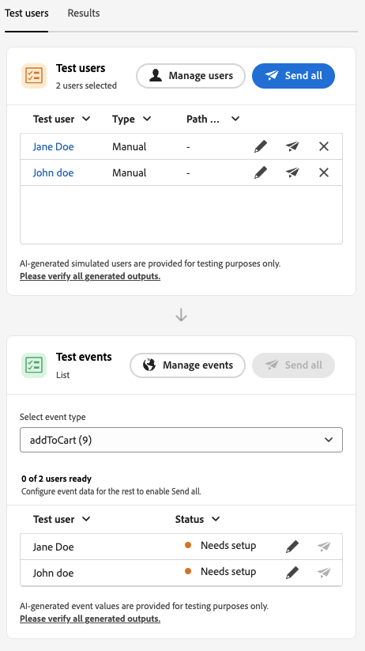

# Introduzione alla simulazione dei Percorsi {#simulate-journey-gs}

>[!BEGINSHADEBOX]

**In questa pagina:** scopri come la simulazione di percorso consente di eseguire test con utenti simulati e come l&#39;esperienza di simulazione varia a seconda del tipo di percorso prima della pubblicazione.

>[!ENDSHADEBOX]

>[!IMPORTANT]
>
>* Per utilizzare **[!UICONTROL Simulazione]**, assegna almeno un&#39;autorizzazione dalla funzionalità **[!UICONTROL Percorsi]**: **Simula percorsi**, **Pubblica percorsi** o **Approva e pubblica percorsi**. Le stesse autorizzazioni ti consentono di creare e gestire utenti simulati; **[!UICONTROL Utenti simulati]** le autorizzazioni non sono necessarie. [Ulteriori informazioni](../administration/permissions.md)
>
>* Per gestire gli utenti simulati senza **[!UICONTROL Simulazione]**, assegna **Gestione utenti simulati** o **Visualizza utenti simulati** dalla funzionalità **[!UICONTROL Utenti simulati]**.
>
>* Per IA nella simulazione (**[!UICONTROL Simulazione rapida]**, utenti generati da IA, **[!UICONTROL Genera valori evento]**), assegna **[!UICONTROL Genera contenuto]** dalla funzionalità **[!UICONTROL Assistente IA]**.

Puoi impostare il percorso su **[!UICONTROL Simulazione]** oltre a **Bozza**, **Modalità test** e **Live**. In Simulazione, si esegue il test con **utenti simulati**: entità temporanee simili a profili aggiunte, senza utilizzare profili di test persistenti in Adobe Experience Platform.

Adobe Journey Optimizer offre due modi per testare e convalidare il percorso:

* **[Simulazione](simulate-journey.md#test-users)**: utilizzare la funzionalità di percorso **[!UICONTROL Simulazione]** e simulare utenti senza profili precreati in Adobe Experience Platform, supportando sia gli utenti basati su IA che quelli creati manualmente.

* **[Modalità di test](testing-the-journey.md)**: utilizza profili persistenti contrassegnati come profili di test in Adobe Experience Platform, riutilizzabili in più sessioni. Scegli questo approccio quando hai bisogno di dati coerenti e predefiniti. [Scopri come creare profili di test](../audience/creating-test-profiles.md).

## Simulazione per tipo di percorso {#by-journey-type}

Il pannello **[!UICONTROL Simulazione]** mostra solo i passaggi necessari per il percorso. Questo dipende dal modo in cui i profili entrano nel percorso. Da questi fattori, Adobe Journey Optimizer fa emergere diverse esperienze di simulazione. Espandi ciascun tipo riportato di seguito per vedere le differenze tra le esecuzioni e quali pannelli utilizzi.

Per ulteriori dettagli, vedere [Simulare il percorso](simulate-journey.md).

+++ Percorso batch con un pubblico di lettura

Il percorso è attivato da un **[!UICONTROL Read audience]** e l&#39;area di lavoro non include attività evento unitarie. Durante la simulazione, la popolazione del pubblico non viene attivata. Solo gli utenti simulati entrano nel percorso.
Gli utenti simulati selezionati per la simulazione vengono visualizzati nella sezione **Test utenti**:

+++

+++ Percorso batch con un pubblico di lettura ed eventi unitari

Un percorso di attivazione segmento che include uno o più eventi unitari lungo il percorso. Innanzitutto devi attivare gli utenti simulati per accedere alla simulazione, quindi attivare gli eventi per gli utenti che attendono un nodo evento.
Gli utenti simulati selezionati per la simulazione e gli eventi configurati saranno visibili rispettivamente nelle sezioni Test users (Utenti di test) e Test events (Eventi di test). La sezione Eventi di test non sarà visibile finché un utente simulato non entra nel percorso.

+++

+++ Percorso unitario

Il percorso inizia con un evento unitario, non con un pubblico di lettura. Un utente simulato non entra nel percorso finché l’evento di inizio non viene attivato per lui.
Gli utenti simulati selezionati per la simulazione e gli eventi configurati saranno visibili rispettivamente nelle sezioni **Utenti test** e **Eventi test**. La sezione **Verifica utenti** non include un&#39;azione per attivare un utente simulato nel percorso. Attiva la voce da **Eventi di test**.

+++

## Simulazione avvio {#launch}

Passa al percorso **[!UICONTROL Simulazione]** per eseguire il test con utenti simulati. Le attività dettagliate sono descritte in [Simulare il percorso](simulate-journey.md).

1. Dal tuo percorso, fai clic su **[!UICONTROL Simula]** e scegli **[!UICONTROL Simulazione]**.

   

1. Attendere il completamento dell&#39;attivazione. Mentre il percorso passa a **[!UICONTROL Simulazione]**, i controlli nel pannello vengono disattivati e riattivati automaticamente al termine dell&#39;attivazione.

## Limitazioni {#limitations}

In questa versione, **[!UICONTROL La simulazione]** potrebbe non supportare tutte le attività, i canali o le integrazioni supportati dalla **[!UICONTROL Modalità di test]** o da un percorso live e il comportamento potrebbe cambiare con la maturazione delle funzionalità. Usa questo articolo per i flussi di lavoro supportati.

Per ulteriori informazioni sulle limitazioni della simulazione, consulta i menu a discesa sottostanti.

+++ Limitazioni a livello di nodo

Alcuni nodi impediscono l&#39;avvio della **[!UICONTROL simulazione]**. Altri vengono eseguiti in simulazione con il comportamento descritto di seguito. Quando un nodo deve essere rimosso o modificato prima della simulazione, aggiornare prima il percorso.

| Nodo con restrizioni | Note |
| --- | --- |
| Eventi di business | Impossibile eseguire percorsi che iniziano con un evento di business in **[!UICONTROL Simulazione]**. |
| ID supplementare (rientro multiplo) | **[!UICONTROL La simulazione]** non si avvia quando è abilitato il rientro multiplo e lo stesso utente simulato potrebbe avere più istanze attive contemporaneamente. |
| Nodo decisione contenuto | Rimuovi o modifica questa attività prima di simulare il percorso. |
| Ricerca nei set di dati | **[!UICONTROL La simulazione]** non supporta le ricerche di set di dati cliente per chiave. Rimuovi o modifica questa attività prima di eseguire una simulazione. |
| **[!UICONTROL Ottimizza]** attività | **[!UICONTROL Esperimento]** e **[!UICONTROL Regola di targeting]** non supportati. Rimuovere o modificare il nodo prima della simulazione.  Altri metodi **[!UICONTROL Ottimizza]** si comportano come segue:  **[!UICONTROL Divisione percentuale &#x200B;]**: Journey Agent crea un utente simulato per ramo, non in base alle percentuali di ramo. In fase di runtime, la valutazione live seleziona il ramo e potrebbe differire dal percorso generato. Non è possibile simulare una scelta di ramo. Per indirizzare gli utenti, si basa sull’ordine dei rami nell’area di lavoro. Il ramo superiore viene sempre scelto.  **[!UICONTROL Condizione temporale]**: le condizioni vengono applicate in fase di runtime come in un percorso live. Ad esempio, una finestra da 8:00 a 20:00 consente agli utenti di passare solo mentre la simulazione viene eseguita all&#39;interno di tale finestra. Non è possibile simulare il tempo di esecuzione. Imposta la condizione in modo che corrisponda all’ora corrente al momento del test.  **[!UICONTROL Condizione data &#x200B;]**: le condizioni vengono applicate in fase di runtime come in un percorso live. Ad esempio, una data dell’8 giugno 2026 consente agli utenti di passare solo quando la simulazione viene eseguita in tale data. Non puoi simulare la data di esecuzione. Imposta la condizione sulla data corrente quando esegui il test.  **[!UICONTROL Limite del profilo]**: i limiti non vengono applicati durante la simulazione. Journey Agent crea un utente simulato per ramo. Non è possibile simulare una scelta di ramo. Per indirizzare gli utenti, si basa sull’ordine dei rami nell’area di lavoro. Il ramo superiore viene sempre scelto. |
| Rami di timeout ed errore | Journey Agent non genera utenti per i rami di timeout attività o errore. Gli utenti possono accedere a tali percorsi solo se durante la simulazione si verifica un errore o un timeout reale. |
| Ramo timeout (attività evento) | Vengono creati utenti simulati, ma in **[!UICONTROL Simulazione manuale]** Journey Agent non decide chi deve inserire un ramo di timeout dell&#39;evento. Controlla il percorso inviando o meno l’evento. Ad esempio, per testare un ramo di timeout, attendi il timeout configurato e non inviare l’evento. **[!UICONTROL La simulazione rapida]** può inviare o trattenere automaticamente gli eventi per coprire i rami di timeout. |
| Eventi di reazione | Gli eventi di reazione vengono eseguiti in simulazione, ma l’azione deve essere eseguita nella vita reale. Ad esempio, una reazione e-mail **open** richiede l&#39;apertura del messaggio di bozza. Non è possibile simulare reazioni nell’interfaccia utente di simulazione. |
| Origini dati esterne | Le chiamate vengono eseguite durante la simulazione nello stesso modo in cui vengono eseguite in un percorso live. Le attività a valle possono utilizzare la risposta, ma non puoi prenderla in giro. Quando un valore di risposta genera un&#39;attività **[!UICONTROL Ottimizza]**, Journey Agent non può inventare tale output. Genera solo input per la chiamata. Ad esempio, se una chiamata accetta una città profilo e restituisce il meteo, l’agente imposta una città sull’utente simulato e la chiamata in tempo reale restituisce il meteo. |
| Azioni personalizzate | Il comportamento corrisponde alle origini dati esterne. Le chiamate in uscita vengono eseguite in tempo reale. Il Journey Agent inserisce gli input. Gli output provengono dalla risposta live. Non puoi prendere in giro le risposte. |
| Arricchimento degli attributi del pubblico esterno | I percorsi che utilizzano attributi personalizzati da origini di pubblico esterne non iniziano in **[!UICONTROL Simulazione]** quando si applica questa convalida. |

+++

 

+++ Limitazioni funzionali

Le seguenti funzionalità non sono supportate in **[!UICONTROL Simulazione]**.

| Funzionalità | Note |
| --- | --- |
| Criteri di uscita | I criteri di uscita non vengono applicati quando si esegue **[!UICONTROL Simulazione]**. |
| [!DNL Adobe Journey Optimizer] decisioni all&#39;interno di un&#39;azione, ad esempio contenuto e-mail con Adobe Journey Optimizer decisioning | Le bozze delle azioni per il contenuto che utilizza le decisioni [!DNL Adobe Journey Optimizer] non vengono generate. |
| Mascherare la risposta dell’azione personalizzata | [!UICONTROL Le azioni personalizzate] eseguono una chiamata in uscita reale per impostazione predefinita. Non è supportato il mascheramento della risposta in modo da non eseguire chiamate esterne. |
| Valutazione dei criteri di consenso | Il consenso non può essere deriso a livello di utente simulato e i criteri di consenso non vengono valutati durante la simulazione. |
| Limitazione di percorso e arbitrato | Non valutato né applicato durante la simulazione. |
| Limitazione della frequenza (per canale o tipo di comunicazione) | Non valutato né applicato durante la simulazione. |
| Gestione delle rinunce, soppressione ed elenchi consentiti | Non valutato né applicato durante la simulazione. |
| Sottodominio dinamico e attributi dinamici in configurazioni di canale | Non supportato. |
| Ottimizzazione dell’ora di invio (STO) | Non valutato né applicato durante la simulazione. |
| Strumenti sandbox (copia utenti simulati tra sandbox) | Non supportato. |
| Invio ondata in percorsi | Non supportato. |
| Ore di silenzio | Non valutato né applicato durante la simulazione. |
| Privacy Service | Gli utenti simulati non sono profili persistenti conformi ai requisiti RGPD. Non includere dati reali dei clienti in utenti simulati. |

+++

 

+++ Guardrail quantitativi 

Queste protezioni si applicano alla **[!UICONTROL simulazione]**. Le maiuscole numeriche vengono applicate nell’interfaccia di percorso e in fase di runtime. I limiti possono cambiare in una versione successiva. Se ti trovi vicino a un soffitto, verifica il comportamento nella sandbox.

| Guardrail | Limite | Note |
| --- | --- | --- |
| Numero massimo di utenti simulati che possono essere selezionati e attivati in un batch (percorsi batch, flussi attivati da eventi e flussi di qualificazione del pubblico) | 20 | Conteggiato per ogni **[!UICONTROL Invia tutti]** o **[!UICONTROL Attiva eventi selezionati]**, non un limite cumulativo per l&#39;intero percorso. |
| Numero massimo di utenti simulati per richiesta di generazione | 50 | Numero massimo di utenti simulati generati da Journey Agent in una richiesta tramite **[!UICONTROL Simulazione rapida]** o **[!UICONTROL Generazione con IA]** in **[!UICONTROL Simulazione manuale]**. Se il percorso ha più di **50** percorsi, Journey Agent seleziona in modo casuale i percorsi per produrre gli utenti simulati **50**. |
| Numero massimo di utenti simulati univoci testati in una singola esecuzione di simulazione | 100 | Il raggiungimento di **100** utenti univoci in una sola esecuzione blocca **[!UICONTROL Seleziona utenti simulati]** per i nuovi utenti simulati. Se ti trovi alle **90**, puoi aggiungerne al massimo **10** prima dello stesso blocco. |
| Numero massimo di percorsi eseguibili contemporaneamente in **[!UICONTROL Simulazione]** in una sandbox | 20 | Il limite viene condiviso da ogni **[!UICONTROL Simulazione]** percorso della sandbox. |
| Numero massimo di utenti simulati attivi in una sandbox | 2,000 | Numero massimo di utenti simulati che possono esistere nella sandbox contemporaneamente. Adobe può modificare questo limite in base al feedback ricevuto dai clienti. |
| Precompilazione evento (solo browser) | — | Puoi precompilare i campi del payload dell’evento solo nell’interfaccia utente di simulazione basata su browser. I valori precompilati rimangono in tale browser e non vengono sincronizzati con altri browser, dispositivi o sessioni, pertanto puoi visualizzare dati precompilati diversi in ogni posizione in cui esegui il test. |

+++
