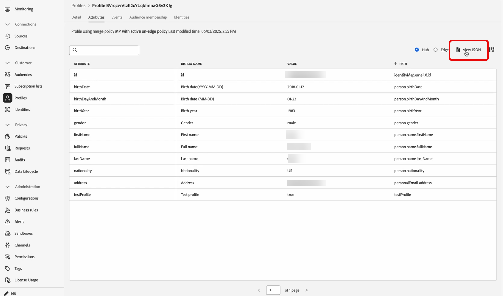

# Simulare il percorso {#simulate-journey}

>[!BEGINSHADEBOX]

**In questa pagina:** Scopri come eseguire la simulazione rapida e la simulazione manuale con utenti simulati per convalidare i percorsi del percorso e rivedere i risultati prima di pubblicare.

>[!ENDSHADEBOX]

>[!IMPORTANT]
>
>* Per utilizzare **[!UICONTROL Simulazione]**, assegna almeno un&#39;autorizzazione dalla funzionalità **[!UICONTROL Percorsi]**: **Simula percorsi**, **Pubblica percorsi** o **Approva e pubblica percorsi**. Le stesse autorizzazioni ti consentono di creare e gestire utenti simulati; **[!UICONTROL Utenti simulati]** le autorizzazioni non sono necessarie. [Ulteriori informazioni](../administration/permissions.md)
>
>* Per gestire gli utenti simulati senza **[!UICONTROL Simulazione]**, assegna **Gestione utenti simulati** o **Visualizza utenti simulati** dalla funzionalità **[!UICONTROL Utenti simulati]**.
>
>* Per IA nella simulazione (**[!UICONTROL Simulazione rapida]**, utenti generati da IA, **[!UICONTROL Genera valori evento]**), assegna **[!UICONTROL Genera contenuto]** dalla funzionalità **[!UICONTROL Assistente IA]**.

Utilizza **[!UICONTROL Simulazione]** per convalidare il percorso con **utenti simulati** prima di pubblicare. Questa pagina illustra **[!UICONTROL Simulazione rapida]** e **[!UICONTROL Simulazione manuale]**, creazione e invio di utenti simulati, attivazione di eventi unitari quando il percorso ne ha bisogno e revisione del registro **[!UICONTROL Risultati]**.

Per una panoramica per tipo di percorso, vedere [Introduzione alla simulazione di Percorso](simulate-journey-gs.md).

## Tipi di simulazione {#simulation-types}

Dopo l’attivazione, i percorsi batch con voce Read audience offrono due modi per eseguire una simulazione:

* **[!UICONTROL La simulazione rapida]** viene eseguita in modalità end-to-end con gli utenti generati, i valori degli eventi generati e le impostazioni di test predefinite, con tecnologia Journey Agent. È un modo rapido per simulare un percorso end-to-end con un intervento minimo. La simulazione rapida viene avviata non appena si seleziona questa opzione.

* **[!UICONTROL Simulazione manuale]** consente di eseguire una simulazione passo dopo passo, manualmente. Creazione di utenti simulati (manualmente o con Journey Agent), attivazione nel percorso, definizione dei payload degli eventi (manualmente o con Journey Agent) e sostituzione delle attese.

### Simulazione rapida {#quick-simulation}

In qualsiasi percorso della **[!UICONTROL simulazione]**, la **[!UICONTROL simulazione rapida]** esegue il percorso con gli utenti generati, i valori dell&#39;evento e le impostazioni precompilate.

1. Selezionare **[!UICONTROL Simulazione rapida]**.

1. Esamina i campi raccolti da Adobe Journey Optimizer per l’esecuzione. Fare clic su **[!UICONTROL Aggiorna valori]** per modificare le impostazioni di test e gli indirizzi di esecuzione oppure continuare senza modifiche.

   Questo passo viene visualizzato solo se il percorso utilizza Attese o Canali. È possibile regolare tutte le durate di attesa e gli indirizzi di esecuzione per gli utenti simulati, ad esempio utilizzare la propria e-mail in modo che i messaggi dell’esecuzione vadano nella propria casella in entrata.

   

1. Se hai aperto **[!UICONTROL Aggiorna valori]**, modifica le impostazioni, ad esempio l&#39;indirizzo utilizzato per le bozze dei messaggi, quindi conferma l&#39;avvio della simulazione.

   >[!NOTE]
   >
   >I campi e-mail e telefono dell’esecuzione precompilati provengono dall’indirizzo e-mail e dal numero di telefono del profilo utente di Adobe IMS.

   

1. Journey Agent genera un set di utenti simulati dalla definizione del percorso.

   Per i percorsi con un nodo e-mail, SMS o push, l’agente richiede di confermare l’indirizzo e-mail, il numero di telefono o il token push da utilizzare. Gli utenti simulati vengono generati utilizzando tali valori. Al termine, fai clic su **[!UICONTROL Genera]**.

1. Al termine dell&#39;esecuzione, fare clic su **[!UICONTROL Visualizza risultati]** per esaminare percorsi, errori e rami individuati. Vedi [Visualizza risultati](#viewing-results).

   

La simulazione rapida supporta anche percorsi e percorsi attivati da eventi che includono attività di evento. I valori degli eventi vengono impostati e attivati automaticamente per ogni utente simulato generato. Una volta che un utente accede al percorso, ogni evento viene attivato non appena raggiunge l’Wait corrispondente.

### Simulazione manuale {#manual-simulation}

Scegli **[!UICONTROL Simulazione manuale]** quando devi scegliere ogni utente simulato, controllare l&#39;ordine di invio, configurare i payload degli eventi e ignorare le **[!UICONTROL Durate di attesa]** per l&#39;esecuzione.

Continua con [Crea e gestisci utenti simulati](#test-users), [Attiva i tuoi eventi](#firing-events) e [Visualizza i risultati](#viewing-results).

## Creare e gestire utenti simulati {#test-users}

Gli utenti simulati sono entità temporanee simili a profili definite in **[!UICONTROL Impostazioni simulazione]**. Questa sezione descrive come crearli, salvarli per il riutilizzo, regolarli o rimuoverli dall’elenco e inviarli al percorso.

1. Per iniziare, compila l&#39;elenco **[!UICONTROL Utenti test]**:

   +++ Generare utenti con IA

   Adobe Journey Optimizer genera un set di utenti simulati dalla definizione del percorso.

   Per i percorsi con un nodo E-mail, Push o SMS, l’IA richiede di confermare l’indirizzo e-mail o il numero di telefono da utilizzare. Gli utenti simulati verranno generati utilizzando tali valori definiti. Al termine, fai clic su **[!UICONTROL Genera]**.

   >[!NOTE]
   >
   >I campi e-mail e telefono sono precompilati dal tuo profilo utente Adobe IMS.

   

   +++

   +++ Sfoglia inventario

   Scegli **[!UICONTROL Sfoglia inventario]** per aggiungere utenti simulati già salvati, ad esempio utenti creati da un modulo o da un JSON o utenti mantenuti dopo l&#39;esecuzione di una generazione di IA.

   

   +++

   +++ Crea da modulo

   1. Immetti un **[!UICONTROL Nome visualizzato]**, **[!UICONTROL Spazio dei nomi identità]** e **[!UICONTROL Descrizione]** per identificare l&#39;utente simulato.

      

   1. Quindi, seleziona dallo schema di unione gli attributi che desideri compilare per questo utente.

   1. Fai clic su **[!UICONTROL Aggiungi appartenenza a pubblico]** per simulare le appartenenze a segmenti.

   1. Nella finestra **[!UICONTROL Crea utenti simulati]**, fare clic su **[!UICONTROL Aggiungi utente simulato]** per definire più utenti simulati in una sessione.

      È possibile modificare la modalità di visualizzazione degli utenti nell&#39;elenco, comprimere tutte le schede in visualizzazione sovrapposta o aprire i metadati degli attributi di un utente.

      

   1. Dal menu Utente simulato, utilizza **[!UICONTROL Duplica]** per copiare un utente, **[!UICONTROL Applica tutti gli attributi ad altri utenti]** per copiare gli attributi di un utente a tutti gli altri utenti nella sessione o **[!UICONTROL Elimina]** per rimuovere un utente.

      

   1. Fai clic su **[!UICONTROL Salva]** al termine della configurazione degli utenti in questa sessione.

   +++

   +++ Crea da JSON

   In **[!UICONTROL Crea utenti simulati]**, modifica il modello JSON per definire gli utenti, quindi fai clic su **[!UICONTROL Formatta JSON]** e **[!UICONTROL Salva]**.

   

   Per riutilizzare i valori degli attributi da un profilo o da un [profilo di test](../audience/creating-test-profiles.md) in [!DNL Adobe Experience Platform]:

   1. Individuate il profilo da utilizzare come riferimento. Nella pagina dei dettagli del profilo, fai clic su **[!UICONTROL Visualizza JSON]**. [Ulteriori informazioni](../audience/get-started-profiles.md)

      

   1. Copia il JSON dal visualizzatore.

   1. Nel percorso, aprire **[!UICONTROL Impostazioni simulazione]**, avviare **[!UICONTROL Crea utenti simulati]** e scegliere **Crea da JSON**.

   1. Incolla il JSON nella parte corrispondente del modello utente simulato (ad esempio, il blocco di attributi per un utente). Fai clic su **[!UICONTROL Formato JSON]** per convalidare la struttura.

      

   1. Rimuovere le proprietà esistenti nel profilo [!DNL Adobe Experience Platform] associate solo al profilo di origine, ad esempio mergePolicyId o lastModifiedAt.

   1. Impostare i campi richiesti dal modello utente simulato: **[!UICONTROL Nome visualizzato]**, **[!UICONTROL Spazio dei nomi identità]**, valore identità e indirizzi di esecuzione del canale.

   1. Fai clic su **[!UICONTROL Salva]**. Utilizza l&#39; nell&#39;utente simulato salvato per esaminare i dati prima di eseguire la **[!UICONTROL simulazione]**.

      

      >[!WARNING]
      >
      >Se incolla il JSON del profilo, rimuovi o sostituisci tutti gli identificatori di produzione e i punti di contatto (e-mail, telefono, ECID, token push e simili). La simulazione invierà i messaggi utilizzando i dati forniti.

   +++

1. Gli utenti simulati creati vengono visualizzati nell&#39;elenco **[!UICONTROL Utenti test]**. Per ogni voce, selezionare una delle opzioni seguenti:

   * : aggiorna i dettagli dell&#39;utente simulato.
   * : esegui la simulazione solo per questo utente simulato.

     Questa opzione non è disponibile per i percorsi che iniziano con un evento, in quanto l’ingresso utente simulato viene attivato dall’evento inviato. [Ulteriori informazioni](#firing-events)

   * : rimuovere l&#39;utente dall&#39;elenco. L’utente simulato non viene eliminato e rimane disponibile nella selezione Utenti simulati.

   

1. Per modificare l&#39;elenco dopo la selezione, fare clic su **[!UICONTROL Gestisci utenti]** per aggiungere altri utenti simulati, dall&#39;inventario o creandone di nuovi. Per rimuovere ogni utente dall&#39;elenco **[!UICONTROL Utenti di prova]** per questa esecuzione, scegliere **[!UICONTROL Cancella tutti gli utenti]**.

   

1. Se il percorso include un&#39;attività **[!UICONTROL Attendi]**, apri la scheda **[!UICONTROL Impostazioni test]** per ottimizzare la durata dell&#39;attesa durante la simulazione. Ad esempio, se l&#39;attività **[!UICONTROL Attendi]** è configurata per diversi giorni, puoi eseguirne l&#39;override a 10 secondi in modo che l&#39;utente simulato trascorra solo tale tempo sul nodo prima di passare all&#39;attività successiva.

1. Fai clic su **[!UICONTROL Invia tutto]** per inviare al percorso tutti gli utenti simulati nell&#39;elenco, oppure fai clic su  per inviare solo tali utenti. Viene visualizzato un messaggio di conferma `Simulated users have entered the journey successfully.` quando gli utenti simulati entrano correttamente nel percorso.

   

1. Se il percorso include eventi unitari, devi selezionare l’evento da attivare. Consulta [Attivare i tuoi eventi](#firing-events).

1. Accedi alla scheda **[!UICONTROL Risultati]** per aprire il registro di esecuzione e controllare come è stato eseguito ciascun passaggio. Per ulteriori informazioni, vedere [Visualizza risultati](#viewing-results).

1. Al termine del test, apri il menu **[!UICONTROL Gestisci simulazione]**:

   * **[!UICONTROL Chiudi simulazione]** per uscire dalla sessione di simulazione corrente.
   * **[!UICONTROL Reimposta simulazione]** per cancellare tutti i dati dall&#39;esecuzione corrente, gli utenti simulati selezionati, i valori evento definiti e altre impostazioni test, in modo da poter avviare una nuova simulazione da zero.

     

Dopo aver convalidato il percorso in **[!UICONTROL Simulazione]**, controlla il registro **[!UICONTROL Risultati]**. Se vengono visualizzati errori, lasciare **[!UICONTROL Simulazione]**, applicare le modifiche necessarie al percorso ed eseguire di nuovo **[!UICONTROL Simulazione]** finché l&#39;esecuzione non risulta corretta. È quindi possibile pubblicare il percorso. Vedi [Pubblica il tuo percorso](../building-journeys/publish-journey.md).

## Attivare gli eventi {#firing-events}

Se il percorso include uno o più eventi unitari, puoi attivarli mentre la simulazione è attiva. Per i percorsi che non iniziano da un evento ma ne contengono uno, questa sezione non sarà visibile fino a quando un utente simulato non entra nel percorso.

1. In **[!UICONTROL Seleziona tipo di evento]**, seleziona l&#39;evento da attivare per questa simulazione.

   

1. Per applicare la stessa modifica a ogni utente dell&#39;elenco, utilizzare l&#39;opzione **[!UICONTROL Gestisci eventi]** per:

   * **[!UICONTROL Genera valori evento]** per consentire a Journey Agent di generare tutti i payload utilizzando l&#39;intelligenza artificiale. Quando vengono generati i valori, l&#39;utente viene contrassegnato come **[!UICONTROL Pronto per l&#39;invio]**.
   * **[!UICONTROL Modifica dati evento]** per modificare il payload per ogni utente simulato nell&#39;elenco.

   

1. Configura il payload dell&#39;evento per ogni utente facendo clic su  accanto a un utente per:

   * **[!UICONTROL Genera valori evento]** per consentire al Journey Agent di generare il payload utilizzando l&#39;intelligenza artificiale. Quando vengono generati i valori, l&#39;utente viene contrassegnato come **[!UICONTROL Pronto per l&#39;invio]**.
   * **[!UICONTROL Modifica dati evento]** per modificare il payload solo per l&#39;utente simulato.

   

1. In **[!UICONTROL Eventi di test]**, selezionare **[!UICONTROL Invia tutto]** per inviare questo evento per tutti gli utenti simulati elencati in **[!UICONTROL Utenti di test]** oppure selezionare  per attivare un singolo evento solo per tale utente.

   

1. Dopo l’attivazione degli eventi, l’area di lavoro si aggiorna per riflettere la progressione di ogni utente.

1. Accedi alla scheda **[!UICONTROL Risultati]** per aprire il registro di esecuzione e controllare come è stato eseguito ciascun passaggio. Per ulteriori informazioni, vedere [Visualizza risultati](#viewing-results).

1. Al termine del test, apri il menu **[!UICONTROL Gestisci simulazione]**:

   * **[!UICONTROL Chiudi simulazione]** per uscire dalla sessione di simulazione corrente.
   * **[!UICONTROL Reimposta simulazione]** per cancellare tutti i dati dall&#39;esecuzione corrente, gli utenti simulati selezionati, i valori evento definiti e altre impostazioni test, in modo da poter avviare una nuova simulazione da zero.

     

## Visualizza risultati {#viewing-results}

La scheda **[!UICONTROL Risultati]** consente di visualizzare i risultati del test. Nell&#39;elenco a discesa **[!UICONTROL Test utente]** selezionare l&#39;utente simulato di cui si desidera verificare l&#39;esecuzione. Quando selezioni un singolo utente simulato, l’area di lavoro evidenzia l’esatto percorso che l’utente ha seguito nel percorso, in modo da poter confermare che è entrato nel ramo previsto.

Seleziona **[!UICONTROL Tutti]** per visualizzare i risultati aggregati per ogni utente simulato nell&#39;esecuzione. L’area di lavoro mostra quindi ogni percorso coperto dall’esecuzione, il che consente di confrontare la copertura tra i profili e analizzare a colpo d’occhio l’intera simulazione, incluse attività, risultati ed errori, senza scegliere prima un singolo utente simulato.

Per ogni attività, il registro può mostrare se l’utente simulato è entrato o uscito dal passaggio, le marche temporali e le decisioni sui rami per ogni passaggio ed errori che si sono verificati durante la simulazione.

Per le attività **Wait**, il registro include due valori relativi alla durata:

* **Durata definita**: la durata specificata nell&#39;attività **Attendi** per il percorso pubblicato e applicata una volta che il percorso è attivo. Il registro registra se Simulazione applica un&#39;esclusione dalle impostazioni del test, ad esempio 10 secondi, anziché basarsi esclusivamente sul valore definito nel percorso.
* **Durata effettiva**: tempo trascorso per cui l&#39;utente simulato è rimasto nell&#39;attività **Wait**. Questo valore è impostato dalla scheda **[!UICONTROL Impostazioni test]**.

Quando nel registro vengono visualizzati errori, lasciare **Simulazione**, applicare le modifiche necessarie al percorso ed eseguire di nuovo **Simulazione**. Dopo la convalida, pubblica il percorso. Vedi [Pubblica il tuo percorso](../building-journeys/publish-journey.md).
