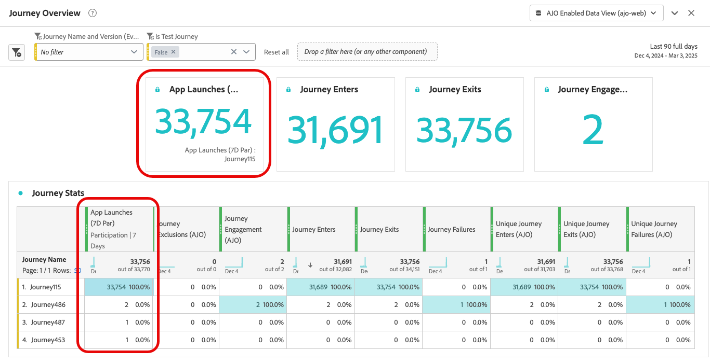

# Configurare e tenere traccia della metrica di percorso {#success-metrics}

Con le metriche di percorso, puoi misurare efficacemente l’impatto delle attività tracciando le loro prestazioni rispetto a metriche predefinite.
Monitorando queste metriche, puoi vedere le prestazioni del percorso, identificare le aree da migliorare e prendere decisioni informate per migliorare il coinvolgimento dei clienti.

## Prerequisiti {#prerequisites}

Prima di utilizzare la metrica di percorso, è necessario aggiungere un set di dati che includa `Commerce Details`, `Web`e `Mobile` [gruppi di campi](https://experienceleague.adobe.com/docs/experience-platform/xdm/tutorials/create-schema-ui.html?lang=it#field-group){target="_blank"}.

## Metriche disponibili {#metrics}

L&#39;elenco delle metriche varia a seconda dei [gruppi di campi](https://experienceleague.adobe.com/docs/experience-platform/xdm/tutorials/create-schema-ui.html?lang=it#field-group){target="_blank"} inclusi nel set di dati.

Se il set di dati non è configurato, saranno disponibili solo le metriche seguenti: **[!UICONTROL Clic]**, **[!UICONTROL Clic univoco]**, **[!UICONTROL Frequenza clickthrough]** e **[!UICONTROL Frequenza aperture]**.

Tieni presente che con una licenza Customer Journey Analytics puoi creare metriche di successo personalizzate. [Ulteriori informazioni](https://experienceleague.adobe.com/en/docs/analytics-platform/using/cja-components/cja-calcmetrics/cm-workflow/participation-metric)

| Metriche | Gruppo di campi correlato |
|-|-|
| Clic | Nessun gruppo di campi richiesto |
| Clic univoci | Nessun gruppo di campi richiesto |
| Percentuale di clickthrough (CTR) | Nessun gruppo di campi richiesto |
| Percentuale di apertura click-through (CTOR) | Nessun gruppo di campi richiesto |
| Page Views | Gruppo di campi Web |
| Avvii app | Gruppo di campi mobile |
| Primi avvii app | Gruppo di campi mobile |
| Installazioni app | Gruppo di campi mobile |
| Aggiornamenti delle app | Gruppo di campi mobile |
| Acquisti | Gruppo di campi Dettagli Commerce |
| Pagamenti | Gruppo di campi Dettagli Commerce |
| Aggiunte al carrello | Gruppo di campi Dettagli Commerce |
| Aperture carrello | Gruppo di campi Dettagli Commerce |
| Visualizzazioni carrello | Gruppo di campi Dettagli Commerce |
| Rimozioni dal carrello | Gruppo di campi Dettagli Commerce |
| Visualizzazioni prodotto | Gruppo di campi Dettagli Commerce |
| Salva per dopo | Gruppo di campi Dettagli Commerce |

## Attribuzione {#attribution}

Ogni metrica viene fornita con una determinata attribuzione che determina quali punti di contatto o interazioni hanno contribuito a un risultato specifico.

* **Attribuzione delle metriche con licenza Journey Optimizer**:

  Solo con la licenza Journey Optimizer, l’intervallo di lookback massimo disponibile per qualsiasi metrica selezionata è impostato su 7 giorni. Per queste metriche, il modello di attribuzione è impostato per impostazione predefinita su **Ultimo contatto**, ovvero l&#39;interazione più recente prima della conversione.

  Ad esempio, puoi tenere traccia di un acquisto effettuato dopo che un cliente ha interagito con il tuo percorso negli ultimi 7 giorni.

* **Attribuzione delle metriche con licenza Customer Journey Analytics**:

  Con entrambe le licenze Journey Optimizer e Customer Journey Analytics, puoi creare metriche personalizzate con impostazioni di attribuzione specifiche o modificare le attribuzioni delle metriche integrate.

  Ulteriori informazioni su [Modelli di attribuzione](https://experienceleague.adobe.com/en/docs/analytics-platform/using/cja-dataviews/component-settings/attribution#attribution-models)

## Assegnare la metrica di Percorso {#assign}

Per iniziare a tracciare la metrica di percorso, segui i passaggi descritti di seguito:

1. Dal menu **[!UICONTROL Percorsi]**, fai clic su **[!UICONTROL Crea Percorso]**.

1. Modificate il riquadro di configurazione del percorso per definire il nome del percorso e impostarne le proprietà. Scopri come impostare le proprietà del percorso in [questa pagina](../building-journeys/journey-properties.md).

1. Scegli le **[!UICONTROL metriche di Percorso]** che verranno utilizzate per misurare l&#39;efficacia del percorso.

   Le metriche si applicano al percorso stesso e sono applicabili a tutti gli elementi del percorso.

   

1. Fai clic su **[!UICONTROL Salva]**.

1. Progetta il tuo percorso con le **[!UICONTROL Attività]** necessarie.

1. Verifica e pubblica il percorso.

1. Apri il rapporto sul percorso per tenere traccia delle prestazioni della metrica di successo assegnata.

   La metrica scelta viene visualizzata nella tabella KPI e statistiche Percorso del report.

   
