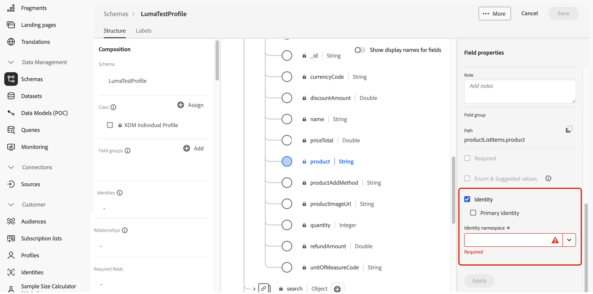

# Utilizzare identificatori supplementari nei percorsi {#supplemental-id}

>[!CONTEXTUALHELP]
>id="ajo_journey_parameters_supplemental_identifier"
>title="Usare un identificatore supplementare"
>abstract="L’identificatore supplementare è un identificatore secondario che fornisce contesto aggiuntivo per l’esecuzione di un percorso. Per definirlo, seleziona il campo da utilizzare come identificatore supplementare e scegli uno spazio dei nomi da associare."

<table style="border-collapse: collapse; width: 100%;">
  <tr>
    <td style="vertical-align: top; padding-right: 20px; border: none;">
      <p>Per impostazione predefinita, i percorsi vengono eseguiti nel contesto di un <b>ID profilo</b>. Questo significa che, se il profilo è attivo in un dato percorso, non potrà rientrare in un altro percorso. Per evitare questo problema, Journey Optimizer ti consente di acquisire un <b>identificatore supplementare</b>, ad esempio un ID ordine, un ID abbonamento, un ID prescrizione, oltre all'ID profilo.  
      <p>In questo esempio, è stato aggiunto un <b>ID prenotazione</b> come identificatore supplementare.</p>
      <p>In questo modo, i percorsi vengono eseguiti nel contesto dell’ID profilo associato all’identificatore supplementare (in questo caso, l’ID prenotazione). Viene eseguita un’istanza del percorso per ogni iterazione dell’identificatore supplementare. Questo consente più ingressi dello stesso ID profilo nei percorsi se sono state effettuate prenotazioni diverse.</p>
      <p>Inoltre, Journey Optimizer consente di sfruttare gli attributi dell’identificatore supplementare (ad esempio, numero di prenotazione, data di rinnovo della prescrizione, tipo di prodotto) per la personalizzazione dei messaggi, garantendo comunicazioni altamente pertinenti.</p>
    </td>
    <td style="vertical-align: top; border: none; text-align: center; width: 40%;">
      
    </td>
  </tr>
</table>

➡️ [Scopri questa funzione nel video](#video)

## Guardrail e limitazioni {#guardrails}

* **percorsi supportati**: sono supportati identificatori supplementari per **percorsi attivati da eventi** e **di pubblico di lettura**. Sono **non supportati** per i percorsi di qualificazione del pubblico (ovvero, percorsi che iniziano con un&#39;attività di qualificazione del pubblico).

* **Limiti di istanze simultanee**: i profili non possono avere più di 10 istanze di percorso simultanee.

* **Regole di frequenza**: ogni istanza di percorso creata da conteggi di utilizzo dell&#39;identificatore supplementare per il limite di frequenza, anche se l&#39;utilizzo di identificatori supplementari genera più istanze di percorso.

* **Tipo di dati e struttura dello schema**: l&#39;identificatore supplementare deve essere di tipo `string`. Può essere un attributo di stringa indipendente oppure un attributo di stringa all&#39;interno di una matrice di oggetti. L&#39;attributo di stringa indipendente darà luogo a una singola istanza di percorso, mentre l&#39;attributo di stringa all&#39;interno di una matrice di oggetti darà luogo a un&#39;istanza di percorso univoca per iterazione della matrice di oggetti. Gli array di stringhe e le mappe non sono supportati.

* **Rientro Percorso**

  Il comportamento di rientro percorso con identificatori supplementari segue la politica di rientro esistente:

   * Se il percorso non è un rientro, la stessa combinazione di ID profilo + ID supplementare non può rientrare nel percorso.
   * Se il percorso è rientro con una finestra temporale, la stessa combinazione di ID profilo + ID supplementare può essere reinserita dopo la finestra temporale definita.

* **Etichettatura e applicazione uso dati (DULE)** - Nessun controllo di convalida DULE eseguito sull&#39;ID supplementare. Questo significa che questo attributo non verrà considerato quando il percorso cerca violazioni dei criteri di governance dei dati.

* **Configurazione eventi downstream**

  Se utilizzi un altro evento a valle nel percorso, questo deve utilizzare lo stesso ID supplementare e avere lo stesso ID spazio dei nomi.

* **Leggi percorsi di pubblico**

   * L’ID supplementare è disattivato se utilizzi un evento di business.
   * L’ID supplementare deve essere un campo del profilo (ovvero non un campo evento/contesto).
   * Per i percorsi di pubblico di lettura che utilizzano ID supplementari, la velocità di lettura dell’attività di lettura del pubblico per ogni istanza di percorso è limitata a un massimo di 500 profili al secondo.
   * Quando si utilizzano percorsi di pubblico in lettura con ID supplementari, sono supportati solo i tipi di pubblico del Servizio di profilo unificato.

## Comportamento dei criteri di uscita con ID supplementari {#exit-criteria}

Precondizione: Percorso abilitato per l’ID supplementare (tramite attività evento unitario o attività di lettura del pubblico)

La tabella seguente spiega il comportamento dei profili in un percorso supplementare abilitato per gli ID quando è configurato il criterio di uscita:

| Configurazione criteri di uscita | Comportamento quando vengono soddisfatti i criteri di uscita |
| ---------------------------- | ---------------------------------- |
| Basato su un evento ID non supplementare | Tutte le istanze del profilo corrispondente nel percorso sono chiuse. |
| In base a un evento ID supplementare <br/>*Nota: lo spazio dei nomi ID supplementare deve corrispondere a quello del nodo iniziale.* | Viene chiusa solo l’istanza di profilo + ID supplementare corrispondente. |
| In base a un pubblico | Tutte le istanze del profilo corrispondente nel percorso sono chiuse. |

## Aggiungere un identificatore supplementare e sfruttarlo in un percorso {#add}

>[!BEGINTABS]

>[!TAB percorso attivato da eventi]

Per utilizzare un identificatore supplementare in un percorso attivato da un evento, effettua le seguenti operazioni:

1. **Contrassegna l&#39;attributo come identificatore nello schema evento**

   1. Accedi allo schema dell’evento e individua l’attributo che desideri utilizzare come identificatore supplementare (ad esempio, ID prenotazione, ID abbonamento) e contrassegnalo come ID. [Scopri come utilizzare gli schemi](../data/get-started-schemas.md)

   1. Contrassegna l&#39;identificatore come **[!UICONTROL Identità]**.

      

      >[!IMPORTANT]
      >
      >Assicurarsi di non contrassegnare l&#39;attributo come **Identità primaria**.

   1. Seleziona lo spazio dei nomi da associare all’ID supplementare. Deve essere uno spazio dei nomi non relativo all’identificatore della persona.

      Dopo aver applicato lo spazio dei nomi dell’identità non persona a uno schema, è necessario creare un nuovo evento per utilizzare l’identificatore supplementare. Impossibile aggiornare le entità esistenti per riconoscere il nuovo identificatore.

1. **Aggiungi l&#39;ID supplementare all&#39;evento**

   1. Crea o modifica l’evento desiderato. [Scopri come configurare un evento unitario](../event/about-creating.md)

   1. Nella schermata di configurazione dell&#39;evento, selezionare l&#39;opzione **[!UICONTROL Usa identificatore supplementare]**.

      

   1. Utilizza l’editor espressioni per selezionare l’attributo contrassegnato come ID supplementare.

      >[!NOTE]
      >
      >Assicurarsi di utilizzare l&#39;editor espressioni in **[!UICONTROL modalità avanzata]** per selezionare l&#39;attributo.

   1. Dopo aver selezionato l’ID supplementare, lo spazio dei nomi associato viene visualizzato nella schermata di configurazione dell’evento come di sola lettura.

1. **Aggiungi l&#39;evento al percorso**

   Trascina l’evento configurato nell’area di lavoro del percorso. Attiva la voce percorso in base sia all’ID profilo che all’ID supplementare.

   

>[!TAB Leggi percorso di destinatari]

Per utilizzare un identificatore supplementare in un percorso Read audience, effettua le seguenti operazioni:

1. **Contrassegna l&#39;attributo come identificatore nello schema di unione/profilo**

   1. Accedi allo schema di unione/profilo e individua l’attributo che desideri utilizzare come identificatore supplementare (ad esempio, ID prenotazione, ID abbonamento) e contrassegnalo come ID. [Scopri come utilizzare gli schemi](../data/get-started-schemas.md)

   1. Contrassegna l&#39;identificatore come **[!UICONTROL Identità]**.

      

      >[!IMPORTANT]
      >
      >Assicurarsi di non contrassegnare l&#39;attributo come **Identità primaria**.

   1. Seleziona lo spazio dei nomi da associare all’ID supplementare. Deve essere uno spazio dei nomi non relativo all’identificatore della persona.

      Dopo aver applicato lo spazio dei nomi dell’identità non persona a uno schema, è necessario creare un nuovo gruppo di campi per utilizzare l’identificatore supplementare. Impossibile aggiornare le entità esistenti per riconoscere il nuovo identificatore.

<!--1. **Add the supplemental ID field to the data source**

    1. Navigate to the **[!UICONTROL Configuration]** / **[!UICONTROL Data Sources]** menu, then locate the "ExperiencePlatformDataSource" data source.

        

    1. Open the field selector then select the attribute you want to use as a supplemental identifier (e.g., booking ID, subscription ID).-->

1. **Aggiungi e configura un&#39;attività Read audience nel percorso**

   1. Trascina nel percorso un&#39;attività **[!UICONTROL Read audience]**.

   1. Nel riquadro delle proprietà dell&#39;attività attivare l&#39;opzione **[!UICONTROL Usa identificatore supplementare]**.

      

   1. Nel campo **[!UICONTROL Identificatore supplemento]**, utilizzare l&#39;editor espressioni per selezionare l&#39;attributo contrassegnato come ID supplementare.

      >[!NOTE]
      >
      >Assicurarsi di utilizzare l&#39;editor espressioni in **[!UICONTROL modalità avanzata]** per selezionare l&#39;attributo.

   1. Dopo aver selezionato l&#39;ID supplementare, lo spazio dei nomi associato viene visualizzato nel campo **[!UICONTROL Spazio dei nomi supplementare]** in sola lettura.

>[!ENDTABS]

## Utilizzo degli attributi ID supplementari

Utilizza l’editor di espressioni e l’editor di personalizzazione per fare riferimento agli attributi dell’identificatore supplementare per la personalizzazione o la logica condizionale. Gli attributi sono accessibili dal menu **[!UICONTROL Attributi contestuali]**.


Per i percorsi attivati da eventi se si utilizzano array (ad esempio, più prescrizioni o criteri), utilizzare una formula per estrarre elementi specifici.

+++ Vedi esempi

In un array di oggetti con ID supplementare come `bookingNum` e un attributo allo stesso livello denominato `bookingCountry`, il percorso eseguirà un&#39;iterazione nell&#39;oggetto array in base al bookingNum e creerà un&#39;istanza di percorso per ogni oggetto.

* L&#39;espressione seguente nell&#39;attività condizione eseguirà un&#39;iterazione nella matrice di oggetti e verificherà se il valore di `bookingCountry` è uguale a &quot;FR&quot;:

  ```
  @event{<event_name>.<object_path>.<object_array_name>.all(currentEventField.<attribute_path>.bookingNum==${supplementalId}).at(0).<attribute_path>.bookingCountry}=="FR"
  ```

* L&#39;espressione seguente nell&#39;editor di personalizzazione e-mail eseguirà un&#39;iterazione nell&#39;array di oggetti, estrae `bookingCountry` applicabile all&#39;istanza di percorso corrente e lo visualizza nel contenuto:

  ```
  {{#each context.journey.events.<event_ID>.<object_path>.<object_array_name> as |l|}} 
  
   {{l.<attribute_path>.bookingCountry}}  
  
  {{/each}}
  ```

* Esempio dell’evento utilizzato per attivare il percorso:

  ```
  "bookingList": [
        {
            "bookingInfo": {
                "bookingNum": "x1",
                      "bookingCountry": "US"
            }
        },
        {
            "bookingInfo": {
                "bookingNum": "x2",
                "bookingCountry": "FR"
            }
        }
    ]
  ```

+++

## Casi d’uso di esempio

### **Notifiche di rinnovo criteri**

* **Scenario**: un provider di assicurazioni invia promemoria di rinnovo per ogni polizza attiva detenuta da un cliente.
* **Esecuzione**:
   * Voce principale: John.
   * ID supplementari: `"AutoPolicy123", "HomePolicy456"`.
   * Il percorso viene eseguito separatamente per ogni criterio, con date di rinnovo personalizzate, dettagli sulla copertura e informazioni sui premi.

### **Gestione abbonamenti**

* **Scenario**: un servizio di sottoscrizione invia messaggi personalizzati per ogni sottoscrizione quando viene attivato un evento per tale sottoscrizione.
* **Esecuzione**:
   * Voce principale: Jane.
   * ID supplementari: `"Luma Yoga Program ", "Luma Fitness Program"`.
   * Ogni evento include un ID abbonamento e i dettagli relativi a tale abbonamento. Il percorso viene eseguito separatamente per ogni evento/abbonamento, consentendo offerte di rinnovo personalizzate per abbonamento.

### **Consigli di prodotto**

* **Scenario**: una piattaforma di e-commerce invia consigli basati su prodotti specifici acquistati da un cliente.
* **Esecuzione**:
   * Voce principale: Alex.
   * ID supplementari: `"productID1234", "productID5678"`.
   * Il percorso viene eseguito separatamente per ciascun prodotto, con opportunità di upselling personalizzate.

## Video dimostrativo {#video}

Scopri come abilitare e applicare un identificatore supplementare in [!DNL Adobe Journey Optimizer].

>[!VIDEO](https://video.tv.adobe.com/v/3464792?quality=12)
