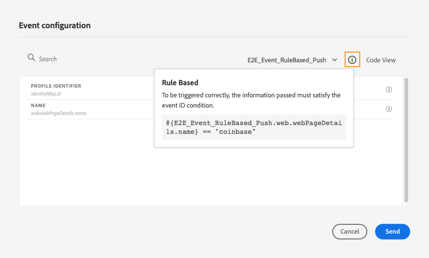

# Test del percorso{#testing_the_journey}

>[!CONTEXTUALHELP]
>id="ajo_journey_test"
>title="Test del percorso"
>abstract="Utilizza i profili di test per testare il percorso prima di pubblicarlo. Questo consente di analizzare il flusso dei singoli utenti nel percorso e risolvere eventuali problemi prima della pubblicazione."

Utilizza i profili di test per testare il percorso prima di pubblicarlo. Questa modalità ti consente di eseguire un test del percorso e identificare i problemi utilizzando i profili di test.

Solo i profili di test possono entrare in un percorso in modalità di test. Puoi creare nuovi profili di test o trasformare quelli esistenti in profili di test. Ulteriori informazioni sui profili di test in [questa sezione](../audience/creating-test-profiles.md).

>[!NOTE]
>
>Prima di eseguire il test del percorso, è necessario risolvere tutti gli eventuali errori. Scopri come controllare gli errori prima di eseguire il test in [questa sezione](../building-journeys/troubleshooting.md#checking-for-errors-before-testing).

Per utilizzare la modalità di test, effettua le seguenti operazioni:

1. Per attivare la modalità di test, fare clic sul pulsante **[!UICONTROL Modalità di test]** nell&#39;angolo in alto a destra.

   

1. Se nel percorso è presente almeno un&#39;attività **Wait**, impostare il parametro **[!UICONTROL Wait time]** per definire la durata di ogni attività di attesa e di ogni timeout evento in modalità di test. Il tempo predefinito è di 10 secondi per attese e timeout di eventi. In questo modo potrai ottenere rapidamente i risultati del test.

   

   >[!NOTE]
   >
   >Quando in un percorso viene utilizzato un evento di reazione con timeout, il valore predefinito e minimo del tempo di attesa è di 40 secondi. Consulta [questa sezione](../building-journeys/reaction-events.md).

1. Utilizza il pulsante **[!UICONTROL Attiva un evento]** per configurare e inviare eventi al percorso.

   

1. Configura i diversi campi previsti. Nel campo **Identificatore profilo** immettere il valore del campo utilizzato per identificare il profilo di test. Ad esempio, può essere l’indirizzo e-mail. Assicurati di inviare eventi relativi ai profili di test. Consulta [questa sezione](#firing_events).

   

1. Dopo aver ricevuto gli eventi, fare clic sul pulsante **[!UICONTROL Mostra registro]** per visualizzare i risultati del test e verificarli. Consulta [questa sezione](#viewing_logs).

   

1. In caso di errori, disattiva la modalità di test, modifica il percorso e verificalo di nuovo. Una volta completati i test, puoi pubblicare il percorso. Consulta [questa pagina](../building-journeys/publishing-the-journey.md).

## Note importanti {#important_notes}

* In modalità di test, puoi attivare gli eventi utilizzando l’interfaccia. Gli eventi non possono essere attivati da sistemi esterni che utilizzano un’API.
* Solo i singoli utenti contrassegnati come &quot;profili di test&quot; nel servizio Profilo cliente in tempo reale potranno accedere al percorso testato. Consulta questa [sezione](../audience/creating-test-profiles.md).
* La modalità di test è disponibile solo nei percorsi bozza che utilizzano uno spazio dei nomi. La modalità di test deve verificare se una persona che entra nel percorso è un profilo di test o meno e quindi deve essere in grado di raggiungere Adobe Experience Platform.
* Il numero massimo di profili di test che può entrare in un percorso durante una sessione di test è 100.
* Quando disattivi la modalità di test, i percorsi vengono svuotati da tutte le persone che vi sono entrate in passato o che vi si trovano attualmente. Cancella anche la segnalazione.
* Puoi abilitare/disabilitare la modalità di test il numero di volte necessario.
* Non è possibile modificare il percorso quando la modalità di test è attivata. In modalità di test, puoi pubblicare direttamente il percorso; non è necessario disattivare prima la modalità di test.
* Quando si raggiunge una suddivisione, viene sempre scelto il ramo superiore. Se vuoi che il test scelga un percorso diverso, puoi riorganizzare la posizione dei rami divisi.
* Per ottimizzare le prestazioni ed evitare l&#39;utilizzo di risorse obsolete, tutti i percorsi in modalità di test che non sono stati attivati per una settimana torneranno allo stato **Bozza**.
* Gli eventi attivati dalla modalità di test vengono memorizzati in set di dati dedicati. Questi set di dati sono etichettati come segue: `JOtestmode - <schema of your event>`

<!--
* Fields from related entities are hidden from the test mode.
-->

## Attivare gli eventi {#firing_events}

>[!CONTEXTUALHELP]
>id="ajo_journey_test_configuration"
>title="Configurare la modalità di test"
>abstract="Se il percorso contiene più eventi, utilizza l’elenco a discesa per selezionare un evento. Quindi, per ogni evento, configura i campi passati e l’esecuzione dell’invio dell’evento."

Utilizza il pulsante **[!UICONTROL Attiva un evento]** per configurare un evento che farà entrare una persona nel percorso.

>[!NOTE]
>
>Quando si attiva un evento in modalità di test, viene generato un evento reale, che si verifica quindi anche in un altro percorso che ascolta l’evento.

Come prerequisito, è necessario sapere quali profili sono contrassegnati come profili di test in Adobe Experience Platform. In effetti, la modalità di test consente solo questi profili nel percorso e l’evento deve contenere un ID. L’ID previsto dipende dalla configurazione dell’evento. Ad esempio, può essere un ECID o un indirizzo e-mail. Il valore di questa chiave deve essere aggiunto nel campo **Identificatore profilo**.

Se il percorso contiene più eventi, utilizza l’elenco a discesa per selezionare un evento. Quindi, per ogni evento, configura i campi passati e l’esecuzione dell’invio dell’evento. L’interfaccia ti aiuta a trasmettere le informazioni corrette nel payload dell’evento e a verificare che il tipo di informazioni sia corretto. La modalità di test salva gli ultimi parametri utilizzati in una sessione di test per un utilizzo successivo.

L’interfaccia ti consente di trasmettere parametri evento semplici. Se desideri passare raccolte o altri oggetti avanzati nell&#39;evento, puoi fare clic su **[!UICONTROL Vista Codice]** per visualizzare l&#39;intero codice del payload e modificarlo. Ad esempio, puoi copiare e incollare le informazioni sull’evento preparate da un utente tecnico.

Un utente tecnico può inoltre utilizzare questa interfaccia per comporre payload di eventi e attivare eventi senza dover utilizzare uno strumento di terze parti.

Quando si fa clic sul pulsante **[!UICONTROL Invia]**, inizia il test. La progressione dell&#39;individuo nel percorso è rappresentata da un flusso visivo. Il tracciato diventa verde man mano che l&#39;individuo si sposta attraverso il percorso. Se si verifica un errore, nel passaggio corrispondente viene visualizzato un simbolo di avviso. È possibile posizionare il cursore su di esso per visualizzare ulteriori informazioni sull&#39;errore e accedere ai dettagli completi (se disponibili).

Quando selezioni un profilo di test diverso nella schermata di configurazione dell’evento ed esegui di nuovo il test, il flusso visivo viene cancellato e mostra il percorso del nuovo individuo.

Quando si apre un percorso in un test, il percorso visualizzato corrisponde all’ultimo test eseguito.

## Modalità di test per percorsi basati su regole {#test-rule-based}

La modalità di test è disponibile anche per i percorsi che utilizzano un evento basato su regole. Per ulteriori informazioni sugli eventi basati su regole, consulta [questa pagina](../event/about-events.md).

Quando si attiva un evento, la schermata **Configurazione evento** consente di definire i parametri dell&#39;evento da passare nel test. Per visualizzare la condizione dell’ID evento, fai clic sull’icona con la descrizione comando nell’angolo in alto a destra. È inoltre disponibile una descrizione comando accanto a ogni campo che fa parte della valutazione delle regole.

## Modalità di test per gli eventi di business {#test-business}

Quando utilizzi un [evento di business](../event/about-events.md), utilizza la modalità di test per attivare un singolo ingresso del profilo di test nel percorso, simulare l&#39;evento e passare l&#39;ID profilo corretto. Devi trasmettere i parametri dell’evento e l’identificatore del profilo di test che entrerà nel percorso in test. In modalità di test, non è disponibile la modalità &quot;Visualizzazione codice&quot; per i percorsi basata su eventi di business.

Si noti che quando si attiva per la prima volta un evento business, non è possibile modificare la definizione dell&#39;evento business nella stessa sessione di test. È possibile fare in modo che lo stesso individuo o un individuo diverso entri nel percorso passando lo stesso identificatore o un altro identificatore. Se si desidera modificare i parametri degli eventi business, è necessario interrompere e riavviare la modalità di test.

## Visualizzare i registri {#viewing_logs}

>[!CONTEXTUALHELP]
>id="ajo_journey_test_logs"
>title="Registri della modalità di test"
>abstract="Il pulsante **Mostra registro** visualizza i risultati dei test in formato JSON. Questi risultati mostrano il numero di singoli utenti all’interno del percorso e il loro stato."

Il pulsante **[!UICONTROL Mostra registro]** consente di visualizzare i risultati del test. In questa pagina vengono visualizzate le informazioni correnti del percorso in formato JSON. Un pulsante consente di copiare interi nodi. Per aggiornare i risultati del test del percorso, è necessario aggiornare manualmente la pagina.

>[!NOTE]
>
>Nei registri di test, in caso di errore durante la chiamata a un sistema di terze parti (origine dati o azione), vengono visualizzati il codice di errore e la risposta all’errore.

Viene visualizzato il numero di individui (tecnicamente denominati istanze) attualmente all’interno del percorso. Di seguito sono riportate informazioni utili visualizzate per ogni utente:

* _Id_: ID interno dell&#39;individuo nel percorso. Può essere utilizzato a scopo di debug.
* _currentstep_: il passaggio in cui si trova l&#39;utente nel percorso. È consigliabile aggiungere etichette alle attività per identificarle più facilmente.
* _currentstep_ > fase: lo stato del percorso dell&#39;utente (in esecuzione, terminato, errore o timeout). Per ulteriori informazioni, consulta di seguito.
* _currentstep_ > _extraInfo_: descrizione dell&#39;errore e altre informazioni contestuali.
* _currentstep_ > _fetchErrors_: informazioni sugli errori di recupero dati che si sono verificati durante questo passaggio.
* _externalKeys_: valore della formula chiave definita nell&#39;evento.
* _arricchedData_: i dati recuperati dal percorso se il percorso utilizza origini dati.
* _transitionHistory_: elenco dei passaggi seguiti dall&#39;utente. Per gli eventi, viene visualizzato il payload.
* _actionExecutionErrors_: informazioni sugli errori che si sono verificati.

Di seguito sono riportati i diversi stati del percorso di un singolo utente:

* _In esecuzione_: l&#39;individuo è attualmente nel percorso.
* _Fine_: l&#39;utente si trova alla fine del percorso.
* _Errore_: l&#39;utente è stato arrestato nel percorso a causa di un errore.
* _Timeout_: l&#39;utente è stato arrestato nel percorso a causa di un passaggio che ha richiesto troppo tempo.

Quando un evento viene attivato utilizzando la modalità di test, viene generato automaticamente un set di dati con il nome dell’origine.

La modalità di test crea automaticamente un evento esperienza e lo invia a Adobe Experience Platform. Il nome dell’origine di questo evento esperienza è &quot;Eventi test di Journey Orchestration&quot;.

